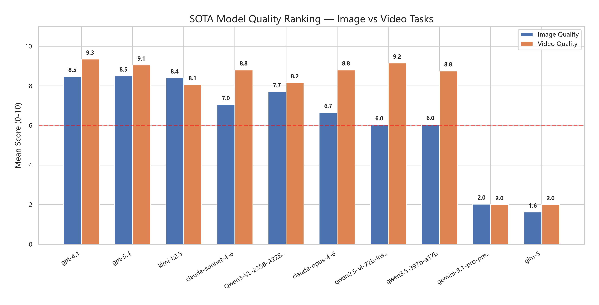
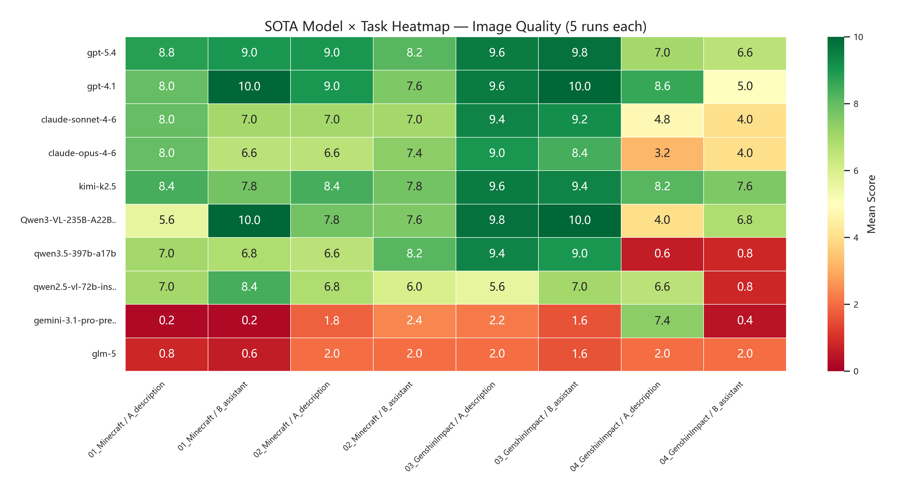
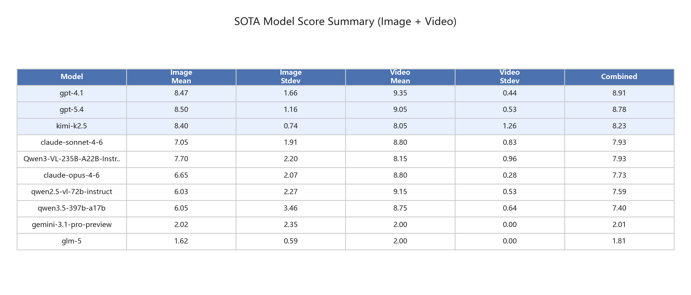
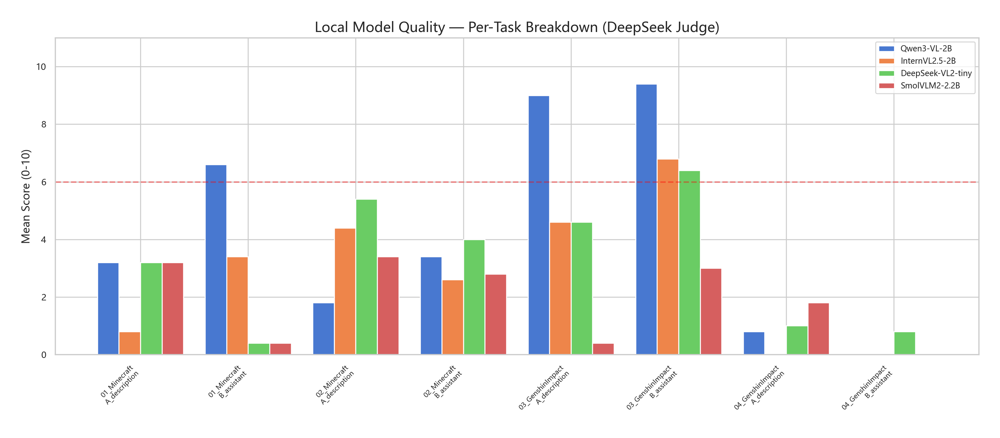
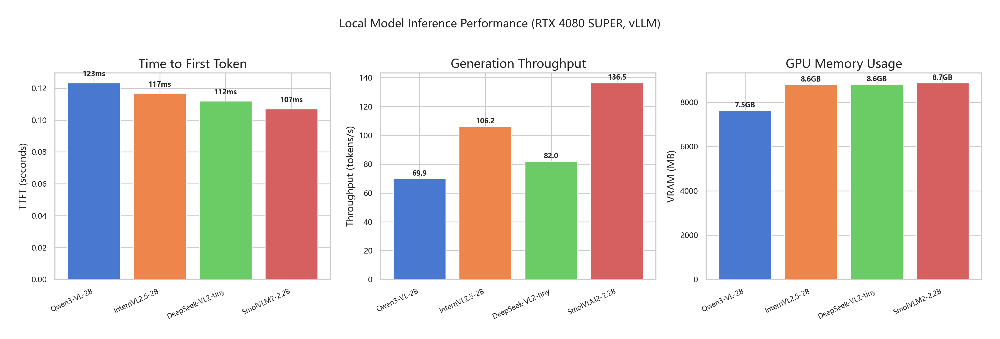
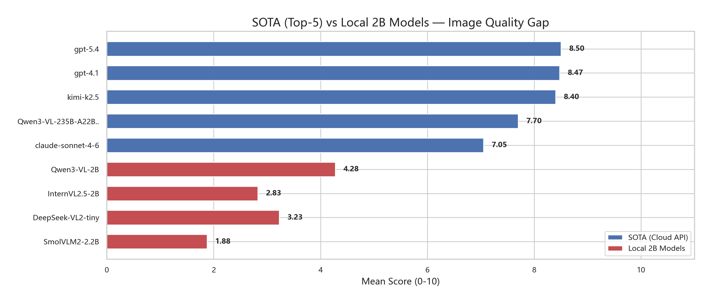
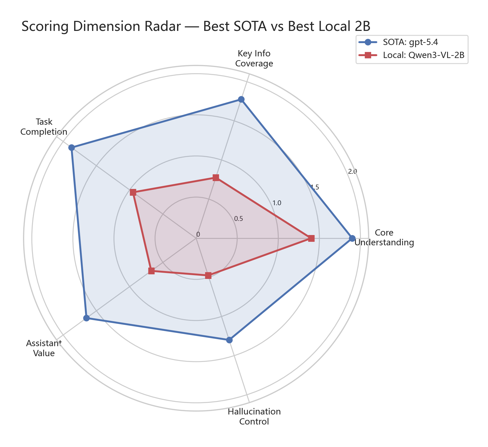

# 实验报告：视觉语言模型选型与评估框架验证

**实验日期**: 2026-03-19 ~ 2026-03-21  
**实验环境**: NVIDIA GeForce RTX 4060 Ti (16 GB), Python 3.12, vLLM / Ollama  
**裁判模型**: DeepSeek (deepseek-chat)  
**数据来源**:
- 本地 2B 模型基准: `results/v3/2026-03-19_04-09-24/`
- 本地 4B 模型基准: `results/v3/2026-03-21_04-53-58/`
- Ollama 推理后端对比: `results/v3-ollama/2026-03-21_03-50-59/`
- SOTA 模型校准: `results/v3-sota/2026-03-19_14-57-39/complete_data/`

---

## 摘要

本实验旨在为游戏场景实时理解系统筛选合适的本地端视觉语言模型（VLM）。实验分为三个阶段：首先，我们设计了一套面向游戏截图与视频片段的评估框架（包含多维度评分标准和结构化 prompt），并通过 10 个 SOTA 大模型的校准实验验证该评估框架的合理性与区分度；随后，我们使用相同框架对 5 个本地小模型（含 2B 级和 4B 级）进行质量和推理速度的综合基准测试；最后，我们对比了不同推理后端（vLLM vs Ollama）对同一模型性能的影响，完成模型与后端的联合选型。

**核心结论**：
1. 评估框架经 SOTA 校准验证有效——顶级模型（GPT-4.1、GPT-5.4、Claude Sonnet 4.6）在图片/视频任务上均分达 8.0–8.5/10，证明题目设计合理且存在明确的评分天花板。
2. 本地模型中，**Qwen3-VL-2B-Instruct (vLLM)** 在质量与速度之间取得最佳平衡，推荐作为系统实时部署模型。
3. Qwen3-VL-4B-Instruct 质量略优于 2B（+23%），但 VRAM 近乎翻倍（14GB vs 7.5GB），性价比不如 2B。
4. Ollama 推理后端的 Thinking 模式可使同一 2B 模型质量提升 107%（8.88 vs 4.28），但 TTFT 增加 67 倍，完全不适合实时应用。

---

## 1. 引言与研究目的

### 1.1 背景

游戏场景实时理解需要 VLM 具备以下能力：
- **截图理解**：识别游戏中的角色、敌人、UI 元素、文字等
- **视频理解**：追踪事件序列、理解因果关系、判断局势变化
- **游戏助手价值**：基于场景信息提供实用建议
- **幻觉控制**：不编造图像/视频中不存在的信息

由于系统需要在消费级 GPU 上实时运行，我们需要选择一个参数量小（~2B）、推理速度快、同时质量可接受的本地模型。

### 1.2 核心问题

> 如何证明我们设计的评估框架（题目 + rubric + 评分维度）能合理地区分模型能力，从而可靠地用于本地小模型的选型？

**解决方案**：通过 SOTA 大模型校准——如果最强模型在我们的框架下能获得高分，且不同能力级别的模型呈现梯度分布，则说明框架有效。

---

## 2. 评估框架设计

### 2.1 测试素材

| 类型 | 素材 ID          | 游戏      | 测试重点                 |
| ---- | ---------------- | --------- | ------------------------ |
| 图片 | 01_Minecraft     | Minecraft | 战斗 HUD 读取 + 战术建议 |
| 图片 | 02_Minecraft     | Minecraft | 物品栏 / 合成界面理解    |
| 图片 | 03_GenshinImpact | 原神      | 任务文本 / 导航指引理解  |
| 图片 | 04_GenshinImpact | 原神      | 开放世界场景理解         |
| 视频 | 01_Minecraft     | Minecraft | 战斗序列理解             |
| 视频 | 02_GenshinImpact | 原神      | 探索与交互序列理解       |

### 2.2 Prompt 设计

每个素材设计两种 prompt 模式：

- **A_description（描述模式）**：要求模型描述当前场景，覆盖核心情况、UI 信息、即时状况，不做无依据猜测。
- **B_assistant（助手模式）**：要求模型作为游戏助手，判断当前重点、评估安全/危险程度、提供有依据的建议、指出不可判断的内容。

### 2.3 评分维度（5 维度 × 0-2 分，满分 10）

| 维度                     | 含义         | 满分  |
| ------------------------ | ------------ | :---: |
| core_understanding       | 核心情况识别 |   2   |
| key_information_coverage | 关键信息覆盖 |   2   |
| task_completion          | 任务完成度   |   2   |
| assistant_value          | 助手实用价值 |   2   |
| hallucination_control    | 幻觉控制     |   2   |

每个维度有详细的 0/1/2 评分标准（见[附录 A](附录A_评分标准与完整Rubric.md)），并配有参考答案和严格扣分项（hard penalties）。

### 2.4 评分方法

- **统一裁判模型**：所有实验使用 DeepSeek (deepseek-chat) 作为裁判，避免自评偏差。
- **多次重复**：每个（模型 × 素材 × prompt）组合重复 5 次，报告均分和标准差。
- **结构化评分**：裁判返回 JSON 格式的逐维度分数、优势、弱点、遗漏要点、幻觉列表。

---

## 3. SOTA 模型校准实验

### 3.1 被测模型（10 个）

| 层级 | 模型                                                   | 类型      |
| ---- | ------------------------------------------------------ | --------- |
| 旗舰 | GPT-5.4, GPT-4.1, Claude Opus 4.6, Claude Sonnet 4.6   | Cloud API |
| 主力 | Kimi-K2.5, Qwen3-VL-235B, Qwen3.5-397B, Qwen2.5-VL-72B | Cloud API |
| 对照 | Gemini 3.1 Pro Preview, GLM-5                          | Cloud API |

所有模型通过 DMXAPI 统一接口调用，并行执行以提高效率。

### 3.2 图片理解结果

**图 1**：SOTA 模型在图片和视频任务上的平均得分对比。GPT-4.1 和 GPT-5.4 在图片任务中领先，Kimi-K2.5 表现稳定。

**图 6**：各模型在每个图片任务上的详细表现热力图。颜色越绿表示得分越高。

**关键发现**：

| 模型              | 图片均分 | 视频均分 |   综合   |
| ----------------- | :------: | :------: | :------: |
| GPT-4.1           | **8.48** | **9.35** | **8.91** |
| GPT-5.4           |   8.50   |   9.05   |   8.78   |
| Kimi-K2.5         |   8.40   |   8.05   |   8.23   |
| Claude Sonnet 4.6 |   7.05   |   8.80   |   7.93   |
| Qwen3-VL-235B     |   7.70   |   8.15   |   7.93   |
| Claude Opus 4.6   |   6.65   |   8.80   |   7.73   |
| Qwen3.5-397B      |   6.05   |   8.75   |   7.40   |
| Qwen2.5-VL-72B    |   6.03   |   9.15   |   7.59   |
| Gemini 3.1 Pro    |   2.03   |   2.00   |   2.01   |
| GLM-5             |   1.63   |   2.00   |   1.81   |

**图 7**：SOTA 模型综合排名汇总表。

### 3.3 评估框架有效性分析

**1) 天花板效应**：顶级模型（GPT-4.1）在多个任务上获得 9-10 分，说明满分标准是可达到的，rubric 设计合理。

**2) 梯度区分度**：
- 旗舰模型 (GPT-4.1/5.4) 均分 8.5+ → 框架能识别顶级能力
- 主力模型 (Kimi/Qwen) 均分 6-8 → 中等水平可区分
- 异常模型 (Gemini/GLM-5) 均分 1-2 → 检测出明显缺陷（如 GLM-5 无法识别图片内容）

**3) 维度独立性**：不同模型在各维度上的表现模式不同（如 Claude 在 hallucination_control 维度突出，Qwen 在 task_completion 上表现更好），说明五个维度捕捉了不同的能力。

**4) 稳定性**：大多数高分模型的标准差 < 1.0，表明评分一致性良好。低分模型的高方差（如 Gemini 的 σ=3.46）反映了模型本身输出不稳定。

### 3.4 问答示例

以下展示 01_Minecraft（战斗 HUD 读取）任务在 A_description 模式下，不同模型回复的对比，用于说明评估框架的区分效果。完整示例见[附录 B](附录B_问答示例详情.md)。

#### 高分示例：GPT-4.1 (得分: 8/10)

> **Prompt**: Please describe the current situation in this game screenshot. Your answer should: (1) identify the main threat or important target, (2) summarize the player's current state using visible UI information, (3) describe the immediate situation shown on screen, and (4) avoid guessing anything that is not supported by the image.

> **模型回复**（节选）:
>
> 1. **Main Threat**: The main threat is a zombie, which is approaching the player in the cave.
> 2. **Player's Current State**: Health: 3 out of 10 hearts (low). Experience level: 3. Hotbar: stone sword (held), pickaxe, axe, torches, wood, rotten flesh, cobblestone, dirt, and bread.
> 3. **Immediate Situation**: The player is in a cave, facing a zombie moving toward them. The cave is dimly lit with torches.
> 4. **No Unsupported Guesses**: All observations based solely on visible information.

> **裁判评价**: 正确识别僵尸威胁，准确读取血量和经验值，结构化回答覆盖所有要求。扣分点：误判饥饿值为满、缺少"情况危险"的明确判断。

#### 零分示例：GLM-5 (得分: 0-1/10)

> **模型回复**: "你好！有什么我可以帮你的吗？无论是问题、聊天还是需要建议，我都在这里 😊"

> **裁判评价**: 完全未识别图片内容，未提及任何游戏元素，输出为通用问候语，所有维度均为 0 分。

**分析**：GLM-5 通过 DMXAPI 调用时无法接收/处理图像输入，仅返回通用文本，在评分框架下自然获得最低分。这验证了框架能够有效检测模型视觉能力的缺失。

---

## 4. 本地小模型基准测试

### 4.1 候选模型

| 模型                    | 参数量 | 框架 |  VRAM   |
| ----------------------- | :----: | ---- | :-----: |
| Qwen3-VL-2B-Instruct    |   2B   | vLLM | 7.5 GB  |
| **Qwen3-VL-4B-Instruct** | **4B** | vLLM | **14.0 GB** |
| InternVL2.5-2B          |   2B   | vLLM | 8.6 GB  |
| DeepSeek-VL2-tiny       |   3B   | vLLM | 8.6 GB  |
| SmolVLM2-2.2B-Instruct  |  2.2B  | vLLM | 8.7 GB  |

### 4.2 质量评估

使用与 SOTA 校准相同的评估框架（题目、prompt、rubric、裁判模型），对 4 个本地模型进行图片理解质量测试。

**图 2**：本地 2B 模型在各任务上的详细得分对比。

**本地模型图片质量汇总**：

| 模型               | 01_MC (A) | 01_MC (B) | 02_MC (A) | 02_MC (B) | 03_GI (A) | 03_GI (B) | 04_GI (A) | 04_GI (B) |   均分   |
| ------------------ | :-------: | :-------: | :-------: | :-------: | :-------: | :-------: | :-------: | :-------: | :------: |
| **Qwen3-VL-4B**    |    3.4    |  **8.0**  |  **4.0**  |  **6.2**  |    6.8    |  **9.0**  |    0.8    |  **4.0**  | **5.28** |
| Qwen3-VL-2B        |    3.2    |    6.6    |    1.8    |    3.4    |  **9.0**  |    9.4    |    0.8    |    0.0    |   4.28   |
| DeepSeek-VL2-tiny  |    3.2    |    0.4    |    5.4    |    4.0    |    4.6    |    6.4    |    1.0    |    0.8    |   3.23   |
| InternVL2.5-2B     |    0.8    |    3.4    |    4.4    |    2.6    |    4.6    |    6.8    |    0.0    |    0.0    |   2.83   |
| SmolVLM2-2.2B      |    3.2    |    0.4    |    3.4    |    2.8    |    0.4    |    3.0    |    1.8    |    0.0    |   1.88   |

**分析**：
- Qwen3-VL-4B 以 5.28 均分成为质量第一，较 2B 提升 23%。4B 在 B_assistant 模式下提升最为显著（04_GI 从 0.0 → 4.0），说明更大的模型能更好地理解"助手角色"的任务要求。
- 然而 4B 在 03_GI (A) 上分数反而低于 2B（6.8 vs 9.0），存在一定的任务偏差。
- 综合来看，4B 在 B_assistant 模式（助手价值）上优势明显，但在 A_description 模式（纯描述）上与 2B 差异较小。

### 4.3 推理速度评估

**图 3**：本地模型的 TTFT、吞吐量和显存占用对比。

**速度汇总**：

| 模型               | 平均 TTFT | 平均吞吐量 |  VRAM   |
| ------------------ | :-------: | :--------: | :-----: |
| Qwen3-VL-2B        |  ~123 ms  | ~70 tok/s  | 7.5 GB  |
| **Qwen3-VL-4B**    |  ~133 ms  | ~52 tok/s  | 14.0 GB |
| InternVL2.5-2B     |  ~110 ms  | ~77 tok/s  | 8.6 GB  |
| DeepSeek-VL2-tiny  |  ~100 ms  | ~59 tok/s  | 8.6 GB  |
| SmolVLM2-2.2B      |  ~130 ms  | ~71 tok/s  | 8.7 GB  |

所有模型 TTFT 均在 100-133ms 范围内，满足实时响应需求。4B 模型的 TTFT 与 2B 接近，但吞吐量下降 25%（52 vs 70 tok/s），VRAM 占用几乎翻倍（14.0 vs 7.5 GB），在 16 GB 显卡上已接近极限。

### 4.4 SOTA 与本地模型差距分析

**图 4**：SOTA 顶级模型与本地 2B 模型的得分差距可视化。

**图 5**：最佳 SOTA 模型与最佳本地模型在五个评分维度上的雷达图对比。

**差距分析**：
- SOTA 最高分 (GPT-4.1: 8.48) vs 本地最高分 (Qwen3-VL-4B: 5.28) → 差距 ~3.2 分
- 4B 模型较 2B 缩小了约 1 分差距，但与 SOTA 仍有明显差距
- 本地模型在 **core_understanding** 维度与 SOTA 差距最小，说明 2-4B 模型能基本识别场景核心内容
- 在 **hallucination_control** 和 **assistant_value** 维度差距最大，这是小模型的能力瓶颈
- 部分任务（03_GenshinImpact）本地模型已接近 SOTA 水平，说明文字清晰的任务对小模型更友好

---

## 5. 推理后端对比实验：vLLM vs Ollama

### 5.1 实验动机

在确定 Qwen3-VL-2B 为候选模型后，我们进一步探索不同推理后端对同一模型性能的影响。vLLM 运行在 WSL2 中，需要 Linux 环境；而 Ollama 提供 Windows 原生支持，部署更简单，且 Qwen3-VL 在 Ollama 上默认启用 "Thinking Mode"（推理前进行内部思考），可能提升输出质量。

### 5.2 关键技术发现：Ollama Thinking Mode

Ollama 的 Qwen3-VL 模型默认启用思考模式——模型在生成可见内容前，先消耗部分 `max_tokens` 进行内部推理。这一行为导致：

1. **TTFT 大幅增加**：模型需要先完成思考再输出第一个可见 token
2. **实际吞吐量虚高**：思考 token 被计入总吞吐量统计
3. **OpenAI 兼容 API 不支持禁用**：`think: false` 参数仅在 Ollama 原生 API 中生效

### 5.3 速度对比

| 指标     | vLLM (2B) | Ollama (2B, Thinking) | 差异     |
| -------- | :-------: | :-------------------: | :------: |
| TTFT     | 0.123s    | 8.249s                | 67x 慢   |
| 端到端耗时 | 4.63s   | 10.11s                | 2.2x 慢  |
| VRAM     | 7,637 MB  | ~7,000 MB             | 相近     |

Ollama 的 TTFT 增加了 67 倍，原因是思考阶段在内部完成，外部无法观测到进度。对于实时游戏场景理解，这意味着每帧分析需等待 8 秒以上才能获得第一个响应 token，完全无法满足实时性要求。

### 5.4 质量对比

| 指标         | vLLM (2B) | Ollama (2B, Thinking) | 提升  |
| ------------ | :-------: | :-------------------: | :---: |
| 质量均分     | 4.28      | **8.88**              | +107% |
| 标准差       | 3.59      | 2.49                  | 更稳定 |
| 02_MC (A+B)  | 2.60      | **10.00**             | +285% |
| 03_GI (A+B)  | 9.20      | **9.70**              | +5%   |

Thinking Mode 使同一 2B 模型的质量均分提升 107%，从 4.28 跃升至 8.88，**接近 SOTA 旗舰模型水平**（GPT-4.1: 8.48）。这表明小模型的"智力"并非绝对瓶颈——通过更长的推理链，2B 模型可以产出接近顶级大模型的分析结果。

### 5.5 视频理解

由于 Ollama 的高延迟使得实时帧捕获-分析流水线无法工作（每帧 8s+ 的处理时间导致帧丢失率 >90%），视频理解实验在 Ollama 后端下跳过。详见[Ollama 对比报告](../v3/ollama_vs_vllm/对比报告_vLLM_vs_Ollama.md)。

### 5.6 后端选型结论

| 场景         | 推荐后端 | 理由                                        |
| ------------ | :------: | ------------------------------------------- |
| 实时游戏理解 | **vLLM** | TTFT 0.12s，满足实时交互需求                 |
| 离线质量分析 | **Ollama** | Thinking Mode 质量接近 SOTA，适合非实时场景 |
| 快速原型部署 | **Ollama** | Windows 原生、一键安装，无需 WSL 环境        |

---

## 6. 综合分析与模型选型

### 6.1 评估框架验证结论

| 验证指标       | 结果 | 说明                                        |
| -------------- | ---- | ------------------------------------------- |
| 天花板可达性   | ✅    | GPT-4.1 多任务获得 9-10 分                  |
| 梯度区分度     | ✅    | 三个明确层级：旗舰(8+)、主力(6-8)、缺陷(<3) |
| 评分稳定性     | ✅    | 高分模型 σ < 1.0                            |
| 维度独立性     | ✅    | 不同模型在各维度的优劣分布不同              |
| 跨能力级别泛化 | ✅    | 从 SOTA 到 2B 模型均能产生有意义的分数      |

**结论**：评估框架经 SOTA 校准验证有效，可作为本地模型选型的可靠依据。

### 6.2 本地模型选型决策

综合质量、速度与 VRAM 开销，各模型的综合评估：

| 模型               |   质量排名    | 速度排名 |       VRAM         | 推荐度 |
| ------------------ | :-----------: | :------: | :----------------: | :----: |
| **Qwen3-VL-4B**    | **#1** (5.28) |    #5    |   最高 (14.0 GB)   |   ⭐⭐   |
| **Qwen3-VL-2B**    |   #2 (4.28)   |    #2    | **最低** (7.5 GB)  |  ⭐⭐⭐   |
| DeepSeek-VL2-tiny  |   #3 (3.23)   |    #4    |    中 (8.6 GB)     |   ⭐    |
| InternVL2.5-2B     |   #4 (2.83)   |    #1    |    中 (8.6 GB)     |   ⭐    |
| SmolVLM2-2.2B      |   #5 (1.88)   |    #3    |    中高 (8.7 GB)   |   —    |

**最终选择：Qwen3-VL-2B-Instruct (vLLM)**

理由：
1. **质量/资源比最优**：均分 4.28/10，仅用 7.5 GB VRAM；4B 虽然质量高 23%，但 VRAM 翻倍至 14 GB，在 16 GB 显卡上几乎无余量
2. **显存最低**：7.5 GB，在 16 GB 显卡上留有充裕余量给其他系统组件（截图处理、帧缓冲等）
3. **特定任务表现优异**：在文字明确的场景（03_GenshinImpact）达到 9.0+ 分，接近 SOTA
4. **中文支持**：中文回复质量高，适合中文游戏场景
5. **速度满足实时需求**：TTFT ~123ms，吞吐量 ~70 tok/s
6. **Ollama 后端可选**：需要高质量离线分析时，可切换至 Ollama 的 Thinking Mode（质量 8.88，接近 SOTA）

**关于 4B 模型的考量**：Qwen3-VL-4B 质量领先，但 14 GB VRAM 已接近 16 GB 显卡上限，且 `gpu-memory-utilization` 需设为 0.85 才能启动。在实际部署中，系统还需为截图捕获、帧差分、UI 渲染等预留 GPU 资源，因此 4B 在当前硬件条件下不适合实时部署。

### 6.3 局限性与未来工作

1. **测试素材有限**：当前仅覆盖 Minecraft 和原神两款游戏，未来应扩展到更多游戏类型
2. **2-4B 模型固有瓶颈**：在 hallucination_control 和 assistant_value 维度与 SOTA 差距大，可通过 prompt 工程或后处理改善
3. **Thinking Mode 的潜力**：Ollama Thinking Mode 表明 2B 模型通过更长推理链可达 SOTA 水平质量，未来可探索 vLLM 的 thinking 支持或异步思考管线
4. **4B 模型的硬件升级路径**：若目标硬件升级至 24 GB VRAM，4B 模型将成为更优选择
5. **动态场景适应性**：静态截图测试无法完全反映实时游戏流中的表现

---

## 附录列表

- [附录 A：评分标准与完整 Rubric](附录A_评分标准与完整Rubric.md)
- [附录 B：问答示例详情](附录B_问答示例详情.md)
- [附录 C：完整数据表](附录C_完整数据表.md)
- [原始 CSV 数据](data/) — 包含所有 SOTA 和本地模型的完整实验数据

---

## 参考资料

- SOTA 实验完整报告：`QA/v3/sota_validation/评估报告_supplemental.md`
- 本地 2B 模型基准数据：`results/v3/2026-03-19_04-09-24/`
- 本地 4B 模型基准数据：`results/v3/2026-03-21_04-53-58/`
- Ollama 推理后端实验数据：`results/v3-ollama/2026-03-21_03-50-59/`
- Ollama vs vLLM 对比报告：`QA/v3/ollama_vs_vllm/对比报告_vLLM_vs_Ollama.md`
- SOTA 完整数据：`results/v3-sota/2026-03-19_14-57-39/complete_data/`
- 评估框架设计文档：`blueprint/v3-GameScene-Eval/SOTA模型验证实验设计.md`
