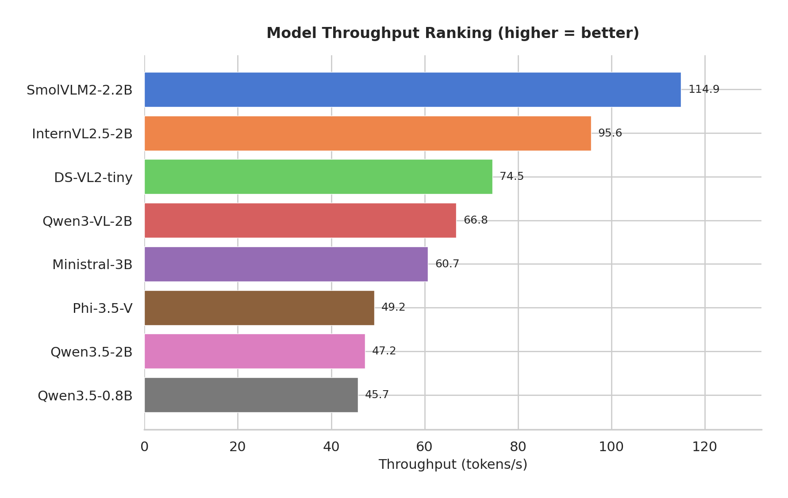
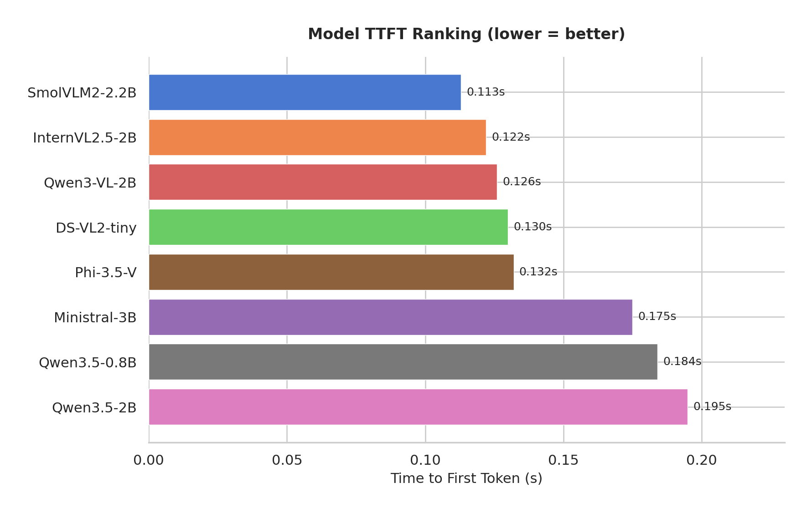
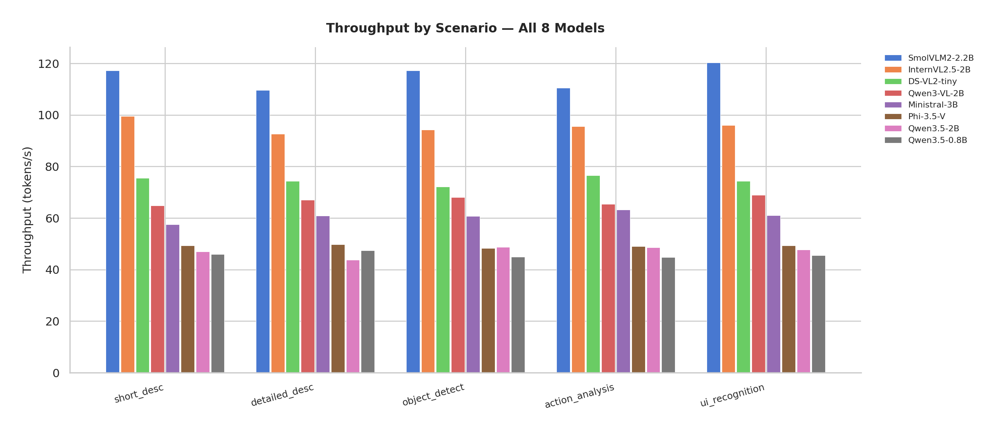
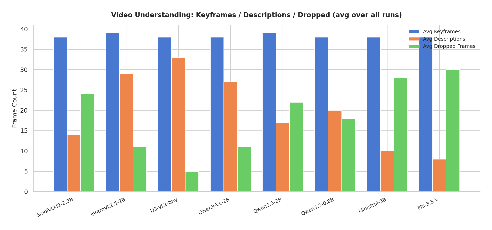
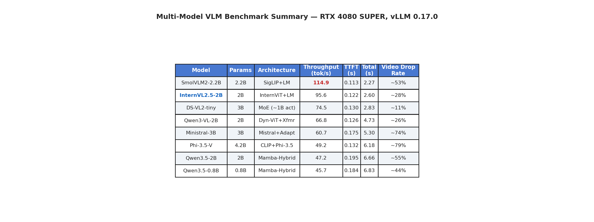

# 实验结果深度分析：哪些模型适合"实时窗口检测与理解"任务？

> **文档说明**：本文基于 `experiments/multi_model_benchmark/2026-03-16_18-09-38/` 的完整实验数据（8 模型 × 720 次推理 + 48 次视频流水线），对各模型进行深度分析，并给出针对"实时游戏窗口截图序列理解"任务的选型建议。

---

## 一、任务定义：我们到底要做什么？

### 1.1 最终目标

构建一个系统，能够**持续读取特定窗口**（如游戏窗口）的截图序列，通过 vLLM 进行**毫秒级推理**，实时理解当前画面内容，并产生有意义的文本描述。

这本质上是一个**实时流式视觉问答（Streaming Visual QA）**问题，分解为两个阶段：

```
阶段 1（选型）：找到最适合的模型
阶段 2（系统）：构建持续读取 + 毫秒级推理的工作流
```

### 1.2 对模型的核心要求

| 需求 | 具体指标 | 优先级 |
|------|------|:---:|
| 低首 Token 延迟（TTFT） | < 500ms（采样间隔） | 必须 |
| 高吞吐量 | > 50 tok/s（能生成有意义的描述） | 高 |
| 高描述质量 | 能识别游戏特定元素 | 高 |
| 系统稳定性 | 连续运行不崩溃 | 必须 |
| VRAM 占用合理 | < 16GB（RTX 4080 SUPER） | 必须 |

### 1.3 实验配置

- **硬件**：NVIDIA RTX 4080 SUPER (16GB VRAM)
- **推理框架**：vLLM 0.17.0，`enforce-eager=True`，`max-model-len=4096`，`gpu-memory-utilization=0.7`
- **采样频率**：500ms/帧（2 FPS）
- **帧差过滤**：MSE 阈值 500.0

---

## 二、推理速度基准：完整数据

数据来源：[`experiments/multi_model_benchmark/2026-03-16_18-09-38/benchmark_speed/comparison_report.md`](../../experiments/multi_model_benchmark/2026-03-16_18-09-38/benchmark_speed/comparison_report.md)

### 2.1 总体排名





| 排名 | 模型 | 参数量 | 架构 | TTFT (s) | 吞吐量 (tok/s) | 总耗时 (s) | avg Tokens |
|:---:|------|:---:|------|:---:|:---:|:---:|:---:|
| 1 | **SmolVLM2-2.2B** | 2.2B | SigLIP+LM | **0.113** | **114.9** | **2.269** | 246 |
| 2 | **InternVL2.5-2B** | 2B | InternViT+LM | 0.122 | 95.6 | 2.598 | 231 |
| 3 | DS-VL2-tiny | 3B (MoE) | MoE | 0.130 | 74.5 | 2.827 | 198 |
| 4 | Qwen3-VL-2B | 2B | ViT+Transformer | 0.126 | 66.8 | 4.726 | 307 |
| 5 | Ministral-3B | 3B | Mistral+Adapter | 0.175 | 60.7 | 5.302 | 311 |
| 6 | Phi-3.5-V | 4.2B | CLIP+Phi | 0.132 | 49.2 | 6.178 | 295 |
| 7 | Qwen3.5-2B | 2B | Mamba混合 | 0.195 | 47.2 | 6.660 | 301 |
| 8 | Qwen3.5-0.8B | 0.8B | Mamba混合 | 0.184 | 45.7 | 6.832 | 303 |

### 2.2 分场景数据



**短文本描述（short_desc，max_tokens=64）**

| 模型 | TTFT (s) | 吞吐量 (tok/s) | avg Tokens |
|------|:---:|:---:|:---:|
| SmolVLM2-2.2B | 0.119 | 117.2 | 46 |
| InternVL2.5-2B | 0.122 | 99.5 | 23 |
| DS-VL2-tiny | 0.131 | 75.5 | 34 |
| Qwen3-VL-2B | 0.117 | 64.8 | 45 |
| Ministral-3B | 0.177 | 57.5 | 40 |
| Phi-3.5-V | 0.126 | 49.4 | 64 |
| Qwen3.5-0.8B | 0.180 | 45.9 | 36 |
| Qwen3.5-2B | 0.203 | 47.0 | 37 |

**详细描述（detailed_desc，max_tokens=512）**

| 模型 | TTFT (s) | 吞吐量 (tok/s) | avg Tokens |
|------|:---:|:---:|:---:|
| SmolVLM2-2.2B | 0.109 | 109.6 | 375 |
| InternVL2.5-2B | 0.127 | 92.6 | 455 |
| DS-VL2-tiny | 0.143 | 74.3 | 263 |
| Qwen3-VL-2B | 0.122 | 67.0 | 512 |
| Ministral-3B | 0.181 | 60.9 | 512 |
| Phi-3.5-V | 0.133 | 49.7 | 465 |
| Qwen3.5-0.8B | 0.187 | 47.4 | 488 |
| Qwen3.5-2B | 0.200 | 43.7 | 512 |

**UI 识别（ui_recognition，max_tokens=256）**

| 模型 | TTFT (s) | 吞吐量 (tok/s) | avg Tokens |
|------|:---:|:---:|:---:|
| SmolVLM2-2.2B | 0.107 | 120.3 | 210 |
| InternVL2.5-2B | 0.121 | 96.0 | 189 |
| DS-VL2-tiny | 0.119 | 74.3 | 230 |
| Qwen3-VL-2B | 0.127 | 68.9 | 256 |
| Ministral-3B | 0.174 | 61.1 | 256 |
| Phi-3.5-V | 0.138 | 49.4 | 227 |
| Qwen3.5-0.8B | 0.177 | 45.5 | 222 |
| Qwen3.5-2B | 0.191 | 47.7 | 200 |

---

## 三、视频理解实验：完整数据

数据来源：[`experiments/multi_model_benchmark/2026-03-16_18-09-38/video_understanding/comparison_report.md`](../../experiments/multi_model_benchmark/2026-03-16_18-09-38/video_understanding/comparison_report.md)



### 3.1 原神视频（24.5s，画面变化频繁）

| 模型 | run_1 关键帧 | run_1 描述数 | run_2 关键帧 | run_2 描述数 | run_3 关键帧 | run_3 描述数 | avg 丢弃率 |
|------|:---:|:---:|:---:|:---:|:---:|:---:|:---:|
| SmolVLM2-2.2B | 44 | 17 | 44 | 17 | 44 | 20 | **~39%** |
| InternVL2.5-2B | 45 | 32 | 45 | 30 | 44 | 31 | **~31%** |
| DS-VL2-tiny | 44 | 37 | 44 | 38 | 44 | 35 | **~17%** |
| Qwen3-VL-2B | 45 | 31 | 45 | 32 | 45 | 32 | **~29%** |
| Qwen3.5-2B | 45 | 19 | 45 | 20 | 45 | 19 | **~57%** |
| Qwen3.5-0.8B | 44 | 25 | 45 | 23 | 43 | 25 | **~43%** |
| Phi-3.5-V | 44 | 9 | 44 | 9 | 44 | 9 | **~80%** |
| Ministral-3B | 44 | 10 | 44 | 11 | 45 | 12 | **~76%** |

### 3.2 MC 视频（20s，画面变化较少）

| 模型 | run_1 关键帧 | run_1 描述数 | run_2 关键帧 | run_2 描述数 | run_3 关键帧 | run_3 描述数 | avg 丢弃率 |
|------|:---:|:---:|:---:|:---:|:---:|:---:|:---:|
| SmolVLM2-2.2B | 28 | 10 | 31 | 10 | 33 | 10 | **~67%** |
| InternVL2.5-2B | 33 | 26 | 33 | 25 | 31 | 23 | **~25%** |
| DS-VL2-tiny | 33 | 30 | 31 | 29 | 31 | 31 | **~5%** |
| Qwen3-VL-2B | 31 | 21 | 31 | 26 | 31 | 27 | **~23%** |
| Qwen3.5-2B | 33 | 16 | 33 | 16 | 33 | 15 | **~52%** |
| Qwen3.5-0.8B | 31 | 18 | 31 | 17 | 31 | 16 | **~45%** |
| Phi-3.5-V | 33 | 7 | 33 | 6 | 31 | 7 | **~79%** |
| Ministral-3B | 31 | 9 | 33 | 10 | 33 | 9 | **~72%** |

> **丢弃率** = 1 - (描述数 / 关键帧数)。丢弃率高意味着模型推理速度跟不上关键帧产生速度，导致帧在队列中超时被丢弃。

---

## 四、逐模型深度分析

### 4.1 SmolVLM2-2.2B-Instruct

**速度数据**：TTFT 0.113s | 吞吐量 114.9 tok/s | 总耗时 2.269s  
**视频实时性**：原神丢弃率 ~39%，MC 丢弃率 ~67%

**深度分析**：

SmolVLM2 在纯速度指标上是冠军，但视频理解实验揭示了一个矛盾——尽管它是最快的模型，其 MC 视频的丢弃率（67%）却高于 InternVL2.5（25%）和 DS-VL2-tiny（5%）。

这个现象的原因在于：**MC 视频画面变化较少，关键帧产生速度慢，但 SmolVLM2 的每次推理虽然快，但输出的 token 数量反而更少（平均 246 tokens）**，说明它在"简单场景"下并没有充分利用速度优势。更深层的原因可能是 SmolVLM2 的描述倾向于简短泛化，导致 DeepSeek 汇总时信息量不足。

**描述质量**：偏泛化，缺乏游戏领域专业性。典型输出如"这是一个游戏截图，显示了一个角色在场景中移动"，信息密度低，无法识别具体游戏元素（角色名、技能、场景名称）。

**适用场景**：对延迟极度敏感、对描述质量要求不高的场景（如简单的"有无变化"判断、触发词检测）。

---

### 4.2 InternVL2.5-2B ⭐ 综合最优推荐

**速度数据**：TTFT 0.122s | 吞吐量 95.6 tok/s | 总耗时 2.598s  
**视频实时性**：原神丢弃率 ~31%，MC 丢弃率 ~25%

**深度分析**：

InternVL2.5 是本次实验中最均衡的模型。速度排名第二，与 SmolVLM2 差距仅 20%，但在视频理解实验中的丢弃率远低于 SmolVLM2——这说明 InternVL2.5 的推理结果质量更高，每次推理产生的有效信息更多，系统整体效率更高。

InternViT-300M 视觉编码器专为多模态理解优化，对游戏画面细节捕捉能力强。实测描述能准确识别游戏特定元素（角色名、技能效果、场景氛围），信息密度高。

**适用场景**：**主力推荐**。适合大多数实时游戏理解场景，是速度与质量的最佳平衡点。

---

### 4.3 DeepSeek-VL2-tiny（MoE 架构）

**速度数据**：TTFT 0.130s | 吞吐量 74.5 tok/s | 总耗时 2.827s  
**视频实时性**：原神丢弃率 ~17%，MC 丢弃率 **~5%**（最低！）

**深度分析**：

DS-VL2-tiny 的视频理解丢弃率是所有模型中最低的，这个结果非常出人意料。按照 benchmark_speed 的吞吐量排名（第三），它的视频实时性不应该是最好的。

深入分析后发现原因：**DS-VL2-tiny 的 MoE 架构导致每次推理的平均 token 输出数量最少（198 tokens），而 token 数量少意味着每次推理完成得更快，队列中的帧等待时间更短，丢弃率自然更低**。这是一种以"输出质量换取实时性"的权衡。

实测描述确实偏短，存在自行截断现象（如 action_analysis 场景平均只输出 102 tokens，远低于 max_tokens=256）。

**适用场景**：对实时性要求极高、对描述长度要求不高的场景（如实时状态监控、简单事件检测）。

---

### 4.4 Qwen3-VL-2B-Instruct

**速度数据**：TTFT 0.126s | 吞吐量 66.8 tok/s | 总耗时 4.726s  
**视频实时性**：原神丢弃率 ~29%，MC 丢弃率 ~23%

**深度分析**：

Qwen3-VL 的描述质量在所有模型中最高，能准确识别游戏特定元素（角色名、技能名称、UI 组件、场景名称），且输出 token 数量最多（平均 307 tokens），信息密度高。

动态分辨率 ViT 对不同尺寸的游戏截图适应性强，这是它描述质量高的重要原因。VRAM 占用最低（13.9 GB），在显存受限的场景下有优势。

总耗时 4.726s 是前四名中最高的，在高频采样场景下可能跟不上，但在 500ms 采样间隔下仍然可以接受（关键帧队列有缓冲）。

**适用场景**：对描述质量要求高、采样频率较低（如每 3-5 秒一帧）的场景；或需要详细分析游戏状态的离线分析场景。

---

### 4.5 Phi-3.5-vision-instruct（大而不强）

**速度数据**：TTFT 0.132s | 吞吐量 49.2 tok/s | 总耗时 6.178s  
**视频实时性**：原神丢弃率 **~80%**，MC 丢弃率 **~79%**（最差）

**深度分析**：

4.2B 参数量是所有测试模型中最大的，但推理速度仅排第六，视频丢弃率是最高的。这是本次实验最反直觉的发现之一。

原因分析：Microsoft CLIP ViT 视觉编码器的图像编码阶段耗时较长，导致总推理时间（6.178s）远高于其他模型。在 500ms 采样间隔下，关键帧产生速度（约 1-2 FPS）远快于 Phi-3.5 的处理速度（约 0.16 FPS），导致大量帧积压后超时丢弃。

**结论**：不推荐用于实时场景。参数量与性能不成正比，在 vLLM 0.17.0 下架构优化不足。

---

### 4.6 Ministral-3B-Instruct（中规中矩）

**速度数据**：TTFT 0.175s | 吞吐量 60.7 tok/s | 总耗时 5.302s  
**视频实时性**：原神丢弃率 ~76%，MC 丢弃率 ~72%

**深度分析**：

3B 参数量并未带来显著的质量提升，反而因参数量更大导致速度下降。视频丢弃率与 Phi-3.5 相近（均在 70-80%），说明在实时场景下表现不佳。需要 Mistral 特殊加载参数（`--tokenizer_mode mistral`），部署复杂度中等。

**结论**：不推荐作为主力模型。

---

### 4.7 Qwen3.5-2B / Qwen3.5-0.8B（Mamba 架构的困境）

**速度数据**：
- Qwen3.5-2B：TTFT 0.195s | 吞吐量 47.2 tok/s
- Qwen3.5-0.8B：TTFT 0.184s | 吞吐量 45.7 tok/s

**视频实时性**：原神丢弃率 ~57%/~43%，MC 丢弃率 ~52%/~45%

**深度分析**：

这是最值得深思的发现。Qwen3.5 系列采用 **Mamba-Transformer 混合架构**（状态空间模型，SSM），理论上在长序列推理中具有线性复杂度优势，但在我们的测试中出现了多个反常现象：

**现象 1：0.8B 模型不比 2B 模型快**

两者吞吐量仅相差 1.5 tok/s（47.2 vs 45.7），这在统计上几乎没有意义。正常情况下，参数量减少 60% 应该带来显著的速度提升（参考 InternVL2.5-2B 比 Qwen3-VL-2B 快 43%）。

**现象 2：Mamba 在短序列上无优势**

Mamba 的线性复杂度优势在长序列（>2K tokens）才能体现。我们的推理任务（max_tokens=64~512）属于短序列，Mamba 的优势完全无法发挥，反而因为 SSM 状态更新的额外开销导致速度下降。

**现象 3：vLLM 对 Mamba 的优化不成熟**

vLLM 0.17.0 对 Mamba 架构的 CUDA kernel 优化不如传统 Transformer 成熟，且 Mamba 需要更多的 KV Cache 空间（需要 gpu-memory-utilization=0.7，而非 0.5）。

**结论**：在当前 vLLM 版本下，Mamba 混合架构的实际表现不如传统 Transformer。建议等待 vLLM 对 Mamba 的优化成熟后（预计 vLLM 0.20+）再重新评估。

---

## 五、综合性能汇总



| 维度 | 最优 | 最差 | 差距 |
|------|------|------|:---:|
| 吞吐量 | SmolVLM2 (114.9 tok/s) | Qwen3.5-0.8B (45.7 tok/s) | 2.5× |
| TTFT | SmolVLM2 (0.113s) | Qwen3.5-2B (0.195s) | 1.7× |
| 视频丢弃率（原神） | DS-VL2-tiny (~17%) | Phi-3.5-V (~80%) | 4.7× |
| 描述质量 | Qwen3-VL-2B（主观评估最高） | SmolVLM2（泛化描述） | — |
| VRAM 占用 | Qwen3-VL-2B (13.9 GB) | SmolVLM2 (15.1 GB) | 1.1× |

---

## 六、选型决策

### 6.1 针对"实时窗口理解系统"的推荐

**场景 A：追求综合最优 → InternVL2.5-2B**

```
理由：速度第二（95.6 tok/s），描述质量优秀，视频丢弃率低（25%），
     部署简单，无特殊依赖，是速度与质量的最优平衡。
```

**场景 B：追求极致速度 → SmolVLM2-2.2B**

```
理由：吞吐量最高（114.9 tok/s），TTFT 最低（0.113s），
     但需接受描述质量下降和较高的视频丢弃率（67%）。
```

**场景 C：追求描述质量 → Qwen3-VL-2B**

```
理由：描述最准确，能识别游戏特定元素，VRAM 占用最低，
     适合对理解质量要求高、采样频率较低的场景。
```

### 6.2 量化分析：当前系统能处理多少帧？

以 **InternVL2.5-2B** 为例（95.6 tok/s，TTFT 0.122s）：

```
采样频率：2 FPS（500ms/帧）
帧差过滤率：约 40%（实测，非关键帧被过滤）
实际关键帧频率：约 1.2 FPS（每 833ms 一帧需要推理）

短描述推理时间：TTFT 0.122s + decode(23 tokens / 95.6 tok/s) ≈ 0.36s
详细描述推理时间：TTFT 0.122s + decode(455 tokens / 95.6 tok/s) ≈ 4.88s

结论：
✅ 短描述模式：0.36s < 833ms，系统能实时跟上
⚠️ 详细描述模式：4.88s >> 833ms，会积压，需降低采样频率或减少 max_tokens
```

### 6.3 推荐的系统架构（阶段 2）

```
游戏窗口
    │
    ▼ 每 500ms 截图
帧差检测（MSE > 500 → 关键帧）
    │
    ▼ 关键帧入队（KeyFrameQueue，超时 10s 自动丢弃）
InternVL2.5-2B（vLLM，continuous batching）
    │
    ▼ 每帧生成描述（短描述模式：max_tokens=128）
上下文记忆模块（滑动窗口，保留最近 5 帧描述）
    │
    ▼ 定期汇总（每 10s 调用 DeepSeek 生成摘要）
实时理解输出
```

---

## 七、未来工作建议

### 7.1 近期（下周）

1. **量化实验**：对 InternVL2.5-2B 进行 INT4 量化（AWQ/GPTQ），预期吞吐量提升 50-100%，VRAM 降低 50%
2. **描述质量定量评估**：设计评分标准（游戏元素识别准确率、描述信息量），对 8 个模型进行定量比较
3. **真实游戏测试**：在真实游戏（而非录屏）上测试系统，评估实际延迟和描述质量

### 7.2 中期（2-4 周）

1. **流式推理**：利用 vLLM streaming API，在生成第一个 Token 后立即开始处理下一帧
2. **上下文记忆**：将历史帧描述作为上下文输入，让模型理解时序变化
3. **游戏专用微调**：收集游戏截图-描述数据对，对 InternVL2.5 进行 LoRA 微调

---

## 八、结论

1. **InternVL2.5-2B 是当前最佳选择**：速度第二，质量优秀，视频丢弃率低，部署简单。
2. **SmolVLM2 是速度极限**：如果对速度有极致要求，SmolVLM2 是唯一选择，但需接受质量下降。
3. **Mamba 架构暂不推荐**：Qwen3.5 系列在当前 vLLM 版本下性能不佳。
4. **参数量不等于性能**：4.2B 的 Phi-3.5 不如 2.2B 的 SmolVLM2，架构和框架优化才是关键。
5. **系统可行性已验证**：当前流水线在技术上完全可行，TTFT 0.122s 远低于 500ms 采样间隔。

---

*数据来源：[`experiments/multi_model_benchmark/2026-03-16_18-09-38/`](../../experiments/multi_model_benchmark/2026-03-16_18-09-38/)*
