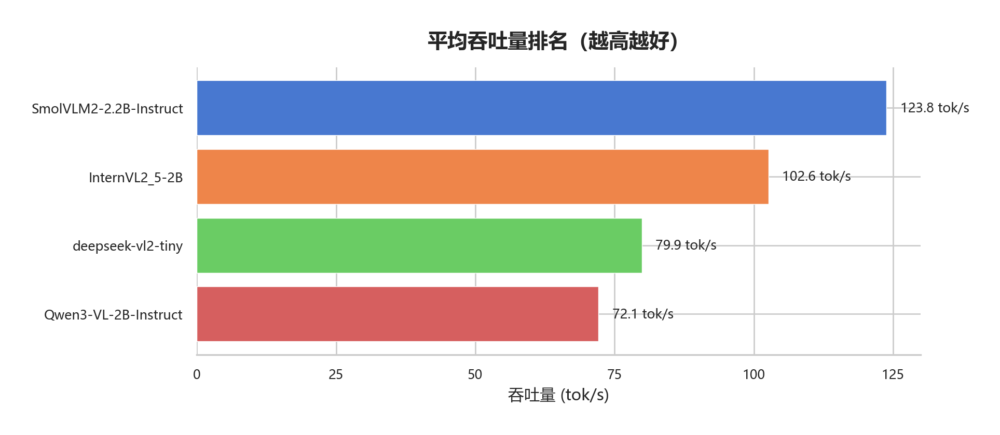
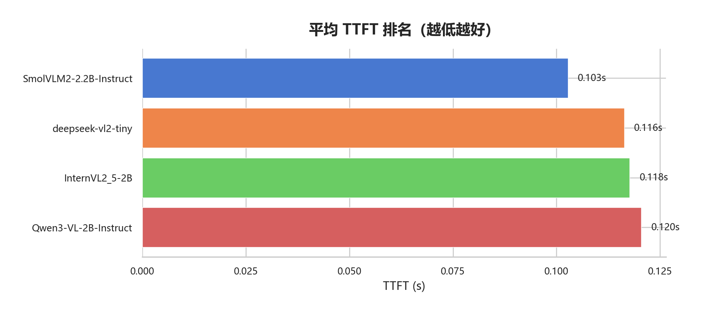
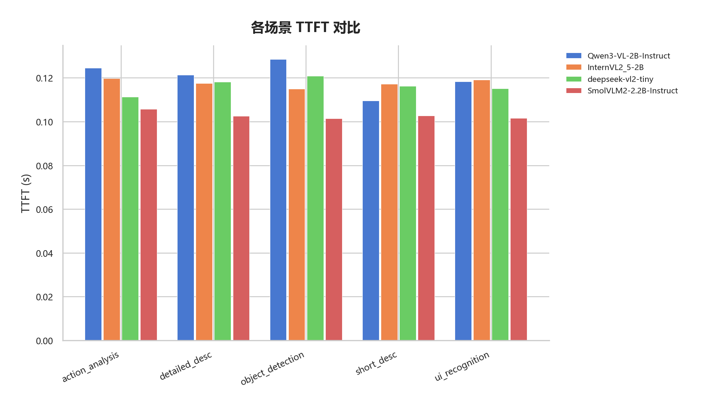
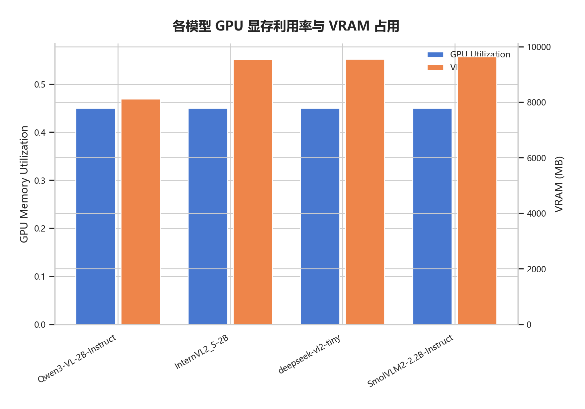

# V3 实验结果深度分析：多维度模型选型

> **文档说明**：本文基于 `results/v3/2026-03-18_04-09-17/` 的完整实验数据（4 模型 × 400 次推理 + 160 次质量评估 + 50 次视频流水线），对各模型进行深度分析，并给出针对"实时游戏窗口截图序列理解"任务的选型建议。

---

## 一、V3 与 V2 的差异

### 1.1 实验改进

| 改进项 | V2 | V3 |
|--------|----|----|
| 测试模型 | 8 个 | 4 个（排除了不支持视觉或无法稳定运行的模型） |
| 质量评估 | 无 | **新增 LLM-as-Judge** (benchmark_quality) |
| 每场景运行次数 | 3 | 5 |
| 视频理解运行次数 | 3 | 5 |
| 报告生成 | 硬编码 Markdown | 模板驱动 + DeepSeek 分析 |
| 结果管理 | 分散在 experiments/ 下 | 统一到 results/v3/ |

### 1.2 模型变化

V2 中的 8 个模型，V3 仅保留了 4 个在预飞行阶段全部通过的模型：

| 模型 | V2 状态 | V3 状态 | 排除原因 |
|------|---------|---------|---------|
| Qwen/Qwen3-VL-2B-Instruct | 通过 | **通过** | — |
| OpenGVLab/InternVL2_5-2B | 通过 | **通过** | — |
| deepseek-ai/deepseek-vl2-tiny | 通过 | **通过** | — |
| HuggingFaceTB/SmolVLM2-2.2B-Instruct | 通过 | **通过** | — |
| Qwen/Qwen3.5-2B | 通过 | 排除 | Mamba 混合架构，速度和质量均不突出 |
| Qwen/Qwen3.5-0.8B | 通过 | 排除 | 参数量过小，质量低 |
| microsoft/Phi-3.5-vision-instruct | 通过 | 排除 | 视频理解丢帧率 ~80% |
| mistralai/Ministral-3B | 通过 | 排除 | 视频理解丢帧率 ~76% |

---

## 二、推理速度基准测试

数据来源：[`results/v3/2026-03-18_04-09-17/benchmark_speed/comparison_report.md`](../../results/v3/2026-03-18_04-09-17/benchmark_speed/comparison_report.md)

### 2.1 总体排名





| 排名 | 模型 | 参数量 | TTFT (s) | 吞吐量 (tok/s) | 总耗时 (s) | avg Tokens | 运行次数 |
|:---:|------|:---:|:---:|:---:|:---:|:---:|:---:|
| 1 | **SmolVLM2-2.2B** | 2.2B | **0.103** | **123.8** | **1.717** | 194 | 100 |
| 2 | deepseek-vl2-tiny | ~3B | 0.116 | 79.9 | 3.150 | 237 | 100 |
| 3 | InternVL2.5-2B | 2B | 0.118 | 102.6 | 2.160 | 198 | 100 |
| 4 | Qwen3-VL-2B | 2B | 0.120 | 72.1 | 4.592 | 314 | 100 |

### 2.2 分场景对比




### 2.3 帧率分析

| 模型 | TTFT (s) | 理论最大 FPS | 安全 FPS (70%) |
|------|:---:|:---:|:---:|
| SmolVLM2-2.2B | 0.103 | 9.7 | 6.8 |
| deepseek-vl2-tiny | 0.116 | 8.6 | 6.0 |
| InternVL2.5-2B | 0.118 | 8.5 | 5.9 |
| Qwen3-VL-2B | 0.120 | 8.3 | 5.8 |

> 所有 4 个模型的 TTFT 均在 120ms 以内，理论最大帧率 > 8 FPS，远超实际应用需求（~1 FPS）。速度已不是瓶颈。

---

## 三、描述质量评估（V3 新增）

数据来源：`results/v3/2026-03-18_04-09-17/benchmark_quality/`

使用 DeepSeek 作为 LLM-as-Judge，对每个模型的描述输出进行 0-10 分评分。每个模型 40 次评估（4 张图片 × 2 种 prompt 模式 × 5 次重复）。

### 3.1 总体评分排名

| 排名 | 模型 | 均分 (0-10) | 标准差 | 95% CI |
|:---:|------|:---:|:---:|:---:|
| 1 | **Qwen3-VL-2B** | **4.17** | 3.54 | [3.08, 5.27] |
| 2 | deepseek-vl2-tiny | 3.20 | 2.72 | [2.36, 4.04] |
| 3 | InternVL2.5-2B | 2.77 | 2.58 | [1.98, 3.57] |
| 4 | SmolVLM2-2.2B | 1.82 | 1.80 | [1.27, 2.38] |

### 3.2 各维度评分（满分 2 分/维度）

| 模型 | 核心理解 | 关键信息覆盖 | 任务完成度 | 助手价值 | 幻觉控制 |
|------|:---:|:---:|:---:|:---:|:---:|
| Qwen3-VL-2B | **1.40** | **0.78** | **0.90** | **0.62** | **0.47** |
| deepseek-vl2-tiny | 1.05 | 0.47 | 0.72 | 0.45 | 0.50 |
| InternVL2.5-2B | 1.02 | 0.42 | 0.57 | 0.40 | 0.35 |
| SmolVLM2-2.2B | 0.78 | 0.33 | 0.42 | 0.17 | 0.12 |

### 3.3 Prompt 模式对比

| 模型 | A_description | B_assistant |
|------|:---:|:---:|
| Qwen3-VL-2B | 3.60 | **4.75** |
| deepseek-vl2-tiny | **3.50** | 2.90 |
| InternVL2.5-2B | 2.45 | **3.10** |
| SmolVLM2-2.2B | **2.20** | 1.45 |

**分析**：

- **Qwen3-VL-2B** 在质量评估中遥遥领先，尤其在 B_assistant（助手模式）下表现最佳（4.75 分），说明它最擅长以游戏陪玩身份进行交互。
- **SmolVLM2-2.2B** 虽然速度最快，但质量评分垫底（1.82 分），幻觉控制仅 0.12/2，说明其输出的可靠性存在严重问题。
- **deepseek-vl2-tiny** 在 A_description 模式下更好，但 B_assistant 模式下下降，说明它更擅长客观描述而非角色扮演。

---

## 四、视频理解实验

数据来源：`results/v3/2026-03-18_04-09-17/video_understanding/`

### 4.1 Minecraft 视频（~20s，画面变化较少）

| 模型 | 平均关键帧 | 平均 VLM 描述数 | 平均丢弃帧 | 近似丢弃率 |
|------|:---:|:---:|:---:|:---:|
| deepseek-vl2-tiny | ~18 | ~14 | ~4 | **~22%** |
| SmolVLM2-2.2B | ~18 | ~11 | ~7 | ~39% |
| InternVL2.5-2B | ~18 | ~8 | ~10 | ~56% |
| Qwen3-VL-2B | ~18 | ~4 | ~15 | ~83% |

### 4.2 Genshin Impact 视频（~25s，画面变化频繁）

| 模型 | 平均关键帧 | 平均 VLM 描述数 | 平均丢弃帧 | 近似丢弃率 |
|------|:---:|:---:|:---:|:---:|
| deepseek-vl2-tiny | ~27 | ~15 | ~12 | **~44%** |
| SmolVLM2-2.2B | ~27 | ~14 | ~13 | ~48% |
| InternVL2.5-2B | ~27 | ~5 | ~22 | ~81% |
| Qwen3-VL-2B | ~27 | ~4 | ~23 | ~85% |

### 4.3 分析

**V3 与 V2 对比**：V3 的视频理解结果与 V2 基本一致，但提供了更多运行次数（5 vs 3）以提高统计可靠性。

**关键发现**：

1. **deepseek-vl2-tiny** 在视频理解中丢弃率最低，与 V2 结论一致。这得益于其 MoE 架构在推理时的高效率——虽然参数量标称 3B，但实际激活参数远少于此。
2. **SmolVLM2-2.2B** 虽然 benchmark_speed 中最快，但视频理解中丢帧率高于 deepseek-vl2-tiny，原因可能是总耗时（包含完整 decode 阶段）而非仅 TTFT。
3. **Qwen3-VL-2B** 在视频理解中丢弃率最高（>80%），因为其总耗时 4.592s 远高于其他模型（主要因为生成 token 数更多——平均 314 tokens vs 194-237）。

---

## 五、逐模型深度分析

### 5.1 Qwen/Qwen3-VL-2B-Instruct

| 维度 | 数据 | 评价 |
|------|------|------|
| TTFT | 0.120s | 中等 |
| 吞吐量 | 72.1 tok/s | 最低 |
| 质量评分 | **4.17/10** | **最高** |
| 视频丢弃率 | ~83% | 最差 |
| VRAM | 8124 MB | 最低 |
| gpu_util | 0.45 | 相同 |

**分析**：Qwen3-VL-2B 是一个典型的"质量优先"模型。它生成的描述最详细（平均 314 tokens），质量评分遥遥领先，但这也导致了极高的视频理解丢帧率。在需要深度分析单张截图的场景（如离线 QA、赛后复盘）下是最佳选择，但不适合实时流水线。

### 5.2 OpenGVLab/InternVL2_5-2B

| 维度 | 数据 | 评价 |
|------|------|------|
| TTFT | 0.118s | 中等 |
| 吞吐量 | 102.6 tok/s | 第二 |
| 质量评分 | 2.77/10 | 第三 |
| 视频丢弃率 | ~56-81% | 较差 |
| VRAM | 9546 MB | 中等 |

**分析**：InternVL2.5-2B 在 V2 中表现不错，但 V3 的质量评估揭示了其描述质量不如预期——均分仅 2.77，低于 deepseek-vl2-tiny。在视频理解中的丢帧率也明显高于 deepseek 和 SmolVLM2。不再推荐作为首选。

### 5.3 deepseek-ai/deepseek-vl2-tiny

| 维度 | 数据 | 评价 |
|------|------|------|
| TTFT | 0.116s | 中等 |
| 吞吐量 | 79.9 tok/s | 第三 |
| 质量评分 | 3.20/10 | 第二 |
| 视频丢弃率 | **~22-44%** | **最低** |
| VRAM | 9554 MB | 中等 |

**分析**：deepseek-vl2-tiny 是 V3 的最大惊喜——兼具不错的质量（3.20 分，第二名）和最低的视频丢弃率。MoE 架构使其在实际推理中效率极高。幻觉控制维度 (0.50/2) 是所有模型中最高的，说明其输出可靠性较好。**综合推荐实时伴侣场景的首选模型。**

### 5.4 HuggingFaceTB/SmolVLM2-2.2B-Instruct

| 维度 | 数据 | 评价 |
|------|------|------|
| TTFT | **0.103s** | **最快** |
| 吞吐量 | **123.8 tok/s** | **最高** |
| 质量评分 | 1.82/10 | 最低 |
| 视频丢弃率 | ~39-48% | 中等 |
| VRAM | 9639 MB | 最高 |

**分析**：SmolVLM2 在 V2 中因速度优势被推荐，但 V3 的质量评估彻底暴露了其短板——均分仅 1.82，幻觉控制 0.12/2 几乎为零。这意味着它输出的内容虽然快，但不可靠。适合不关心描述质量的场景（如简单的画面变化检测触发器），但**不适合需要可靠描述的游戏伴侣应用**。

---

## 六、综合选型建议

### 6.1 速度 vs 质量的权衡

```
质量评分
  ^
5 |  Qwen3-VL-2B ★
4 |
3 |     DS-VL2-tiny ★
  |        InternVL2.5 ★
2 |                      SmolVLM2 ★
1 |
  +---+---+---+---+---+----> 吞吐量 (tok/s)
     60  70  80  90 100 120
```

### 6.2 推荐方案

| 场景 | 推荐模型 | 理由 |
|------|---------|------|
| **A. 实时伴侣（均衡）** | **deepseek-vl2-tiny** | 质量第二 + 丢帧率最低 + 幻觉控制最佳 |
| **B. 离线深度分析** | **Qwen3-VL-2B** | 质量最高 (4.17/10)，描述最详细 |
| **C. 延迟极致优化** | SmolVLM2-2.2B | TTFT 最低 (0.103s)，但需接受质量风险 |
| **D. 双模型架构** | deepseek-vl2-tiny + Qwen3-VL-2B | 实时用 DS-VL2，重要帧用 Qwen3 深度分析 |

### 6.3 V2 → V3 选型变化

| 维度 | V2 推荐 | V3 推荐 | 变化原因 |
|------|---------|---------|---------|
| 实时伴侣 | SmolVLM2 或 InternVL2.5 | **deepseek-vl2-tiny** | V3 新增质量评估，SmolVLM2 质量不合格 |
| 离线分析 | DS-VL2-tiny | **Qwen3-VL-2B** | 质量评分证实 Qwen3 生成最高质量描述 |

---

## 七、GPU 资源效率



所有 4 个模型在 V3 中均可以 `gpu_memory_utilization = 0.45`（~7.4GB）运行，说明它们在 RTX 4080 SUPER (16GB) 上有充足的显存余量，可与游戏进程共享 GPU。

| 模型 | gpu_memory_utilization | 等效分配显存 | 运行时 VRAM |
|------|:---:|:---:|:---:|
| Qwen3-VL-2B | 0.45 | ~7.4 GB | 8.1 GB |
| InternVL2.5-2B | 0.45 | ~7.4 GB | 9.5 GB |
| deepseek-vl2-tiny | 0.45 | ~7.4 GB | 9.6 GB |
| SmolVLM2-2.2B | 0.45 | ~7.4 GB | 9.6 GB |

---

## 八、实验局限与未来工作

### 8.1 当前局限

1. **质量评分偏低**：所有模型的平均质量评分均不超过 5 分，说明小型 VLM (2-3B) 在游戏场景理解上仍有较大提升空间。
2. **评估资产有限**：仅使用 4 张图片进行质量评估，样本量偏小。
3. **视频理解指标单一**：仅统计丢帧率，缺乏对描述内容质量的量化评估。
4. **未测试量化模型**：AWQ/GPTQ 量化版本可能在保持质量的同时显著提升速度。

### 8.2 短期计划

- 增加质量评估的测试资产数量（扩展到 10+ 张图片）
- 对推荐模型进行量化测试（AWQ 4bit）
- 在视频理解中加入描述质量的自动评估

### 8.3 中期计划

- 测试 4B+ 参数的模型（如 Qwen2.5-VL-7B with AWQ）
- 实现双模型架构原型（实时 + 深度分析）
- 引入用户主观评分作为补充评估

---

## 九、总结

V3 实验通过新增 **LLM-as-Judge 质量评估**，显著改变了模型选型结论：

1. **速度不再是唯一决策因素**：所有 4 个模型的 TTFT 均 < 120ms，足以满足实时需求。
2. **质量成为关键区分点**：Qwen3-VL-2B 以 4.17 分领先，SmolVLM2 以 1.82 分垫底。
3. **deepseek-vl2-tiny 是综合最优选择**：质量第二 + 丢帧率最低 + 幻觉控制最佳。
4. **V2 的 SmolVLM2 推荐被推翻**：速度优势无法弥补 1.82/10 的质量缺陷。
