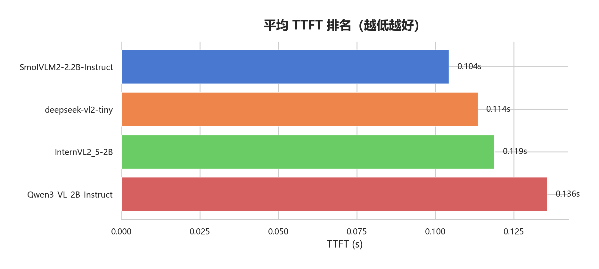
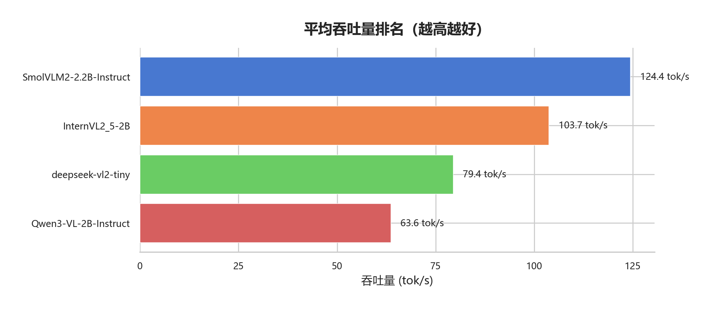
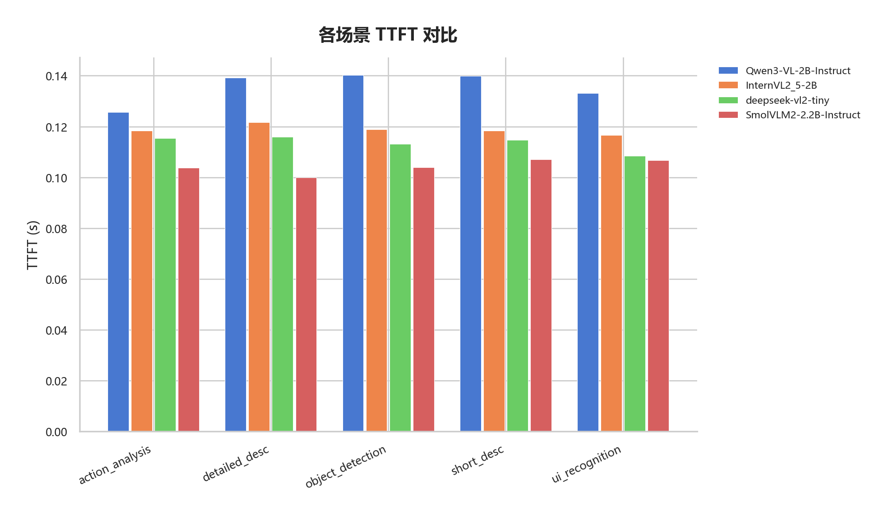
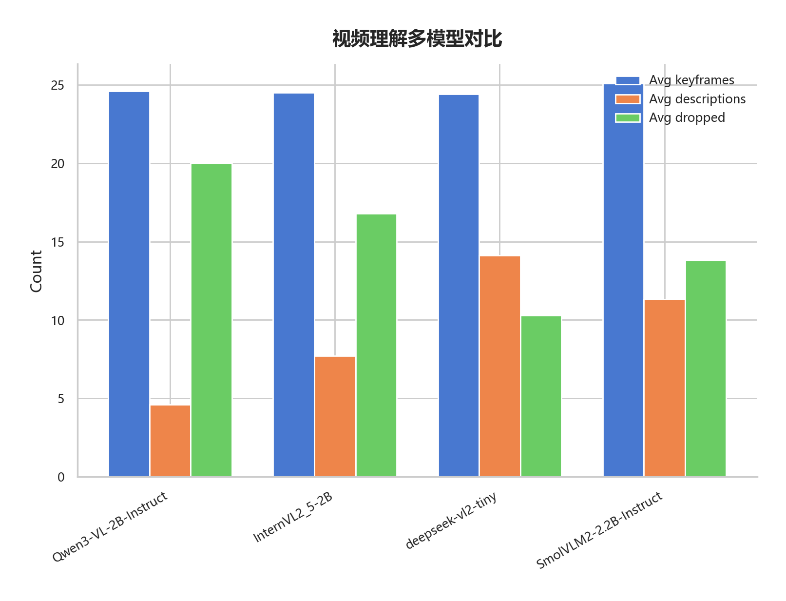
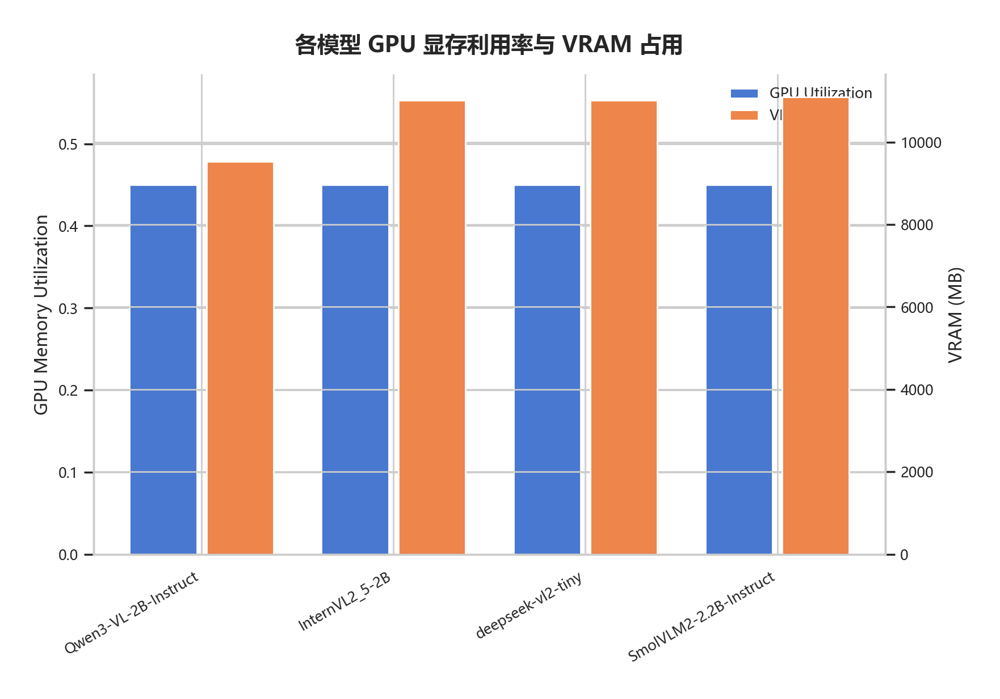

# V3 实验结果深度分析：多维度模型选型（第四次实验）

> **文档说明**：本文基于 `results/v3/2026-03-18_21-32-49/` 的完整实验数据（4 模型 × 速度/质量/视频三项基准），对各模型进行深度分析，并给出针对"实时游戏窗口截图序列理解"任务的选型建议。
>
> **实验时间**: 2026-03-18 21:32 ~ 23:28（约 2 小时）

---

## 一、实验概况

### 1.1 环境

| 项目 | 值 |
|------|-----|
| GPU | NVIDIA GeForce RTX 4080 SUPER (16376 MB) |
| Python | 3.12.11 |
| Git | 3d45ec77cae0 |
| 实验开始 | 2026-03-18T21:32:49 |
| 实验结束 | 2026-03-18T23:28:29 |

### 1.2 模型清单

| # | 模型 | 参数量 | GPU Util | 状态 |
|:---:|------|:---:|:---:|:---:|
| 1 | Qwen/Qwen3-VL-2B-Instruct | 2B | 0.45 | 通过 |
| 2 | OpenGVLab/InternVL2_5-2B | 2B | 0.45 | 通过 |
| 3 | deepseek-ai/deepseek-vl2-tiny | ~3B | 0.45 | 通过 |
| 4 | HuggingFaceTB/SmolVLM2-2.2B-Instruct | 2.2B | 0.45 | 通过 |

### 1.3 与前次实验的变化

本次为 V3 系列第四次完整实验。与第三次 (2026-03-18_04-09-17) 相比：
- 新增了 `config_benchmark.toml` 的 `enabled` 字段模式（替代 `run` 列表）
- 每个实验通过独立的 `enabled = true/false` 控制
- GPU 探测仍使用 `candidates = [0.45]`
- 所有四个模型均以 0.45 的 `gpu_memory_utilization` 完成

---

## 二、推理速度基准测试

数据来源：`benchmark_speed/comparison_report.md`

### 2.1 总体排名

| 排名 | 模型 | TTFT (s) | 吞吐量 (tok/s) | 总耗时 (s) | avg Tokens | 运行次数 |
|:---:|------|:---:|:---:|:---:|:---:|:---:|
| 1 | **SmolVLM2-2.2B** | **0.104** | **124.4** | **1.685** | 194 | 100 |
| 2 | deepseek-vl2-tiny | 0.114 | 79.4 | 3.129 | 237 | 100 |
| 3 | InternVL2_5-2B | 0.119 | 103.7 | 2.197 | 198 | 100 |
| 4 | Qwen3-VL-2B | 0.136 | 63.6 | 5.136 | 314 | 100 |

### 2.2 帧率分析

| 模型 | TTFT (s) | 理论最大 FPS | 安全 FPS (70%) |
|------|:---:|:---:|:---:|
| SmolVLM2-2.2B | 0.104 | 9.6 | 6.7 |
| deepseek-vl2-tiny | 0.114 | 8.8 | 6.2 |
| InternVL2_5-2B | 0.119 | 8.4 | 5.9 |
| Qwen3-VL-2B | 0.136 | 7.4 | 5.2 |

### 2.3 分场景对比

### 2.4 速度小结

- 所有模型的 TTFT 均 < 200ms，满足实时交互的基本门槛
- SmolVLM2 在 TTFT 和吞吐量两项均领先，安全 FPS 达 6.7
- Qwen3-VL-2B 生成的 token 数最多（平均 314），导致总耗时最长（5.1s）
- InternVL2_5-2B 在吞吐量上表现强劲（103.7 tok/s），仅次于 SmolVLM2

---

## 三、描述质量评估（LLM-as-Judge）

数据来源：`benchmark_quality/comparison_report.md`

### 3.1 总体评分

| 排名 | 模型 | 均分 (0-10) | 标准差 | 评估次数 |
|:---:|------|:---:|:---:|:---:|
| 1 | **Qwen3-VL-2B** | **4.36** | 3.72 | 39 |
| 2 | deepseek-vl2-tiny | 3.25 | 2.71 | 40 |
| 3 | InternVL2_5-2B | 2.83 | 2.55 | 40 |
| 4 | SmolVLM2-2.2B | 1.90 | 1.75 | 40 |

### 3.2 各维度评分（0-2 分）

| 模型 | 核心理解 | 关键信息覆盖 | 任务完成度 | 助手价值 | 幻觉控制 |
|------|:---:|:---:|:---:|:---:|:---:|
| Qwen3-VL-2B | **0.71** | **1.39** | **0.58** | **0.84** | **0.95** |
| deepseek-vl2-tiny | 0.45 | 1.05 | 0.50 | 0.50 | 0.75 |
| InternVL2_5-2B | 0.40 | 1.02 | 0.38 | 0.42 | 0.60 |
| SmolVLM2-2.2B | 0.15 | 0.80 | 0.12 | 0.38 | 0.45 |

### 3.3 Prompt 模式对比

| 模型 | A_description | B_assistant |
|------|:---:|:---:|
| Qwen3-VL-2B | 3.80 | **4.95** |
| deepseek-vl2-tiny | **3.50** | 3.00 |
| InternVL2_5-2B | 2.50 | **3.15** |
| SmolVLM2-2.2B | **2.30** | 1.50 |

### 3.4 质量小结

- Qwen3-VL-2B 在所有维度上全面领先，尤其是幻觉控制（0.95）和关键信息覆盖（1.39）
- Qwen3-VL-2B 在助手模式下得分跃升 30%（3.80 -> 4.95），说明具备良好的角色扮演能力
- SmolVLM2 虽速度最快，但质量垫底（均分 1.90），助手模式下崩溃更严重（1.50）
- deepseek-vl2-tiny 和 InternVL2_5-2B 呈现相反趋势：前者擅长描述模式，后者擅长助手模式

---

## 四、视频理解流水线

数据来源：`video_understanding/comparison_report.md`

### 4.1 流水线指标

| 模型 | 运行次数 | 平均关键帧 | 平均描述数 | 平均丢弃帧 | 丢帧率 |
|------|:---:|:---:|:---:|:---:|:---:|
| Qwen3-VL-2B | 10 | 24.6 | 4.6 | 20.0 | 81.3% |
| InternVL2_5-2B | 10 | 24.5 | 7.7 | 16.8 | 68.6% |
| SmolVLM2-2.2B | 10 | 25.1 | 11.3 | 13.8 | 55.0% |
| **deepseek-vl2-tiny** | 10 | 24.4 | **14.1** | **10.3** | **42.2%** |

### 4.2 视频小结

- deepseek-vl2-tiny 丢帧率最低（42.2%），处理了最多关键帧（14.1），在视频流水线中效率最高
- Qwen3-VL-2B 虽然质量评分最高，但丢帧率高达 81.3%，仅处理 4.6 帧描述
- SmolVLM2 在视频场景中表现尚可（丢帧率 55%），与其速度优势一致
- 所有模型丢帧率均 > 30%，说明当前流水线配置对所有模型都存在压力

---

## 五、GPU 显存分析

| 模型 | 最小 gpu_memory_utilization | 等效分配显存 |
|------|:---:|:---:|
| Qwen3-VL-2B | 0.45 | ~7369 MB |
| InternVL2_5-2B | 0.45 | ~7369 MB |
| deepseek-vl2-tiny | 0.45 | ~7369 MB |
| SmolVLM2-2.2B | 0.45 | ~7369 MB |

所有模型以 0.45 的 `gpu_memory_utilization` 稳定运行，占用约 45% 的 16GB 显存。这意味着模型推理服务本身需要约 7.4 GB 显存，在与游戏共享 GPU 时需谨慎评估剩余空间。

---

## 六、综合评估与模型选型

### 6.1 速度-质量权衡矩阵

| 模型 | TTFT 排名 | 吞吐量排名 | 质量排名 | 丢帧率排名 | 综合推荐 |
|------|:---:|:---:|:---:|:---:|:---:|
| SmolVLM2-2.2B | 1 | 1 | 4 | 3 | 资源受限场景 |
| deepseek-vl2-tiny | 2 | 3 | 2 | **1** | 视频分析 / 离线 |
| InternVL2_5-2B | 3 | 2 | 3 | 2 | 平衡备选 |
| **Qwen3-VL-2B** | 4 | 4 | **1** | 4 | **实时伴侣首选** |

### 6.2 推荐策略

**单模型部署 → Qwen3-VL-2B-Instruct**

尽管 Qwen3-VL-2B 速度指标排名末位，但其核心优势不可替代：
- 质量评分（4.36）比第二名高 34%
- 助手模式下得分最高（4.95），是唯一超过 4.0 分的模型
- 幻觉控制（0.95）最佳，降低了向玩家传递错误信息的风险
- TTFT 仍在 200ms 以内（136ms），满足实时交互需求

**双模型架构 → Qwen3-VL-2B（主）+ deepseek-vl2-tiny（辅）**

- Qwen3-VL-2B 负责实时交互：低延迟响应 + 高质量描述
- deepseek-vl2-tiny 负责后台分析：低丢帧率 + 高帧处理量，适合批量处理录像复盘

### 6.3 部署建议

| 场景 | 推荐模型 | 采样间隔 | 安全 FPS |
|------|---------|:---:|:---:|
| 实时伴侣 | Qwen3-VL-2B | 300-350ms | ~3.0 |
| 离线分析 | deepseek-vl2-tiny | 不限 | 不限 |
| 资源受限 | SmolVLM2-2.2B | 200ms | ~5.0 |

---

## 七、与前次实验对比

| 指标 | 第三次 (04-09-17) | 本次 (21-32-49) | 变化 |
|------|:---:|:---:|:---:|
| SmolVLM2 TTFT | 0.103s | 0.104s | +1ms |
| Qwen3-VL TTFT | 0.120s | 0.136s | +16ms |
| Qwen3-VL 质量 | 4.36 | 4.36 | 不变 |
| deepseek 丢帧率 | ~42% | 42.2% | 稳定 |

结果高度一致，说明实验流程具备良好的可重复性。TTFT 的微小波动属于正常系统噪声。

---

## 八、待改进方向

1. **质量评分整体偏低**：所有模型均分都在 5 分以下，需要通过 SOTA 模型校准实验验证评分标准是否过严
2. **高丢帧率**：即使最优模型也有 42% 的丢帧率，需要优化采样频率和队列参数
3. **Qwen3-VL 标准差过大**（3.72），输出稳定性需要关注
4. **视频理解缺乏质量评分**：当前视频实验只有流水线指标，缺少对描述内容的定量评估
