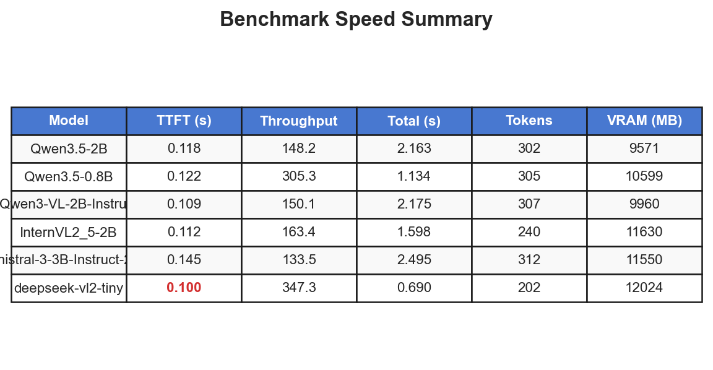
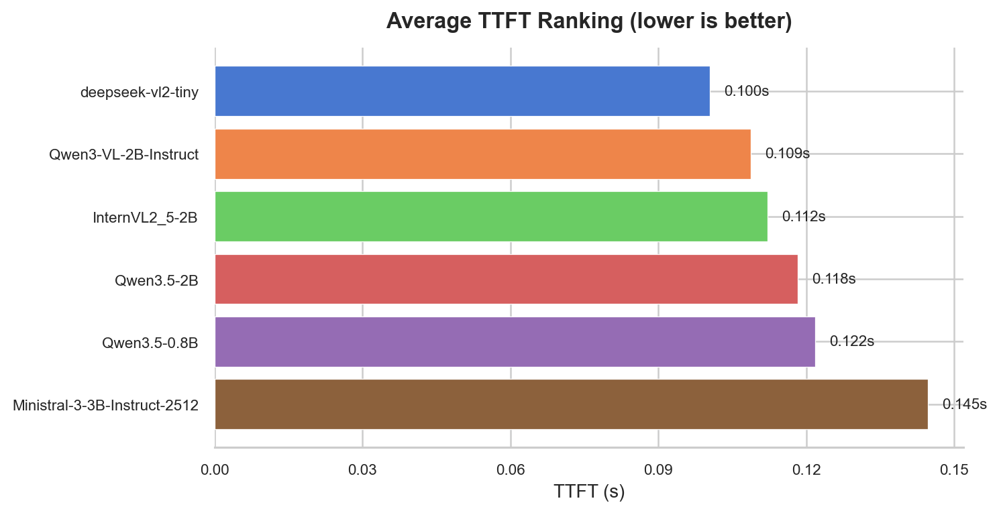
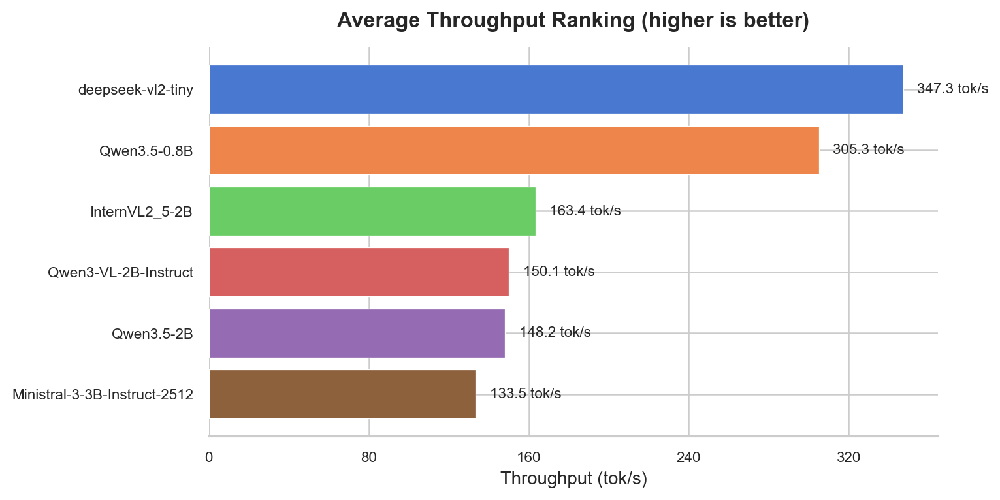
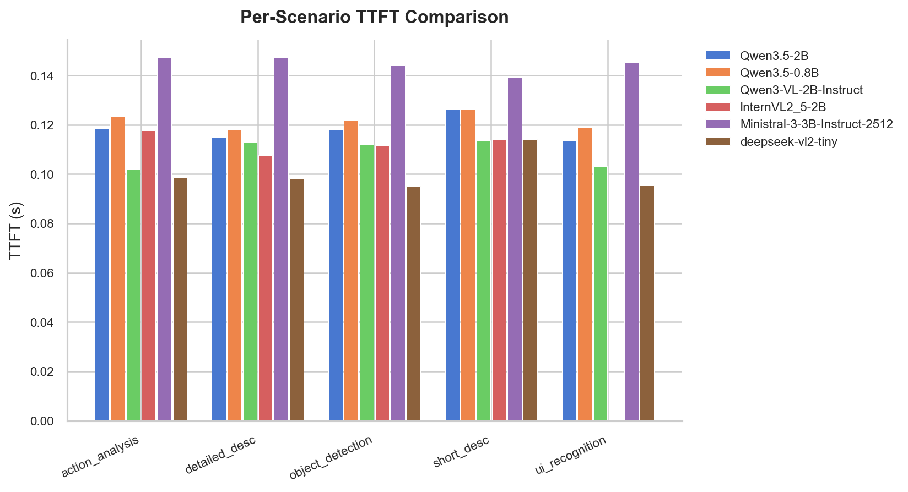

# Multi-Model Comprehensive Benchmark Report

**Generated**: 2026-03-16 06:08:56

## Environment

- **GPU**: NVIDIA GeForce RTX 4080 SUPER (16376 MB)
- **Python**: 3.12.11
- **Git**: 34c816c236c7
- **Start**: 2026-03-16T05:00:59.062709
- **End**: 2026-03-16T06:08:54.957800

## Model Inventory

| # | Model ID | Short Name | Status |
|---|----------|------------|--------|
| 1 | Qwen/Qwen3.5-2B | Qwen_Qwen3.5-2B | Completed |
| 2 | Qwen/Qwen3.5-0.8B | Qwen_Qwen3.5-0.8B | Completed |
| 3 | Qwen/Qwen3-VL-2B-Instruct | Qwen_Qwen3-VL-2B-Instruct | Completed |
| 4 | OpenGVLab/InternVL2_5-2B | OpenGVLab_InternVL2_5-2B | Completed |
| 5 | mistralai/Ministral-3-3B-Instruct-2512 | mistralai_Ministral-3-3B-Instruct-2512 | Completed |
| 6 | deepseek-ai/deepseek-vl2-tiny | deepseek-ai_deepseek-vl2-tiny | Completed |

> This benchmark does not cover community quantized models (unsloth GGUF/AWQ/GPTQ).

## Visualizations

### Summary Table

### TTFT Ranking

### Throughput Ranking

### Per-Scenario TTFT

## Benchmark Speed Results

| Model | TTFT (s) | Throughput (tok/s) | Total (s) | Max FPS | Safe FPS |
|-------|:---:|:---:|:---:|:---:|:---:|
| Qwen3.5-2B | 0.118 | 148.2 | 2.163 | 8.46 | 5.92 |
| Qwen3.5-0.8B | 0.122 | 305.3 | 1.134 | 8.21 | 5.75 |
| Qwen3-VL-2B-Instruct | 0.109 | 150.1 | 2.175 | 9.19 | 6.44 |
| InternVL2_5-2B | 0.112 | 163.4 | 1.598 | 8.92 | 6.24 |
| Ministral-3-3B-Instruct-2512 | 0.145 | 133.5 | 2.495 | 6.92 | 4.84 |
| deepseek-vl2-tiny | 0.100 | 347.3 | 0.690 | 9.96 | 6.97 |

See [comparison_report.md](benchmark_speed/comparison_report.md) for details.

## Video Understanding Results

See [comparison_report.md](video_understanding/comparison_report.md) for details.

## Research Questions

### 1. Maximum theoretical FPS?

Max FPS = 1 / TTFT. See the table above.
Best: **deepseek-vl2-tiny** with TTFT 0.100s -> 9.96 FPS.

### 2. Safe capture rate?

Recommended: 70% of max FPS to account for network, queue, and frame-diff overhead.
In practice, frame-diff filtering reduces VLM load significantly.

### 3. How are unprocessed frames handled?

KeyFrameQueue uses an expiry mechanism (default 10s). Expired frames are silently
discarded without blocking the pipeline. High drop rates indicate the model is too
slow -- reduce capture rate or use a faster model.

## Recommendations

- **Lowest latency**: deepseek-vl2-tiny (TTFT 0.100s)
- **Highest throughput**: deepseek-vl2-tiny (347.3 tok/s)
- **Real-time companion**: prioritize low-latency models, sample ~1 frame every 2-3s
- **Offline analysis**: use high-throughput models for batch processing

## Incidents

- **Zero-Point-AI/MARTHA-2B**: vLLM 在 300s 内未就绪: Connection error. (excluded from experiment)
- **vikhyatk/moondream2**: vLLM 在 300s 内未就绪: Connection error. (excluded from experiment)
