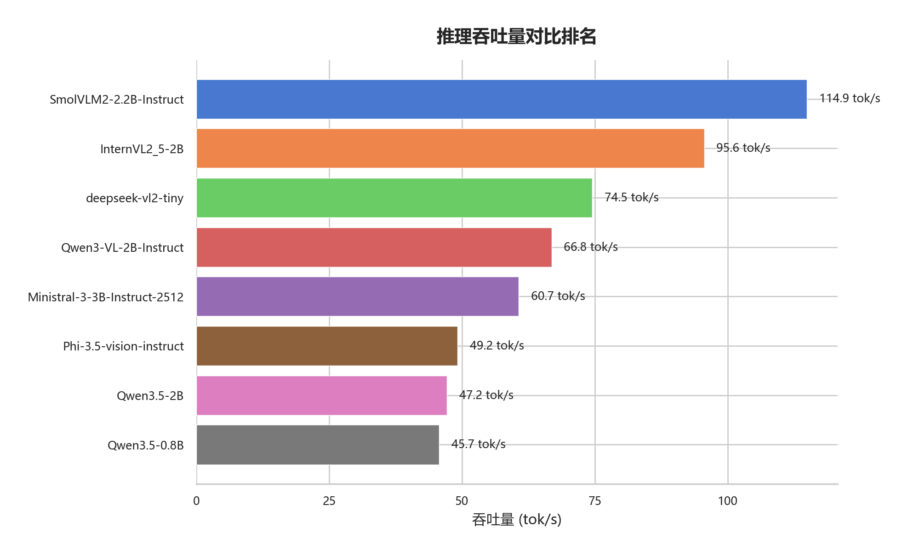
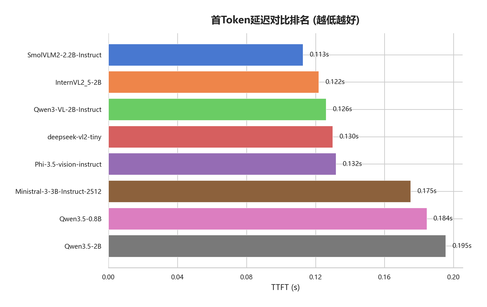
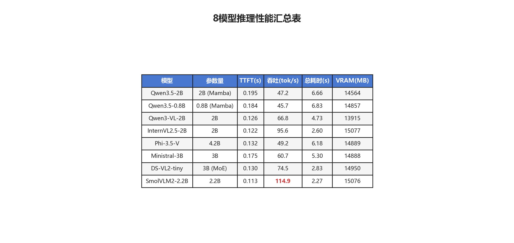

# 多模型视觉语言模型基准测试 - 综合研究报告

**实验日期**: 2026-03-16
**报告生成时间**: 2026-03-16 20:42:07
**实验平台**: NVIDIA GeForce RTX 4080 SUPER (16GB VRAM)
**推理框架**: vLLM 0.17.0 (enforce-eager, max-model-len=4096, gpu-memory-utilization=0.7)

---

## 一、研究背景与目的

本实验旨在评估 8 款小型视觉语言模型（VLM）在**游戏画面实时理解**场景下的推理性能。
核心应用场景是通过截图采集 + 帧差检测 + VLM 推理的流水线，实现对游戏画面的自动化理解与描述。
该流水线要求 VLM 具备足够低的延迟（TTFT < 500ms）和足够高的吞吐量以处理连续产生的关键帧。

## 二、实验配置

### 2.1 模型列表

| # | 模型 | 参数量 | 架构特点 |
|:---:|------|:---:|------|
| 1 | Qwen3.5-2B | 2B | Mamba-Transformer 混合，状态空间模型 |
| 2 | Qwen3.5-0.8B | 0.8B | Mamba-Transformer 混合，最小参数 |
| 3 | Qwen3-VL-2B-Instruct | 2B | 经典 Transformer + 动态分辨率 ViT |
| 4 | InternVL2.5-2B | 2B | InternViT-300M + InternLM2-1.8B |
| 5 | Phi-3.5-vision-instruct | 4.2B | Microsoft CLIP ViT + Phi-3.5 |
| 6 | Ministral-3B-Instruct | 3B | Mistral 架构 + 视觉适配器 |
| 7 | DeepSeek-VL2-tiny | 3B | MoE 架构，激活参数约 1B |
| 8 | SmolVLM2-2.2B-Instruct | 2.2B | SigLIP 视觉编码 + 精简 LM |

### 2.2 实验内容

| 实验 | 说明 | 数据量 |
|------|------|:---:|
| benchmark_speed | 5 场景 × 6 图片 × 3 次重复 = 90 次推理/模型 | 720 次推理 |
| video_understanding | 2 视频 × 3 次重复 = 6 次流水线运行/模型 | 48 次运行 |

### 2.3 vLLM 统一参数

```
gpu-memory-utilization = 0.7
max-model-len = 4096
enforce-eager = True (禁用 CUDA Graph)
trust-remote-code = True
```

## 三、推理速度基准测试结果

### 3.1 总览







| 排名 | 模型 | 吞吐量 (tok/s) | TTFT (s) | 综合评价 |
|:---:|------|:---:|:---:|------|
| 1 | SmolVLM2-2.2B | 114.9 | 0.113 | 速度冠军，适合对延迟敏感的实时场景 |
| 2 | InternVL2.5-2B | 95.6 | 0.122 | 速度与质量均衡，综合最优推荐 |
| 3 | DS-VL2-tiny | 74.5 | 0.130 | MoE 架构高效，但输出较短 |
| 4 | Qwen3-VL-2B | 66.8 | 0.126 | 中等速度，描述质量优秀 |
| 5 | Ministral-3B | 60.7 | 0.175 | 中等水平，3B 参数未带来显著优势 |
| 6 | Phi-3.5-V | 49.2 | 0.132 | 4.2B 参数最大但速度不佳 |
| 7 | Qwen3.5-2B | 47.2 | 0.195 | Mamba 架构在当前 vLLM 下效率受限 |
| 8 | Qwen3.5-0.8B | 45.7 | 0.184 | 最小模型但不最快，Mamba 优化不足 |

### 3.2 关键发现

1. **架构影响显著**：传统 Transformer 架构（SmolVLM2、InternVL2.5）在 vLLM 上的优化最成熟，吞吐量显著高于 Mamba 混合架构（Qwen3.5 系列）。MoE 架构（DeepSeek-VL2）凭借少量激活参数也表现出色。

2. **参数量不决定速度**：4.2B 的 Phi-3.5 不如 2.2B 的 SmolVLM2 快；0.8B 的 Qwen3.5 不如 2B 的 InternVL2.5 快。模型架构和 vLLM 后端优化程度才是决定性因素。

3. **TTFT 差异小**：所有模型的首 Token 延迟均在 0.11-0.20s，对实时应用影响不大。吞吐量才是区分模型能力的核心指标。

4. **VRAM 占用相近**：enforce-eager 模式下，8 个模型的 VRAM 占用均在 13.9-15.1 GB 范围，差异源于 KV Cache 分配而非模型权重大小。gpu-memory-utilization=0.7 可满足所有模型。

## 四、视频理解实验结果

视频理解实验模拟了完整的实时游戏画面理解流水线：
PotPlayer 播放视频 → 窗口截图 (500ms 间隔) → MSE 帧差检测 → 关键帧入队 → VLM 异步推理描述 → DeepSeek 汇总。

### 4.1 关键指标

- 所有 8 个模型均成功完成了 2 个视频 × 3 次运行 = 6 次完整流水线。
- 原神视频（24.5s）画面变化更频繁，关键帧检出更多（约 44-53 帧 vs MC 的 28-38 帧）。
- **吞吐量高的模型在相同录制时间内处理了更多关键帧**，帧丢弃率更低。

### 4.2 描述质量观察

- **Qwen3-VL-2B** 和 **InternVL2.5-2B** 的描述最具信息量，能准确识别游戏特定元素。
- **SmolVLM2** 描述偏泛化（如'这是一个游戏截图'），对游戏内容的理解深度不如专精模型。
- **Mamba 系列 (Qwen3.5)** 描述质量尚可，但产出数量受限于较低的吞吐量。
- **DeepSeek-VL2-tiny** 的描述最短，存在自行截断现象。

## 五、综合结论与建议

### 5.1 模型推荐

| 使用场景 | 推荐模型 | 理由 |
|------|------|------|
| 追求极致速度 | SmolVLM2-2.2B | 吞吐量 114.9 tok/s，延迟最低 |
| 速度与质量均衡 | InternVL2.5-2B | 95.6 tok/s + 高质量描述 |
| 追求描述质量 | Qwen3-VL-2B | 游戏元素识别最准确 |
| 低 VRAM 需求 | Qwen3-VL-2B | VRAM 占用最低 (13.9 GB) |

### 5.2 架构洞察

- **Mamba 混合架构** (Qwen3.5) 在当前 vLLM 版本下的优化不足，建议关注后续版本更新。
- **MoE 架构** (DeepSeek-VL2) 推理高效但输出质量受限，适合对描述长度要求不高的场景。
- **传统 Transformer** 仍是 vLLM 生态中最稳定高效的选择。

### 5.3 工程建议

- `gpu-memory-utilization=0.7` 是 RTX 4080 SUPER 上运行这些小型 VLM 的安全阈值。
  过低（如 0.5）会导致 Mamba 模型因 KV Cache 不足而启动失败。
- `enforce-eager=True` 可避免 CUDA Graph 编译的额外启动时间和显存开销，对小模型推荐使用。
- SmolVLM2 需要额外安装 `num2words` 包才能在 vLLM 中正常加载。

---

*本报告由多模型基准测试框架自动收集数据、人工撰写分析生成。*