# 实验审阅: video_GenshinImpact_01.mp4

## 运行元信息

- **模型**: `Qwen/Qwen3-VL-2B-Instruct`
- **视频**: `video_GenshinImpact_01.mp4`
- **运行目录**: `video_GenshinImpact_01_run1`

### 配置参数

| 参数 | 值 |
|------|-----|
| screenshot_interval_ms | 500 |
| max_size | 512 |
| recording_duration_s | 26 |
| algorithm | mse |
| diff_threshold | 500.0 |

## 统计摘要

- **总采样帧数**: 53
- **关键帧数**: 45
- **丢弃帧数**: 6
- **录制时长**: 26.0s
- **关键帧率**: 84.9%

## 帧时间线

| 帧序号 | 时间戳 | 差异值 | 关键帧 | 判定原因 | 图片 | VLM 描述 |
|--------|--------|--------|--------|----------|------|----------|
| 0 | 0.0s | - | **是** | 首帧，自动标记为关键帧 | [frame_0000_key.png](frames/frame_0000_key.png) | 这是一张游戏《原神》的地图界面截图，显示了玩家当前所在区域的探索地图。地图上标注了多个地点，如“沉玉谷”、“碧水原”、“明冠山地”等。画面底部有字幕“璃月有一处地方”，表明玩家正在探索璃月地区。地图右上角显示了玩家的等级、资源和当前任... |
| 1 | 0.5s | 3213.53 | **是** | 差异值 3213.53 >= 阈值 500.00 | [frame_0001_key.png](frames/frame_0001_key.png) | - |
| 2 | 1.0s | 3220.86 | **是** | 差异值 3220.86 >= 阈值 500.00 | [frame_0002_key.png](frames/frame_0002_key.png) | - |
| 3 | 1.5s | 3951.40 | **是** | 差异值 3951.40 >= 阈值 500.00 | [frame_0003_key.png](frames/frame_0003_key.png) | - |
| 4 | 2.0s | 23.67 | 否 | 差异值 23.67 < 阈值 500.00 | [frame_0004_skip.png](frames/frame_0004_skip.png) | - |
| 5 | 2.5s | 2401.17 | **是** | 差异值 2401.17 >= 阈值 500.00 | [frame_0005_key.png](frames/frame_0005_key.png) | - |
| 6 | 3.0s | 600.08 | **是** | 差异值 600.08 >= 阈值 500.00 | [frame_0006_key.png](frames/frame_0006_key.png) | - |
| 7 | 3.5s | 2372.30 | **是** | 差异值 2372.30 >= 阈值 500.00 | [frame_0007_key.png](frames/frame_0007_key.png) | - |
| 8 | 4.0s | 31.79 | 否 | 差异值 31.79 < 阈值 500.00 | [frame_0008_skip.png](frames/frame_0008_skip.png) | - |
| 9 | 4.5s | 77.26 | 否 | 差异值 77.26 < 阈值 500.00 | [frame_0009_skip.png](frames/frame_0009_skip.png) | - |
| 10 | 5.0s | 6895.15 | **是** | 差异值 6895.15 >= 阈值 500.00 | [frame_0010_key.png](frames/frame_0010_key.png) | 一个粉色长发、头戴牛角装饰的动漫风格角色站在一条石板路上，两侧是燃烧着火焰的石灯笼，背景是茂密的绿色树林。角色似乎正准备进入或正在穿过一个石制拱门。 |
| 11 | 5.5s | 1621.42 | **是** | 差异值 1621.42 >= 阈值 500.00 | [frame_0011_key.png](frames/frame_0011_key.png) | 一个粉色长发、头戴牛角装饰的角色背对镜头，站在一个石砌拱门下，正朝着前方的绿色山谷走去。拱门两侧有燃烧的火把，照亮了石板路和周围的绿植。画面下方有字幕：“最好找一位大佬来帮你”。 |
| 12 | 6.0s | 1269.74 | **是** | 差异值 1269.74 >= 阈值 500.00 | [frame_0012_key.png](frames/frame_0012_key.png) | 一个粉色长发、头戴牛角的动漫风格女性角色站在石板路上，她身后是两盏燃烧的火把，周围是石墙和绿植，场景像是一个幽暗的森林小径。画面下方的字幕显示“最好找一位大佬来帮你”。 |
| 13 | 6.5s | 1197.92 | **是** | 差异值 1197.92 >= 阈值 500.00 | [frame_0013_key.png](frames/frame_0013_key.png) | 一个粉色长发、头戴角饰的动漫风格女性角色，正站在一个石砌的拱门下，背对镜头。她双手各持一把带有蓝色花朵装饰的武器，似乎正准备进入或探索一个幽暗的洞穴或遗迹。画面下方的字幕显示“最好找一位大佬来帮你”，暗示她可能正在寻求帮助。 |
| 14 | 7.0s | 1214.97 | **是** | 差异值 1214.97 >= 阈值 500.00 | [frame_0014_key.png](frames/frame_0014_key.png) | 一位粉色长发、头戴角饰的动漫风格女性角色正背对镜头，站在一个石砌拱门下。她身后的拱门两侧各有一盏燃烧的火把，照亮了周围的石墙和藤蔓。画面下方有字幕显示“最好找一位大佬来帮你”。 |
| 15 | 7.5s | 1747.88 | **是** | 差异值 1747.88 >= 阈值 500.00 | [frame_0015_key.png](frames/frame_0015_key.png) | 一个粉色双马尾的动漫风格女性角色背对着镜头，站在一个石砌拱门下，正准备进入一个充满绿色植物和火把的洞穴或密室。她身后的拱门两侧各有一盏燃烧的火把，照亮了周围的环境。画面下方的字幕显示“因为里面的东西”。 |
| 16 | 8.0s | 1029.83 | **是** | 差异值 1029.83 >= 阈值 500.00 | [frame_0016_key.png](frames/frame_0016_key.png) | 一个粉色长发、头戴角饰的动漫风格角色背对镜头，站在一个由石墙和藤蔓构成的拱门下。拱门两侧各有一盏燃烧的火把，照亮了周围的环境。角色似乎正准备进入或正在穿过这个拱门，画面下方有字幕“因为里面的东西”。 |
| 17 | 8.5s | 1445.24 | **是** | 差异值 1445.24 >= 阈值 500.00 | [frame_0017_key.png](frames/frame_0017_key.png) | 一个粉色长发、头戴牛角的动漫风格角色背对镜头，站在一个由石块砌成的拱门下。拱门两侧有燃烧的火把，照亮了周围的环境。角色正准备进入一个充满绿色植物和光斑的幽深洞穴或森林区域。画面下方的字幕显示“因为里面的东西”。 |
| 18 | 9.0s | 1674.63 | **是** | 差异值 1674.63 >= 阈值 500.00 | [frame_0018_key.png](frames/frame_0018_key.png) | 一个粉色长发、头戴角饰的动漫风格女性角色背对镜头，站在一个由石块和藤蔓构成的拱门下，正准备进入一个充满绿意的森林区域。她身后的拱门两侧有燃烧的火把，照亮了周围的环境。 |
| 19 | 9.5s | 3176.65 | **是** | 差异值 3176.65 >= 阈值 500.00 | [frame_0019_key.png](frames/frame_0019_key.png) | 在一处石砌的幽暗通道中，一个粉色头发、头戴角饰的角色正蹲在石板路上，似乎在观察前方。通道两侧是古老的石墙，上方的天空中漂浮着橙色的光点，像是某种发光的生物或魔法效果。画面下方有字幕“不是你所能敌的”。 |
| 20 | 10.0s | 3349.34 | **是** | 差异值 3349.34 >= 阈值 500.00 | [frame_0020_key.png](frames/frame_0020_key.png) | 一名角色正站在一个石制结构旁，抬头仰望天空，天空中悬浮着一个巨大的、散发着橙黄色光芒的球体，周围有发光的碎片在飘动。画面下方有字幕“不是你所能数的”。 |
| 21 | 10.5s | 5033.99 | **是** | 差异值 5033.99 >= 阈值 500.00 | [frame_0021_key.png](frames/frame_0021_key.png) | 在一片充满奇幻色彩的森林中，一个角色正站在水边，前方漂浮着一个发光的球体装置。画面中，角色似乎正在准备进行某种操作，屏幕下方的字幕提示“来到前面的装置”，暗示着这是一个需要玩家前往的互动点。 |
| 22 | 11.0s | 4375.56 | **是** | 差异值 4375.56 >= 阈值 500.00 | [frame_0022_key.png](frames/frame_0022_key.png) | 在一片充满奇幻色彩的草丛中，一个角色正站在前方，周围环绕着发光的植物和神秘的光效。画面下方的字幕显示“来到前面的装置”，暗示着角色正在执行一个任务或探索。 |
| 23 | 11.5s | 3975.80 | **是** | 差异值 3975.80 >= 阈值 500.00 | [frame_0023_key.png](frames/frame_0023_key.png) | 在一片充满奇幻色彩的森林中，一名角色正站在草地上，准备面对前方的装置。画面中，一个巨大的、发光的南瓜头状物体悬挂在空中，而右侧则有一个发光的、类似生物的物体。 |
| 24 | 12.0s | 3856.19 | **是** | 差异值 3856.19 >= 阈值 500.00 | [frame_0024_key.png](frames/frame_0024_key.png) | 在一片充满奇幻色彩的绿色草地上，一个粉色头发、身穿白色和红色服饰的角色正在奔跑。背景中，巨大的黑色生物翅膀悬在空中，远处有发光的橙色晶体和一座石碑。画面下方显示着游戏界面，包括角色等级和“启动它”等文字。 |
| 25 | 12.5s | 2679.34 | **是** | 差异值 2679.34 >= 阈值 500.00 | [frame_0025_key.png](frames/frame_0025_key.png) | 在一片绿意盎然的森林中，一个角色正站在一块岩石上，准备启动一个发光的黑色石碑。石碑顶部有橙色的火焰状光点，周围是茂密的植被和发光的岩石。画面下方有“启动它”的提示文字。 |
| 26 | 13.0s | 3804.90 | **是** | 差异值 3804.90 >= 阈值 500.00 | [frame_0026_key.png](frames/frame_0026_key.png) | 一个粉色头发、穿着粉色和白色服装的角色正站在一个蓝色的岩石上，旁边是一个黑色的石碑状物体，顶部有橙色的发光装饰。角色的身后是绿色的草地和远处的山丘，周围有发光的岩石。画面下方有游戏界面，显示角色等级为90。 |
| 27 | 13.5s | 2348.61 | **是** | 差异值 2348.61 >= 阈值 500.00 | [frame_0027_key.png](frames/frame_0027_key.png) | 一名粉色头发的女性角色站在一个发光的黑色石碑前，背景是充满绿色植被和橙色晶体的奇幻洞穴环境。画面右下角显示了游戏的用户界面，包括角色等级、生命值和技能图标。 |
| 28 | 14.0s | 1910.89 | **是** | 差异值 1910.89 >= 阈值 500.00 | [frame_0028_key.png](frames/frame_0028_key.png) | 一名角色站在一个发光的石碑前，准备开始一场名为“消灭5只魔物”的挑战。画面中显示“挑战开始”字样，表明游戏正处于挑战模式的初始阶段。 |
| 29 | 14.5s | 6679.16 | **是** | 差异值 6679.16 >= 阈值 500.00 | [frame_0029_key.png](frames/frame_0029_key.png) | 一名粉色长发的女性角色正在一个绿色的草地上奔跑，她手持弓箭，正准备进行一场战斗。画面中央的蓝色横幅显示“消灭5只魔物”，下方的黄色文字“挑战开始”表明这是一场挑战任务的开始。 |
| 30 | 15.0s | 2701.53 | **是** | 差异值 2701.53 >= 阈值 500.00 | [frame_0030_key.png](frames/frame_0030_key.png) | 在一片绿色的草地上，一名粉色头发的女性角色正面对着一个巨大的、类似岩石的怪物。怪物身上有火焰特效，屏幕中央显示着“消灭5只怪物”和“守护轻策密藏不被破坏”的任务提示。画面下方的字幕写着“第一波和第二波的独眼小宝”，表明这是一场战斗任务。 |
| 31 | 15.5s | 2520.37 | **是** | 差异值 2520.37 >= 阈值 500.00 | [frame_0031_key.png](frames/frame_0031_key.png) | 在一片绿色的草地上，一名身着蓝紫色服饰的玩家角色正面对着一个巨大的、由岩石构成的怪物。该怪物体型庞大，呈深色，其上方显示着“消灭5只魔物”的任务提示。玩家角色手持武器，似乎正在准备攻击或与怪物对峙。画面下方的字幕显示“第一波和第二波的... |
| 32 | 16.0s | 2742.37 | **是** | 差异值 2742.37 >= 阈值 500.00 | [frame_0032_key.png](frames/frame_0032_key.png) | 在一片绿色的草地上，一个角色正在与一个巨大的、类似石像的敌人对峙。敌人身上有火焰特效，角色正准备攻击。画面下方的字幕显示“第一波和第二波的独眼小宝”，表明这是一场战斗。 |
| 33 | 16.5s | 8430.05 | **是** | 差异值 8430.05 >= 阈值 500.00 | [frame_0033_key.png](frames/frame_0033_key.png) | 这是一张游戏战斗结束后的画面，显示玩家成功击败了5只怪物，获得了2704点“绽放”能量。画面中央的光效和文字提示表明，玩家正在使用“独眼小宝”技能，而“第一波和第二波的独眼小宝”则说明这是一次连续的战斗。 |
| 34 | 17.0s | 10178.12 | **是** | 差异值 10178.12 >= 阈值 500.00 | [frame_0034_key.png](frames/frame_0034_key.png) | 在一处昏暗的洞穴或山地环境中，一个发光的、类似怪物的生物正在与一个橙色的、类似小宝的生物进行战斗。战斗中，怪物释放出大量蓝紫色的光效，而小宝则在右侧进行攻击，画面下方的字幕显示“第一波和第二波的独眼小宝”，表明这是一场战斗的场景。 |
| 35 | 17.5s | 7074.63 | **是** | 差异值 7074.63 >= 阈值 500.00 | [frame_0035_key.png](frames/frame_0035_key.png) | 在一场激烈的战斗中，一个角色正在攻击一个巨大的敌人，画面中充满了动态模糊效果，显示了攻击的瞬间。敌人身上有“超激化”和“19185”的伤害数值，而角色身上则显示“619”的数值，表明战斗正在进行中。 |
| 36 | 18.0s | 7285.40 | **是** | 差异值 7285.40 >= 阈值 500.00 | [frame_0036_key.png](frames/frame_0036_key.png) | 在一处充满蓝色魔法光芒的战斗场景中，一名绿发角色正与一个巨大的机械敌人对峙，敌人身上有橙色的光效，正在释放攻击。画面下方的字幕显示“你可能还可以应对”，暗示着战斗的进行中。 |
| 37 | 18.5s | 6245.72 | **是** | 差异值 6245.72 >= 阈值 500.00 | [frame_0037_key.png](frames/frame_0037_key.png) | 在一场激烈的战斗中，一名角色正与一个巨大的、散发着紫色光芒的敌人进行对抗。敌人被击中后，周围环绕着蓝色的光效，画面中还显示了“敌人再次来袭！(3/3)”的提示，表明战斗正处于关键时刻。 |
| 38 | 19.0s | 6577.23 | **是** | 差异值 6577.23 >= 阈值 500.00 | [frame_0038_key.png](frames/frame_0038_key.png) | 在一片充满奇幻色彩的绿色森林中，一名身着红衣、头戴角饰的角色正手持武器，面对着前方的敌人。画面中，一个巨大的、被火焰和能量环绕的敌人正在被攻击，周围有光效和特效，显示战斗正在进行。 |
| 39 | 19.5s | 5850.39 | **是** | 差异值 5850.39 >= 阈值 500.00 | [frame_0039_key.png](frames/frame_0039_key.png) | 在一场激烈的战斗中，一名红发角色正手持武器，与一个巨大的、由多个发光生物组成的敌人进行对抗。画面中充满了蓝色和橙色的光效，显示战斗正在进行中。 |
| 40 | 20.0s | 3869.55 | **是** | 差异值 3869.55 >= 阈值 500.00 | [frame_0040_key.png](frames/frame_0040_key.png) | 一名红发角色正在与名为“遗迹猎者”的敌人进行战斗，她手持发光的武器，正向敌人发起攻击，画面中显示了攻击造成的伤害数值6525。场景位于一个充满发光晶体和神秘符号的洞穴或遗迹中。 |
| 41 | 20.5s | 3238.00 | **是** | 差异值 3238.00 >= 阈值 500.00 | [frame_0041_key.png](frames/frame_0041_key.png) | 在一处充满奇幻色彩的森林场景中，一名红发角色正手持发光的武器，对准前方的敌人进行攻击。画面中央的敌人身上显示着“6525”的伤害数值，表明攻击成功。角色的武器周围有蓝色的光效，而背景中则有多个发光的、类似眼睛的敌人。 |
| 42 | 21.0s | 1950.23 | **是** | 差异值 1950.23 >= 阈值 500.00 | [frame_0042_key.png](frames/frame_0042_key.png) | 在充满奇幻色彩的战斗场景中，一名红发角色正手持武器，向空中漂浮的敌人发射出一道蓝色的光束。画面中，多个橙红色的、类似眼球的敌人在空中悬浮，似乎正在被攻击。背景是绿色的植被和神秘的光影，营造出一种神秘的氛围。 |
| 43 | 21.5s | 1.53 | 否 | 差异值 1.53 < 阈值 500.00 | [frame_0043_skip.png](frames/frame_0043_skip.png) | - |
| 44 | 22.0s | 2.60 | 否 | 差异值 2.60 < 阈值 500.00 | [frame_0044_skip.png](frames/frame_0044_skip.png) | - |
| 45 | 22.5s | 2.80 | 否 | 差异值 2.80 < 阈值 500.00 | [frame_0045_skip.png](frames/frame_0045_skip.png) | - |
| 46 | 23.0s | 3.45 | 否 | 差异值 3.45 < 阈值 500.00 | [frame_0046_skip.png](frames/frame_0046_skip.png) | - |
| 47 | 23.5s | 3.89 | 否 | 差异值 3.89 < 阈值 500.00 | [frame_0047_skip.png](frames/frame_0047_skip.png) | - |
| 48 | 24.0s | 10160.00 | **是** | 差异值 10160.00 >= 阈值 500.00 | [frame_0048_key.png](frames/frame_0048_key.png) | 这是一张《我的世界》游戏的截图，视角位于玩家角色的视角。画面右侧是一座由石块和木头搭建的房屋，旁边是一条通往湖边的小路。湖面平静，远处是连绵的山丘和树木。天空晴朗，有白云。 |
| 49 | 24.5s | 3451.55 | **是** | 差异值 3451.55 >= 阈值 500.00 | [frame_0049_key.png](frames/frame_0049_key.png) | 这是一张《我的世界》游戏的截图，视角为第一人称。玩家正站在一座由蓝色方块建造的房屋前，房屋的木制窗户和门框清晰可见。画面左侧是一条沙地小径，通向一片水域，远处是连绵的山丘和天空。玩家的界面显示了生命值、饥饿值和物品栏，表明玩家正处于游... |
| 50 | 25.0s | 7025.00 | **是** | 差异值 7025.00 >= 阈值 500.00 | [frame_0050_key.png](frames/frame_0050_key.png) | 这是一张《我的世界》游戏的视频截图，视角为第一人称。玩家正站在一个由棕色方块构成的建筑前，建筑有多个窗户，透过窗户可以看到内部的深色方块。画面右下角有玩家的物品栏，显示了当前持有的工具和物品。画面右侧是绿色的植被和蓝色的水域，表明场景... |
| 51 | 25.5s | 1863.58 | **是** | 差异值 1863.58 >= 阈值 500.00 | [frame_0051_key.png](frames/frame_0051_key.png) | 这是一张《我的世界》游戏的视频截图，画面中一个玩家角色站在一个由石块和木板搭建的室内空间里。角色身穿棕色上衣，正站在一个石制台子上，旁边有一支燃烧的火把。场景看起来像是一个简陋的洞穴或地牢，墙壁由灰色的石块构成，墙上还挂着一株绿色的植物。 |
| 52 | 26.1s | 5716.55 | **是** | 差异值 5716.55 >= 阈值 500.00 | [frame_0052_key.png](frames/frame_0052_key.png) | 在《我的世界》游戏中，玩家打开了交易界面，准备进行物品交易。界面显示玩家拥有64个绿色的物品（可能是某种资源），正在将一个方块物品进行交易。 |

## DeepSeek 最终总结

```
视频以《原神》游戏地图界面开始，展示了璃月地区的探索。随后，一位粉色长发的角色在幽暗的森林拱门下反复出现，字幕提示“最好找一位大佬来帮你”，暗示她即将进入危险区域。紧接着，视频进入核心战斗部分：角色启动装置，接受“消灭5只魔物”的挑战，并与名为“独眼小宝”和“遗迹猎者”的强大敌人展开激烈战斗，画面充满技能光效和伤害数值。最后，视频突然切换至《我的世界》的游戏场景，展示了玩家在房屋和水域旁的平静探索与物品交易界面。

视频的核心内容是一位《原神》玩家角色在探索中接受高难度战斗挑战的过程，主题围绕游戏中的冒险、战斗与寻求合作展开。结尾部分则意外地切换到了另一款游戏《我的世界》的建造与生存场景。
```

## 关键帧详细描述

### 帧 #0 (0.0s)

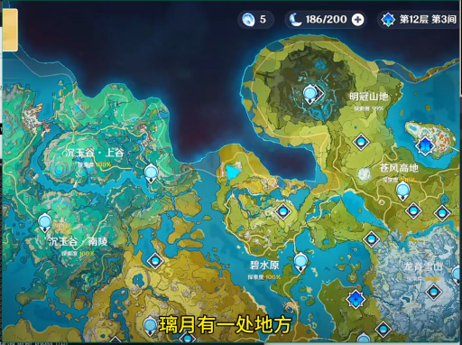

> 这是一张游戏《原神》的地图界面截图，显示了玩家当前所在区域的探索地图。地图上标注了多个地点，如“沉玉谷”、“碧水原”、“明冠山地”等。画面底部有字幕“璃月有一处地方”，表明玩家正在探索璃月地区。地图右上角显示了玩家的等级、资源和当前任务信息。

### 帧 #10 (5.0s)

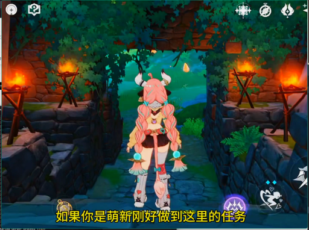

> 一个粉色长发、头戴牛角装饰的动漫风格角色站在一条石板路上，两侧是燃烧着火焰的石灯笼，背景是茂密的绿色树林。角色似乎正准备进入或正在穿过一个石制拱门。

### 帧 #11 (5.5s)

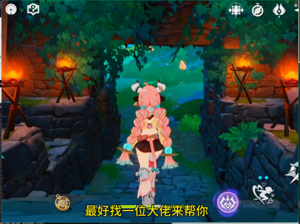

> 一个粉色长发、头戴牛角装饰的角色背对镜头，站在一个石砌拱门下，正朝着前方的绿色山谷走去。拱门两侧有燃烧的火把，照亮了石板路和周围的绿植。画面下方有字幕：“最好找一位大佬来帮你”。

### 帧 #12 (6.0s)

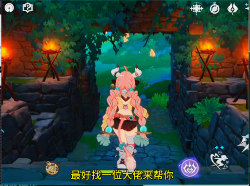

> 一个粉色长发、头戴牛角的动漫风格女性角色站在石板路上，她身后是两盏燃烧的火把，周围是石墙和绿植，场景像是一个幽暗的森林小径。画面下方的字幕显示“最好找一位大佬来帮你”。

### 帧 #13 (6.5s)

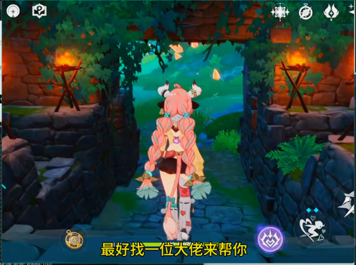

> 一个粉色长发、头戴角饰的动漫风格女性角色，正站在一个石砌的拱门下，背对镜头。她双手各持一把带有蓝色花朵装饰的武器，似乎正准备进入或探索一个幽暗的洞穴或遗迹。画面下方的字幕显示“最好找一位大佬来帮你”，暗示她可能正在寻求帮助。

### 帧 #14 (7.0s)

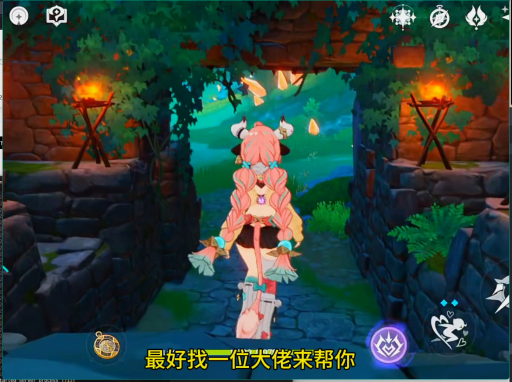

> 一位粉色长发、头戴角饰的动漫风格女性角色正背对镜头，站在一个石砌拱门下。她身后的拱门两侧各有一盏燃烧的火把，照亮了周围的石墙和藤蔓。画面下方有字幕显示“最好找一位大佬来帮你”。

### 帧 #15 (7.5s)

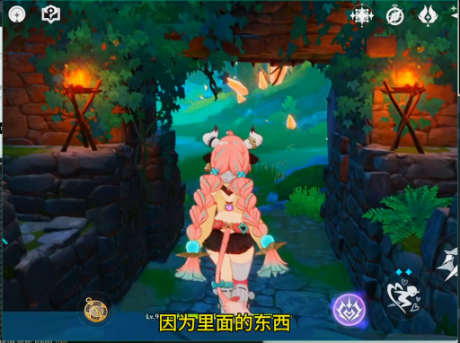

> 一个粉色双马尾的动漫风格女性角色背对着镜头，站在一个石砌拱门下，正准备进入一个充满绿色植物和火把的洞穴或密室。她身后的拱门两侧各有一盏燃烧的火把，照亮了周围的环境。画面下方的字幕显示“因为里面的东西”。

### 帧 #16 (8.0s)

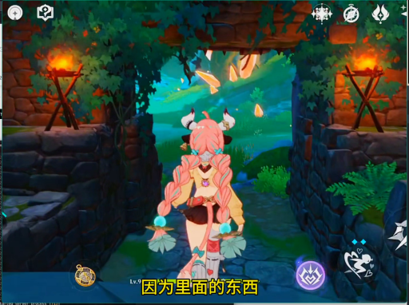

> 一个粉色长发、头戴角饰的动漫风格角色背对镜头，站在一个由石墙和藤蔓构成的拱门下。拱门两侧各有一盏燃烧的火把，照亮了周围的环境。角色似乎正准备进入或正在穿过这个拱门，画面下方有字幕“因为里面的东西”。

### 帧 #17 (8.5s)

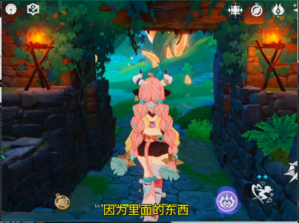

> 一个粉色长发、头戴牛角的动漫风格角色背对镜头，站在一个由石块砌成的拱门下。拱门两侧有燃烧的火把，照亮了周围的环境。角色正准备进入一个充满绿色植物和光斑的幽深洞穴或森林区域。画面下方的字幕显示“因为里面的东西”。

### 帧 #18 (9.0s)

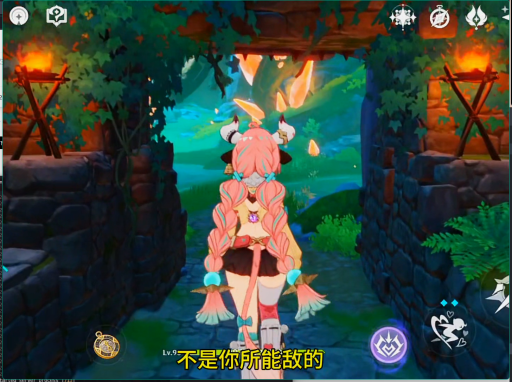

> 一个粉色长发、头戴角饰的动漫风格女性角色背对镜头，站在一个由石块和藤蔓构成的拱门下，正准备进入一个充满绿意的森林区域。她身后的拱门两侧有燃烧的火把，照亮了周围的环境。

### 帧 #19 (9.5s)

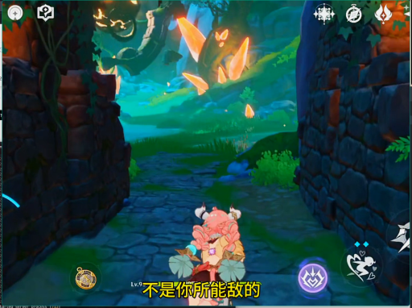

> 在一处石砌的幽暗通道中，一个粉色头发、头戴角饰的角色正蹲在石板路上，似乎在观察前方。通道两侧是古老的石墙，上方的天空中漂浮着橙色的光点，像是某种发光的生物或魔法效果。画面下方有字幕“不是你所能敌的”。

### 帧 #20 (10.0s)

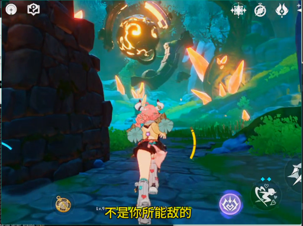

> 一名角色正站在一个石制结构旁，抬头仰望天空，天空中悬浮着一个巨大的、散发着橙黄色光芒的球体，周围有发光的碎片在飘动。画面下方有字幕“不是你所能数的”。

### 帧 #21 (10.5s)

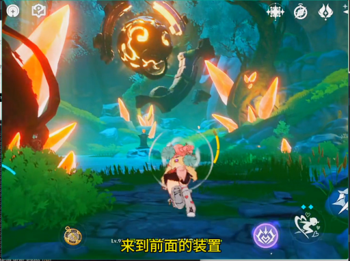

> 在一片充满奇幻色彩的森林中，一个角色正站在水边，前方漂浮着一个发光的球体装置。画面中，角色似乎正在准备进行某种操作，屏幕下方的字幕提示“来到前面的装置”，暗示着这是一个需要玩家前往的互动点。

### 帧 #22 (11.0s)

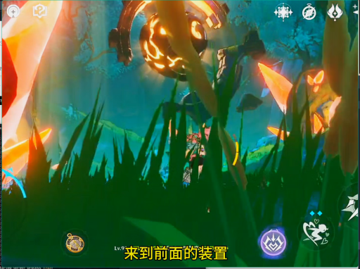

> 在一片充满奇幻色彩的草丛中，一个角色正站在前方，周围环绕着发光的植物和神秘的光效。画面下方的字幕显示“来到前面的装置”，暗示着角色正在执行一个任务或探索。

### 帧 #23 (11.5s)

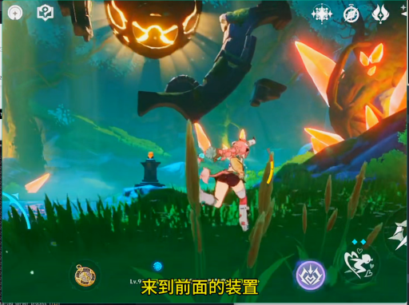

> 在一片充满奇幻色彩的森林中，一名角色正站在草地上，准备面对前方的装置。画面中，一个巨大的、发光的南瓜头状物体悬挂在空中，而右侧则有一个发光的、类似生物的物体。

### 帧 #24 (12.0s)

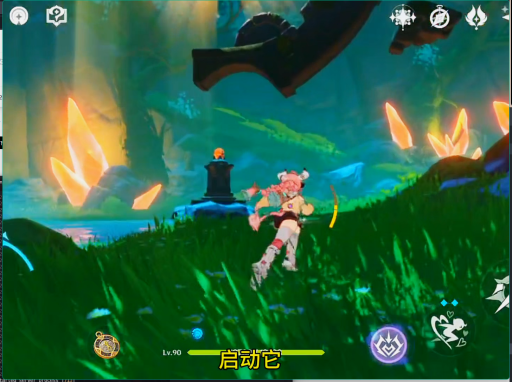

> 在一片充满奇幻色彩的绿色草地上，一个粉色头发、身穿白色和红色服饰的角色正在奔跑。背景中，巨大的黑色生物翅膀悬在空中，远处有发光的橙色晶体和一座石碑。画面下方显示着游戏界面，包括角色等级和“启动它”等文字。

### 帧 #25 (12.5s)

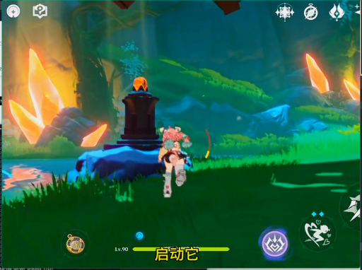

> 在一片绿意盎然的森林中，一个角色正站在一块岩石上，准备启动一个发光的黑色石碑。石碑顶部有橙色的火焰状光点，周围是茂密的植被和发光的岩石。画面下方有“启动它”的提示文字。

### 帧 #26 (13.0s)

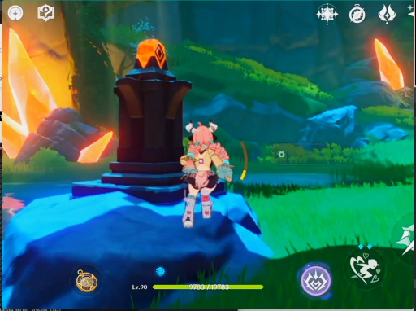

> 一个粉色头发、穿着粉色和白色服装的角色正站在一个蓝色的岩石上，旁边是一个黑色的石碑状物体，顶部有橙色的发光装饰。角色的身后是绿色的草地和远处的山丘，周围有发光的岩石。画面下方有游戏界面，显示角色等级为90。

### 帧 #27 (13.5s)

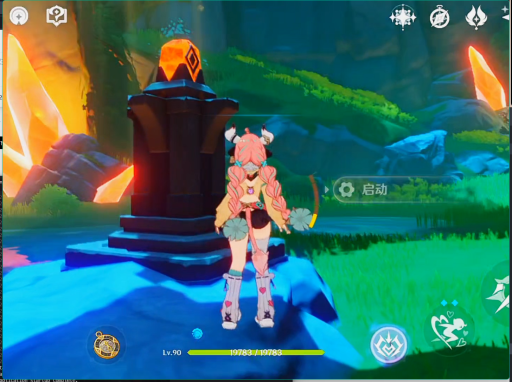

> 一名粉色头发的女性角色站在一个发光的黑色石碑前，背景是充满绿色植被和橙色晶体的奇幻洞穴环境。画面右下角显示了游戏的用户界面，包括角色等级、生命值和技能图标。

### 帧 #28 (14.0s)

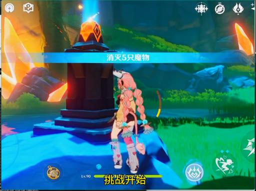

> 一名角色站在一个发光的石碑前，准备开始一场名为“消灭5只魔物”的挑战。画面中显示“挑战开始”字样，表明游戏正处于挑战模式的初始阶段。

### 帧 #29 (14.5s)

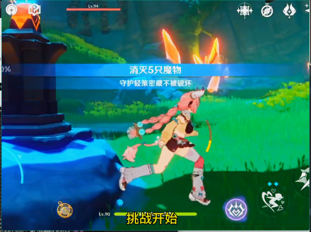

> 一名粉色长发的女性角色正在一个绿色的草地上奔跑，她手持弓箭，正准备进行一场战斗。画面中央的蓝色横幅显示“消灭5只魔物”，下方的黄色文字“挑战开始”表明这是一场挑战任务的开始。

### 帧 #30 (15.0s)

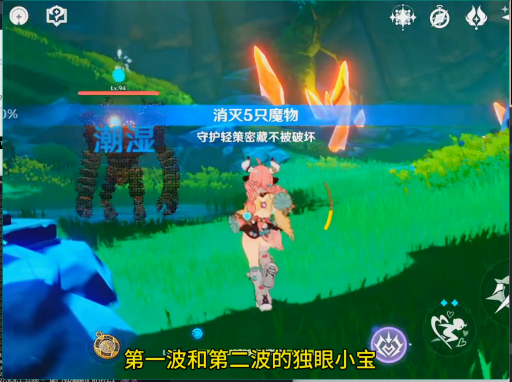

> 在一片绿色的草地上，一名粉色头发的女性角色正面对着一个巨大的、类似岩石的怪物。怪物身上有火焰特效，屏幕中央显示着“消灭5只怪物”和“守护轻策密藏不被破坏”的任务提示。画面下方的字幕写着“第一波和第二波的独眼小宝”，表明这是一场战斗任务。

### 帧 #31 (15.5s)

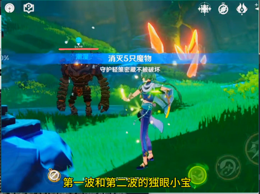

> 在一片绿色的草地上，一名身着蓝紫色服饰的玩家角色正面对着一个巨大的、由岩石构成的怪物。该怪物体型庞大，呈深色，其上方显示着“消灭5只魔物”的任务提示。玩家角色手持武器，似乎正在准备攻击或与怪物对峙。画面下方的字幕显示“第一波和第二波的独眼小宝”，表明这是一场战斗任务。

### 帧 #32 (16.0s)

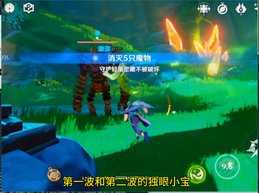

> 在一片绿色的草地上，一个角色正在与一个巨大的、类似石像的敌人对峙。敌人身上有火焰特效，角色正准备攻击。画面下方的字幕显示“第一波和第二波的独眼小宝”，表明这是一场战斗。

### 帧 #33 (16.5s)

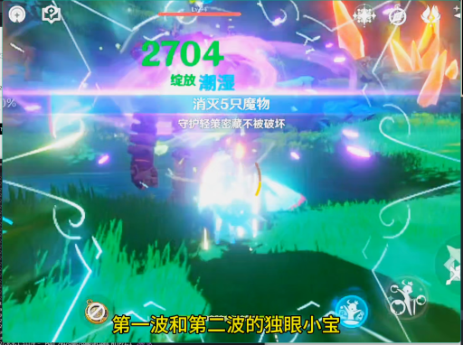

> 这是一张游戏战斗结束后的画面，显示玩家成功击败了5只怪物，获得了2704点“绽放”能量。画面中央的光效和文字提示表明，玩家正在使用“独眼小宝”技能，而“第一波和第二波的独眼小宝”则说明这是一次连续的战斗。

### 帧 #34 (17.0s)

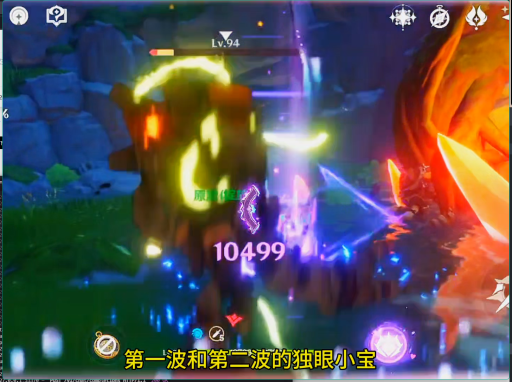

> 在一处昏暗的洞穴或山地环境中，一个发光的、类似怪物的生物正在与一个橙色的、类似小宝的生物进行战斗。战斗中，怪物释放出大量蓝紫色的光效，而小宝则在右侧进行攻击，画面下方的字幕显示“第一波和第二波的独眼小宝”，表明这是一场战斗的场景。

### 帧 #35 (17.5s)

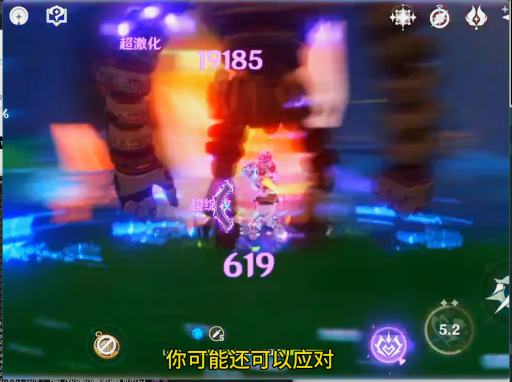

> 在一场激烈的战斗中，一个角色正在攻击一个巨大的敌人，画面中充满了动态模糊效果，显示了攻击的瞬间。敌人身上有“超激化”和“19185”的伤害数值，而角色身上则显示“619”的数值，表明战斗正在进行中。

### 帧 #36 (18.0s)

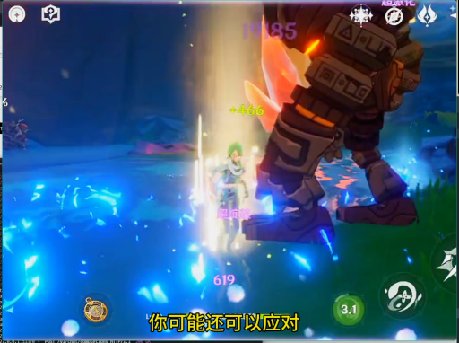

> 在一处充满蓝色魔法光芒的战斗场景中，一名绿发角色正与一个巨大的机械敌人对峙，敌人身上有橙色的光效，正在释放攻击。画面下方的字幕显示“你可能还可以应对”，暗示着战斗的进行中。

### 帧 #37 (18.5s)

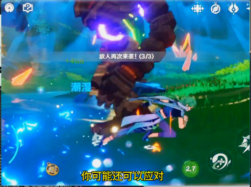

> 在一场激烈的战斗中，一名角色正与一个巨大的、散发着紫色光芒的敌人进行对抗。敌人被击中后，周围环绕着蓝色的光效，画面中还显示了“敌人再次来袭！(3/3)”的提示，表明战斗正处于关键时刻。

### 帧 #38 (19.0s)

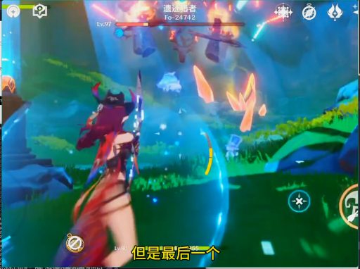

> 在一片充满奇幻色彩的绿色森林中，一名身着红衣、头戴角饰的角色正手持武器，面对着前方的敌人。画面中，一个巨大的、被火焰和能量环绕的敌人正在被攻击，周围有光效和特效，显示战斗正在进行。

### 帧 #39 (19.5s)

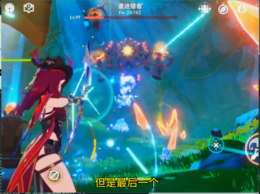

> 在一场激烈的战斗中，一名红发角色正手持武器，与一个巨大的、由多个发光生物组成的敌人进行对抗。画面中充满了蓝色和橙色的光效，显示战斗正在进行中。

### 帧 #40 (20.0s)

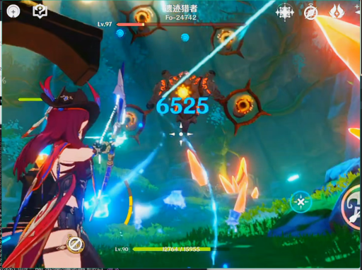

> 一名红发角色正在与名为“遗迹猎者”的敌人进行战斗，她手持发光的武器，正向敌人发起攻击，画面中显示了攻击造成的伤害数值6525。场景位于一个充满发光晶体和神秘符号的洞穴或遗迹中。

### 帧 #41 (20.5s)

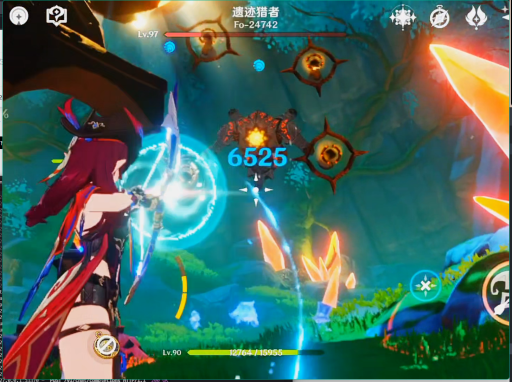

> 在一处充满奇幻色彩的森林场景中，一名红发角色正手持发光的武器，对准前方的敌人进行攻击。画面中央的敌人身上显示着“6525”的伤害数值，表明攻击成功。角色的武器周围有蓝色的光效，而背景中则有多个发光的、类似眼睛的敌人。

### 帧 #42 (21.0s)

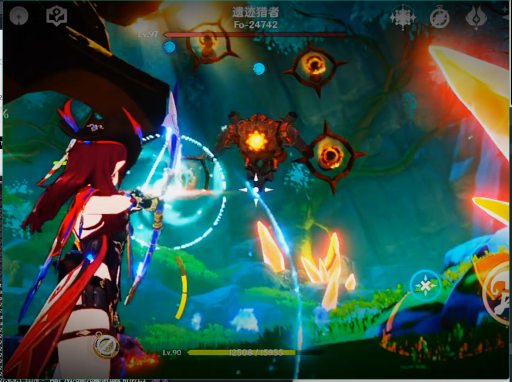

> 在充满奇幻色彩的战斗场景中，一名红发角色正手持武器，向空中漂浮的敌人发射出一道蓝色的光束。画面中，多个橙红色的、类似眼球的敌人在空中悬浮，似乎正在被攻击。背景是绿色的植被和神秘的光影，营造出一种神秘的氛围。

### 帧 #48 (24.0s)

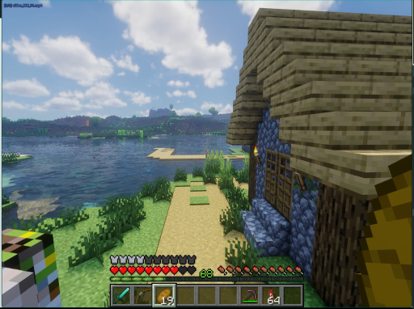

> 这是一张《我的世界》游戏的截图，视角位于玩家角色的视角。画面右侧是一座由石块和木头搭建的房屋，旁边是一条通往湖边的小路。湖面平静，远处是连绵的山丘和树木。天空晴朗，有白云。

### 帧 #49 (24.5s)

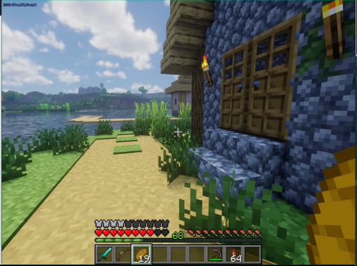

> 这是一张《我的世界》游戏的截图，视角为第一人称。玩家正站在一座由蓝色方块建造的房屋前，房屋的木制窗户和门框清晰可见。画面左侧是一条沙地小径，通向一片水域，远处是连绵的山丘和天空。玩家的界面显示了生命值、饥饿值和物品栏，表明玩家正处于游戏中的一个场景。

### 帧 #50 (25.0s)

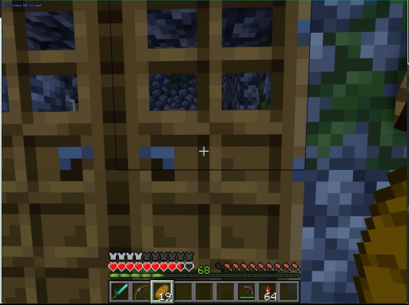

> 这是一张《我的世界》游戏的视频截图，视角为第一人称。玩家正站在一个由棕色方块构成的建筑前，建筑有多个窗户，透过窗户可以看到内部的深色方块。画面右下角有玩家的物品栏，显示了当前持有的工具和物品。画面右侧是绿色的植被和蓝色的水域，表明场景可能在河边或靠近水域的区域。

### 帧 #51 (25.5s)

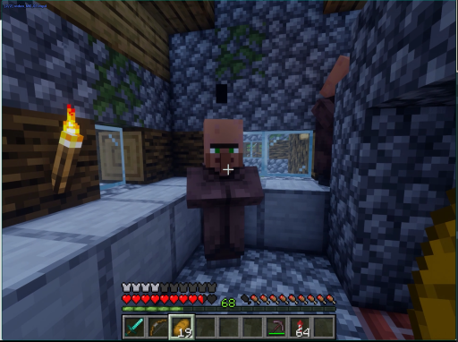

> 这是一张《我的世界》游戏的视频截图，画面中一个玩家角色站在一个由石块和木板搭建的室内空间里。角色身穿棕色上衣，正站在一个石制台子上，旁边有一支燃烧的火把。场景看起来像是一个简陋的洞穴或地牢，墙壁由灰色的石块构成，墙上还挂着一株绿色的植物。

### 帧 #52 (26.1s)

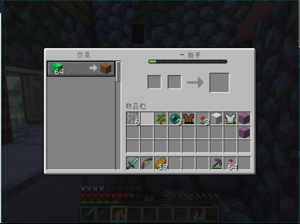

> 在《我的世界》游戏中，玩家打开了交易界面，准备进行物品交易。界面显示玩家拥有64个绿色的物品（可能是某种资源），正在将一个方块物品进行交易。
