# 实验审阅: video_GenshinImpact_01.mp4

## 运行元信息

- **模型**: `Qwen/Qwen3-VL-2B-Instruct`
- **视频**: `video_GenshinImpact_01.mp4`
- **运行目录**: `video_GenshinImpact_01_run2`

### 配置参数

| 参数 | 值 |
|------|-----|
| screenshot_interval_ms | 500 |
| max_size | 512 |
| recording_duration_s | 26 |
| algorithm | mse |
| diff_threshold | 500.0 |

## 统计摘要

- **总采样帧数**: 53
- **关键帧数**: 45
- **丢弃帧数**: 0
- **录制时长**: 26.0s
- **关键帧率**: 84.9%

## 帧时间线

| 帧序号 | 时间戳 | 差异值 | 关键帧 | 判定原因 | 图片 | VLM 描述 |
|--------|--------|--------|--------|----------|------|----------|
| 0 | 0.0s | - | **是** | 首帧，自动标记为关键帧 | [frame_0000_key.png](frames/frame_0000_key.png) | 这是一张游戏《原神》的地图界面截图，显示了玩家在“第12层”地图中，正在探索“璃月”区域。地图上标有多个地点，如“沉玉谷”、“碧水原”和“明冠山地”等。画面底部的字幕显示“璃月有一处地方”，表明玩家正在寻找或定位某个特定地点。 |
| 1 | 0.5s | 3219.95 | **是** | 差异值 3219.95 >= 阈值 500.00 | [frame_0001_key.png](frames/frame_0001_key.png) | 这是一张游戏《原神》的野外地图截图，显示了玩家的当前位置和可探索区域。地图上标注了多个地点，如“沉玉谷”、“明冠山地”、“碧水原”等。画面下方的字幕“璃月有一处地方”表明玩家正在璃月地区探索。 |
| 2 | 1.0s | 3203.46 | **是** | 差异值 3203.46 >= 阈值 500.00 | [frame_0002_key.png](frames/frame_0002_key.png) | 这是一张游戏《原神》的探索地图截图，显示了玩家在璃月地区（具体为第12层第3间）的探索进度。地图上标有多个地点和资源点，玩家当前的资源数量为186/200，已收集5个资源。画面下方的字幕提示“璃月有一处地方”，表明玩家正在寻找或探索璃... |
| 3 | 1.5s | 3983.66 | **是** | 差异值 3983.66 >= 阈值 500.00 | [frame_0003_key.png](frames/frame_0003_key.png) | 这是一张游戏《原神》的地图界面截图，显示了玩家在“第12层 第3间”区域的探索状态。地图上有一个蓝色的标记点，代表玩家当前的探索位置，周围是绿色的山地和水域。屏幕下方的字幕“宝箱很丰富”表明玩家正在寻找或发现一个宝藏。 |
| 4 | 2.0s | 290.96 | 否 | 差异值 290.96 < 阈值 500.00 | [frame_0004_skip.png](frames/frame_0004_skip.png) | - |
| 5 | 2.5s | 2403.49 | **是** | 差异值 2403.49 >= 阈值 500.00 | [frame_0005_key.png](frames/frame_0005_key.png) | 这是一张游戏《原神》的地图界面截图，显示了玩家在地图上标记了一个位置。画面中央的蓝色圆圈标记了宝箱的位置，旁边有文字“宝箱很丰富”，表明该宝箱内物品丰富。地图上还显示了玩家的当前位置和路线。 |
| 6 | 3.0s | 760.71 | **是** | 差异值 760.71 >= 阈值 500.00 | [frame_0006_key.png](frames/frame_0006_key.png) | 这是一张游戏《原神》的界面截图，显示了地图和任务信息。画面中央是游戏地图，一个蓝色的标记点位于山丘上，旁边有黄色的路径。右上角显示了玩家的资源（5个资源，186/200的体力值）和任务进度（总标记29/30）。屏幕下方的字幕写着“如果... |
| 7 | 3.5s | 1845.52 | **是** | 差异值 1845.52 >= 阈值 500.00 | [frame_0007_key.png](frames/frame_0007_key.png) | 这是一张游戏《原神》的地图界面截图，显示了玩家在“第12层 第3间”区域的探索状态。地图上有一个蓝色的标记点，代表当前任务的地点，周围是绿色的山地和水域。屏幕下方的字幕提示：“如果你是萌新刚好做到这里的任务”，表明这是新手玩家完成任务... |
| 8 | 4.0s | 45.18 | 否 | 差异值 45.18 < 阈值 500.00 | [frame_0008_skip.png](frames/frame_0008_skip.png) | - |
| 9 | 4.5s | 89.51 | 否 | 差异值 89.51 < 阈值 500.00 | [frame_0009_skip.png](frames/frame_0009_skip.png) | - |
| 10 | 5.0s | 6874.00 | **是** | 差异值 6874.00 >= 阈值 500.00 | [frame_0010_key.png](frames/frame_0010_key.png) | 一个粉色长发、头戴白色角饰的动漫风格角色背对镜头，站在一条由石块铺成的狭窄小径上。小径两侧是石墙，墙上挂着燃烧的火把，为场景提供照明。角色似乎正准备进入或正在穿过一个由绿色植物和藤蔓环绕的洞穴或通道。 |
| 11 | 5.5s | 1765.64 | **是** | 差异值 1765.64 >= 阈值 500.00 | [frame_0011_key.png](frames/frame_0011_key.png) | 一个粉色长发、头戴牛角装饰的动漫风格角色背对镜头，站在一个由石块砌成的拱门下，正准备穿过一条石板路。拱门两侧有燃烧的火把，照亮了周围的环境，背景是绿色的植被和远处的山峦。画面下方有字幕：“最好找一位大佬来帮你”。 |
| 12 | 6.0s | 1308.67 | **是** | 差异值 1308.67 >= 阈值 500.00 | [frame_0012_key.png](frames/frame_0012_key.png) | 一个粉色长发、头戴角饰的动漫风格女性角色，正背对镜头站在一条石板小径的入口处。她身后的石拱门两侧有燃烧的火把，照亮了周围的环境。画面下方有字幕显示“最好找一位大佬来帮你”。 |
| 13 | 6.5s | 1142.77 | **是** | 差异值 1142.77 >= 阈值 500.00 | [frame_0013_key.png](frames/frame_0013_key.png) | 一个粉色长发、头戴角饰的动漫风格女性角色，正背对镜头站在一条石板路上，她手持两把扇子，似乎在准备进入一个有石墙和火把的洞穴或遗迹。画面下方的字幕显示“最好找一位大佬来帮你”，暗示她可能正在寻找帮助或准备进入某个需要协助的区域。 |
| 14 | 7.0s | 1298.81 | **是** | 差异值 1298.81 >= 阈值 500.00 | [frame_0014_key.png](frames/frame_0014_key.png) | 一个粉色长发、头戴角饰的动漫风格女性角色正站在一个石砌拱门下，她背对镜头，似乎正准备进入或走出一个幽暗的洞穴或小径。拱门两侧有燃烧的火把，照亮了周围的石墙和绿植，营造出一种神秘的氛围。画面下方有字幕：“最好找一位大佬来帮你”。 |
| 15 | 7.5s | 1731.67 | **是** | 差异值 1731.67 >= 阈值 500.00 | [frame_0015_key.png](frames/frame_0015_key.png) | 一个粉色长发、头戴角饰的女性角色背对镜头，站在一个石砌拱门下，正准备进入一个被藤蔓和火焰照亮的洞穴或通道。她身后的通道两侧是石墙，墙上挂着燃烧的火把，营造出一种神秘的氛围。 |
| 16 | 8.0s | 1065.29 | **是** | 差异值 1065.29 >= 阈值 500.00 | [frame_0016_key.png](frames/frame_0016_key.png) | 一个粉色长发、头戴角饰的动漫风格角色背对镜头，站在一个石砌拱门下，正准备进入一个充满绿色植物和光亮的洞穴或森林区域。画面中，两侧的石墙上各有一盏燃烧的火把，为场景提供照明。角色的下方有字幕“因为里面的东西”。 |
| 17 | 8.5s | 1416.94 | **是** | 差异值 1416.94 >= 阈值 500.00 | [frame_0017_key.png](frames/frame_0017_key.png) | 一个粉色头发、头上有角的女性角色背对着镜头，站在一座石拱门下，正准备进入一个充满绿色植物和火把的洞穴或遗迹。画面下方的字幕显示“因为里面的东西”，暗示她正在探索或准备进入某个区域。 |
| 18 | 9.0s | 1656.48 | **是** | 差异值 1656.48 >= 阈值 500.00 | [frame_0018_key.png](frames/frame_0018_key.png) | 一个粉色长发、头戴角饰的动漫风格女性角色背对镜头，站在一个石砌的拱门下，正朝着前方的森林深处走去。她身后的拱门两侧有燃烧的火把，照亮了周围的环境。画面下方有字幕“不是你所能敌的”。 |
| 19 | 9.5s | 3328.75 | **是** | 差异值 3328.75 >= 阈值 500.00 | [frame_0019_key.png](frames/frame_0019_key.png) | 这是一个游戏画面，视角位于一个角色的身后，该角色是一个粉色的、有角的生物，正站在一条石板路上。画面的背景是幽暗的森林，有发光的橙色蝴蝶在空中飞舞，两侧是石墙。画面下方有游戏界面元素和字幕“不是你所能敌的”。 |
| 20 | 10.0s | 3376.57 | **是** | 差异值 3376.57 >= 阈值 500.00 | [frame_0020_key.png](frames/frame_0020_key.png) | 在一处石墙环绕的奇幻场景中，一名角色正站在一条小路上，抬头仰望着天空中一个正在发光的、类似球体的神秘物体。该物体周围有橙黄色的光点和碎片在飞舞，似乎在进行某种能量释放或爆炸。角色似乎正准备应对或观察这一现象。 |
| 21 | 10.5s | 5089.60 | **是** | 差异值 5089.60 >= 阈值 500.00 | [frame_0021_key.png](frames/frame_0021_key.png) | 在一片充满奇幻色彩的森林中，一名角色正向前奔跑，周围漂浮着发光的橙色碎片和一个巨大的发光球体。画面下方的字幕显示“来到前面的装置”，表明角色正在执行任务或前往特定地点。 |
| 22 | 11.0s | 3916.35 | **是** | 差异值 3916.35 >= 阈值 500.00 | [frame_0022_key.png](frames/frame_0022_key.png) | 在一片充满奇幻色彩的森林中，一名角色正站在草地上，面对着一个发光的、类似南瓜的敌人。画面下方的字幕显示“来到前面的装置”，暗示角色正在执行任务或与敌人对峙。 |
| 23 | 11.5s | 3742.29 | **是** | 差异值 3742.29 >= 阈值 500.00 | [frame_0023_key.png](frames/frame_0023_key.png) | 在一片充满奇幻色彩的草地上，一个角色正在奔跑，背景中漂浮着巨大的发光南瓜和神秘的生物。画面下方有文字提示“来到前面的装置”。 |
| 24 | 12.0s | 3834.11 | **是** | 差异值 3834.11 >= 阈值 500.00 | [frame_0024_key.png](frames/frame_0024_key.png) | 在一片充满奇幻色彩的绿色草地上，一个粉色头发、身穿白色和红色服饰的角色正在奔跑。背景中，巨大的黑色物体悬停在空中，远处有发光的橙色晶体和水体，场景充满神秘感。画面下方有“启动它”的黄色文字提示。 |
| 25 | 12.5s | 2873.96 | **是** | 差异值 2873.96 >= 阈值 500.00 | [frame_0025_key.png](frames/frame_0025_key.png) | 在一片绿意盎然的森林中，一个角色正站在一块蓝色的岩石上，面对着一个发光的石碑。石碑顶部有一个橙色的火焰状物体，周围是散发着橙色光芒的岩石和茂密的植被。画面下方有游戏界面，显示角色等级为90，以及“启动它”字样。 |
| 26 | 13.0s | 3904.06 | **是** | 差异值 3904.06 >= 阈值 500.00 | [frame_0026_key.png](frames/frame_0026_key.png) | 在一处充满奇幻色彩的户外场景中，一名粉色头发、身着战斗装束的角色正站在一个发光的黑色石碑前。角色似乎正在准备进行某种互动或战斗，周围环境是绿色的草地和发光的岩石，整体氛围神秘而充满能量。 |
| 27 | 13.5s | 2280.55 | **是** | 差异值 2280.55 >= 阈值 500.00 | [frame_0027_key.png](frames/frame_0027_key.png) | 在一处充满奇幻色彩的户外场景中，一名粉色长发的女性角色站在一个发光的黑色石碑前，她手持一把弓箭，似乎正准备进行战斗或探索。背景是绿色的草地和岩石，周围有橙色的发光晶体，营造出一种神秘的氛围。 |
| 28 | 14.0s | 1846.03 | **是** | 差异值 1846.03 >= 阈值 500.00 | [frame_0028_key.png](frames/frame_0028_key.png) | 在一处充满奇幻色彩的户外场景中，一名角色正站在一个发光的石碑前，准备开始一场挑战。屏幕中央的蓝色横幅显示“消灭5只魔物”，下方的黄色文字“挑战开始”表明游戏正处于战斗准备阶段。 |
| 29 | 14.5s | 6781.20 | **是** | 差异值 6781.20 >= 阈值 500.00 | [frame_0029_key.png](frames/frame_0029_key.png) | 一名粉色头发的女性角色正在草地上奔跑，准备开始一场挑战。画面中央的蓝色横幅显示“消灭5只怪物”和“守护轻密密藏不被破坏”，下方的黄色文字“挑战开始”表明游戏任务已启动。 |
| 30 | 15.0s | 2556.14 | **是** | 差异值 2556.14 >= 阈值 500.00 | [frame_0030_key.png](frames/frame_0030_key.png) | 在一片绿色的草地上，一名角色正在与一只巨大的、由岩石构成的怪物进行战斗。怪物身上有火焰特效，角色正准备攻击。画面下方的字幕显示“第一波和第二波的独眼小宝”，表明这是一场战斗任务。 |
| 31 | 15.5s | 2508.00 | **是** | 差异值 2508.00 >= 阈值 500.00 | [frame_0031_key.png](frames/frame_0031_key.png) | 在一片绿色的草地上，一名身着蓝紫色服饰的女性角色正面对着一个巨大的、由岩石构成的敌人。屏幕上方显示着“消灭5只魔物”的任务目标，下方则有“第一波和第二波的独眼小宝”的提示文字。 |
| 32 | 16.0s | 2692.50 | **是** | 差异值 2692.50 >= 阈值 500.00 | [frame_0032_key.png](frames/frame_0032_key.png) | 在一片绿色的草地上，一名玩家角色正与一个巨大的、类似机械的敌人对峙。敌人身上有火焰特效，屏幕中央显示着“消灭5只怪物”的任务提示。画面下方的字幕写着“第一波和第二波的独眼小宝”，表明这是一场战斗任务。 |
| 33 | 16.5s | 8949.07 | **是** | 差异值 8949.07 >= 阈值 500.00 | [frame_0033_key.png](frames/frame_0033_key.png) | 在一场充满奇幻色彩的战斗中，一个角色正在释放强大的技能，画面中央的数字“2704”和“绽放 潮湿”表明这是一次攻击或技能释放。画面下方的字幕显示“第一波和第二波的独眼小宝”，暗示这可能是一场多人对战或团队副本的战斗场景。 |
| 34 | 17.0s | 10540.41 | **是** | 差异值 10540.41 >= 阈值 500.00 | [frame_0034_key.png](frames/frame_0034_key.png) | 在一处充满奇幻色彩的地下洞穴或遗迹中，一个巨大的、类似树桩的生物正被攻击，其身上闪烁着紫色的光芒，周围有能量特效。画面下方的字幕显示“第一波和第二波的独眼小宝”，表明这是一场战斗，主角正在与这个生物进行对抗。 |
| 35 | 17.5s | 9858.54 | **是** | 差异值 9858.54 >= 阈值 500.00 | [frame_0035_key.png](frames/frame_0035_key.png) | 这是一个游戏战斗场景，画面中央是一个巨大的、由粗壮的机械臂和腿组成的敌人，其腿部正在释放蓝色的光效。在敌人前方，一个小型角色正在与之对战，周围有紫色和蓝色的光效，显示战斗正在进行。画面下方有游戏界面，显示“你可能还可以应对”等提示文字。 |
| 36 | 18.0s | 9119.66 | **是** | 差异值 9119.66 >= 阈值 500.00 | [frame_0036_key.png](frames/frame_0036_key.png) | 在一处充满蓝色魔法光芒的洞穴或地下场景中，一名绿发角色正与一个巨大的、装甲厚重的机械敌人对峙。角色周围环绕着蓝色的魔法特效，似乎正在发动攻击或受到攻击，画面下方的字幕显示“你可能还可以应对”。 |
| 37 | 18.5s | 7241.54 | **是** | 差异值 7241.54 >= 阈值 500.00 | [frame_0037_key.png](frames/frame_0037_key.png) | 在一场激烈的战斗中，一个巨大的敌人正被一名身着蓝白色服饰的玩家角色攻击。敌人身上有绿色的光效，而玩家角色则在空中进行躲避。画面中显示“敌人再次来袭！(3/3)”和“你可能还可以应对”的提示，表明战斗正处于关键阶段。 |
| 38 | 19.0s | 7343.28 | **是** | 差异值 7343.28 >= 阈值 500.00 | [frame_0038_key.png](frames/frame_0038_key.png) | 一名红发女性角色背对镜头，手持弓箭，正面对着一个充满能量的战斗场景，空中有多个发光的敌人和漂浮的碎片。画面左下角有“但是最后一个”的字幕，表明她正在面对最后一个敌人。 |
| 39 | 19.5s | 4966.79 | **是** | 差异值 4966.79 >= 阈值 500.00 | [frame_0039_key.png](frames/frame_0039_key.png) | 一名红发女性角色手持武器，正面对着一个巨大的、正在释放能量的敌人。画面中充满了战斗特效，包括光束和能量冲击波，场景似乎是在一个充满奇幻色彩的洞穴或地下城中。 |
| 40 | 20.0s | 3347.98 | **是** | 差异值 3347.98 >= 阈值 500.00 | [frame_0040_key.png](frames/frame_0040_key.png) | 一名红发女性角色正在与一个发光的敌人进行战斗，她手持武器，正释放出蓝色的光束攻击。战斗发生在一处充满绿色植被的洞穴或地下环境中，画面中还显示了伤害数值和角色等级。 |
| 41 | 20.5s | 2547.53 | **是** | 差异值 2547.53 >= 阈值 500.00 | [frame_0041_key.png](frames/frame_0041_key.png) | 在一款动作游戏中，一名红发角色正手持武器，从左向右攻击空中漂浮的敌人。画面中，多个敌人呈环状排列，正在被攻击，同时有伤害数值显示。背景是充满奇幻色彩的森林环境，光线明亮，场景充满动感。 |
| 42 | 21.0s | 1323.21 | **是** | 差异值 1323.21 >= 阈值 500.00 | [frame_0042_key.png](frames/frame_0042_key.png) | 一名红发女性角色手持发光的武器，正在与空中漂浮的多个橙色、类似眼球的敌人进行战斗。她处于一个充满奇幻色彩的、类似洞穴或森林的环境中，周围有发光的植物和漂浮的光点。画面左上角显示了角色的名称“遗迹猎者”和等级信息。 |
| 43 | 21.5s | 0.70 | 否 | 差异值 0.70 < 阈值 500.00 | [frame_0043_skip.png](frames/frame_0043_skip.png) | - |
| 44 | 22.0s | 1.98 | 否 | 差异值 1.98 < 阈值 500.00 | [frame_0044_skip.png](frames/frame_0044_skip.png) | - |
| 45 | 22.5s | 2.17 | 否 | 差异值 2.17 < 阈值 500.00 | [frame_0045_skip.png](frames/frame_0045_skip.png) | - |
| 46 | 23.0s | 2.67 | 否 | 差异值 2.67 < 阈值 500.00 | [frame_0046_skip.png](frames/frame_0046_skip.png) | - |
| 47 | 23.5s | 2.68 | 否 | 差异值 2.68 < 阈值 500.00 | [frame_0047_skip.png](frames/frame_0047_skip.png) | - |
| 48 | 24.0s | 9790.79 | **是** | 差异值 9790.79 >= 阈值 500.00 | [frame_0048_key.png](frames/frame_0048_key.png) | 这是一张《我的世界》游戏的截图，画面中玩家正站在一座木屋旁，俯瞰着一片宁静的湖泊。远处是连绵的山丘和茂密的植被，天空晴朗，云朵稀疏。玩家的视角位于画面的右下角，可以看到游戏界面的血条、物品栏和生命值等信息。 |
| 49 | 24.6s | 3554.72 | **是** | 差异值 3554.72 >= 阈值 500.00 | [frame_0049_key.png](frames/frame_0049_key.png) | 这是一张《我的世界》游戏的截图，视角位于玩家角色的视角。画面中，玩家正站在一座由蓝色石块和木板搭建的房屋前，房屋的窗户是木质的，墙上挂着一盏火把。玩家面前是一条由沙地和草方块铺成的小路，通向一片水域。远处是连绵的山丘和天空中的云朵。 |
| 50 | 25.1s | 6469.50 | **是** | 差异值 6469.50 >= 阈值 500.00 | [frame_0050_key.png](frames/frame_0050_key.png) | 这是一个《我的世界》游戏的视频截图，视角位于玩家角色的视角内。画面中，一个穿着深色盔甲的玩家角色站在一个由石块和木板搭建的室内空间里，似乎正站在一个工作台或储物柜旁。场景看起来像是一个地下洞穴或矿洞的内部，墙壁和地面都是由方块构成。画... |
| 51 | 25.6s | 1864.67 | **是** | 差异值 1864.67 >= 阈值 500.00 | [frame_0051_key.png](frames/frame_0051_key.png) | 这是一个《我的世界》游戏的视频截图，画面中一个玩家角色站在一个由石块和木板搭建的室内空间里。角色身穿棕色的盔甲，正面对着镜头。角色的左前方有一支燃烧的火把，照亮了房间。角色的右后方有一个木制的门或窗。画面下方是游戏的用户界面，显示了角... |
| 52 | 26.1s | 5628.44 | **是** | 差异值 5628.44 >= 阈值 500.00 | [frame_0052_key.png](frames/frame_0052_key.png) | 这是一个《我的世界》游戏的交易界面截图。玩家的交易栏中，一个绿色的物品（可能是64个）正在被交易，旁边显示了玩家的物品栏，其中包含各种工具和物品。 |

## DeepSeek 最终总结

```
视频展示了《原神》玩家在璃月地区探索并完成一项挑战任务的过程。玩家首先在地图上定位一个宝箱丰富的地点，随后操作粉色长发的角色进入一个神秘洞穴，并按照提示启动装置，开启了一场需要消灭多波“独眼小宝”等魔物的守护挑战。战斗过程中，角色先后应对了数波敌人，并最终与强大的“遗迹猎者”进行对决。视频整体主题是新手玩家在探索中接受高难度战斗挑战，并暗示寻求资深玩家帮助的必要性。结尾处画面意外切换至《我的世界》的游戏场景，可能与内容过渡或彩蛋有关。
```

## 关键帧详细描述

### 帧 #0 (0.0s)

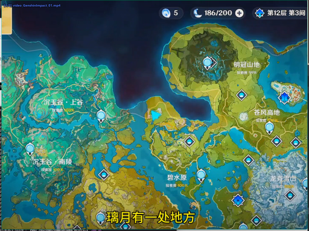

> 这是一张游戏《原神》的地图界面截图，显示了玩家在“第12层”地图中，正在探索“璃月”区域。地图上标有多个地点，如“沉玉谷”、“碧水原”和“明冠山地”等。画面底部的字幕显示“璃月有一处地方”，表明玩家正在寻找或定位某个特定地点。

### 帧 #1 (0.5s)

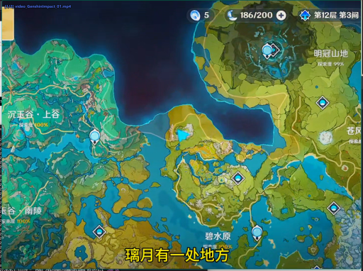

> 这是一张游戏《原神》的野外地图截图，显示了玩家的当前位置和可探索区域。地图上标注了多个地点，如“沉玉谷”、“明冠山地”、“碧水原”等。画面下方的字幕“璃月有一处地方”表明玩家正在璃月地区探索。

### 帧 #2 (1.0s)

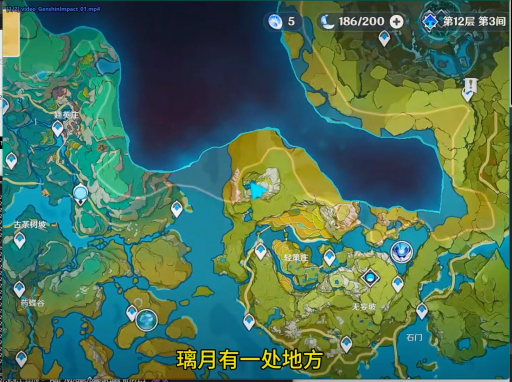

> 这是一张游戏《原神》的探索地图截图，显示了玩家在璃月地区（具体为第12层第3间）的探索进度。地图上标有多个地点和资源点，玩家当前的资源数量为186/200，已收集5个资源。画面下方的字幕提示“璃月有一处地方”，表明玩家正在寻找或探索璃月中的某个特定地点。

### 帧 #3 (1.5s)

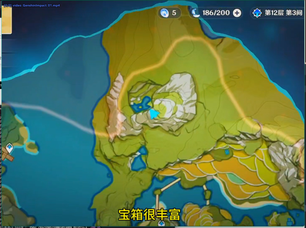

> 这是一张游戏《原神》的地图界面截图，显示了玩家在“第12层 第3间”区域的探索状态。地图上有一个蓝色的标记点，代表玩家当前的探索位置，周围是绿色的山地和水域。屏幕下方的字幕“宝箱很丰富”表明玩家正在寻找或发现一个宝藏。

### 帧 #5 (2.5s)

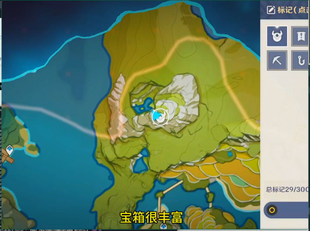

> 这是一张游戏《原神》的地图界面截图，显示了玩家在地图上标记了一个位置。画面中央的蓝色圆圈标记了宝箱的位置，旁边有文字“宝箱很丰富”，表明该宝箱内物品丰富。地图上还显示了玩家的当前位置和路线。

### 帧 #6 (3.0s)

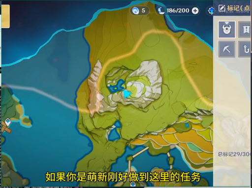

> 这是一张游戏《原神》的界面截图，显示了地图和任务信息。画面中央是游戏地图，一个蓝色的标记点位于山丘上，旁边有黄色的路径。右上角显示了玩家的资源（5个资源，186/200的体力值）和任务进度（总标记29/30）。屏幕下方的字幕写着“如果你是萌新刚好做到这里的任务”。

### 帧 #7 (3.5s)

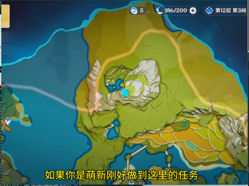

> 这是一张游戏《原神》的地图界面截图，显示了玩家在“第12层 第3间”区域的探索状态。地图上有一个蓝色的标记点，代表当前任务的地点，周围是绿色的山地和水域。屏幕下方的字幕提示：“如果你是萌新刚好做到这里的任务”，表明这是新手玩家完成任务的指引。

### 帧 #10 (5.0s)

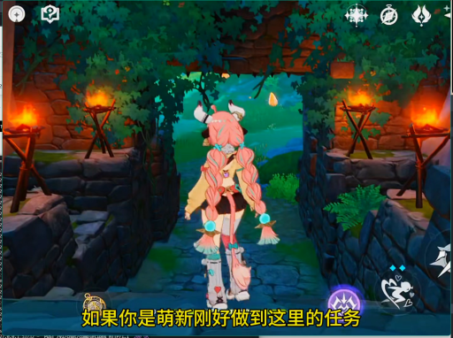

> 一个粉色长发、头戴白色角饰的动漫风格角色背对镜头，站在一条由石块铺成的狭窄小径上。小径两侧是石墙，墙上挂着燃烧的火把，为场景提供照明。角色似乎正准备进入或正在穿过一个由绿色植物和藤蔓环绕的洞穴或通道。

### 帧 #11 (5.5s)

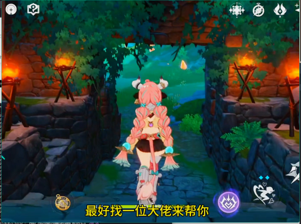

> 一个粉色长发、头戴牛角装饰的动漫风格角色背对镜头，站在一个由石块砌成的拱门下，正准备穿过一条石板路。拱门两侧有燃烧的火把，照亮了周围的环境，背景是绿色的植被和远处的山峦。画面下方有字幕：“最好找一位大佬来帮你”。

### 帧 #12 (6.0s)

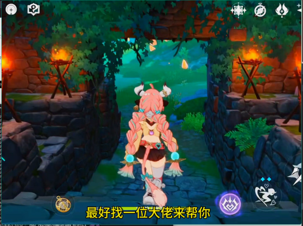

> 一个粉色长发、头戴角饰的动漫风格女性角色，正背对镜头站在一条石板小径的入口处。她身后的石拱门两侧有燃烧的火把，照亮了周围的环境。画面下方有字幕显示“最好找一位大佬来帮你”。

### 帧 #13 (6.5s)

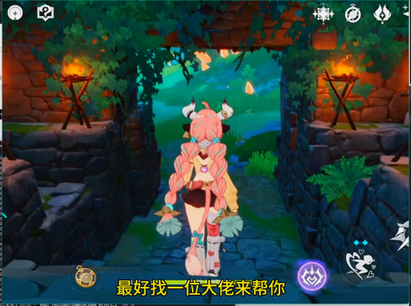

> 一个粉色长发、头戴角饰的动漫风格女性角色，正背对镜头站在一条石板路上，她手持两把扇子，似乎在准备进入一个有石墙和火把的洞穴或遗迹。画面下方的字幕显示“最好找一位大佬来帮你”，暗示她可能正在寻找帮助或准备进入某个需要协助的区域。

### 帧 #14 (7.0s)

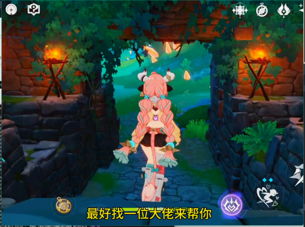

> 一个粉色长发、头戴角饰的动漫风格女性角色正站在一个石砌拱门下，她背对镜头，似乎正准备进入或走出一个幽暗的洞穴或小径。拱门两侧有燃烧的火把，照亮了周围的石墙和绿植，营造出一种神秘的氛围。画面下方有字幕：“最好找一位大佬来帮你”。

### 帧 #15 (7.5s)

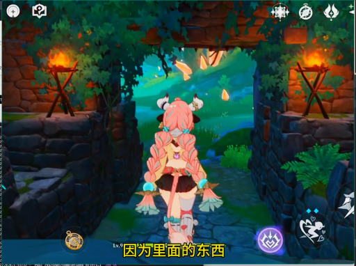

> 一个粉色长发、头戴角饰的女性角色背对镜头，站在一个石砌拱门下，正准备进入一个被藤蔓和火焰照亮的洞穴或通道。她身后的通道两侧是石墙，墙上挂着燃烧的火把，营造出一种神秘的氛围。

### 帧 #16 (8.0s)

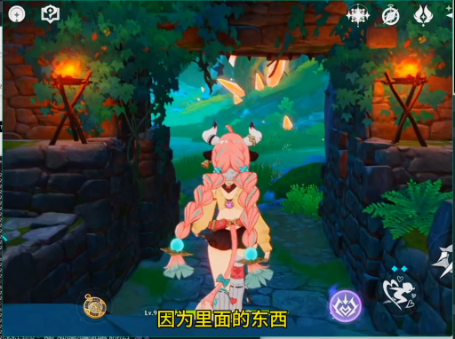

> 一个粉色长发、头戴角饰的动漫风格角色背对镜头，站在一个石砌拱门下，正准备进入一个充满绿色植物和光亮的洞穴或森林区域。画面中，两侧的石墙上各有一盏燃烧的火把，为场景提供照明。角色的下方有字幕“因为里面的东西”。

### 帧 #17 (8.5s)

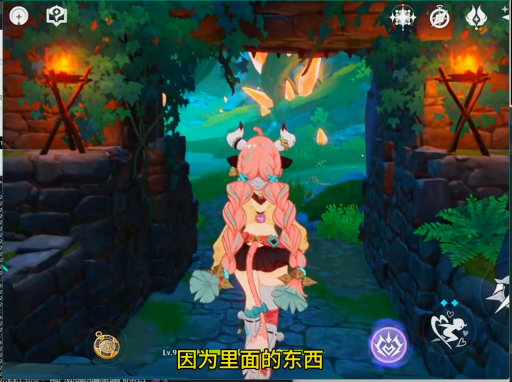

> 一个粉色头发、头上有角的女性角色背对着镜头，站在一座石拱门下，正准备进入一个充满绿色植物和火把的洞穴或遗迹。画面下方的字幕显示“因为里面的东西”，暗示她正在探索或准备进入某个区域。

### 帧 #18 (9.0s)

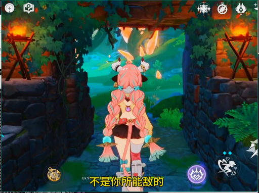

> 一个粉色长发、头戴角饰的动漫风格女性角色背对镜头，站在一个石砌的拱门下，正朝着前方的森林深处走去。她身后的拱门两侧有燃烧的火把，照亮了周围的环境。画面下方有字幕“不是你所能敌的”。

### 帧 #19 (9.5s)

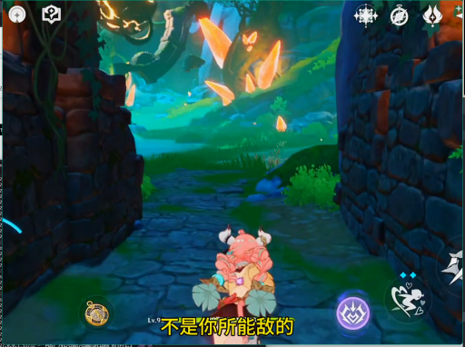

> 这是一个游戏画面，视角位于一个角色的身后，该角色是一个粉色的、有角的生物，正站在一条石板路上。画面的背景是幽暗的森林，有发光的橙色蝴蝶在空中飞舞，两侧是石墙。画面下方有游戏界面元素和字幕“不是你所能敌的”。

### 帧 #20 (10.0s)

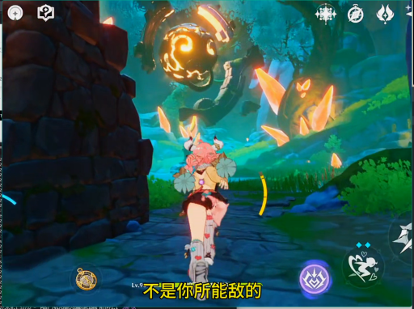

> 在一处石墙环绕的奇幻场景中，一名角色正站在一条小路上，抬头仰望着天空中一个正在发光的、类似球体的神秘物体。该物体周围有橙黄色的光点和碎片在飞舞，似乎在进行某种能量释放或爆炸。角色似乎正准备应对或观察这一现象。

### 帧 #21 (10.5s)

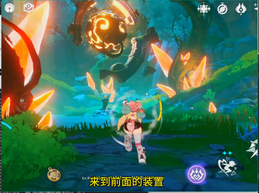

> 在一片充满奇幻色彩的森林中，一名角色正向前奔跑，周围漂浮着发光的橙色碎片和一个巨大的发光球体。画面下方的字幕显示“来到前面的装置”，表明角色正在执行任务或前往特定地点。

### 帧 #22 (11.0s)

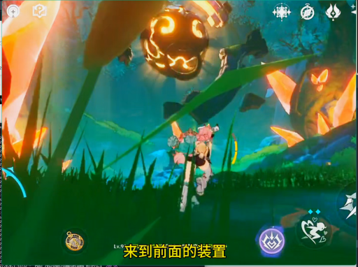

> 在一片充满奇幻色彩的森林中，一名角色正站在草地上，面对着一个发光的、类似南瓜的敌人。画面下方的字幕显示“来到前面的装置”，暗示角色正在执行任务或与敌人对峙。

### 帧 #23 (11.5s)

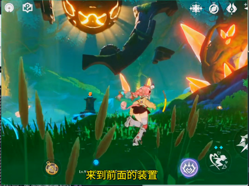

> 在一片充满奇幻色彩的草地上，一个角色正在奔跑，背景中漂浮着巨大的发光南瓜和神秘的生物。画面下方有文字提示“来到前面的装置”。

### 帧 #24 (12.0s)

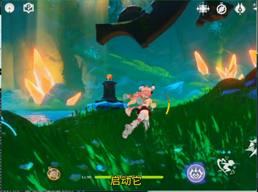

> 在一片充满奇幻色彩的绿色草地上，一个粉色头发、身穿白色和红色服饰的角色正在奔跑。背景中，巨大的黑色物体悬停在空中，远处有发光的橙色晶体和水体，场景充满神秘感。画面下方有“启动它”的黄色文字提示。

### 帧 #25 (12.5s)

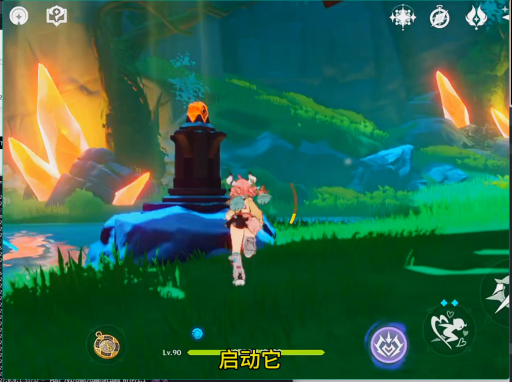

> 在一片绿意盎然的森林中，一个角色正站在一块蓝色的岩石上，面对着一个发光的石碑。石碑顶部有一个橙色的火焰状物体，周围是散发着橙色光芒的岩石和茂密的植被。画面下方有游戏界面，显示角色等级为90，以及“启动它”字样。

### 帧 #26 (13.0s)

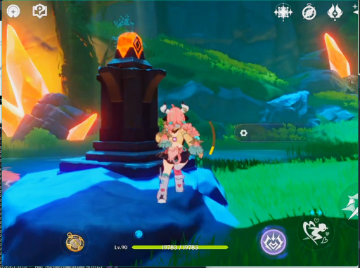

> 在一处充满奇幻色彩的户外场景中，一名粉色头发、身着战斗装束的角色正站在一个发光的黑色石碑前。角色似乎正在准备进行某种互动或战斗，周围环境是绿色的草地和发光的岩石，整体氛围神秘而充满能量。

### 帧 #27 (13.5s)

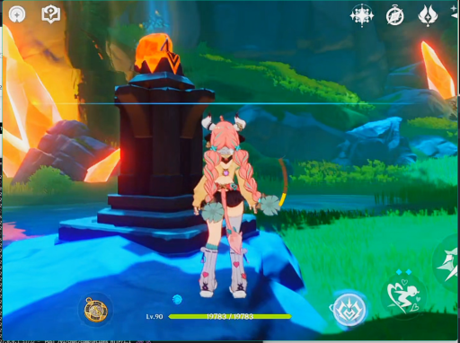

> 在一处充满奇幻色彩的户外场景中，一名粉色长发的女性角色站在一个发光的黑色石碑前，她手持一把弓箭，似乎正准备进行战斗或探索。背景是绿色的草地和岩石，周围有橙色的发光晶体，营造出一种神秘的氛围。

### 帧 #28 (14.0s)

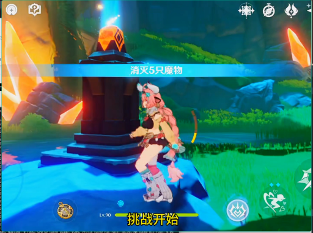

> 在一处充满奇幻色彩的户外场景中，一名角色正站在一个发光的石碑前，准备开始一场挑战。屏幕中央的蓝色横幅显示“消灭5只魔物”，下方的黄色文字“挑战开始”表明游戏正处于战斗准备阶段。

### 帧 #29 (14.5s)

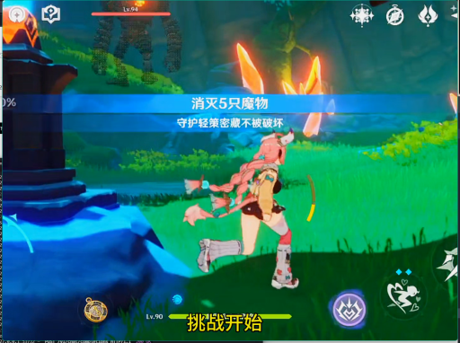

> 一名粉色头发的女性角色正在草地上奔跑，准备开始一场挑战。画面中央的蓝色横幅显示“消灭5只怪物”和“守护轻密密藏不被破坏”，下方的黄色文字“挑战开始”表明游戏任务已启动。

### 帧 #30 (15.0s)

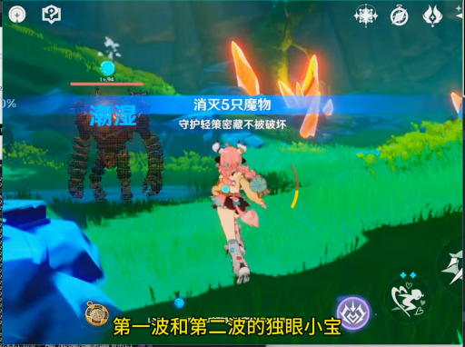

> 在一片绿色的草地上，一名角色正在与一只巨大的、由岩石构成的怪物进行战斗。怪物身上有火焰特效，角色正准备攻击。画面下方的字幕显示“第一波和第二波的独眼小宝”，表明这是一场战斗任务。

### 帧 #31 (15.5s)

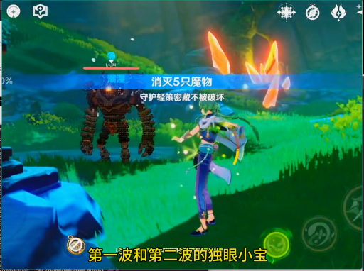

> 在一片绿色的草地上，一名身着蓝紫色服饰的女性角色正面对着一个巨大的、由岩石构成的敌人。屏幕上方显示着“消灭5只魔物”的任务目标，下方则有“第一波和第二波的独眼小宝”的提示文字。

### 帧 #32 (16.0s)

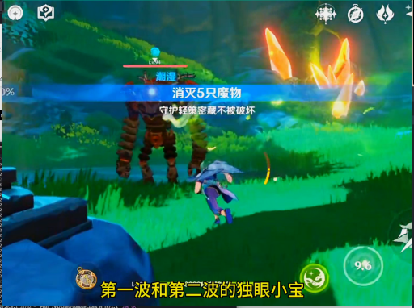

> 在一片绿色的草地上，一名玩家角色正与一个巨大的、类似机械的敌人对峙。敌人身上有火焰特效，屏幕中央显示着“消灭5只怪物”的任务提示。画面下方的字幕写着“第一波和第二波的独眼小宝”，表明这是一场战斗任务。

### 帧 #33 (16.5s)

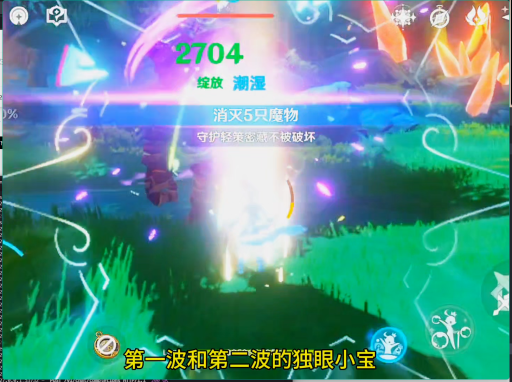

> 在一场充满奇幻色彩的战斗中，一个角色正在释放强大的技能，画面中央的数字“2704”和“绽放 潮湿”表明这是一次攻击或技能释放。画面下方的字幕显示“第一波和第二波的独眼小宝”，暗示这可能是一场多人对战或团队副本的战斗场景。

### 帧 #34 (17.0s)

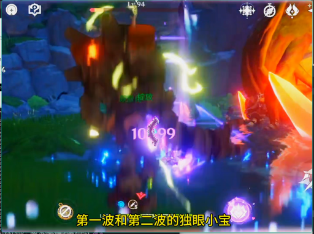

> 在一处充满奇幻色彩的地下洞穴或遗迹中，一个巨大的、类似树桩的生物正被攻击，其身上闪烁着紫色的光芒，周围有能量特效。画面下方的字幕显示“第一波和第二波的独眼小宝”，表明这是一场战斗，主角正在与这个生物进行对抗。

### 帧 #35 (17.5s)

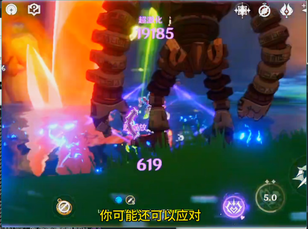

> 这是一个游戏战斗场景，画面中央是一个巨大的、由粗壮的机械臂和腿组成的敌人，其腿部正在释放蓝色的光效。在敌人前方，一个小型角色正在与之对战，周围有紫色和蓝色的光效，显示战斗正在进行。画面下方有游戏界面，显示“你可能还可以应对”等提示文字。

### 帧 #36 (18.0s)

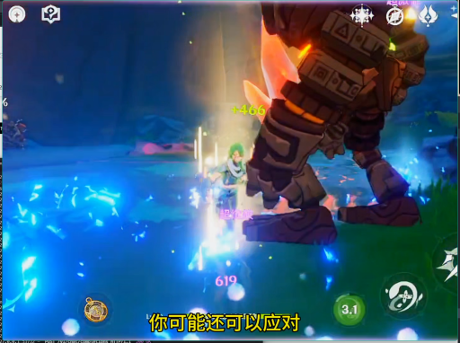

> 在一处充满蓝色魔法光芒的洞穴或地下场景中，一名绿发角色正与一个巨大的、装甲厚重的机械敌人对峙。角色周围环绕着蓝色的魔法特效，似乎正在发动攻击或受到攻击，画面下方的字幕显示“你可能还可以应对”。

### 帧 #37 (18.5s)

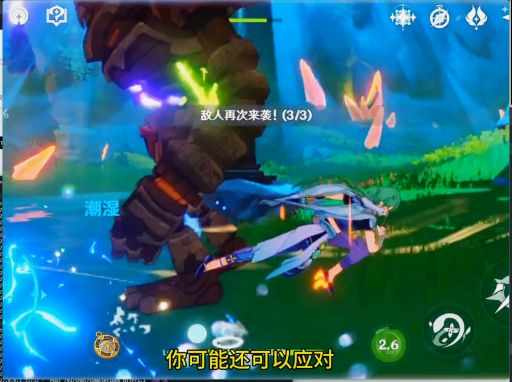

> 在一场激烈的战斗中，一个巨大的敌人正被一名身着蓝白色服饰的玩家角色攻击。敌人身上有绿色的光效，而玩家角色则在空中进行躲避。画面中显示“敌人再次来袭！(3/3)”和“你可能还可以应对”的提示，表明战斗正处于关键阶段。

### 帧 #38 (19.0s)

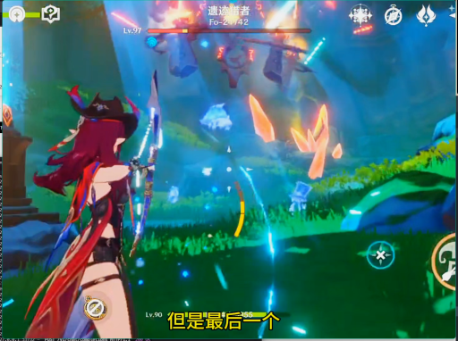

> 一名红发女性角色背对镜头，手持弓箭，正面对着一个充满能量的战斗场景，空中有多个发光的敌人和漂浮的碎片。画面左下角有“但是最后一个”的字幕，表明她正在面对最后一个敌人。

### 帧 #39 (19.5s)

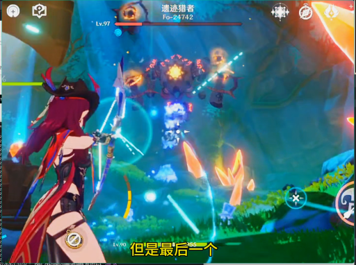

> 一名红发女性角色手持武器，正面对着一个巨大的、正在释放能量的敌人。画面中充满了战斗特效，包括光束和能量冲击波，场景似乎是在一个充满奇幻色彩的洞穴或地下城中。

### 帧 #40 (20.0s)

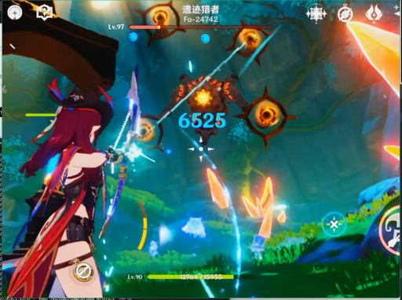

> 一名红发女性角色正在与一个发光的敌人进行战斗，她手持武器，正释放出蓝色的光束攻击。战斗发生在一处充满绿色植被的洞穴或地下环境中，画面中还显示了伤害数值和角色等级。

### 帧 #41 (20.5s)

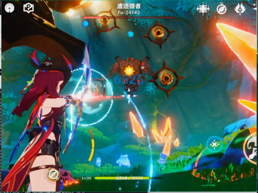

> 在一款动作游戏中，一名红发角色正手持武器，从左向右攻击空中漂浮的敌人。画面中，多个敌人呈环状排列，正在被攻击，同时有伤害数值显示。背景是充满奇幻色彩的森林环境，光线明亮，场景充满动感。

### 帧 #42 (21.0s)

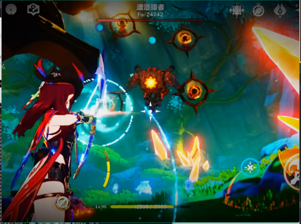

> 一名红发女性角色手持发光的武器，正在与空中漂浮的多个橙色、类似眼球的敌人进行战斗。她处于一个充满奇幻色彩的、类似洞穴或森林的环境中，周围有发光的植物和漂浮的光点。画面左上角显示了角色的名称“遗迹猎者”和等级信息。

### 帧 #48 (24.0s)

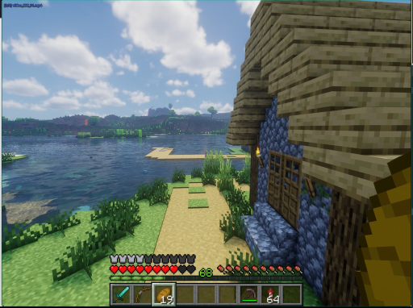

> 这是一张《我的世界》游戏的截图，画面中玩家正站在一座木屋旁，俯瞰着一片宁静的湖泊。远处是连绵的山丘和茂密的植被，天空晴朗，云朵稀疏。玩家的视角位于画面的右下角，可以看到游戏界面的血条、物品栏和生命值等信息。

### 帧 #49 (24.6s)

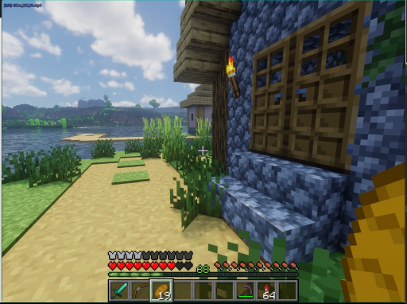

> 这是一张《我的世界》游戏的截图，视角位于玩家角色的视角。画面中，玩家正站在一座由蓝色石块和木板搭建的房屋前，房屋的窗户是木质的，墙上挂着一盏火把。玩家面前是一条由沙地和草方块铺成的小路，通向一片水域。远处是连绵的山丘和天空中的云朵。

### 帧 #50 (25.1s)

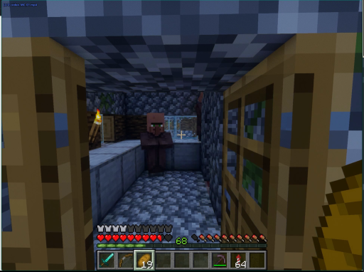

> 这是一个《我的世界》游戏的视频截图，视角位于玩家角色的视角内。画面中，一个穿着深色盔甲的玩家角色站在一个由石块和木板搭建的室内空间里，似乎正站在一个工作台或储物柜旁。场景看起来像是一个地下洞穴或矿洞的内部，墙壁和地面都是由方块构成。画面左下角显示了玩家的健康条、生命值和物品栏，表明这是一个游戏中的第一人称视角。

### 帧 #51 (25.6s)

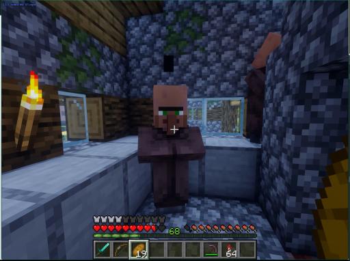

> 这是一个《我的世界》游戏的视频截图，画面中一个玩家角色站在一个由石块和木板搭建的室内空间里。角色身穿棕色的盔甲，正面对着镜头。角色的左前方有一支燃烧的火把，照亮了房间。角色的右后方有一个木制的门或窗。画面下方是游戏的用户界面，显示了角色的生命值、饥饿值、经验值和物品栏。

### 帧 #52 (26.1s)

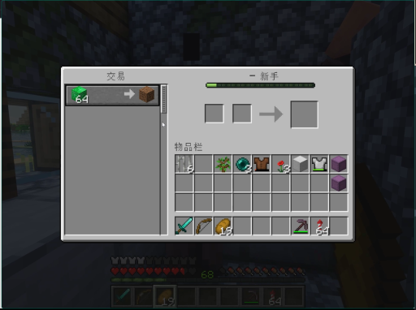

> 这是一个《我的世界》游戏的交易界面截图。玩家的交易栏中，一个绿色的物品（可能是64个）正在被交易，旁边显示了玩家的物品栏，其中包含各种工具和物品。
