# 实验审阅: video_GenshinImpact_01.mp4

## 运行元信息

- **模型**: `Qwen/Qwen3-VL-2B-Instruct`
- **视频**: `video_GenshinImpact_01.mp4`
- **运行目录**: `video_GenshinImpact_01_run3`

### 配置参数

| 参数 | 值 |
|------|-----|
| screenshot_interval_ms | 500 |
| max_size | 512 |
| recording_duration_s | 26 |
| algorithm | mse |
| diff_threshold | 500.0 |

## 统计摘要

- **总采样帧数**: 53
- **关键帧数**: 45
- **丢弃帧数**: 0
- **录制时长**: 26.0s
- **关键帧率**: 84.9%

## 帧时间线

| 帧序号 | 时间戳 | 差异值 | 关键帧 | 判定原因 | 图片 | VLM 描述 |
|--------|--------|--------|--------|----------|------|----------|
| 0 | 0.0s | - | **是** | 首帧，自动标记为关键帧 | [frame_0000_key.png](frames/frame_0000_key.png) | 这是一张游戏《原神》的区域地图截图，显示了玩家在“第12层”地图中，正在探索“璃月”区域。地图上标有多个地点，如“沉玉谷”、“碧水原”和“明冠山地”等。画面底部的字幕显示“璃月有一处地方”，表明玩家正在寻找或定位某个特定地点。 |
| 1 | 0.5s | 3220.62 | **是** | 差异值 3220.62 >= 阈值 500.00 | [frame_0001_key.png](frames/frame_0001_key.png) | 这是一张游戏《原神》的野外地图截图，显示了玩家的当前位置和可探索区域。地图上标有多个地点，如“明冠山地”、“沉玉谷”、“碧水原”等。画面下方的字幕“璃月有一处地方”表明玩家正在璃月地区寻找某个特定地点。 |
| 2 | 1.0s | 3203.46 | **是** | 差异值 3203.46 >= 阈值 500.00 | [frame_0002_key.png](frames/frame_0002_key.png) | 这是一张游戏《原神》的探索地图截图，显示了玩家当前所在区域的地形和任务点。地图上标注了多个地点，其中“璃月”区域的“一处地方”被特别标出，下方有文字提示“璃月有一处地方”。玩家处于第12层第3间，已收集186/200的资源。 |
| 3 | 1.5s | 3994.29 | **是** | 差异值 3994.29 >= 阈值 500.00 | [frame_0003_key.png](frames/frame_0003_key.png) | 这是一张游戏《原神》的地图界面截图，显示了玩家在第12层第3间区域的探索。地图上有一个蓝色的宝箱，周围有黄色的路径，表明玩家正在接近宝箱。画面下方有文字“宝箱很丰富”，暗示宝箱内物品丰富。 |
| 4 | 2.0s | 299.01 | 否 | 差异值 299.01 < 阈值 500.00 | [frame_0004_skip.png](frames/frame_0004_skip.png) | - |
| 5 | 2.5s | 2405.88 | **是** | 差异值 2405.88 >= 阈值 500.00 | [frame_0005_key.png](frames/frame_0005_key.png) | 这是一张游戏《原神》的地图界面截图，显示了玩家在地图上标记了一个位置。画面中央的蓝色圆圈标示出一个宝箱，下方有文字“宝箱很丰富”，表明该宝箱内物品丰富。右侧的标记栏显示了玩家已标记了29个点，当前正在查看或导航。 |
| 6 | 3.0s | 768.41 | **是** | 差异值 768.41 >= 阈值 500.00 | [frame_0006_key.png](frames/frame_0006_key.png) | 这是一张游戏《原神》的界面截图，显示了地图和任务信息。画面中央是游戏地图，一个蓝色的标记点位于山丘上，一条黄色的路径环绕其周围。右上角显示了玩家的资源（5个资源，186/200的体力值）和任务进度（总标记29/30）。屏幕下方的字幕写... |
| 7 | 3.5s | 1854.91 | **是** | 差异值 1854.91 >= 阈值 500.00 | [frame_0007_key.png](frames/frame_0007_key.png) | 这是一张游戏《原神》的地图界面截图，显示了玩家在“第12层 第3间”区域的探索状态。地图上有一个蓝色的标记点，代表当前任务的地点，周围是绿色的山地和水域。屏幕下方的字幕提示：“如果你是萌新刚好做到这里的任务”，表明这是新手玩家完成任务... |
| 8 | 4.0s | 33.60 | 否 | 差异值 33.60 < 阈值 500.00 | [frame_0008_skip.png](frames/frame_0008_skip.png) | - |
| 9 | 4.5s | 79.56 | 否 | 差异值 79.56 < 阈值 500.00 | [frame_0009_skip.png](frames/frame_0009_skip.png) | - |
| 10 | 5.0s | 6874.02 | **是** | 差异值 6874.02 >= 阈值 500.00 | [frame_0010_key.png](frames/frame_0010_key.png) | 一个粉色长发、头戴白色角饰的动漫风格角色背对镜头，站在一条由石块铺成的狭窄小径上。小径两侧是石墙，墙上挂着燃烧的火把，为场景提供照明。角色似乎正准备进入或正在穿过一个由绿色植物和藤蔓环绕的洞穴或通道。 |
| 11 | 5.5s | 1765.64 | **是** | 差异值 1765.64 >= 阈值 500.00 | [frame_0011_key.png](frames/frame_0011_key.png) | 一个粉色长发、头戴牛角装饰的动漫风格角色背对镜头，站在一个石砌拱门下，正准备穿过一条石板路。拱门两侧有燃烧的火把，照亮了周围的石墙和绿植，营造出一种神秘的氛围。画面下方的字幕显示“最好找一位大佬来帮你”。 |
| 12 | 6.0s | 1308.67 | **是** | 差异值 1308.67 >= 阈值 500.00 | [frame_0012_key.png](frames/frame_0012_key.png) | 一个粉色长发、头戴角饰的动漫风格女性角色，正背对镜头站在一条石板小径的入口处。她身后的石拱门两侧有燃烧的火把，照亮了周围的环境。画面下方有字幕显示“最好找一位大佬来帮你”。 |
| 13 | 6.5s | 1142.82 | **是** | 差异值 1142.82 >= 阈值 500.00 | [frame_0013_key.png](frames/frame_0013_key.png) | 一个粉色长发、头戴角饰的动漫角色背对着镜头，站在一条石板路上，正走向一个被绿植环绕的拱门。拱门两侧有燃烧的火把，照亮了周围的环境。画面下方有字幕：“最好找一位大佬来帮你”。 |
| 14 | 7.0s | 1298.85 | **是** | 差异值 1298.85 >= 阈值 500.00 | [frame_0014_key.png](frames/frame_0014_key.png) | 一个粉色长发、头戴角饰的动漫风格女性角色正站在一个石砌拱门下，她背对镜头，似乎正准备进入或走出一个幽暗的洞穴或遗迹。拱门两侧有燃烧的火把，照亮了石墙和周围的绿色藤蔓。画面下方有字幕：“最好找一位大佬来帮你”。 |
| 15 | 7.5s | 1731.67 | **是** | 差异值 1731.67 >= 阈值 500.00 | [frame_0015_key.png](frames/frame_0015_key.png) | 一个粉色双马尾的女性角色背对着镜头，站在一个石砌拱门下，正准备进入一个被藤蔓和绿植覆盖的洞穴或通道。她身后的通道两侧有燃烧的火把，照亮了周围的环境，远处是绿色的植被和水域。画面下方有字幕“因为里面的东西”。 |
| 16 | 8.0s | 1066.33 | **是** | 差异值 1066.33 >= 阈值 500.00 | [frame_0016_key.png](frames/frame_0016_key.png) | 一个粉色长发、头戴角饰的动漫风格角色背对镜头，站在一个石砌拱门下，正准备进入一个充满绿色植物和光亮的洞穴或森林区域。画面下方的字幕显示“因为里面的东西”，暗示角色正在探索或准备进入一个未知的区域。 |
| 17 | 8.5s | 1416.95 | **是** | 差异值 1416.95 >= 阈值 500.00 | [frame_0017_key.png](frames/frame_0017_key.png) | 一个粉色头发、头上有角的女性角色背对着镜头，站在一个石砌拱门下，正准备进入一个充满绿色植物的洞穴或森林区域。她身后的拱门两侧各有一盏燃烧的火把，照亮了周围的环境。画面下方有字幕“因为里面的东西”。 |
| 18 | 9.0s | 1656.49 | **是** | 差异值 1656.49 >= 阈值 500.00 | [frame_0018_key.png](frames/frame_0018_key.png) | 一个粉色长发、头戴角饰的动漫风格女性角色背对镜头，站在一个石砌的拱门下，正朝着前方的森林小径走去。她身后的拱门两侧有燃烧的火把，照亮了周围的环境。画面下方有字幕“不是你所能敌的”。 |
| 19 | 9.5s | 3328.82 | **是** | 差异值 3328.82 >= 阈值 500.00 | [frame_0019_key.png](frames/frame_0019_key.png) | 这是一个游戏画面，视角位于一个角色的身后，该角色是粉色的、有角的，正站在一条石板路上。画面的两侧是深色的石墙，前方是绿色的草地和发光的植物。画面中还有几个发光的橙色蝴蝶状物体在空中飞舞。画面下方有游戏界面元素，包括一个圆形的技能图标和... |
| 20 | 10.0s | 3376.61 | **是** | 差异值 3376.61 >= 阈值 500.00 | [frame_0020_key.png](frames/frame_0020_key.png) | 在一处石墙环绕的奇幻场景中，一名角色正站在一条小路上，抬头仰望着天空中一个正在发光的、类似球体的神秘物体。该物体周围有橙黄色的光点和碎片在飞舞，似乎在进行某种能量释放或召唤。角色似乎正准备应对或观察这个现象。 |
| 21 | 10.5s | 5089.83 | **是** | 差异值 5089.83 >= 阈值 500.00 | [frame_0021_key.png](frames/frame_0021_key.png) | 在一片充满奇幻色彩的森林中，一个角色正向前奔跑，周围漂浮着发光的橙色碎片和一个巨大的发光球体。画面下方的字幕显示“来到前面的装置”，暗示角色正在执行任务或探索。 |
| 22 | 11.0s | 3916.42 | **是** | 差异值 3916.42 >= 阈值 500.00 | [frame_0022_key.png](frames/frame_0022_key.png) | 在一片充满奇幻色彩的森林中，一名角色正站在草地上，面对着一个发光的、类似南瓜的怪物。怪物在空中悬浮，周围环绕着橙色的光晕，似乎正在被攻击或准备攻击。画面下方的字幕提示“来到前面的装置”，暗示角色需要前往某个特定地点。 |
| 23 | 11.5s | 3742.26 | **是** | 差异值 3742.26 >= 阈值 500.00 | [frame_0023_key.png](frames/frame_0023_key.png) | 在一片充满奇幻色彩的草地上，一个角色正在奔跑，背景中漂浮着巨大的发光南瓜和神秘的生物。画面下方的字幕显示“来到前面的装置”，暗示角色正朝着一个特定目标前进。 |
| 24 | 12.0s | 3844.96 | **是** | 差异值 3844.96 >= 阈值 500.00 | [frame_0024_key.png](frames/frame_0024_key.png) | 在一片充满奇幻色彩的绿色草地上，一个粉色头发的角色正在奔跑。背景中，巨大的黑色物体悬停在空中，远处有发光的橙色晶体和水体。画面下方显示着游戏界面，包括角色等级和“启动它”等文字。 |
| 25 | 12.5s | 2882.06 | **是** | 差异值 2882.06 >= 阈值 500.00 | [frame_0025_key.png](frames/frame_0025_key.png) | 在一片绿意盎然的森林中，一个角色正站在一块蓝色的岩石上，面对着一个发光的黑色石碑。石碑顶部有一个橙色的火焰状物体，周围是散发着橙色光芒的岩石和茂密的植被。画面下方显示着“启动它”的提示，表明角色正在准备进行某种操作。 |
| 26 | 13.0s | 3914.97 | **是** | 差异值 3914.97 >= 阈值 500.00 | [frame_0026_key.png](frames/frame_0026_key.png) | 在一处充满奇幻色彩的户外场景中，一名粉发角色正站在一个发光的黑色石碑前，似乎在进行某种仪式或准备行动。背景是绿色的草地和远处的山峦，周围有发光的岩石，营造出一种神秘的氛围。 |
| 27 | 13.5s | 2175.94 | **是** | 差异值 2175.94 >= 阈值 500.00 | [frame_0027_key.png](frames/frame_0027_key.png) | 一名粉色头发的女性角色站在一个发光的黑色石碑前，背景是充满绿色植被和橙色晶体的奇幻洞穴环境。她手持一把弓箭，似乎正准备进行战斗或探索。 |
| 28 | 14.0s | 1767.52 | **是** | 差异值 1767.52 >= 阈值 500.00 | [frame_0028_key.png](frames/frame_0028_key.png) | 在一处充满奇幻色彩的户外场景中，一名角色正站在一个发光的石碑前，准备开始一场名为“消灭5只魔物”的挑战。画面中央的石碑上有一个橙色的发光标志，周围环境是绿色的草地和岩石，背景中还有发光的晶体。 |
| 29 | 14.5s | 6806.29 | **是** | 差异值 6806.29 >= 阈值 500.00 | [frame_0029_key.png](frames/frame_0029_key.png) | 在一款游戏的战斗场景中，一名角色正在草地上奔跑，准备迎接挑战。画面中央的蓝色横幅显示“消灭5只怪物”，下方的“挑战开始”按钮表明任务已启动。 |
| 30 | 15.0s | 2538.99 | **是** | 差异值 2538.99 >= 阈值 500.00 | [frame_0030_key.png](frames/frame_0030_key.png) | 在一片潮湿的草地上，一名粉发角色正面对着一个巨大的、被火焰环绕的怪物。屏幕上的文字显示“消灭5只怪物”和“守护轻策密藏不被破坏”，表明这是一场战斗。角色似乎正在执行任务，而怪物则处于攻击状态。 |
| 31 | 15.5s | 2562.40 | **是** | 差异值 2562.40 >= 阈值 500.00 | [frame_0031_key.png](frames/frame_0031_key.png) | 在一片绿色的草地上，一名身着蓝紫色服饰的女性角色正面对着一个巨大的、由岩石构成的敌人。屏幕上方显示着“消灭5只魔物”的任务目标，下方则有文字提示“第一波和第二波的独眼小宝”，表明这是一场战斗。 |
| 32 | 16.0s | 2692.49 | **是** | 差异值 2692.49 >= 阈值 500.00 | [frame_0032_key.png](frames/frame_0032_key.png) | 在一片绿色的草地上，一名玩家角色正与一个巨大的、类似怪物的敌人对峙。敌人身上有火焰特效，屏幕中央显示着“消灭5只怪物”的任务提示。画面下方的字幕显示“第一波和第二波的独眼小宝”，表明这是一场战斗任务。 |
| 33 | 16.5s | 8986.11 | **是** | 差异值 8986.11 >= 阈值 500.00 | [frame_0033_key.png](frames/frame_0033_key.png) | 这是一张游戏战斗结束后的画面，显示玩家成功击败了5只怪物，获得了2704的战利品。画面中央的光效和文字表明，这是一场在草地上进行的战斗，玩家的队伍正在清理敌方小怪。 |
| 34 | 17.0s | 10644.34 | **是** | 差异值 10644.34 >= 阈值 500.00 | [frame_0034_key.png](frames/frame_0034_key.png) | 在一处充满奇幻色彩的地下洞穴或遗迹中，一个巨大的、类似树干的生物正被攻击，其身上有发光的黄色能量，周围有紫色的光效和数字“10099”显示着伤害值。画面下方的字幕提示“第一波和第二波的独眼小宝”，表明这是一场战斗，主角正在与该生物进行对抗。 |
| 35 | 17.5s | 9858.43 | **是** | 差异值 9858.43 >= 阈值 500.00 | [frame_0035_key.png](frames/frame_0035_key.png) | 在一场激烈的战斗中，一个巨大的机械敌人正被攻击，其腿部和脚部正在释放出蓝色的光效。画面下方的字幕显示“你可能还可以应对”，表明玩家正在与敌人进行对抗。 |
| 36 | 18.0s | 9120.15 | **是** | 差异值 9120.15 >= 阈值 500.00 | [frame_0036_key.png](frames/frame_0036_key.png) | 在一处充满蓝色魔法光芒的洞穴或地下场景中，一名绿发角色正与一个巨大的、装甲厚重的机械敌人对峙。该角色似乎正在施放技能，周围环绕着蓝色的光效，而敌人的脚下也泛起光芒，表明战斗正在进行中。画面下方的字幕显示“你可能还可以应对”，暗示着战斗... |
| 37 | 18.5s | 6605.65 | **是** | 差异值 6605.65 >= 阈值 500.00 | [frame_0037_key.png](frames/frame_0037_key.png) | 在一场战斗中，一个巨大的、由岩石构成的敌人正从水中浮现，其身上散发着蓝紫色的光芒。一名角色正从下方的水面上跃起，似乎在进行攻击或躲避。画面中显示“敌人再次来袭！(3/3)”和“你可能还可以应对”等文字，表明这是一场持续的战斗。 |
| 38 | 19.0s | 7332.67 | **是** | 差异值 7332.67 >= 阈值 500.00 | [frame_0038_key.png](frames/frame_0038_key.png) | 在一片充满奇幻色彩的绿色草地上，一名红发角色正手持武器，面对着空中漂浮的敌人进行战斗。画面中充满了动态的光效和能量特效，显示着激烈的战斗场面。 |
| 39 | 19.5s | 5523.55 | **是** | 差异值 5523.55 >= 阈值 500.00 | [frame_0039_key.png](frames/frame_0039_key.png) | 一名红发女性角色手持武器，正面对着一个巨大的、正在释放能量的敌人。画面中充满了战斗特效，包括光束和能量碎片，表明正在进行激烈的战斗。场景似乎是在一个充满奇幻色彩的洞穴或地下城中。 |
| 40 | 20.0s | 3524.59 | **是** | 差异值 3524.59 >= 阈值 500.00 | [frame_0040_key.png](frames/frame_0040_key.png) | 在一处充满奇幻色彩的洞穴或森林场景中，一名身着红黑服饰、头戴尖角头饰的女性角色正手持发光武器，与空中漂浮的多个橙色、类似眼球的敌人进行激烈战斗。战斗中，角色正在释放技能，击中敌人后，屏幕上显示了巨大的伤害数值“6525”，表明攻击造成... |
| 41 | 20.5s | 2881.02 | **是** | 差异值 2881.02 >= 阈值 500.00 | [frame_0041_key.png](frames/frame_0041_key.png) | 在一款动作游戏中，一名红发角色正手持武器，与一个名为“遗迹猎者”的敌人进行战斗。角色处于攻击姿态，周围有光效和伤害数值，表明正在发动攻击。场景设定在充满奇幻色彩的森林或洞穴环境中。 |
| 42 | 21.0s | 1629.41 | **是** | 差异值 1629.41 >= 阈值 500.00 | [frame_0042_key.png](frames/frame_0042_key.png) | 一名红发角色正在使用弓箭攻击空中漂浮的敌人，画面中可见多个发光的、类似眼球的敌人。场景设定在一个充满奇幻色彩的洞穴或地下空间，背景有绿色的植被和发光的岩石。 |
| 43 | 21.5s | 0.77 | 否 | 差异值 0.77 < 阈值 500.00 | [frame_0043_skip.png](frames/frame_0043_skip.png) | - |
| 44 | 22.0s | 12.63 | 否 | 差异值 12.63 < 阈值 500.00 | [frame_0044_skip.png](frames/frame_0044_skip.png) | - |
| 45 | 22.5s | 12.85 | 否 | 差异值 12.85 < 阈值 500.00 | [frame_0045_skip.png](frames/frame_0045_skip.png) | - |
| 46 | 23.0s | 13.35 | 否 | 差异值 13.35 < 阈值 500.00 | [frame_0046_skip.png](frames/frame_0046_skip.png) | - |
| 47 | 23.5s | 13.35 | 否 | 差异值 13.35 < 阈值 500.00 | [frame_0047_skip.png](frames/frame_0047_skip.png) | - |
| 48 | 24.0s | 10353.48 | **是** | 差异值 10353.48 >= 阈值 500.00 | [frame_0048_key.png](frames/frame_0048_key.png) | 这是一张《我的世界》游戏的截图，视角位于玩家角色的视角。画面右侧是一座由方块构成的木屋，屋旁是绿色的草地和一条通往湖边的小路。湖面平静，远处是连绵的山丘和天空中的云朵。画面左下角可以看到玩家角色的方块状身体。 |
| 49 | 24.5s | 3449.65 | **是** | 差异值 3449.65 >= 阈值 500.00 | [frame_0049_key.png](frames/frame_0049_key.png) | 这是一张《我的世界》游戏的截图，视角位于玩家角色的视角。画面中，玩家正站在一座由石块和木头建造的房屋前，旁边是一条通往湖边的小路。画面右下角可以看到玩家的武器和物品栏，表明玩家处于游戏中的一个场景。 |
| 50 | 25.0s | 6966.20 | **是** | 差异值 6966.20 >= 阈值 500.00 | [frame_0050_key.png](frames/frame_0050_key.png) | 这是一张《我的世界》游戏的截图，视角正对着一个由木板和石块构成的建筑结构。画面中可以看到建筑的木制门板，门板上有几个小窗格，透过窗格可以看到内部的石块。在画面的右侧，可以看到一些绿色的植物和水流。画面下方是游戏的用户界面，显示了玩家的... |
| 51 | 25.5s | 1881.04 | **是** | 差异值 1881.04 >= 阈值 500.00 | [frame_0051_key.png](frames/frame_0051_key.png) | 这是一张《我的世界》游戏的截图，画面中一个玩家角色站在一个由石块和木板搭建的室内空间里。角色的视角正对着一个由石块和木板构成的房间，房间内有木制的墙壁、一个点燃的火把和一个窗户。角色的界面显示其生命值为68，当前持有15个物品。 |
| 52 | 26.0s | 5853.30 | **是** | 差异值 5853.30 >= 阈值 500.00 | [frame_0052_key.png](frames/frame_0052_key.png) | 这是一个《我的世界》游戏的交易界面截图。玩家的物品栏中，一个绿色的方块（可能是草块或某种资源）被选中，准备进行交易。界面显示了交易的进度条，以及玩家的物品栏和当前的健康值。 |

## DeepSeek 最终总结

```
这是一段《原神》游戏攻略视频，主要展示了在璃月地区“沉玉谷”附近寻找并挑战一个高难度宝箱任务的过程。视频首先引导玩家在地图上定位任务地点，并建议新手玩家寻求帮助。随后，玩家角色进入一个神秘遗迹，启动装置后连续迎战多波强大的敌人，包括“独眼小宝”和“遗迹猎者”。整个视频的核心主题是攻略一个奖励丰厚但挑战性极高的世界任务，旨在为玩家提供通关指引。
```

## 关键帧详细描述

### 帧 #0 (0.0s)

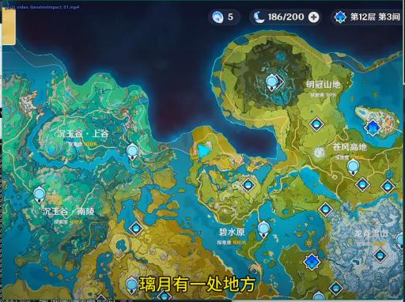

> 这是一张游戏《原神》的区域地图截图，显示了玩家在“第12层”地图中，正在探索“璃月”区域。地图上标有多个地点，如“沉玉谷”、“碧水原”和“明冠山地”等。画面底部的字幕显示“璃月有一处地方”，表明玩家正在寻找或定位某个特定地点。

### 帧 #1 (0.5s)

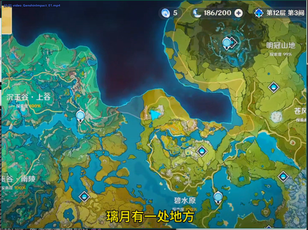

> 这是一张游戏《原神》的野外地图截图，显示了玩家的当前位置和可探索区域。地图上标有多个地点，如“明冠山地”、“沉玉谷”、“碧水原”等。画面下方的字幕“璃月有一处地方”表明玩家正在璃月地区寻找某个特定地点。

### 帧 #2 (1.0s)

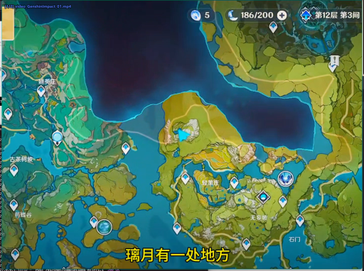

> 这是一张游戏《原神》的探索地图截图，显示了玩家当前所在区域的地形和任务点。地图上标注了多个地点，其中“璃月”区域的“一处地方”被特别标出，下方有文字提示“璃月有一处地方”。玩家处于第12层第3间，已收集186/200的资源。

### 帧 #3 (1.5s)

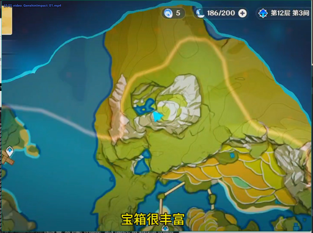

> 这是一张游戏《原神》的地图界面截图，显示了玩家在第12层第3间区域的探索。地图上有一个蓝色的宝箱，周围有黄色的路径，表明玩家正在接近宝箱。画面下方有文字“宝箱很丰富”，暗示宝箱内物品丰富。

### 帧 #5 (2.5s)

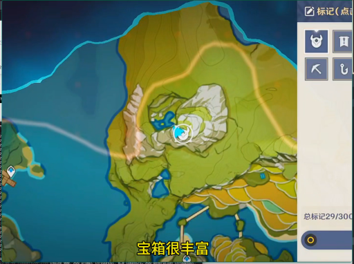

> 这是一张游戏《原神》的地图界面截图，显示了玩家在地图上标记了一个位置。画面中央的蓝色圆圈标示出一个宝箱，下方有文字“宝箱很丰富”，表明该宝箱内物品丰富。右侧的标记栏显示了玩家已标记了29个点，当前正在查看或导航。

### 帧 #6 (3.0s)

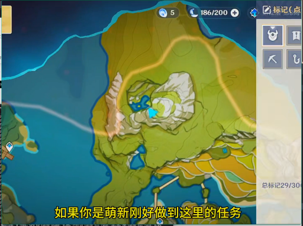

> 这是一张游戏《原神》的界面截图，显示了地图和任务信息。画面中央是游戏地图，一个蓝色的标记点位于山丘上，一条黄色的路径环绕其周围。右上角显示了玩家的资源（5个资源，186/200的体力值）和任务进度（总标记29/30）。屏幕下方的字幕写着“如果你是萌新刚好做到这里的任务”。

### 帧 #7 (3.5s)

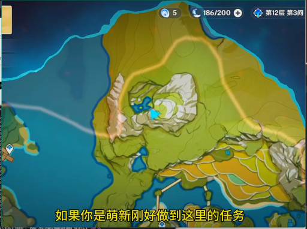

> 这是一张游戏《原神》的地图界面截图，显示了玩家在“第12层 第3间”区域的探索状态。地图上有一个蓝色的标记点，代表当前任务的地点，周围是绿色的山地和水域。屏幕下方的字幕提示：“如果你是萌新刚好做到这里的任务”，表明这是新手玩家完成任务的指引。

### 帧 #10 (5.0s)

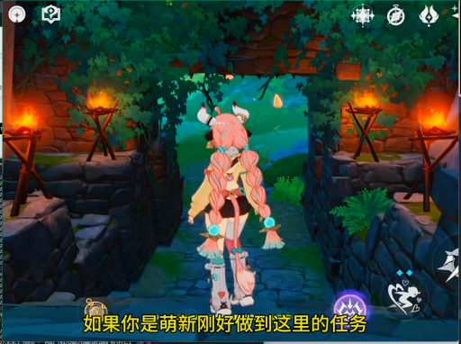

> 一个粉色长发、头戴白色角饰的动漫风格角色背对镜头，站在一条由石块铺成的狭窄小径上。小径两侧是石墙，墙上挂着燃烧的火把，为场景提供照明。角色似乎正准备进入或正在穿过一个由绿色植物和藤蔓环绕的洞穴或通道。

### 帧 #11 (5.5s)

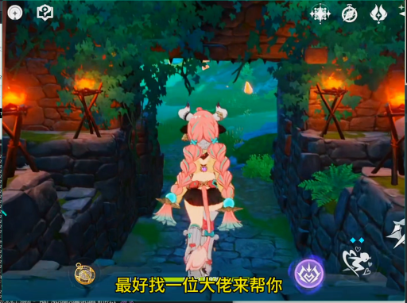

> 一个粉色长发、头戴牛角装饰的动漫风格角色背对镜头，站在一个石砌拱门下，正准备穿过一条石板路。拱门两侧有燃烧的火把，照亮了周围的石墙和绿植，营造出一种神秘的氛围。画面下方的字幕显示“最好找一位大佬来帮你”。

### 帧 #12 (6.0s)

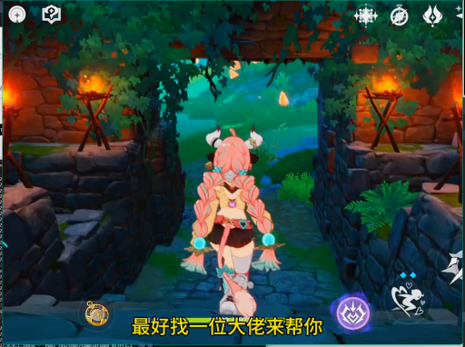

> 一个粉色长发、头戴角饰的动漫风格女性角色，正背对镜头站在一条石板小径的入口处。她身后的石拱门两侧有燃烧的火把，照亮了周围的环境。画面下方有字幕显示“最好找一位大佬来帮你”。

### 帧 #13 (6.5s)

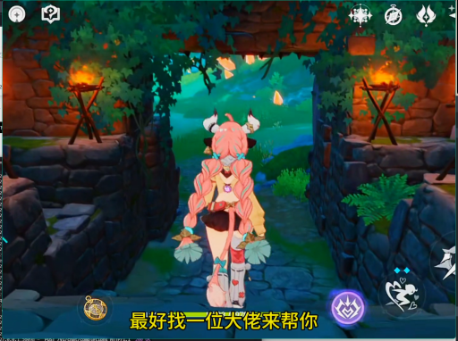

> 一个粉色长发、头戴角饰的动漫角色背对着镜头，站在一条石板路上，正走向一个被绿植环绕的拱门。拱门两侧有燃烧的火把，照亮了周围的环境。画面下方有字幕：“最好找一位大佬来帮你”。

### 帧 #14 (7.0s)

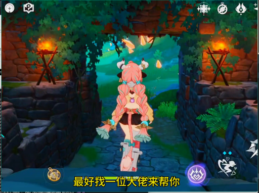

> 一个粉色长发、头戴角饰的动漫风格女性角色正站在一个石砌拱门下，她背对镜头，似乎正准备进入或走出一个幽暗的洞穴或遗迹。拱门两侧有燃烧的火把，照亮了石墙和周围的绿色藤蔓。画面下方有字幕：“最好找一位大佬来帮你”。

### 帧 #15 (7.5s)

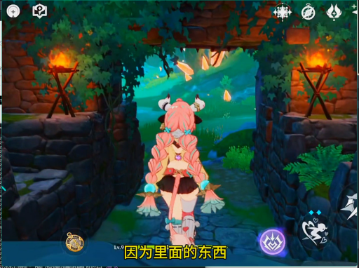

> 一个粉色双马尾的女性角色背对着镜头，站在一个石砌拱门下，正准备进入一个被藤蔓和绿植覆盖的洞穴或通道。她身后的通道两侧有燃烧的火把，照亮了周围的环境，远处是绿色的植被和水域。画面下方有字幕“因为里面的东西”。

### 帧 #16 (8.0s)

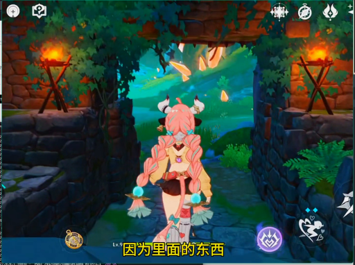

> 一个粉色长发、头戴角饰的动漫风格角色背对镜头，站在一个石砌拱门下，正准备进入一个充满绿色植物和光亮的洞穴或森林区域。画面下方的字幕显示“因为里面的东西”，暗示角色正在探索或准备进入一个未知的区域。

### 帧 #17 (8.5s)

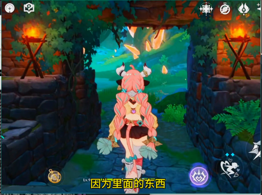

> 一个粉色头发、头上有角的女性角色背对着镜头，站在一个石砌拱门下，正准备进入一个充满绿色植物的洞穴或森林区域。她身后的拱门两侧各有一盏燃烧的火把，照亮了周围的环境。画面下方有字幕“因为里面的东西”。

### 帧 #18 (9.0s)

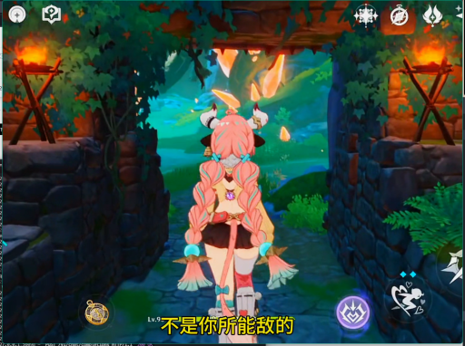

> 一个粉色长发、头戴角饰的动漫风格女性角色背对镜头，站在一个石砌的拱门下，正朝着前方的森林小径走去。她身后的拱门两侧有燃烧的火把，照亮了周围的环境。画面下方有字幕“不是你所能敌的”。

### 帧 #19 (9.5s)

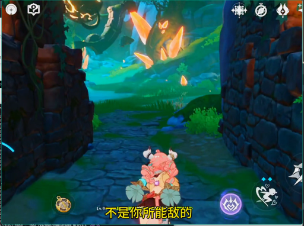

> 这是一个游戏画面，视角位于一个角色的身后，该角色是粉色的、有角的，正站在一条石板路上。画面的两侧是深色的石墙，前方是绿色的草地和发光的植物。画面中还有几个发光的橙色蝴蝶状物体在空中飞舞。画面下方有游戏界面元素，包括一个圆形的技能图标和一个写着“不是你所能敌的”的文字。

### 帧 #20 (10.0s)

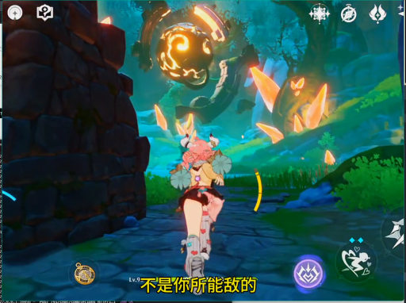

> 在一处石墙环绕的奇幻场景中，一名角色正站在一条小路上，抬头仰望着天空中一个正在发光的、类似球体的神秘物体。该物体周围有橙黄色的光点和碎片在飞舞，似乎在进行某种能量释放或召唤。角色似乎正准备应对或观察这个现象。

### 帧 #21 (10.5s)

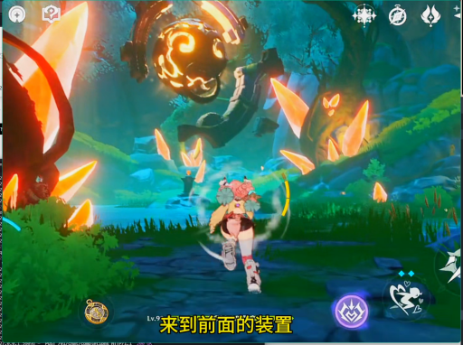

> 在一片充满奇幻色彩的森林中，一个角色正向前奔跑，周围漂浮着发光的橙色碎片和一个巨大的发光球体。画面下方的字幕显示“来到前面的装置”，暗示角色正在执行任务或探索。

### 帧 #22 (11.0s)

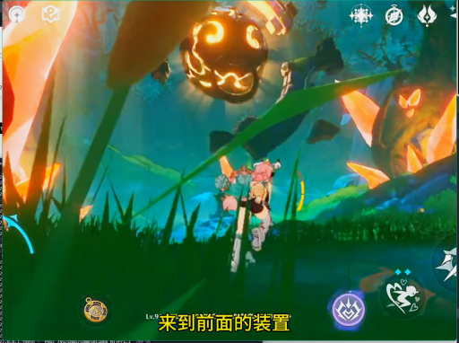

> 在一片充满奇幻色彩的森林中，一名角色正站在草地上，面对着一个发光的、类似南瓜的怪物。怪物在空中悬浮，周围环绕着橙色的光晕，似乎正在被攻击或准备攻击。画面下方的字幕提示“来到前面的装置”，暗示角色需要前往某个特定地点。

### 帧 #23 (11.5s)

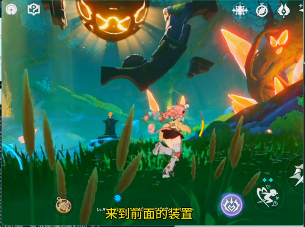

> 在一片充满奇幻色彩的草地上，一个角色正在奔跑，背景中漂浮着巨大的发光南瓜和神秘的生物。画面下方的字幕显示“来到前面的装置”，暗示角色正朝着一个特定目标前进。

### 帧 #24 (12.0s)

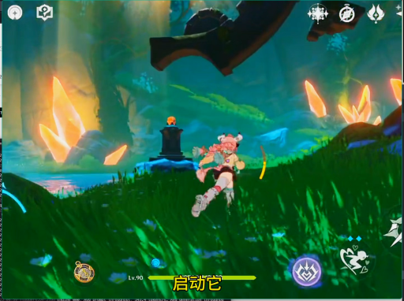

> 在一片充满奇幻色彩的绿色草地上，一个粉色头发的角色正在奔跑。背景中，巨大的黑色物体悬停在空中，远处有发光的橙色晶体和水体。画面下方显示着游戏界面，包括角色等级和“启动它”等文字。

### 帧 #25 (12.5s)

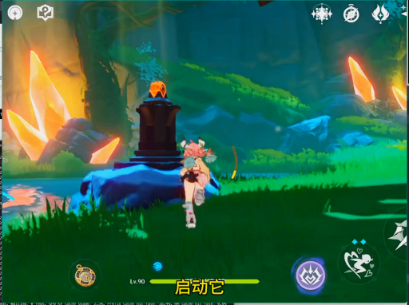

> 在一片绿意盎然的森林中，一个角色正站在一块蓝色的岩石上，面对着一个发光的黑色石碑。石碑顶部有一个橙色的火焰状物体，周围是散发着橙色光芒的岩石和茂密的植被。画面下方显示着“启动它”的提示，表明角色正在准备进行某种操作。

### 帧 #26 (13.0s)

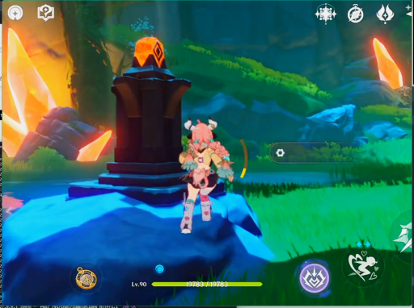

> 在一处充满奇幻色彩的户外场景中，一名粉发角色正站在一个发光的黑色石碑前，似乎在进行某种仪式或准备行动。背景是绿色的草地和远处的山峦，周围有发光的岩石，营造出一种神秘的氛围。

### 帧 #27 (13.5s)

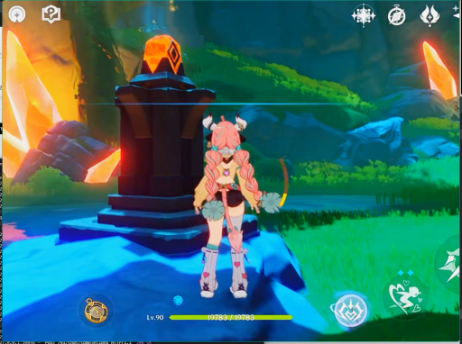

> 一名粉色头发的女性角色站在一个发光的黑色石碑前，背景是充满绿色植被和橙色晶体的奇幻洞穴环境。她手持一把弓箭，似乎正准备进行战斗或探索。

### 帧 #28 (14.0s)

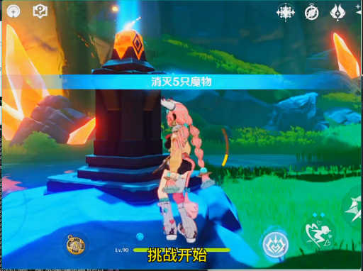

> 在一处充满奇幻色彩的户外场景中，一名角色正站在一个发光的石碑前，准备开始一场名为“消灭5只魔物”的挑战。画面中央的石碑上有一个橙色的发光标志，周围环境是绿色的草地和岩石，背景中还有发光的晶体。

### 帧 #29 (14.5s)

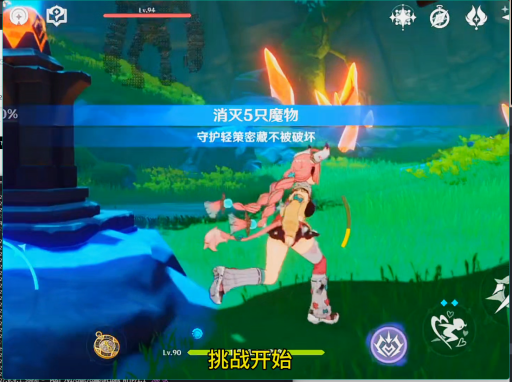

> 在一款游戏的战斗场景中，一名角色正在草地上奔跑，准备迎接挑战。画面中央的蓝色横幅显示“消灭5只怪物”，下方的“挑战开始”按钮表明任务已启动。

### 帧 #30 (15.0s)

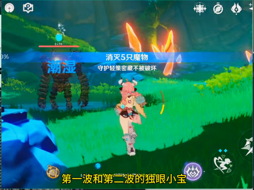

> 在一片潮湿的草地上，一名粉发角色正面对着一个巨大的、被火焰环绕的怪物。屏幕上的文字显示“消灭5只怪物”和“守护轻策密藏不被破坏”，表明这是一场战斗。角色似乎正在执行任务，而怪物则处于攻击状态。

### 帧 #31 (15.5s)

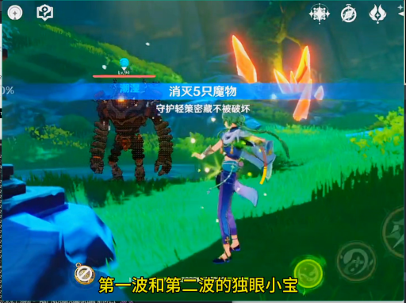

> 在一片绿色的草地上，一名身着蓝紫色服饰的女性角色正面对着一个巨大的、由岩石构成的敌人。屏幕上方显示着“消灭5只魔物”的任务目标，下方则有文字提示“第一波和第二波的独眼小宝”，表明这是一场战斗。

### 帧 #32 (16.0s)

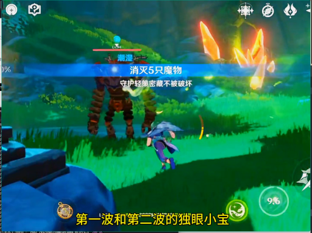

> 在一片绿色的草地上，一名玩家角色正与一个巨大的、类似怪物的敌人对峙。敌人身上有火焰特效，屏幕中央显示着“消灭5只怪物”的任务提示。画面下方的字幕显示“第一波和第二波的独眼小宝”，表明这是一场战斗任务。

### 帧 #33 (16.5s)

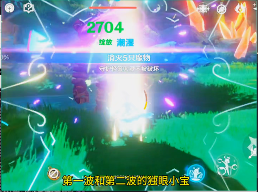

> 这是一张游戏战斗结束后的画面，显示玩家成功击败了5只怪物，获得了2704的战利品。画面中央的光效和文字表明，这是一场在草地上进行的战斗，玩家的队伍正在清理敌方小怪。

### 帧 #34 (17.0s)

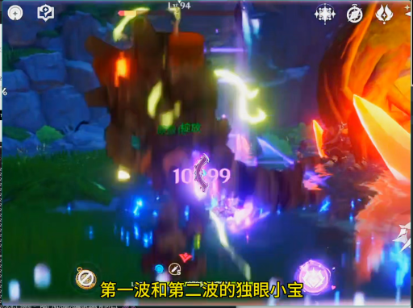

> 在一处充满奇幻色彩的地下洞穴或遗迹中，一个巨大的、类似树干的生物正被攻击，其身上有发光的黄色能量，周围有紫色的光效和数字“10099”显示着伤害值。画面下方的字幕提示“第一波和第二波的独眼小宝”，表明这是一场战斗，主角正在与该生物进行对抗。

### 帧 #35 (17.5s)

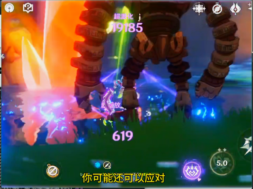

> 在一场激烈的战斗中，一个巨大的机械敌人正被攻击，其腿部和脚部正在释放出蓝色的光效。画面下方的字幕显示“你可能还可以应对”，表明玩家正在与敌人进行对抗。

### 帧 #36 (18.0s)

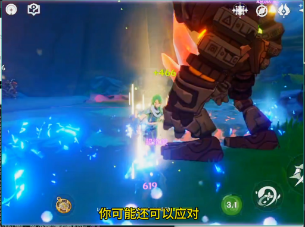

> 在一处充满蓝色魔法光芒的洞穴或地下场景中，一名绿发角色正与一个巨大的、装甲厚重的机械敌人对峙。该角色似乎正在施放技能，周围环绕着蓝色的光效，而敌人的脚下也泛起光芒，表明战斗正在进行中。画面下方的字幕显示“你可能还可以应对”，暗示着战斗的紧张状态。

### 帧 #37 (18.5s)

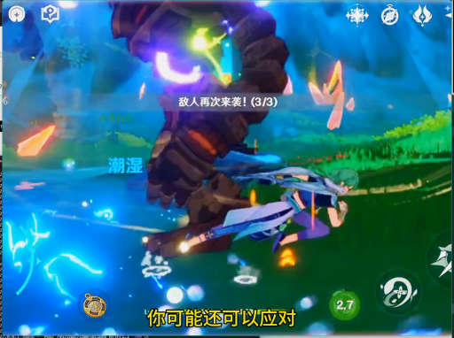

> 在一场战斗中，一个巨大的、由岩石构成的敌人正从水中浮现，其身上散发着蓝紫色的光芒。一名角色正从下方的水面上跃起，似乎在进行攻击或躲避。画面中显示“敌人再次来袭！(3/3)”和“你可能还可以应对”等文字，表明这是一场持续的战斗。

### 帧 #38 (19.0s)

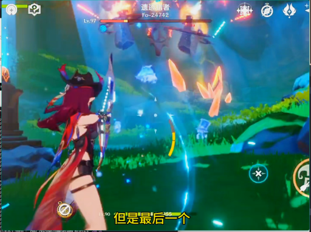

> 在一片充满奇幻色彩的绿色草地上，一名红发角色正手持武器，面对着空中漂浮的敌人进行战斗。画面中充满了动态的光效和能量特效，显示着激烈的战斗场面。

### 帧 #39 (19.5s)

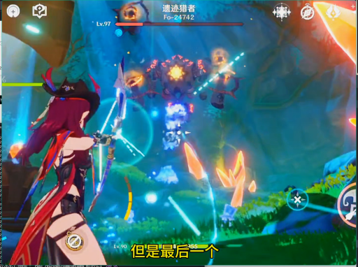

> 一名红发女性角色手持武器，正面对着一个巨大的、正在释放能量的敌人。画面中充满了战斗特效，包括光束和能量碎片，表明正在进行激烈的战斗。场景似乎是在一个充满奇幻色彩的洞穴或地下城中。

### 帧 #40 (20.0s)

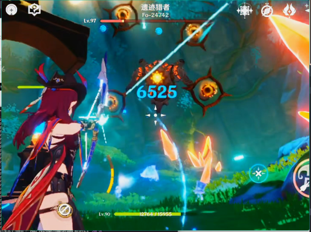

> 在一处充满奇幻色彩的洞穴或森林场景中，一名身着红黑服饰、头戴尖角头饰的女性角色正手持发光武器，与空中漂浮的多个橙色、类似眼球的敌人进行激烈战斗。战斗中，角色正在释放技能，击中敌人后，屏幕上显示了巨大的伤害数值“6525”，表明攻击造成了显著的伤害。

### 帧 #41 (20.5s)

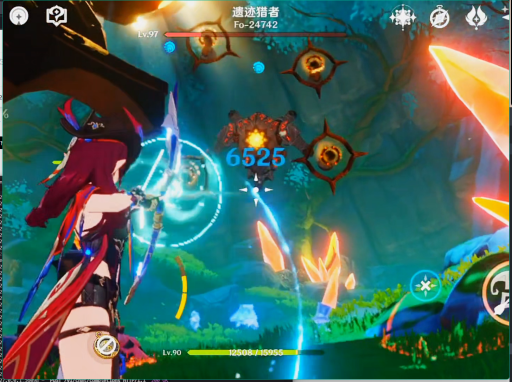

> 在一款动作游戏中，一名红发角色正手持武器，与一个名为“遗迹猎者”的敌人进行战斗。角色处于攻击姿态，周围有光效和伤害数值，表明正在发动攻击。场景设定在充满奇幻色彩的森林或洞穴环境中。

### 帧 #42 (21.0s)

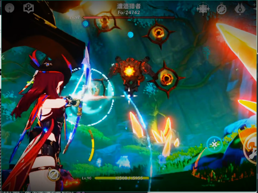

> 一名红发角色正在使用弓箭攻击空中漂浮的敌人，画面中可见多个发光的、类似眼球的敌人。场景设定在一个充满奇幻色彩的洞穴或地下空间，背景有绿色的植被和发光的岩石。

### 帧 #48 (24.0s)

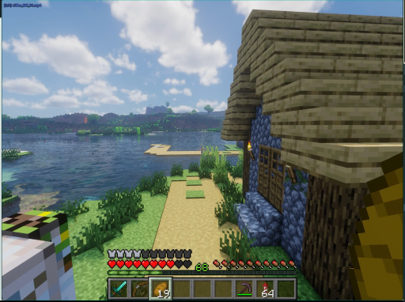

> 这是一张《我的世界》游戏的截图，视角位于玩家角色的视角。画面右侧是一座由方块构成的木屋，屋旁是绿色的草地和一条通往湖边的小路。湖面平静，远处是连绵的山丘和天空中的云朵。画面左下角可以看到玩家角色的方块状身体。

### 帧 #49 (24.5s)

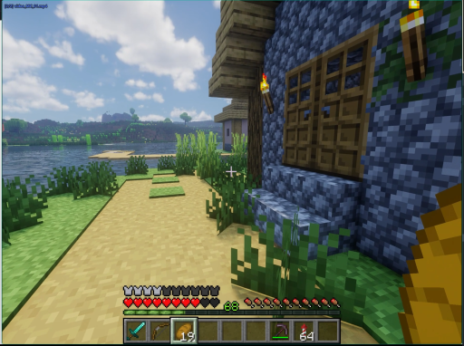

> 这是一张《我的世界》游戏的截图，视角位于玩家角色的视角。画面中，玩家正站在一座由石块和木头建造的房屋前，旁边是一条通往湖边的小路。画面右下角可以看到玩家的武器和物品栏，表明玩家处于游戏中的一个场景。

### 帧 #50 (25.0s)

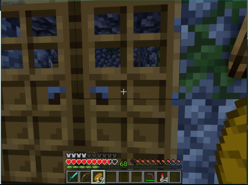

> 这是一张《我的世界》游戏的截图，视角正对着一个由木板和石块构成的建筑结构。画面中可以看到建筑的木制门板，门板上有几个小窗格，透过窗格可以看到内部的石块。在画面的右侧，可以看到一些绿色的植物和水流。画面下方是游戏的用户界面，显示了玩家的生命值、饥饿值、经验值和物品栏。

### 帧 #51 (25.5s)

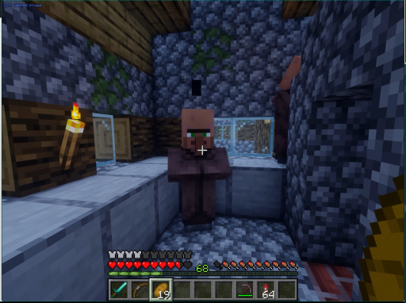

> 这是一张《我的世界》游戏的截图，画面中一个玩家角色站在一个由石块和木板搭建的室内空间里。角色的视角正对着一个由石块和木板构成的房间，房间内有木制的墙壁、一个点燃的火把和一个窗户。角色的界面显示其生命值为68，当前持有15个物品。

### 帧 #52 (26.0s)

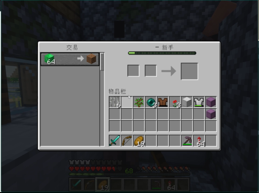

> 这是一个《我的世界》游戏的交易界面截图。玩家的物品栏中，一个绿色的方块（可能是草块或某种资源）被选中，准备进行交易。界面显示了交易的进度条，以及玩家的物品栏和当前的健康值。
