# 实验审阅: video_MC_01.mp4

## 运行元信息

- **模型**: `Qwen/Qwen3-VL-2B-Instruct`
- **视频**: `video_MC_01.mp4`
- **运行目录**: `video_MC_01_run1`

### 配置参数

| 参数 | 值 |
|------|-----|
| screenshot_interval_ms | 500 |
| max_size | 512 |
| recording_duration_s | 27 |
| algorithm | mse |
| diff_threshold | 500.0 |

## 统计摘要

- **总采样帧数**: 55
- **关键帧数**: 32
- **丢弃帧数**: 0
- **录制时长**: 27.0s
- **关键帧率**: 58.2%

## 帧时间线

| 帧序号 | 时间戳 | 差异值 | 关键帧 | 判定原因 | 图片 | VLM 描述 |
|--------|--------|--------|--------|----------|------|----------|
| 0 | 0.0s | - | **是** | 首帧，自动标记为关键帧 | [frame_0000_key.png](frames/frame_0000_key.png) | 这是一张《我的世界》游戏的截图，视角位于玩家角色的视角。画面左侧是玩家角色的像素化身体，右侧是一座带有茅草屋顶的木屋，屋前有一条小路通向湖边。远处是湖泊和连绵的山丘，天空晴朗。 |
| 1 | 0.5s | 2604.31 | **是** | 差异值 2604.31 >= 阈值 500.00 | [frame_0001_key.png](frames/frame_0001_key.png) | 这是一张《我的世界》游戏的截图，画面中显示了玩家的视角。玩家正站在一座由蓝灰色方块构成的石墙建筑前，建筑的窗户上挂着木制窗框，墙上还挂着两盏点燃的火把。建筑旁是一条沙地小径，通向一片水域，水域对面是绿色的丘陵和树木。天空晴朗，有白云。 |
| 2 | 1.0s | 6181.76 | **是** | 差异值 6181.76 >= 阈值 500.00 | [frame_0002_key.png](frames/frame_0002_key.png) | 这是一张《我的世界》游戏的截图，画面中显示了玩家角色站在一个由石块和木板构成的建筑前。角色的视角正对着一扇带有格子的木门，门后是深色的方块。角色的左前方有一个木制门框，门框上挂着一盏点燃的火把。画面左下角显示了玩家的生命值、饥饿值和物... |
| 3 | 1.5s | 1934.83 | **是** | 差异值 1934.83 >= 阈值 500.00 | [frame_0003_key.png](frames/frame_0003_key.png) | 这是一个《我的世界》游戏的视频截图，视角位于玩家角色的视角。画面中，一个穿着棕色衣服的玩家角色站在一个由石块和木板搭建的室内空间里，旁边有一个燃烧的火把。场景看起来像一个简陋的洞穴或地牢，墙壁由灰色的石块构成，地面是灰色的方块。 |
| 4 | 2.0s | 6025.17 | **是** | 差异值 6025.17 >= 阈值 500.00 | [frame_0004_key.png](frames/frame_0004_key.png) | 这是一个《我的世界》游戏的界面截图，显示了玩家的交易界面。玩家的交易栏中，64个绿色的方块（可能是某种资源）正在被交易，而右侧的物品栏中则展示了玩家的装备和物品。背景是游戏中的一个室内环境，看起来像是一个洞穴或地下建筑。 |
| 5 | 2.5s | 147.46 | 否 | 差异值 147.46 < 阈值 500.00 | [frame_0005_skip.png](frames/frame_0005_skip.png) | - |
| 6 | 3.0s | 147.39 | 否 | 差异值 147.39 < 阈值 500.00 | [frame_0006_skip.png](frames/frame_0006_skip.png) | - |
| 7 | 3.5s | 5633.44 | **是** | 差异值 5633.44 >= 阈值 500.00 | [frame_0007_key.png](frames/frame_0007_key.png) | 这是一张《我的世界》游戏的截图，画面中一个玩家角色站在一个由石块和木板搭建的室内建筑内。角色身穿棕色上衣，头戴棕色帽子，正面对着镜头。角色的下方是游戏的用户界面，显示了生命值、饥饿值、经验值和物品栏。背景中可以看到窗户和室外的自然景观。 |
| 8 | 4.0s | 1412.19 | **是** | 差异值 1412.19 >= 阈值 500.00 | [frame_0008_key.png](frames/frame_0008_key.png) | 这是一张《我的世界》游戏的截图，画面中一个玩家角色站在一个由石块和木板搭建的室内空间里。角色的视角是第一人称，可以看到游戏界面，包括生命值、饥饿值和物品栏。角色的左手边有一支点燃的火把，照亮了房间。 |
| 9 | 4.5s | 3571.61 | **是** | 差异值 3571.61 >= 阈值 500.00 | [frame_0009_key.png](frames/frame_0009_key.png) | 这是一张《我的世界》游戏的截图，画面中一个角色站在一个由石块和木板搭建的室内空间里。角色的视角似乎正对着一个木制的桌子或柜台，背景中可以看到一个发光的火把和一个窗户。整个场景光线昏暗，像是在夜晚或室内。 |
| 10 | 5.0s | 2159.55 | **是** | 差异值 2159.55 >= 阈值 500.00 | [frame_0010_key.png](frames/frame_0010_key.png) | 画面中央是一个由发光像素构成的、具有星形对称结构的复杂几何图形，其核心部分呈方形，向外辐射出八条带有尖端的臂状结构。整个图形在深色、带有漩涡纹理的背景中显得格外突出，呈现出一种数字艺术或科幻风格的视觉效果。 |
| 11 | 5.6s | 364.14 | 否 | 差异值 364.14 < 阈值 500.00 | [frame_0011_skip.png](frames/frame_0011_skip.png) | - |
| 12 | 6.1s | 1649.42 | **是** | 差异值 1649.42 >= 阈值 500.00 | [frame_0012_key.png](frames/frame_0012_key.png) | 在像素风格的夜景中，一个角色站在高处的栏杆上，仰望着天空。天空中，一个巨大的、由发光方块构成的建筑结构正在缓缓下降，其下方有明亮的光点，似乎在进行某种仪式或飞行。 |
| 13 | 6.5s | 1248.98 | **是** | 差异值 1248.98 >= 阈值 500.00 | [frame_0013_key.png](frames/frame_0013_key.png) | 画面中央是一个巨大的、由发光线条构成的星形或十字形结构，它在深色的、带有云雾感的天空中悬浮。该结构中心有复杂的几何图案，向外延伸出多个发光的臂状结构，整体呈现出一种科技感和神秘感。画面的底部可以看到几个黑色的、像素化的轮廓，像是玩家的... |
| 14 | 7.0s | 3045.78 | **是** | 差异值 3045.78 >= 阈值 500.00 | [frame_0014_key.png](frames/frame_0014_key.png) | 这是一张《我的世界》（Minecraft）游戏的截图，画面中展示了一个由方块构成的建筑结构。建筑的墙壁上用像素字体写着“TNT TNT TNT”，表明这是一个与炸药相关的场景。建筑的底部有蓝黄相间的图案，而上方则由黑色和灰色的方块组成... |
| 15 | 7.5s | 2266.70 | **是** | 差异值 2266.70 >= 阈值 500.00 | [frame_0015_key.png](frames/frame_0015_key.png) | 这是一张《我的世界》（Minecraft）游戏的截图，画面中展示了由方块构成的建筑结构。前景是带有蓝黄图案的墙壁，背景中可以看到由黑色方块堆叠的柱子，以及一个标有“TNT”字样的红色横幅。整个场景呈现出一种像素化的、具有工业感的建筑风格。 |
| 16 | 8.0s | 4192.45 | **是** | 差异值 4192.45 >= 阈值 500.00 | [frame_0016_key.png](frames/frame_0016_key.png) | 在夜幕下，一个巨大的、发光的未来风格飞行器在云层中悬浮，其结构复杂，顶部有垂直排列的明亮灯柱，底部有类似船体的结构，整体呈现出一种科幻感。 |
| 17 | 8.5s | 2305.97 | **是** | 差异值 2305.97 >= 阈值 500.00 | [frame_0017_key.png](frames/frame_0017_key.png) | 这是一张从低角度仰视拍摄的视频截图，画面中心是一个由发光方块构成的巨大、类似风车或塔状的建筑结构。该结构在夜空中被灯光照亮，其顶部和两侧的叶片上布满了闪烁的光点，背景是深色的天空。 |
| 18 | 9.0s | 2888.86 | **是** | 差异值 2888.86 >= 阈值 500.00 | [frame_0018_key.png](frames/frame_0018_key.png) | 这是一张从高处俯瞰的、具有强烈几何感的建筑结构的视频截图。画面中心是一个由方块构成的、类似迷宫或隧道的结构，其内部有橙红色的光点和图案，周围是深色的、带有红色边框的方块墙壁，整体呈现出一种科幻或未来主义的风格。 |
| 19 | 9.5s | 3062.66 | **是** | 差异值 3062.66 >= 阈值 500.00 | [frame_0019_key.png](frames/frame_0019_key.png) | 这是一张从高处俯视的《我的世界》游戏截图，展示了一个复杂的方块结构。画面中心是一个由各种方块组成的复杂装置，其中包含一个橙色的方块，周围环绕着红、白、灰、绿等颜色的方块，以及一些带有黑色像素图案的方块。整个场景被一个由红白方块构成的框... |
| 20 | 10.1s | 3569.60 | **是** | 差异值 3569.60 >= 阈值 500.00 | [frame_0020_key.png](frames/frame_0020_key.png) | 在昏暗的地下环境中，一个像素化的角色站在由石块和铁栅栏构成的牢笼里，周围有火把提供微弱的光亮。背景是几个巨大的黑色柱子，地面是绿色的方块，整体场景呈现出一种神秘的氛围。 |
| 21 | 10.5s | 797.88 | **是** | 差异值 797.88 >= 阈值 500.00 | [frame_0021_key.png](frames/frame_0021_key.png) | 在昏暗的像素化环境中，一个角色站在一个由石块和火把构成的祭坛上，祭坛周围是深色的地面。背景中有三个高耸的黑色柱状物，整个场景呈现出一种神秘而压抑的氛围。 |
| 22 | 11.0s | 3706.37 | **是** | 差异值 3706.37 >= 阈值 500.00 | [frame_0022_key.png](frames/frame_0022_key.png) | 这是一张来自《我的世界》游戏的截图，展示了一个由方块构成的复杂建筑内部。画面中可以看到一个巨大的、由白色和灰色方块搭建的结构，其上部有红色的条纹装饰。在画面的左下角，有一个由白色和红色方块组成的平台，上面似乎有类似控制台的设备。整个场... |
| 23 | 11.6s | 4283.77 | **是** | 差异值 4283.77 >= 阈值 500.00 | [frame_0023_key.png](frames/frame_0023_key.png) | 这是一张从高处俯瞰的、具有强烈像素化风格的建筑场景，很可能来自一个沙盒游戏。画面中，一个由方块构成的复杂结构在昏暗的光线下延伸，其内部有类似阶梯或通道的布局，两侧有发光的方块结构。整个场景笼罩在阴沉的天空下，营造出一种神秘而宏大的氛围。 |
| 24 | 12.0s | 5175.44 | **是** | 差异值 5175.44 >= 阈值 500.00 | [frame_0024_key.png](frames/frame_0024_key.png) | 这是一张《我的世界》（Minecraft）游戏内的截图，展示了一个宏伟的、由方块构成的建筑内部。画面中央是一个由透明方块构成的高大结构，两侧是带有发光方块的墙壁，整体呈现出一种未来感和对称的几何美感。 |
| 25 | 12.5s | 7894.46 | **是** | 差异值 7894.46 >= 阈值 500.00 | [frame_0025_key.png](frames/frame_0025_key.png) | 这是一张像素风格的视频截图，画面呈现了一个类似游戏《我的世界》的室内场景。画面中央是一个巨大的、浅蓝色的方块，其下方是深色的、带有像素化纹理的地面。在画面的右侧，有一个深色的、带有方格纹理的结构，可能是门或墙壁。在画面的上方，可以看到... |
| 26 | 13.1s | 4673.54 | **是** | 差异值 4673.54 >= 阈值 500.00 | [frame_0026_key.png](frames/frame_0026_key.png) | 这是一张像素风格的视频截图，画面呈现了一个类似《我的世界》的地下或封闭空间。左侧是深蓝色的墙壁，右侧是布满方块的结构，中间区域有发光的方块和一些类似机械或建筑的结构。画面中央有一个橙色的光源，周围有复杂的方块构成的图案，整体环境显得昏... |
| 27 | 13.5s | 4633.10 | **是** | 差异值 4633.10 >= 阈值 500.00 | [frame_0027_key.png](frames/frame_0027_key.png) | 这是一张像素风格的视频截图，画面中似乎是一个游戏场景。一个带有黑色像素化眼睛的方块状物体（可能是角色或生物）位于画面右侧，其后方是发光的白色方块结构。画面左侧的深色方块结构中，有一个发出粉紫色光芒的物体，看起来像一个发光的物品或生物。... |
| 28 | 14.1s | 2018.86 | **是** | 差异值 2018.86 >= 阈值 500.00 | [frame_0028_key.png](frames/frame_0028_key.png) | 这是一张像素风格的视频截图，画面中似乎是一个游戏场景。左侧是深色的方块结构，中间有一个发光的方块，右侧是带有发光方块的平台，整体环境看起来像是一个由方块构成的建筑或房间。 |
| 29 | 14.6s | 4028.40 | **是** | 差异值 4028.40 >= 阈值 500.00 | [frame_0029_key.png](frames/frame_0029_key.png) | 这是一张从低角度仰视拍摄的视频截图，画面中充满了由方块构成的、类似建筑结构的复杂几何图形。这些方块以红、绿、白、灰等颜色组合，呈现出一种类似游戏《我的世界》的像素化风格。画面中央似乎有某种结构在向上延伸，而上方的方块则呈现出扭曲和重叠... |
| 30 | 15.1s | 2610.66 | **是** | 差异值 2610.66 >= 阈值 500.00 | [frame_0030_key.png](frames/frame_0030_key.png) | 这是一张从高处俯瞰的、具有强烈视觉冲击力的视频截图，画面中心是一个巨大的、由方块构成的建筑结构，其顶部呈放射状向外延伸，形成一个类似星形或金字塔的复杂几何形态。该结构由红、绿、白等不同颜色的方块组成，呈现出一种类似游戏《我的世界》的像... |
| 31 | 15.6s | 6264.30 | **是** | 差异值 6264.30 >= 阈值 500.00 | [frame_0031_key.png](frames/frame_0031_key.png) | 这是一张从高处俯瞰的《我的世界》游戏画面，展示了一个由方块构成的复杂建筑结构。画面中央是一个发光的橙色方块，周围环绕着各种建筑和装饰，两侧是带有红色发光灯带的墙壁。 |
| 32 | 16.1s | 4230.17 | **是** | 差异值 4230.17 >= 阈值 500.00 | [frame_0032_key.png](frames/frame_0032_key.png) | 这是一张从低角度仰视拍摄的室内场景，画面主体是天花板上排列整齐的、带有几何图案的发光灯带。这些灯带发出温暖的橙黄色光芒，照亮了白色的天花板结构，营造出一种现代而富有设计感的氛围。 |
| 33 | 16.5s | 3640.43 | **是** | 差异值 3640.43 >= 阈值 500.00 | [frame_0033_key.png](frames/frame_0033_key.png) | 画面中央是一个复杂的、散发着光芒的星形或放射状结构，其设计具有对称的几何图案，由多个发光的尖端和中心圆环构成。背景是深色的、带有流动感的云雾或烟雾，整体氛围显得神秘而庄严。画面的底部可以看到两个模糊的黑色轮廓，可能是人物的剪影。 |
| 34 | 17.1s | 29.08 | 否 | 差异值 29.08 < 阈值 500.00 | [frame_0034_skip.png](frames/frame_0034_skip.png) | - |
| 35 | 17.6s | 92.65 | 否 | 差异值 92.65 < 阈值 500.00 | [frame_0035_skip.png](frames/frame_0035_skip.png) | - |
| 36 | 18.1s | 208.60 | 否 | 差异值 208.60 < 阈值 500.00 | [frame_0036_skip.png](frames/frame_0036_skip.png) | - |
| 37 | 18.5s | 284.04 | 否 | 差异值 284.04 < 阈值 500.00 | [frame_0037_skip.png](frames/frame_0037_skip.png) | - |
| 38 | 19.1s | 322.29 | 否 | 差异值 322.29 < 阈值 500.00 | [frame_0038_skip.png](frames/frame_0038_skip.png) | - |
| 39 | 19.6s | 339.72 | 否 | 差异值 339.72 < 阈值 500.00 | [frame_0039_skip.png](frames/frame_0039_skip.png) | - |
| 40 | 20.1s | 1184.11 | **是** | 差异值 1184.11 >= 阈值 500.00 | [frame_0040_key.png](frames/frame_0040_key.png) | 画面中央是一个巨大的、散发着光芒的星形或机械结构，从其中心发出一道强烈的白光，垂直向下延伸。下方是一个尖锐的、类似山峰或祭坛的结构，其底部有橙红色的光芒，似乎在吸收或释放能量。整个场景处于黑暗的环境中，背景是深邃的夜空或虚无，营造出一... |
| 41 | 20.6s | 143.16 | 否 | 差异值 143.16 < 阈值 500.00 | [frame_0041_skip.png](frames/frame_0041_skip.png) | - |
| 42 | 21.1s | 126.21 | 否 | 差异值 126.21 < 阈值 500.00 | [frame_0042_skip.png](frames/frame_0042_skip.png) | - |
| 43 | 21.5s | 184.58 | 否 | 差异值 184.58 < 阈值 500.00 | [frame_0043_skip.png](frames/frame_0043_skip.png) | - |
| 44 | 22.0s | 175.54 | 否 | 差异值 175.54 < 阈值 500.00 | [frame_0044_skip.png](frames/frame_0044_skip.png) | - |
| 45 | 22.5s | 116.99 | 否 | 差异值 116.99 < 阈值 500.00 | [frame_0045_skip.png](frames/frame_0045_skip.png) | - |
| 46 | 23.0s | 124.92 | 否 | 差异值 124.92 < 阈值 500.00 | [frame_0046_skip.png](frames/frame_0046_skip.png) | - |
| 47 | 23.5s | 131.93 | 否 | 差异值 131.93 < 阈值 500.00 | [frame_0047_skip.png](frames/frame_0047_skip.png) | - |
| 48 | 24.0s | 163.32 | 否 | 差异值 163.32 < 阈值 500.00 | [frame_0048_skip.png](frames/frame_0048_skip.png) | - |
| 49 | 24.6s | 163.41 | 否 | 差异值 163.41 < 阈值 500.00 | [frame_0049_skip.png](frames/frame_0049_skip.png) | - |
| 50 | 25.1s | 163.41 | 否 | 差异值 163.41 < 阈值 500.00 | [frame_0050_skip.png](frames/frame_0050_skip.png) | - |
| 51 | 25.6s | 163.41 | 否 | 差异值 163.41 < 阈值 500.00 | [frame_0051_skip.png](frames/frame_0051_skip.png) | - |
| 52 | 26.1s | 163.41 | 否 | 差异值 163.41 < 阈值 500.00 | [frame_0052_skip.png](frames/frame_0052_skip.png) | - |
| 53 | 26.6s | 163.41 | 否 | 差异值 163.41 < 阈值 500.00 | [frame_0053_skip.png](frames/frame_0053_skip.png) | - |
| 54 | 27.1s | 163.41 | 否 | 差异值 163.41 < 阈值 500.00 | [frame_0054_skip.png](frames/frame_0054_skip.png) | - |

## DeepSeek 最终总结

```
视频以玩家在《我的世界》中探索宁静的乡村木屋和室内空间开始，随后场景迅速转变为一系列充满科幻与神秘感的宏大建筑和发光结构。关键转折点出现在视频中段，画面从日常生存场景切换至悬浮的星形几何体、未来风格飞行器以及标有“TNT”的工业建筑，标志着内容转向了展示玩家建造的复杂、艺术化的奇观。整体主题围绕《我的世界》的创造可能性，通过时间线呈现了从平凡探索到震撼视觉建筑的旅程，突出了游戏作为数字画布的核心体验。
```

## 关键帧详细描述

### 帧 #0 (0.0s)

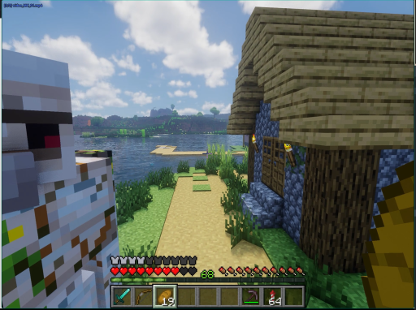

> 这是一张《我的世界》游戏的截图，视角位于玩家角色的视角。画面左侧是玩家角色的像素化身体，右侧是一座带有茅草屋顶的木屋，屋前有一条小路通向湖边。远处是湖泊和连绵的山丘，天空晴朗。

### 帧 #1 (0.5s)

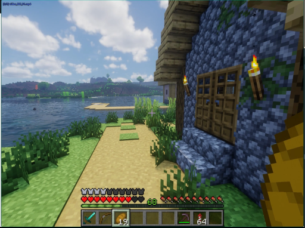

> 这是一张《我的世界》游戏的截图，画面中显示了玩家的视角。玩家正站在一座由蓝灰色方块构成的石墙建筑前，建筑的窗户上挂着木制窗框，墙上还挂着两盏点燃的火把。建筑旁是一条沙地小径，通向一片水域，水域对面是绿色的丘陵和树木。天空晴朗，有白云。

### 帧 #2 (1.0s)


> 这是一张《我的世界》游戏的截图，画面中显示了玩家角色站在一个由石块和木板构成的建筑前。角色的视角正对着一扇带有格子的木门，门后是深色的方块。角色的左前方有一个木制门框，门框上挂着一盏点燃的火把。画面左下角显示了玩家的生命值、饥饿值和物品栏，表明玩家处于游戏中的一个场景。

### 帧 #3 (1.5s)


> 这是一个《我的世界》游戏的视频截图，视角位于玩家角色的视角。画面中，一个穿着棕色衣服的玩家角色站在一个由石块和木板搭建的室内空间里，旁边有一个燃烧的火把。场景看起来像一个简陋的洞穴或地牢，墙壁由灰色的石块构成，地面是灰色的方块。

### 帧 #4 (2.0s)


> 这是一个《我的世界》游戏的界面截图，显示了玩家的交易界面。玩家的交易栏中，64个绿色的方块（可能是某种资源）正在被交易，而右侧的物品栏中则展示了玩家的装备和物品。背景是游戏中的一个室内环境，看起来像是一个洞穴或地下建筑。

### 帧 #7 (3.5s)

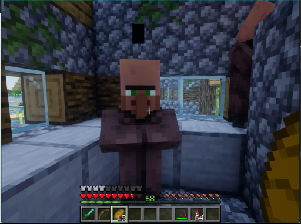

> 这是一张《我的世界》游戏的截图，画面中一个玩家角色站在一个由石块和木板搭建的室内建筑内。角色身穿棕色上衣，头戴棕色帽子，正面对着镜头。角色的下方是游戏的用户界面，显示了生命值、饥饿值、经验值和物品栏。背景中可以看到窗户和室外的自然景观。

### 帧 #8 (4.0s)

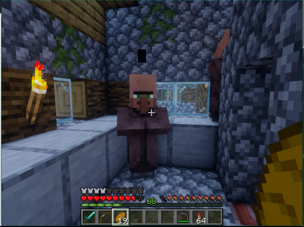

> 这是一张《我的世界》游戏的截图，画面中一个玩家角色站在一个由石块和木板搭建的室内空间里。角色的视角是第一人称，可以看到游戏界面，包括生命值、饥饿值和物品栏。角色的左手边有一支点燃的火把，照亮了房间。

### 帧 #9 (4.5s)

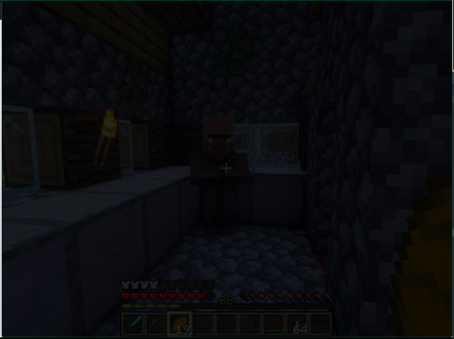

> 这是一张《我的世界》游戏的截图，画面中一个角色站在一个由石块和木板搭建的室内空间里。角色的视角似乎正对着一个木制的桌子或柜台，背景中可以看到一个发光的火把和一个窗户。整个场景光线昏暗，像是在夜晚或室内。

### 帧 #10 (5.0s)

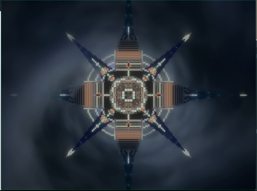

> 画面中央是一个由发光像素构成的、具有星形对称结构的复杂几何图形，其核心部分呈方形，向外辐射出八条带有尖端的臂状结构。整个图形在深色、带有漩涡纹理的背景中显得格外突出，呈现出一种数字艺术或科幻风格的视觉效果。

### 帧 #12 (6.1s)

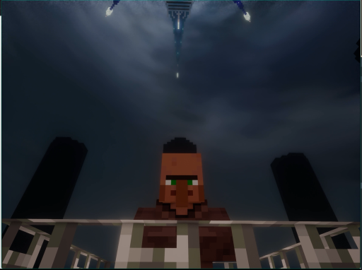

> 在像素风格的夜景中，一个角色站在高处的栏杆上，仰望着天空。天空中，一个巨大的、由发光方块构成的建筑结构正在缓缓下降，其下方有明亮的光点，似乎在进行某种仪式或飞行。

### 帧 #13 (6.5s)

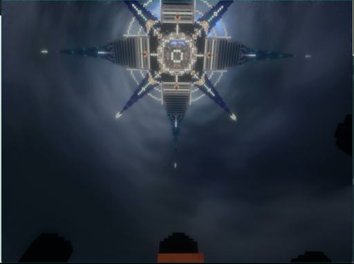

> 画面中央是一个巨大的、由发光线条构成的星形或十字形结构，它在深色的、带有云雾感的天空中悬浮。该结构中心有复杂的几何图案，向外延伸出多个发光的臂状结构，整体呈现出一种科技感和神秘感。画面的底部可以看到几个黑色的、像素化的轮廓，像是玩家的视角，表明这可能是一个游戏中的场景。

### 帧 #14 (7.0s)

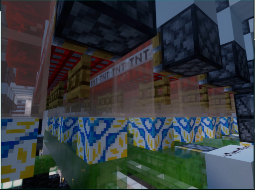

> 这是一张《我的世界》（Minecraft）游戏的截图，画面中展示了一个由方块构成的建筑结构。建筑的墙壁上用像素字体写着“TNT TNT TNT”，表明这是一个与炸药相关的场景。建筑的底部有蓝黄相间的图案，而上方则由黑色和灰色的方块组成，整体呈现出一种工业或军事风格的外观。

### 帧 #15 (7.5s)

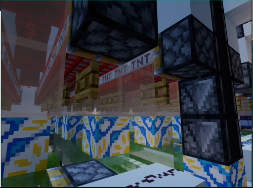

> 这是一张《我的世界》（Minecraft）游戏的截图，画面中展示了由方块构成的建筑结构。前景是带有蓝黄图案的墙壁，背景中可以看到由黑色方块堆叠的柱子，以及一个标有“TNT”字样的红色横幅。整个场景呈现出一种像素化的、具有工业感的建筑风格。

### 帧 #16 (8.0s)

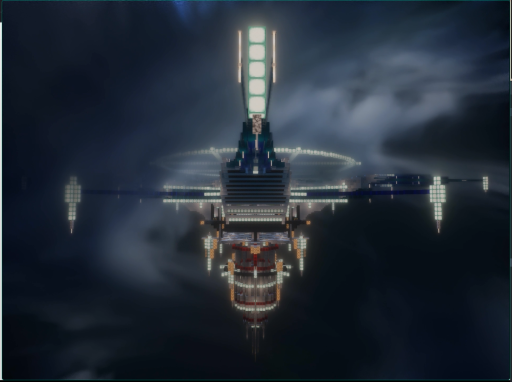

> 在夜幕下，一个巨大的、发光的未来风格飞行器在云层中悬浮，其结构复杂，顶部有垂直排列的明亮灯柱，底部有类似船体的结构，整体呈现出一种科幻感。

### 帧 #17 (8.5s)

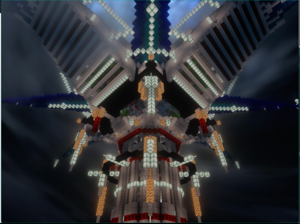

> 这是一张从低角度仰视拍摄的视频截图，画面中心是一个由发光方块构成的巨大、类似风车或塔状的建筑结构。该结构在夜空中被灯光照亮，其顶部和两侧的叶片上布满了闪烁的光点，背景是深色的天空。

### 帧 #18 (9.0s)

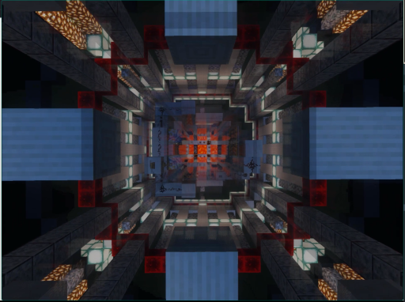

> 这是一张从高处俯瞰的、具有强烈几何感的建筑结构的视频截图。画面中心是一个由方块构成的、类似迷宫或隧道的结构，其内部有橙红色的光点和图案，周围是深色的、带有红色边框的方块墙壁，整体呈现出一种科幻或未来主义的风格。

### 帧 #19 (9.5s)

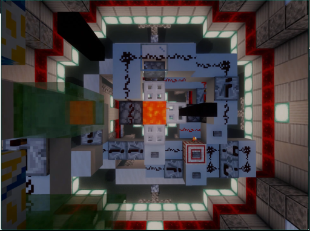

> 这是一张从高处俯视的《我的世界》游戏截图，展示了一个复杂的方块结构。画面中心是一个由各种方块组成的复杂装置，其中包含一个橙色的方块，周围环绕着红、白、灰、绿等颜色的方块，以及一些带有黑色像素图案的方块。整个场景被一个由红白方块构成的框架包围，背景是灰色的墙壁和发光的方块。

### 帧 #20 (10.1s)

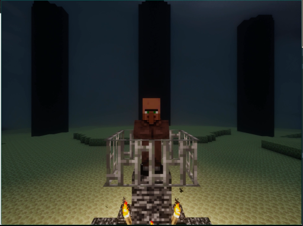

> 在昏暗的地下环境中，一个像素化的角色站在由石块和铁栅栏构成的牢笼里，周围有火把提供微弱的光亮。背景是几个巨大的黑色柱子，地面是绿色的方块，整体场景呈现出一种神秘的氛围。

### 帧 #21 (10.5s)

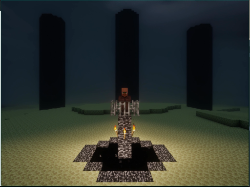

> 在昏暗的像素化环境中，一个角色站在一个由石块和火把构成的祭坛上，祭坛周围是深色的地面。背景中有三个高耸的黑色柱状物，整个场景呈现出一种神秘而压抑的氛围。

### 帧 #22 (11.0s)

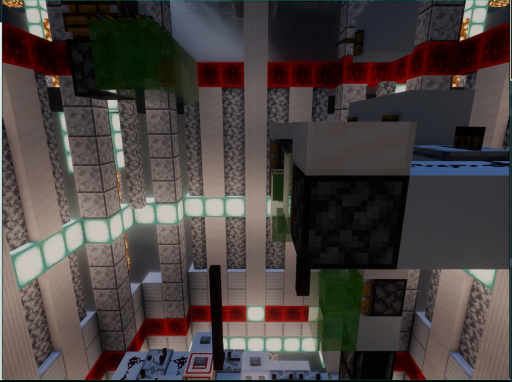

> 这是一张来自《我的世界》游戏的截图，展示了一个由方块构成的复杂建筑内部。画面中可以看到一个巨大的、由白色和灰色方块搭建的结构，其上部有红色的条纹装饰。在画面的左下角，有一个由白色和红色方块组成的平台，上面似乎有类似控制台的设备。整个场景的光线来自墙壁上的发光方块，营造出一种科技感十足的氛围。

### 帧 #23 (11.6s)

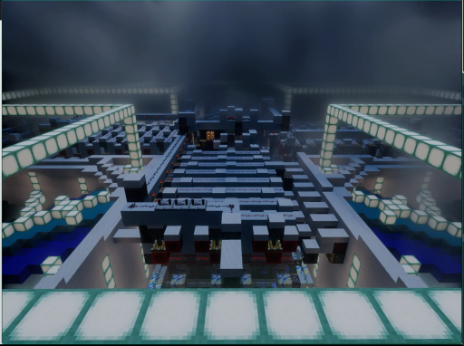

> 这是一张从高处俯瞰的、具有强烈像素化风格的建筑场景，很可能来自一个沙盒游戏。画面中，一个由方块构成的复杂结构在昏暗的光线下延伸，其内部有类似阶梯或通道的布局，两侧有发光的方块结构。整个场景笼罩在阴沉的天空下，营造出一种神秘而宏大的氛围。

### 帧 #24 (12.0s)

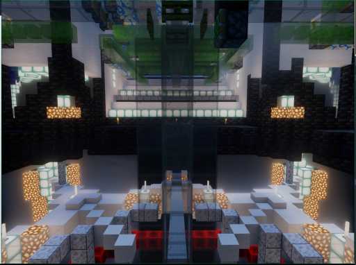

> 这是一张《我的世界》（Minecraft）游戏内的截图，展示了一个宏伟的、由方块构成的建筑内部。画面中央是一个由透明方块构成的高大结构，两侧是带有发光方块的墙壁，整体呈现出一种未来感和对称的几何美感。

### 帧 #25 (12.5s)

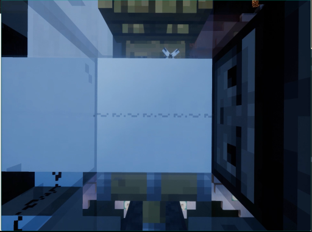

> 这是一张像素风格的视频截图，画面呈现了一个类似游戏《我的世界》的室内场景。画面中央是一个巨大的、浅蓝色的方块，其下方是深色的、带有像素化纹理的地面。在画面的右侧，有一个深色的、带有方格纹理的结构，可能是门或墙壁。在画面的上方，可以看到一个由方块构成的、类似建筑的结构，其上部有类似翅膀的图案。整个场景的光线较暗，呈现出一种幽闭的氛围。

### 帧 #26 (13.1s)

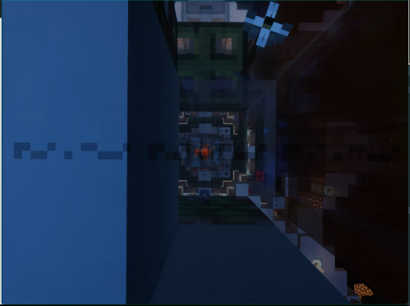

> 这是一张像素风格的视频截图，画面呈现了一个类似《我的世界》的地下或封闭空间。左侧是深蓝色的墙壁，右侧是布满方块的结构，中间区域有发光的方块和一些类似机械或建筑的结构。画面中央有一个橙色的光源，周围有复杂的方块构成的图案，整体环境显得昏暗，像是一个地下通道或矿洞。

### 帧 #27 (13.5s)

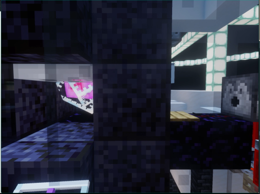

> 这是一张像素风格的视频截图，画面中似乎是一个游戏场景。一个带有黑色像素化眼睛的方块状物体（可能是角色或生物）位于画面右侧，其后方是发光的白色方块结构。画面左侧的深色方块结构中，有一个发出粉紫色光芒的物体，看起来像一个发光的物品或生物。整个场景呈现出一种科幻或奇幻的氛围。

### 帧 #28 (14.1s)

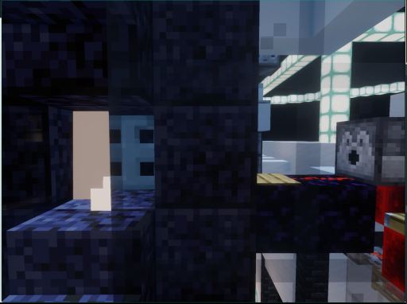

> 这是一张像素风格的视频截图，画面中似乎是一个游戏场景。左侧是深色的方块结构，中间有一个发光的方块，右侧是带有发光方块的平台，整体环境看起来像是一个由方块构成的建筑或房间。

### 帧 #29 (14.6s)


> 这是一张从低角度仰视拍摄的视频截图，画面中充满了由方块构成的、类似建筑结构的复杂几何图形。这些方块以红、绿、白、灰等颜色组合，呈现出一种类似游戏《我的世界》的像素化风格。画面中央似乎有某种结构在向上延伸，而上方的方块则呈现出扭曲和重叠的视觉效果。

### 帧 #30 (15.1s)


> 这是一张从高处俯瞰的、具有强烈视觉冲击力的视频截图，画面中心是一个巨大的、由方块构成的建筑结构，其顶部呈放射状向外延伸，形成一个类似星形或金字塔的复杂几何形态。该结构由红、绿、白等不同颜色的方块组成，呈现出一种类似游戏《我的世界》的像素化风格。整个场景似乎是一个巨大的、由方块搭建的建筑或装置，其下方有类似灯光的结构，整体给人一种宏伟而神秘的感觉。

### 帧 #31 (15.6s)


> 这是一张从高处俯瞰的《我的世界》游戏画面，展示了一个由方块构成的复杂建筑结构。画面中央是一个发光的橙色方块，周围环绕着各种建筑和装饰，两侧是带有红色发光灯带的墙壁。

### 帧 #32 (16.1s)

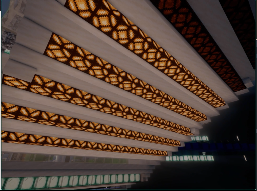

> 这是一张从低角度仰视拍摄的室内场景，画面主体是天花板上排列整齐的、带有几何图案的发光灯带。这些灯带发出温暖的橙黄色光芒，照亮了白色的天花板结构，营造出一种现代而富有设计感的氛围。

### 帧 #33 (16.5s)

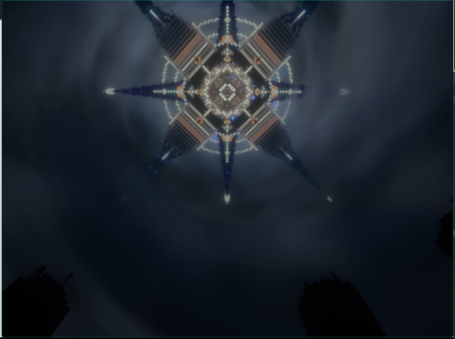

> 画面中央是一个复杂的、散发着光芒的星形或放射状结构，其设计具有对称的几何图案，由多个发光的尖端和中心圆环构成。背景是深色的、带有流动感的云雾或烟雾，整体氛围显得神秘而庄严。画面的底部可以看到两个模糊的黑色轮廓，可能是人物的剪影。

### 帧 #40 (20.1s)


> 画面中央是一个巨大的、散发着光芒的星形或机械结构，从其中心发出一道强烈的白光，垂直向下延伸。下方是一个尖锐的、类似山峰或祭坛的结构，其底部有橙红色的光芒，似乎在吸收或释放能量。整个场景处于黑暗的环境中，背景是深邃的夜空或虚无，营造出一种神秘而强大的氛围。
