# 实验审阅: video_MC_01.mp4

## 运行元信息

- **模型**: `Qwen/Qwen3-VL-2B-Instruct`
- **视频**: `video_MC_01.mp4`
- **运行目录**: `video_MC_01_run3`

### 配置参数

| 参数 | 值 |
|------|-----|
| screenshot_interval_ms | 500 |
| max_size | 512 |
| recording_duration_s | 27 |
| algorithm | mse |
| diff_threshold | 500.0 |

## 统计摘要

- **总采样帧数**: 55
- **关键帧数**: 31
- **丢弃帧数**: 0
- **录制时长**: 27.0s
- **关键帧率**: 56.4%

## 帧时间线

| 帧序号 | 时间戳 | 差异值 | 关键帧 | 判定原因 | 图片 | VLM 描述 |
|--------|--------|--------|--------|----------|------|----------|
| 0 | 0.0s | - | **是** | 首帧，自动标记为关键帧 | [frame_0000_key.png](frames/frame_0000_key.png) | 这是一张《我的世界》游戏的截图，画面中一个穿着绿色和白色盔甲的玩家角色站在一条通往村庄的土路上，旁边是一座由蓝色石块和木板搭建的房屋。远处是湖泊和连绵的山丘，天空晴朗。玩家角色的视角正对着村庄，似乎在观察或准备进入。 |
| 1 | 0.5s | 2929.73 | **是** | 差异值 2929.73 >= 阈值 500.00 | [frame_0001_key.png](frames/frame_0001_key.png) | 这是一张《我的世界》游戏的截图，视角位于玩家角色的视角。画面右侧是一座由蓝色石块和木头搭建的房屋，墙上挂着两盏火把。房屋前是一条沙地小径，通向一片水域，水域对面是绿色的丘陵和远处的山峦。天空晴朗，有白云。 |
| 2 | 1.0s | 5534.95 | **是** | 差异值 5534.95 >= 阈值 500.00 | [frame_0002_key.png](frames/frame_0002_key.png) | 这是一张《我的世界》游戏的截图，画面中显示了玩家视角下的一个像素风格的建筑。建筑外墙由蓝色的方块构成，窗户是木制的格栅，墙上挂着一盏点燃的火把。建筑旁边是绿色的草地和沙地，远处可以看到其他房屋和水域。画面下方是玩家的物品栏和生命值等状... |
| 3 | 1.5s | 3596.05 | **是** | 差异值 3596.05 >= 阈值 500.00 | [frame_0003_key.png](frames/frame_0003_key.png) | 这是一张《我的世界》游戏的截图，画面中一个玩家角色站在一个由石块和木板搭建的室内空间里。角色的视角正对着一个窗户，窗外可以看到水体。房间内有木制的架子和火把，环境看起来像是一个简陋的庇护所或小屋。 |
| 4 | 2.0s | 5981.77 | **是** | 差异值 5981.77 >= 阈值 500.00 | [frame_0004_key.png](frames/frame_0004_key.png) | 这是一个《我的世界》游戏的交易界面截图。玩家正在与另一名玩家进行物品交易，界面显示玩家拥有64个绿色的方块（可能是某种资源或物品），正在将一个方块进行交易。玩家的背包中包含多种物品，包括工具、食物和建筑材料。 |
| 5 | 2.5s | 148.57 | 否 | 差异值 148.57 < 阈值 500.00 | [frame_0005_skip.png](frames/frame_0005_skip.png) | - |
| 6 | 3.0s | 149.30 | 否 | 差异值 149.30 < 阈值 500.00 | [frame_0006_skip.png](frames/frame_0006_skip.png) | - |
| 7 | 3.5s | 149.23 | 否 | 差异值 149.23 < 阈值 500.00 | [frame_0007_skip.png](frames/frame_0007_skip.png) | - |
| 8 | 4.0s | 5537.15 | **是** | 差异值 5537.15 >= 阈值 500.00 | [frame_0008_key.png](frames/frame_0008_key.png) | 这是一张《我的世界》游戏的视频截图，画面中一个玩家角色站在一个由石块和木板搭建的室内空间里。角色身穿棕色衣物，正面对着一个窗户，窗外是雪地。角色的左前方有一支燃烧的火把，照亮了房间。画面下方是游戏的用户界面，显示了角色的生命值、饥饿值... |
| 9 | 4.5s | 2030.62 | **是** | 差异值 2030.62 >= 阈值 500.00 | [frame_0009_key.png](frames/frame_0009_key.png) | 这是一张《我的世界》游戏的视频截图，画面中一个穿着棕色盔甲的玩家角色站在一个由石块和木板搭建的室内空间里。角色的前方有一个木制的架子，上面放着一个黄色的物品，可能是火把或工具。场景的墙壁是灰色的石块，地面是灰色的方块。画面下方是玩家的... |
| 10 | 5.0s | 851.22 | **是** | 差异值 851.22 >= 阈值 500.00 | [frame_0010_key.png](frames/frame_0010_key.png) | 画面中央是一个由像素构成的、具有星形对称结构的发光建筑，其形态类似一个复杂的星图或宇宙飞船。建筑的中心部分由多个同心圆环和方块构成，向外延伸出八条尖锐的臂状结构，每条臂的末端都发出明亮的光点。整个场景背景是深色的、带有模糊的漩涡状光晕... |
| 11 | 5.5s | 413.19 | 否 | 差异值 413.19 < 阈值 500.00 | [frame_0011_skip.png](frames/frame_0011_skip.png) | - |
| 12 | 6.0s | 1294.09 | **是** | 差异值 1294.09 >= 阈值 500.00 | [frame_0012_key.png](frames/frame_0012_key.png) | 一个像素风格的角色站在一个类似瞭望台的结构上，仰望着天空。天空中有一道明亮的光束从天而降，似乎有物体正在坠落。角色的面部表情严肃，背景是阴沉的夜空。 |
| 13 | 6.5s | 1413.43 | **是** | 差异值 1413.43 >= 阈值 500.00 | [frame_0013_key.png](frames/frame_0013_key.png) | 画面中，一个由发光方块构成的、类似星形或十字形的建筑结构悬浮在深色的天空中，其下方是模糊的、类似建筑的轮廓。整个场景呈现出一种科幻或虚拟世界的氛围。 |
| 14 | 7.0s | 2964.94 | **是** | 差异值 2964.94 >= 阈值 500.00 | [frame_0014_key.png](frames/frame_0014_key.png) | 这是一张来自《我的世界》（Minecraft）游戏的截图，画面中展示了由方块构成的建筑结构。前景是带有蓝黄几何图案的方块墙，背景是高耸的、由黑色和灰色方块组成的建筑，其上方有红色的结构。整个场景呈现出典型的像素化风格，暗示着一个正在建... |
| 15 | 7.5s | 2446.39 | **是** | 差异值 2446.39 >= 阈值 500.00 | [frame_0015_key.png](frames/frame_0015_key.png) | 这是一张来自《我的世界》（Minecraft）游戏的截图，画面中展示了由方块构成的建筑结构。前景是一个带有蓝黄几何图案的墙壁，上方悬挂着一个透明的方块，其后方是红黑相间的结构。画面中还有多个黑色的方块，可能是游戏中的“岩浆”或“铁块”... |
| 16 | 8.0s | 3995.58 | **是** | 差异值 3995.58 >= 阈值 500.00 | [frame_0016_key.png](frames/frame_0016_key.png) | 在夜幕笼罩的天空中，一艘巨大的、发光的未来风格飞行器正悬浮在空中。它拥有一个高耸的中央塔状结构，顶部发出明亮的白光，两侧延伸出对称的、带有发光灯带的翼状结构，整体在云层中显得十分醒目。 |
| 17 | 8.5s | 2335.21 | **是** | 差异值 2335.21 >= 阈值 500.00 | [frame_0017_key.png](frames/frame_0017_key.png) | 这是一张在夜间拍摄的、由像素方块构成的建筑或装置的特写。画面中心是一个巨大的、由发光方块搭建的结构，其顶部有类似风车的叶片，整体呈现出一种未来感或科幻风格。该结构在黑暗的背景下被灯光照亮，显得非常醒目。 |
| 18 | 9.0s | 2945.22 | **是** | 差异值 2945.22 >= 阈值 500.00 | [frame_0018_key.png](frames/frame_0018_key.png) | 这是一张从高处俯视的、具有强烈几何感的建筑结构图，呈现出类似游戏《我的世界》中的方块状建筑。画面中心是一个由红色方块构成的发光核心，周围是蓝灰色的方块结构，这些结构以对称的方式向中心汇聚，形成一个类似隧道或迷宫的视觉效果。 |
| 19 | 9.5s | 3044.04 | **是** | 差异值 3044.04 >= 阈值 500.00 | [frame_0019_key.png](frames/frame_0019_key.png) | 这是一张从高处俯视的《我的世界》游戏截图，展示了一个复杂的机械装置。画面中央是一个由方块构成的复杂结构，其中包含一个橙色的方块，周围环绕着各种管道和机械部件。整个场景被红色的发光线条包围，两侧是带有图案的方块墙壁。 |
| 20 | 10.0s | 3561.91 | **是** | 差异值 3561.91 >= 阈值 500.00 | [frame_0020_key.png](frames/frame_0020_key.png) | 一个像素风格的生物，看起来像一个被囚禁的末影人，正坐在一个由方块构成的金属笼子里。它身处一个昏暗的、类似地下或洞穴的环境中，背景是深色的柱子和绿色的地面。 |
| 21 | 10.5s | 866.86 | **是** | 差异值 866.86 >= 阈值 500.00 | [frame_0021_key.png](frames/frame_0021_key.png) | 在夜晚的像素化环境中，一个角色站在由石块和火把构成的祭坛上，背景是三个高耸的黑色方块柱子。 |
| 22 | 11.0s | 3772.39 | **是** | 差异值 3772.39 >= 阈值 500.00 | [frame_0022_key.png](frames/frame_0022_key.png) | 这是一张《我的世界》游戏的截图，展示了一个由方块构成的复杂建筑结构。画面中可以看到一个绿色的方块，可能是玩家的生物或物品，悬挂在由白色和灰色方块搭建的空中结构上。背景是带有发光方块的墙壁和天花板，整体环境看起来像是一个由玩家建造的、具... |
| 23 | 11.5s | 4192.07 | **是** | 差异值 4192.07 >= 阈值 500.00 | [frame_0023_key.png](frames/frame_0023_key.png) | 这是一个《我的世界》（Minecraft）游戏的截图，展示了一个由方块构成的复杂建筑结构。画面中央是一个由白色方块搭建的平台，上面有一个正在燃烧的熔岩块，发出橙红色的光芒。周围是灰色的石砖墙壁和带有发光方块的墙壁，整体环境看起来像是一... |
| 24 | 12.0s | 4441.34 | **是** | 差异值 4441.34 >= 阈值 500.00 | [frame_0024_key.png](frames/frame_0024_key.png) | 这是一张《我的世界》风格的视频截图，展示了一个宏伟的、由方块构成的建筑内部。画面中央是一个巨大的透明玻璃结构，两侧是排列整齐的发光方块，营造出一种未来感和科技感。整个场景光线明亮，结构复杂，呈现出一种对称的、充满未来主义设计的建筑空间。 |
| 25 | 12.5s | 6877.10 | **是** | 差异值 6877.10 >= 阈值 500.00 | [frame_0025_key.png](frames/frame_0025_key.png) | 这是一张像素风格的视频截图，画面呈现了一个类似地下通道或迷宫的场景。视角从一个狭窄的通道深处向前看，通道两侧是巨大的、由方块构成的墙壁，左侧墙壁上有一个发光的白色“X”形符号。通道尽头有一个发光的橙红色物体，可能是某种光源或装置。整个... |
| 26 | 13.0s | 4330.53 | **是** | 差异值 4330.53 >= 阈值 500.00 | [frame_0026_key.png](frames/frame_0026_key.png) | 画面呈现一个蓝色的背景，左侧有深色的竖条纹，右侧是黑色的竖条纹。画面中央有一条由像素点组成的、类似文字或符号的图案，正在缓慢地从左向右移动。 |
| 27 | 13.5s | 7360.72 | **是** | 差异值 7360.72 >= 阈值 500.00 | [frame_0027_key.png](frames/frame_0027_key.png) | 这是一张像素风格的视频截图，画面中似乎是一个游戏场景。左侧是深色的方块结构，可能是由深色岩块或泥土构成的墙壁和地面。右侧有一个类似生物的像素化角色，它有黑色的方块身体和一个白色的眼睛。背景中可以看到一个发光的白色方块结构，可能是某种光... |
| 28 | 14.0s | 1434.98 | **是** | 差异值 1434.98 >= 阈值 500.00 | [frame_0028_key.png](frames/frame_0028_key.png) | 这是一张像素风格的视频截图，画面中似乎是一个游戏场景。左侧是深色的方块结构，中间有类似门或墙体的方块，右侧有一个带有像素化眼睛的方块，可能是一个角色或装置。背景中可以看到一些发光的方块，整体环境看起来像是一个由方块构成的室内空间。 |
| 29 | 14.5s | 3807.61 | **是** | 差异值 3807.61 >= 阈值 500.00 | [frame_0029_key.png](frames/frame_0029_key.png) | 这是一张从低角度仰视拍摄的、具有强烈视觉扭曲效果的视频截图。画面中，一个由方块构成的、类似建筑或机械结构的物体在中心向上延伸，其表面呈现出绿色、红色和蓝色的图案，而周围环境则被扭曲成模糊的几何形状。整个画面充满了动态的、不规则的视觉元... |
| 30 | 15.0s | 2357.01 | **是** | 差异值 2357.01 >= 阈值 500.00 | [frame_0030_key.png](frames/frame_0030_key.png) | 这是一张从低角度仰视拍摄的、具有强烈视觉冲击力的建筑内部场景。画面中，巨大的、由方块构成的结构向上延伸，呈现出类似摩天大楼或巨大机械装置的形态。建筑内部的墙壁和天花板上布满了红色和绿色的方块，以及一些蓝色的图案，整体呈现出一种未来感或... |
| 31 | 15.5s | 10711.19 | **是** | 差异值 10711.19 >= 阈值 500.00 | [frame_0031_key.png](frames/frame_0031_key.png) | 这是一张来自《我的世界》（Minecraft）游戏的俯视视角截图。画面中心是一个由方块构成的建筑结构，其中包含一个发光的橙色方块，可能是一个光源或传送门。周围是高耸的、由方块堆砌的建筑，其墙壁上点缀着红色的发光方块。整个场景呈现出典型... |
| 32 | 16.0s | 7779.40 | **是** | 差异值 7779.40 >= 阈值 500.00 | [frame_0032_key.png](frames/frame_0032_key.png) | 这是一张从低角度仰视拍摄的建筑内部场景，画面中是多层结构的天花板，上面有数条发光的装饰带，发出温暖的橙黄色光芒。这些发光带呈条状排列，表面有重复的几何图案，照亮了整个空间。背景是深色的，暗示着这是一个室内环境，可能是在一个现代化的建筑... |
| 33 | 16.5s | 3646.63 | **是** | 差异值 3646.63 >= 阈值 500.00 | [frame_0033_key.png](frames/frame_0033_key.png) | 画面中央是一个复杂的、散发着光芒的星形或十字形结构，其设计具有对称的几何图案，由发光的线条和几何形状构成。该结构在深色、带有流动感的背景中显得格外突出，背景中似乎有模糊的、类似云雾或烟雾的动态效果。画面的底部可以看到两个黑色的、轮廓模... |
| 34 | 17.0s | 27.69 | 否 | 差异值 27.69 < 阈值 500.00 | [frame_0034_skip.png](frames/frame_0034_skip.png) | - |
| 35 | 17.5s | 90.27 | 否 | 差异值 90.27 < 阈值 500.00 | [frame_0035_skip.png](frames/frame_0035_skip.png) | - |
| 36 | 18.0s | 166.01 | 否 | 差异值 166.01 < 阈值 500.00 | [frame_0036_skip.png](frames/frame_0036_skip.png) | - |
| 37 | 18.5s | 293.16 | 否 | 差异值 293.16 < 阈值 500.00 | [frame_0037_skip.png](frames/frame_0037_skip.png) | - |
| 38 | 19.0s | 322.95 | 否 | 差异值 322.95 < 阈值 500.00 | [frame_0038_skip.png](frames/frame_0038_skip.png) | - |
| 39 | 19.5s | 339.91 | 否 | 差异值 339.91 < 阈值 500.00 | [frame_0039_skip.png](frames/frame_0039_skip.png) | - |
| 40 | 20.0s | 1241.50 | **是** | 差异值 1241.50 >= 阈值 500.00 | [frame_0040_key.png](frames/frame_0040_key.png) | 画面中央是一个由发光线条构成的星形或放射状结构，从其中心向上延伸出一道明亮的光束。下方是一个燃烧着的、类似火山或熔岩的物体，发出橙红色的光芒。整个场景在黑暗的背景下显得非常突出，充满了神秘和能量感。 |
| 41 | 20.5s | 139.19 | 否 | 差异值 139.19 < 阈值 500.00 | [frame_0041_skip.png](frames/frame_0041_skip.png) | - |
| 42 | 21.0s | 120.29 | 否 | 差异值 120.29 < 阈值 500.00 | [frame_0042_skip.png](frames/frame_0042_skip.png) | - |
| 43 | 21.5s | 168.96 | 否 | 差异值 168.96 < 阈值 500.00 | [frame_0043_skip.png](frames/frame_0043_skip.png) | - |
| 44 | 22.0s | 175.96 | 否 | 差异值 175.96 < 阈值 500.00 | [frame_0044_skip.png](frames/frame_0044_skip.png) | - |
| 45 | 22.5s | 108.36 | 否 | 差异值 108.36 < 阈值 500.00 | [frame_0045_skip.png](frames/frame_0045_skip.png) | - |
| 46 | 23.0s | 122.11 | 否 | 差异值 122.11 < 阈值 500.00 | [frame_0046_skip.png](frames/frame_0046_skip.png) | - |
| 47 | 23.5s | 115.51 | 否 | 差异值 115.51 < 阈值 500.00 | [frame_0047_skip.png](frames/frame_0047_skip.png) | - |
| 48 | 24.0s | 151.58 | 否 | 差异值 151.58 < 阈值 500.00 | [frame_0048_skip.png](frames/frame_0048_skip.png) | - |
| 49 | 24.5s | 151.50 | 否 | 差异值 151.50 < 阈值 500.00 | [frame_0049_skip.png](frames/frame_0049_skip.png) | - |
| 50 | 25.0s | 151.50 | 否 | 差异值 151.50 < 阈值 500.00 | [frame_0050_skip.png](frames/frame_0050_skip.png) | - |
| 51 | 25.5s | 151.50 | 否 | 差异值 151.50 < 阈值 500.00 | [frame_0051_skip.png](frames/frame_0051_skip.png) | - |
| 52 | 26.0s | 151.50 | 否 | 差异值 151.50 < 阈值 500.00 | [frame_0052_skip.png](frames/frame_0052_skip.png) | - |
| 53 | 26.5s | 151.50 | 否 | 差异值 151.50 < 阈值 500.00 | [frame_0053_skip.png](frames/frame_0053_skip.png) | - |
| 54 | 27.0s | 151.50 | 否 | 差异值 151.50 < 阈值 500.00 | [frame_0054_skip.png](frames/frame_0054_skip.png) | - |

## DeepSeek 最终总结

```
视频以玩家在《我的世界》中探索一个宁静的村庄和简陋庇护所开始，随后通过交易界面暗示了资源互动。视频的核心转折出现在中段，画面风格突变，一系列发光、结构复杂的星形建筑和未来风格飞行器在夜空中显现，营造出神秘科幻的氛围。随后场景转入地下或室内，展示由方块构成的宏伟机械装置、囚笼和祭坛，整体氛围变得幽闭而充满能量感。视频主题围绕从日常生存探索到发现庞大、未知高科技造物的转变，展现了游戏世界从平凡到奇幻的视觉旅程。
```

## 关键帧详细描述

### 帧 #0 (0.0s)

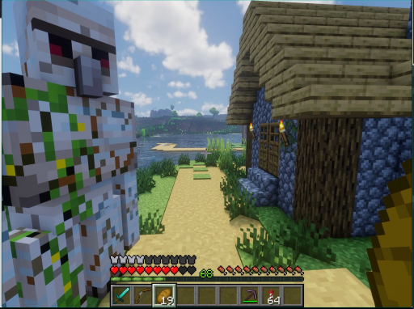

> 这是一张《我的世界》游戏的截图，画面中一个穿着绿色和白色盔甲的玩家角色站在一条通往村庄的土路上，旁边是一座由蓝色石块和木板搭建的房屋。远处是湖泊和连绵的山丘，天空晴朗。玩家角色的视角正对着村庄，似乎在观察或准备进入。

### 帧 #1 (0.5s)

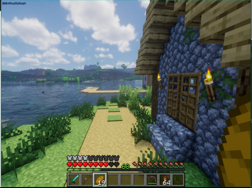

> 这是一张《我的世界》游戏的截图，视角位于玩家角色的视角。画面右侧是一座由蓝色石块和木头搭建的房屋，墙上挂着两盏火把。房屋前是一条沙地小径，通向一片水域，水域对面是绿色的丘陵和远处的山峦。天空晴朗，有白云。

### 帧 #2 (1.0s)

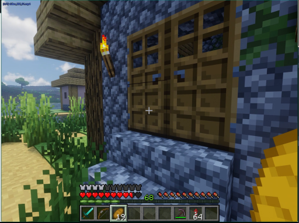

> 这是一张《我的世界》游戏的截图，画面中显示了玩家视角下的一个像素风格的建筑。建筑外墙由蓝色的方块构成，窗户是木制的格栅，墙上挂着一盏点燃的火把。建筑旁边是绿色的草地和沙地，远处可以看到其他房屋和水域。画面下方是玩家的物品栏和生命值等状态信息。

### 帧 #3 (1.5s)

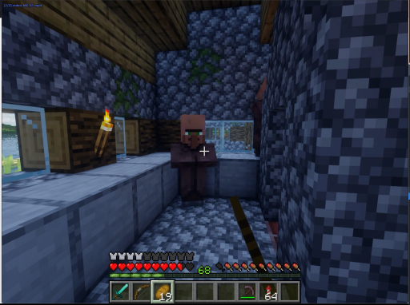

> 这是一张《我的世界》游戏的截图，画面中一个玩家角色站在一个由石块和木板搭建的室内空间里。角色的视角正对着一个窗户，窗外可以看到水体。房间内有木制的架子和火把，环境看起来像是一个简陋的庇护所或小屋。

### 帧 #4 (2.0s)

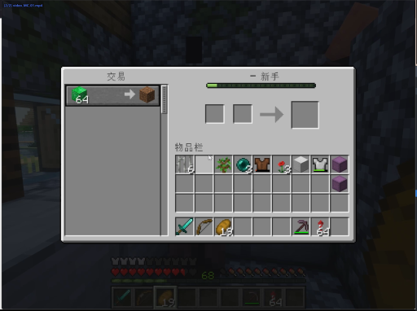

> 这是一个《我的世界》游戏的交易界面截图。玩家正在与另一名玩家进行物品交易，界面显示玩家拥有64个绿色的方块（可能是某种资源或物品），正在将一个方块进行交易。玩家的背包中包含多种物品，包括工具、食物和建筑材料。

### 帧 #8 (4.0s)

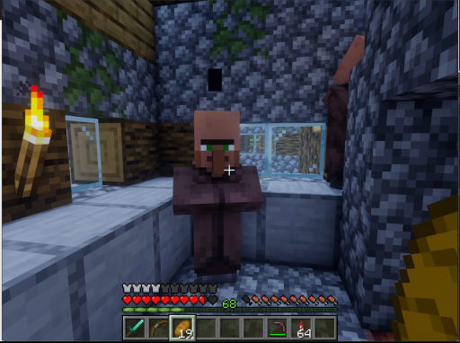

> 这是一张《我的世界》游戏的视频截图，画面中一个玩家角色站在一个由石块和木板搭建的室内空间里。角色身穿棕色衣物，正面对着一个窗户，窗外是雪地。角色的左前方有一支燃烧的火把，照亮了房间。画面下方是游戏的用户界面，显示了角色的生命值、饥饿值和物品栏。

### 帧 #9 (4.5s)

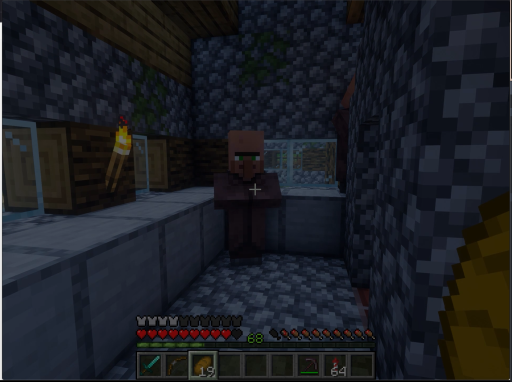

> 这是一张《我的世界》游戏的视频截图，画面中一个穿着棕色盔甲的玩家角色站在一个由石块和木板搭建的室内空间里。角色的前方有一个木制的架子，上面放着一个黄色的物品，可能是火把或工具。场景的墙壁是灰色的石块，地面是灰色的方块。画面下方是玩家的用户界面，显示了生命值、饥饿值和物品栏。

### 帧 #10 (5.0s)

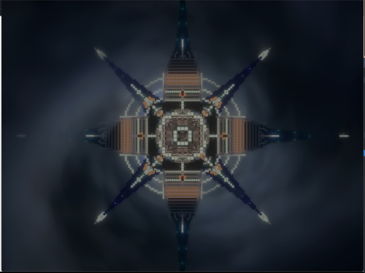

> 画面中央是一个由像素构成的、具有星形对称结构的发光建筑，其形态类似一个复杂的星图或宇宙飞船。建筑的中心部分由多个同心圆环和方块构成，向外延伸出八条尖锐的臂状结构，每条臂的末端都发出明亮的光点。整个场景背景是深色的、带有模糊的漩涡状光晕，营造出一种神秘而科幻的氛围。

### 帧 #12 (6.0s)

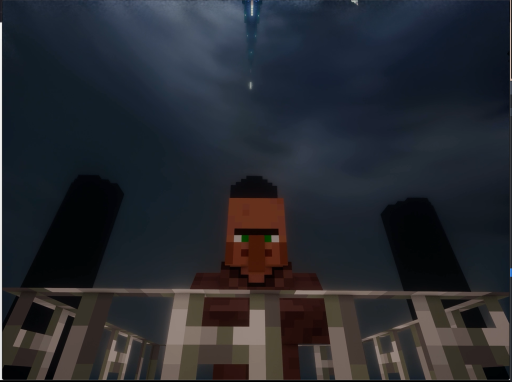

> 一个像素风格的角色站在一个类似瞭望台的结构上，仰望着天空。天空中有一道明亮的光束从天而降，似乎有物体正在坠落。角色的面部表情严肃，背景是阴沉的夜空。

### 帧 #13 (6.5s)

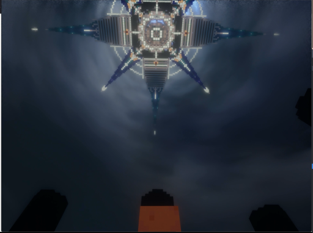

> 画面中，一个由发光方块构成的、类似星形或十字形的建筑结构悬浮在深色的天空中，其下方是模糊的、类似建筑的轮廓。整个场景呈现出一种科幻或虚拟世界的氛围。

### 帧 #14 (7.0s)

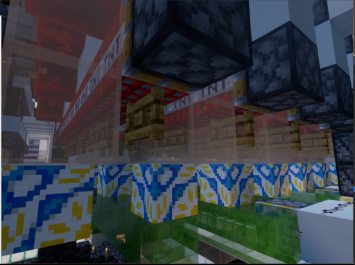

> 这是一张来自《我的世界》（Minecraft）游戏的截图，画面中展示了由方块构成的建筑结构。前景是带有蓝黄几何图案的方块墙，背景是高耸的、由黑色和灰色方块组成的建筑，其上方有红色的结构。整个场景呈现出典型的像素化风格，暗示着一个正在建造或改造的虚拟世界。

### 帧 #15 (7.5s)

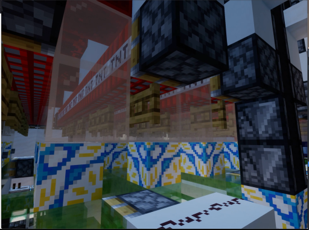

> 这是一张来自《我的世界》（Minecraft）游戏的截图，画面中展示了由方块构成的建筑结构。前景是一个带有蓝黄几何图案的墙壁，上方悬挂着一个透明的方块，其后方是红黑相间的结构。画面中还有多个黑色的方块，可能是游戏中的“岩浆”或“铁块”等材质。整个场景呈现出典型的像素化风格，暗示着一个由玩家建造的虚拟世界。

### 帧 #16 (8.0s)

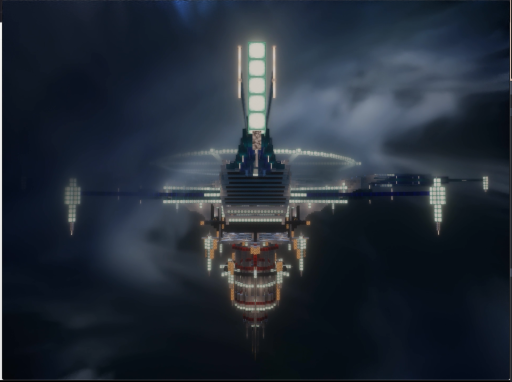

> 在夜幕笼罩的天空中，一艘巨大的、发光的未来风格飞行器正悬浮在空中。它拥有一个高耸的中央塔状结构，顶部发出明亮的白光，两侧延伸出对称的、带有发光灯带的翼状结构，整体在云层中显得十分醒目。

### 帧 #17 (8.5s)

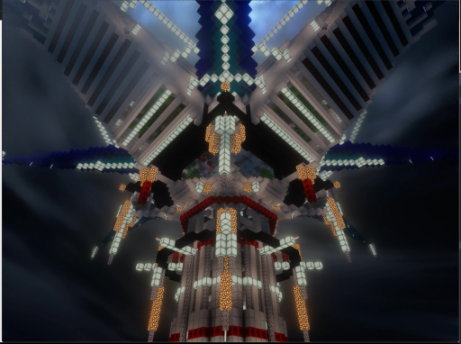

> 这是一张在夜间拍摄的、由像素方块构成的建筑或装置的特写。画面中心是一个巨大的、由发光方块搭建的结构，其顶部有类似风车的叶片，整体呈现出一种未来感或科幻风格。该结构在黑暗的背景下被灯光照亮，显得非常醒目。

### 帧 #18 (9.0s)

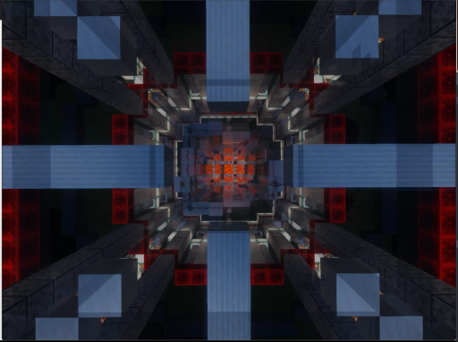

> 这是一张从高处俯视的、具有强烈几何感的建筑结构图，呈现出类似游戏《我的世界》中的方块状建筑。画面中心是一个由红色方块构成的发光核心，周围是蓝灰色的方块结构，这些结构以对称的方式向中心汇聚，形成一个类似隧道或迷宫的视觉效果。

### 帧 #19 (9.5s)

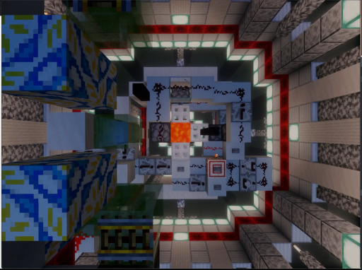

> 这是一张从高处俯视的《我的世界》游戏截图，展示了一个复杂的机械装置。画面中央是一个由方块构成的复杂结构，其中包含一个橙色的方块，周围环绕着各种管道和机械部件。整个场景被红色的发光线条包围，两侧是带有图案的方块墙壁。

### 帧 #20 (10.0s)

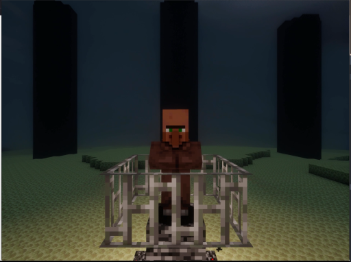

> 一个像素风格的生物，看起来像一个被囚禁的末影人，正坐在一个由方块构成的金属笼子里。它身处一个昏暗的、类似地下或洞穴的环境中，背景是深色的柱子和绿色的地面。

### 帧 #21 (10.5s)

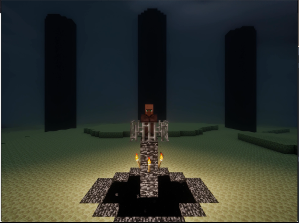

> 在夜晚的像素化环境中，一个角色站在由石块和火把构成的祭坛上，背景是三个高耸的黑色方块柱子。

### 帧 #22 (11.0s)

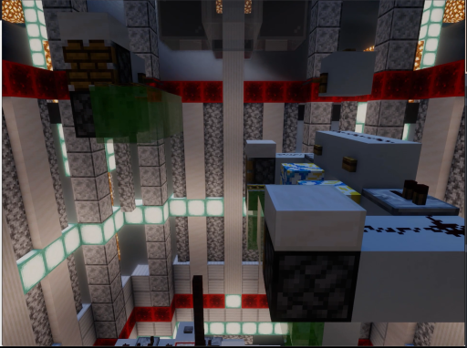

> 这是一张《我的世界》游戏的截图，展示了一个由方块构成的复杂建筑结构。画面中可以看到一个绿色的方块，可能是玩家的生物或物品，悬挂在由白色和灰色方块搭建的空中结构上。背景是带有发光方块的墙壁和天花板，整体环境看起来像是一个由玩家建造的、具有高度的、类似地下或高塔的建筑。

### 帧 #23 (11.5s)

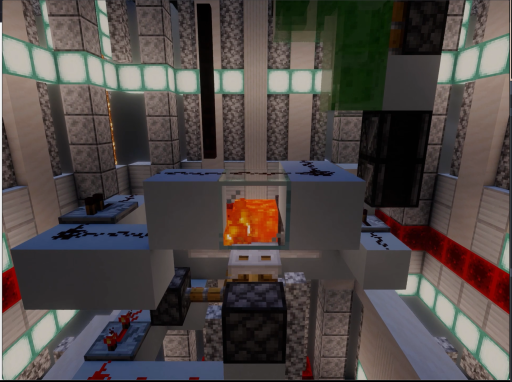

> 这是一个《我的世界》（Minecraft）游戏的截图，展示了一个由方块构成的复杂建筑结构。画面中央是一个由白色方块搭建的平台，上面有一个正在燃烧的熔岩块，发出橙红色的光芒。周围是灰色的石砖墙壁和带有发光方块的墙壁，整体环境看起来像是一个地下矿洞或实验室。

### 帧 #24 (12.0s)

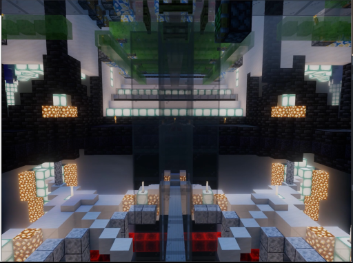

> 这是一张《我的世界》风格的视频截图，展示了一个宏伟的、由方块构成的建筑内部。画面中央是一个巨大的透明玻璃结构，两侧是排列整齐的发光方块，营造出一种未来感和科技感。整个场景光线明亮，结构复杂，呈现出一种对称的、充满未来主义设计的建筑空间。

### 帧 #25 (12.5s)

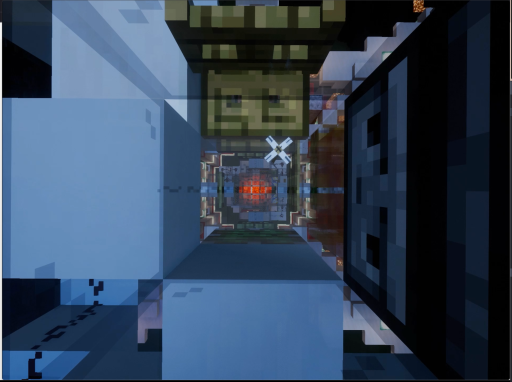

> 这是一张像素风格的视频截图，画面呈现了一个类似地下通道或迷宫的场景。视角从一个狭窄的通道深处向前看，通道两侧是巨大的、由方块构成的墙壁，左侧墙壁上有一个发光的白色“X”形符号。通道尽头有一个发光的橙红色物体，可能是某种光源或装置。整个场景的色调偏冷，以蓝色和灰色为主，营造出一种神秘、幽闭的氛围。

### 帧 #26 (13.0s)

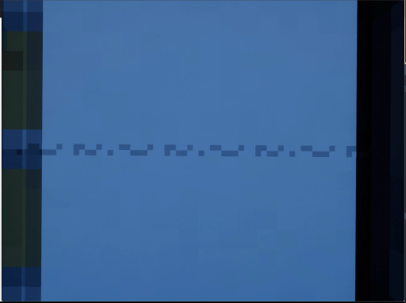

> 画面呈现一个蓝色的背景，左侧有深色的竖条纹，右侧是黑色的竖条纹。画面中央有一条由像素点组成的、类似文字或符号的图案，正在缓慢地从左向右移动。

### 帧 #27 (13.5s)

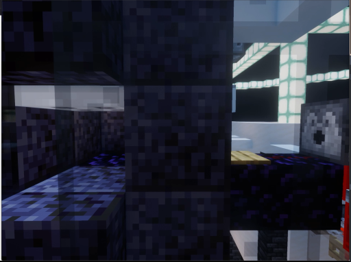

> 这是一张像素风格的视频截图，画面中似乎是一个游戏场景。左侧是深色的方块结构，可能是由深色岩块或泥土构成的墙壁和地面。右侧有一个类似生物的像素化角色，它有黑色的方块身体和一个白色的眼睛。背景中可以看到一个发光的白色方块结构，可能是某种光源或建筑。整个场景的光线较暗，但有部分区域被照亮。

### 帧 #28 (14.0s)

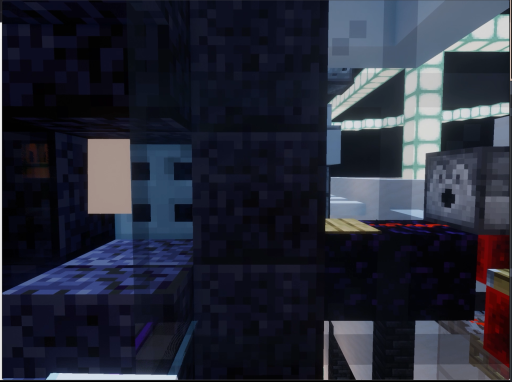

> 这是一张像素风格的视频截图，画面中似乎是一个游戏场景。左侧是深色的方块结构，中间有类似门或墙体的方块，右侧有一个带有像素化眼睛的方块，可能是一个角色或装置。背景中可以看到一些发光的方块，整体环境看起来像是一个由方块构成的室内空间。

### 帧 #29 (14.5s)

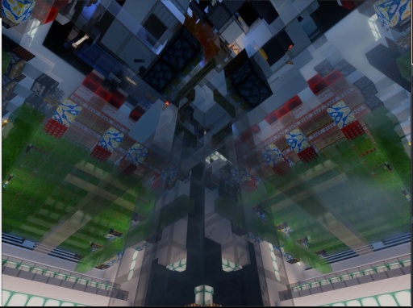

> 这是一张从低角度仰视拍摄的、具有强烈视觉扭曲效果的视频截图。画面中，一个由方块构成的、类似建筑或机械结构的物体在中心向上延伸，其表面呈现出绿色、红色和蓝色的图案，而周围环境则被扭曲成模糊的几何形状。整个画面充满了动态的、不规则的视觉元素，给人一种空间被拉伸或变形的感觉。

### 帧 #30 (15.0s)

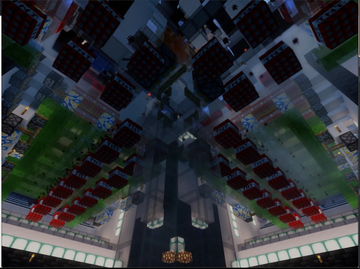

> 这是一张从低角度仰视拍摄的、具有强烈视觉冲击力的建筑内部场景。画面中，巨大的、由方块构成的结构向上延伸，呈现出类似摩天大楼或巨大机械装置的形态。建筑内部的墙壁和天花板上布满了红色和绿色的方块，以及一些蓝色的图案，整体呈现出一种未来感或科幻感。

### 帧 #31 (15.5s)

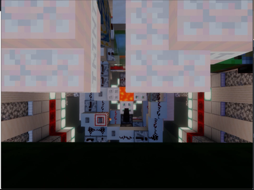

> 这是一张来自《我的世界》（Minecraft）游戏的俯视视角截图。画面中心是一个由方块构成的建筑结构，其中包含一个发光的橙色方块，可能是一个光源或传送门。周围是高耸的、由方块堆砌的建筑，其墙壁上点缀着红色的发光方块。整个场景呈现出典型的像素化风格，暗示着一个由玩家建造的虚拟世界。

### 帧 #32 (16.0s)

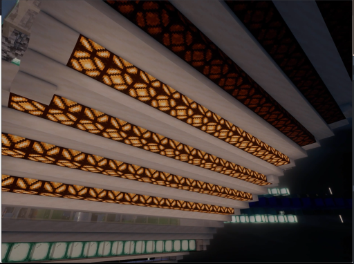

> 这是一张从低角度仰视拍摄的建筑内部场景，画面中是多层结构的天花板，上面有数条发光的装饰带，发出温暖的橙黄色光芒。这些发光带呈条状排列，表面有重复的几何图案，照亮了整个空间。背景是深色的，暗示着这是一个室内环境，可能是在一个现代化的建筑或室内设计中。

### 帧 #33 (16.5s)

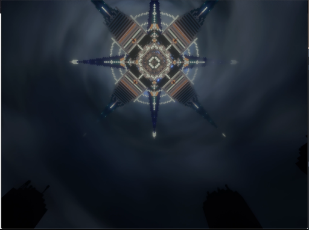

> 画面中央是一个复杂的、散发着光芒的星形或十字形结构，其设计具有对称的几何图案，由发光的线条和几何形状构成。该结构在深色、带有流动感的背景中显得格外突出，背景中似乎有模糊的、类似云雾或烟雾的动态效果。画面的底部可以看到两个黑色的、轮廓模糊的物体，可能是人物的剪影。

### 帧 #40 (20.0s)

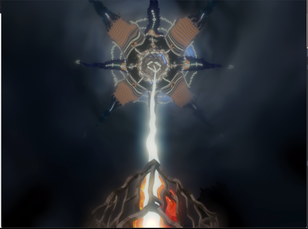

> 画面中央是一个由发光线条构成的星形或放射状结构，从其中心向上延伸出一道明亮的光束。下方是一个燃烧着的、类似火山或熔岩的物体，发出橙红色的光芒。整个场景在黑暗的背景下显得非常突出，充满了神秘和能量感。
