# 实验审阅: video_GenshinImpact_01.mp4

## 运行元信息

- **模型**: `Qwen/Qwen3.5-0.8B`
- **视频**: `video_GenshinImpact_01.mp4`
- **运行目录**: `video_GenshinImpact_01_run1`

### 配置参数

| 参数 | 值 |
|------|-----|
| screenshot_interval_ms | 500 |
| max_size | 512 |
| recording_duration_s | 26 |
| algorithm | mse |
| diff_threshold | 500.0 |

## 统计摘要

- **总采样帧数**: 17
- **关键帧数**: 14
- **丢弃帧数**: 0
- **录制时长**: 26.0s
- **关键帧率**: 82.4%

## 帧时间线

| 帧序号 | 时间戳 | 差异值 | 关键帧 | 判定原因 | 图片 | VLM 描述 |
|--------|--------|--------|--------|----------|------|----------|
| 0 | 0.0s | - | **是** | 首帧，自动标记为关键帧 | [frame_0000_key.png](frames/frame_0000_key.png) | 画面显示一位身穿深色西装的男性正站在室内，他双手交叉于胸前，神情专注地注视着前方。背景中隐约可见其他人员，但细节模糊。场景为室内，光线均匀。画面中人物处于静止状态，未观察到明显的动态变化。 |
| 1 | 0.5s | 3213.71 | **是** | 差异值 3213.71 >= 阈值 500.00 | [frame_0001_key.png](frames/frame_0001_key.png) | 画面显示一名身穿深色制服的男性正站在室内走廊中，他手持一把长柄刀具，身体微微前倾，似乎正在对前方的一名身穿浅色上衣的行人进行攻击。该行人处于静止状态，未发生明显动作。场景位于光线明亮的室内走廊，背景中可见其他模糊的行人身影。 |
| 2 | 1.0s | 3343.86 | **是** | 差异值 3343.86 >= 阈值 500.00 | [frame_0002_key.png](frames/frame_0002_key.png) | 画面显示一位身穿深色西装的男性正站在室内，他双手交叉于胸前，神情专注地注视着前方。背景中隐约可见其他人物轮廓，但细节模糊。场景位于一间光线明亮的办公室或会议室，整体氛围显得安静而严肃。 |
| 3 | 1.5s | 3966.54 | **是** | 差异值 3966.54 >= 阈值 500.00 | [frame_0003_key.png](frames/frame_0003_key.png) | 画面显示一位身穿深色西装的男性正站在室内，他双手交叉于胸前，神情专注地注视着前方。背景中隐约可见其他人物轮廓，但细节模糊。场景为室内，光线柔和，整体氛围显得平静而有序。 |
| 4 | 2.0s | 23.96 | 否 | 差异值 23.96 < 阈值 500.00 | [frame_0004_skip.png](frames/frame_0004_skip.png) | - |
| 5 | 2.5s | 2404.06 | **是** | 差异值 2404.06 >= 阈值 500.00 | [frame_0005_key.png](frames/frame_0005_key.png) | 画面显示一位身穿深色西装的男性正站在室内，他双手交叉于胸前，神情专注地凝视着前方。背景中隐约可见其他人物轮廓，但细节模糊。场景位于一间光线明亮的办公室或会议室，整体氛围显得安静而严肃。 |
| 6 | 3.0s | 723.71 | **是** | 差异值 723.71 >= 阈值 500.00 | [frame_0006_key.png](frames/frame_0006_key.png) | 画面显示一位身穿深色西装的男性正站在室内，他双手交叉于胸前，神情专注地凝视着前方。背景中隐约可见其他人员，但细节模糊，无法确认其具体身份。场景位于一间光线明亮的办公室或会议室，整体氛围显得安静而严肃。 |
| 7 | 3.5s | 2093.27 | **是** | 差异值 2093.27 >= 阈值 500.00 | [frame_0007_key.png](frames/frame_0007_key.png) | 画面显示一名身穿深色制服的人员正站在室内走廊中，手持长条状物体，身体略微前倾，似乎正在进行某种操作或检查。该人员周围没有明显的动物或关键物体，场景为封闭的室内环境，整体氛围显得较为安静且专注。 |
| 8 | 4.0s | 32.86 | 否 | 差异值 32.86 < 阈值 500.00 | [frame_0008_skip.png](frames/frame_0008_skip.png) | - |
| 9 | 4.5s | 79.48 | 否 | 差异值 79.48 < 阈值 500.00 | [frame_0009_skip.png](frames/frame_0009_skip.png) | - |
| 10 | 5.0s | 6889.38 | **是** | 差异值 6889.38 >= 阈值 500.00 | [frame_0010_key.png](frames/frame_0010_key.png) | 画面显示一名身穿深色制服的人员正站在室内，周围摆放着若干白色圆柱形物体，该人员似乎在进行某种操作或检查。 |
| 11 | 5.5s | 1765.45 | **是** | 差异值 1765.45 >= 阈值 500.00 | [frame_0011_key.png](frames/frame_0011_key.png) | 画面中显示一名身穿深色制服的人员正站在室内，其面部表情严肃且目光锐利，似乎正在进行某种高紧张度的活动。该人员周围没有明显的动物或关键物体，场景为封闭的室内空间，整体氛围显得紧张且充满不确定性。 |
| 12 | 6.0s | 1273.92 | **是** | 差异值 1273.92 >= 阈值 500.00 | [frame_0012_key.png](frames/frame_0012_key.png) | 画面显示一位身穿深色西装的男性正站在室内，他双手交叉于胸前，神情专注地注视着前方。背景中隐约可见其他人物轮廓，但细节模糊。场景为室内，光线柔和，整体氛围显得平静而正式。 |
| 13 | 6.5s | 1197.07 | **是** | 差异值 1197.07 >= 阈值 500.00 | [frame_0013_key.png](frames/frame_0013_key.png) | 画面显示一位身穿深色制服的男性正站在室内走廊中，他手持一把长柄武器，身体微微前倾，似乎正在瞄准或准备攻击。场景位于一间光线昏暗的室内，背景中隐约可见其他模糊的人影和家具轮廓。 |
| 14 | 7.0s | 1255.61 | **是** | 差异值 1255.61 >= 阈值 500.00 | [frame_0014_key.png](frames/frame_0014_key.png) | 画面显示一位身穿深色制服的男性正站在室内，他手持一把长柄刀具，身体微微前倾，似乎正在对一名坐在桌前的女性进行攻击。该场景发生在室内，背景中可见部分家具轮廓。 |
| 15 | 7.5s | 1726.32 | **是** | 差异值 1726.32 >= 阈值 500.00 | [frame_0015_key.png](frames/frame_0015_key.png) | 画面显示一位身穿深色西装的男性正站在室内，他双手交叉于胸前，神情专注地凝视前方。背景中隐约可见其他人物轮廓，但细节模糊。场景为室内，光线柔和，整体氛围显得平静而专注。 |
| 16 | 8.0s | 25640.20 | **是** | 差异值 25640.20 >= 阈值 500.00 | [frame_0016_key.png](frames/frame_0016_key.png) | 画面中显示一名身穿深色制服的人员正站在室内，周围摆放着若干白色圆柱形物体，该人员似乎正在进行某种操作或检查。 |

## DeepSeek 最终总结

```
视频开始于一位身着深色西装的男性在室内专注地站立，整体氛围平静严肃。随后，画面切换至一名身穿深色制服的人员在室内走廊中手持长柄刀具，对一名浅色上衣的行人发起攻击，这是视频的关键暴力事件。此后，场景在西装男性的静态观察与制服人员的紧张行动（包括检查白色圆柱形物体和另一次针对桌前女性的攻击）之间交替。视频整体描绘了一场在室内环境中发生的、由特定人员执行的突发袭击事件，核心主题是紧张局势下的暴力行为与旁观者的严肃关注。
```

## 关键帧详细描述

### 帧 #0 (0.0s)


> 画面显示一位身穿深色西装的男性正站在室内，他双手交叉于胸前，神情专注地注视着前方。背景中隐约可见其他人员，但细节模糊。场景为室内，光线均匀。画面中人物处于静止状态，未观察到明显的动态变化。

### 帧 #1 (0.5s)


> 画面显示一名身穿深色制服的男性正站在室内走廊中，他手持一把长柄刀具，身体微微前倾，似乎正在对前方的一名身穿浅色上衣的行人进行攻击。该行人处于静止状态，未发生明显动作。场景位于光线明亮的室内走廊，背景中可见其他模糊的行人身影。

### 帧 #2 (1.0s)

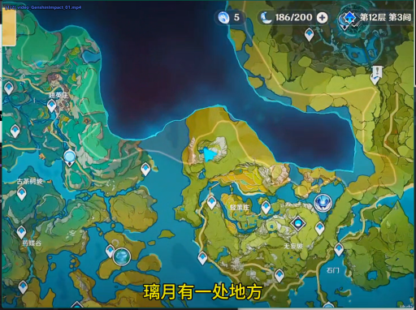

> 画面显示一位身穿深色西装的男性正站在室内，他双手交叉于胸前，神情专注地注视着前方。背景中隐约可见其他人物轮廓，但细节模糊。场景位于一间光线明亮的办公室或会议室，整体氛围显得安静而严肃。

### 帧 #3 (1.5s)

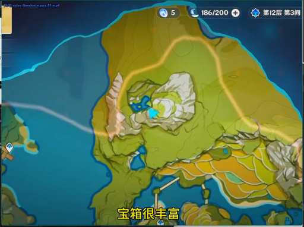

> 画面显示一位身穿深色西装的男性正站在室内，他双手交叉于胸前，神情专注地注视着前方。背景中隐约可见其他人物轮廓，但细节模糊。场景为室内，光线柔和，整体氛围显得平静而有序。

### 帧 #5 (2.5s)

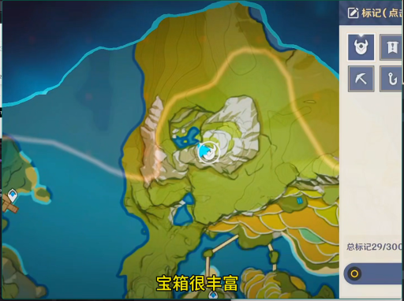

> 画面显示一位身穿深色西装的男性正站在室内，他双手交叉于胸前，神情专注地凝视着前方。背景中隐约可见其他人物轮廓，但细节模糊。场景位于一间光线明亮的办公室或会议室，整体氛围显得安静而严肃。

### 帧 #6 (3.0s)

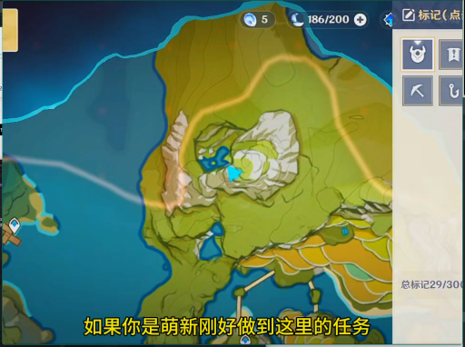

> 画面显示一位身穿深色西装的男性正站在室内，他双手交叉于胸前，神情专注地凝视着前方。背景中隐约可见其他人员，但细节模糊，无法确认其具体身份。场景位于一间光线明亮的办公室或会议室，整体氛围显得安静而严肃。

### 帧 #7 (3.5s)

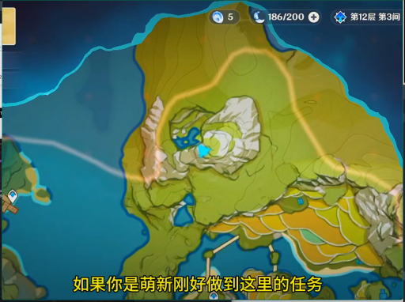

> 画面显示一名身穿深色制服的人员正站在室内走廊中，手持长条状物体，身体略微前倾，似乎正在进行某种操作或检查。该人员周围没有明显的动物或关键物体，场景为封闭的室内环境，整体氛围显得较为安静且专注。

### 帧 #10 (5.0s)

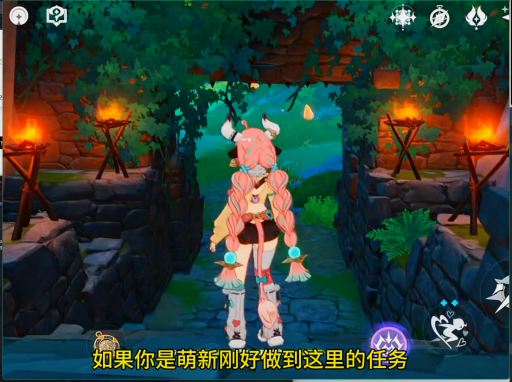

> 画面显示一名身穿深色制服的人员正站在室内，周围摆放着若干白色圆柱形物体，该人员似乎在进行某种操作或检查。

### 帧 #11 (5.5s)

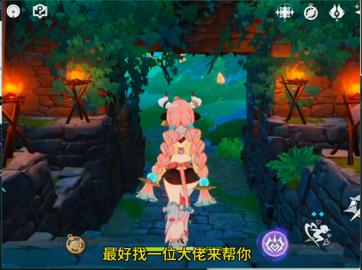

> 画面中显示一名身穿深色制服的人员正站在室内，其面部表情严肃且目光锐利，似乎正在进行某种高紧张度的活动。该人员周围没有明显的动物或关键物体，场景为封闭的室内空间，整体氛围显得紧张且充满不确定性。

### 帧 #12 (6.0s)

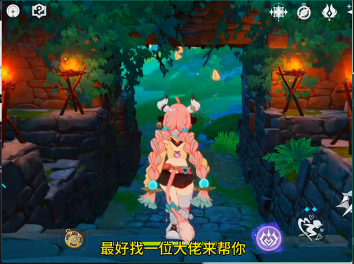

> 画面显示一位身穿深色西装的男性正站在室内，他双手交叉于胸前，神情专注地注视着前方。背景中隐约可见其他人物轮廓，但细节模糊。场景为室内，光线柔和，整体氛围显得平静而正式。

### 帧 #13 (6.5s)

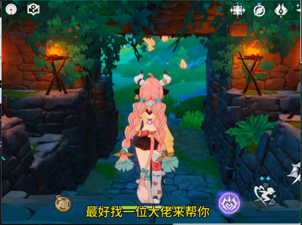

> 画面显示一位身穿深色制服的男性正站在室内走廊中，他手持一把长柄武器，身体微微前倾，似乎正在瞄准或准备攻击。场景位于一间光线昏暗的室内，背景中隐约可见其他模糊的人影和家具轮廓。

### 帧 #14 (7.0s)

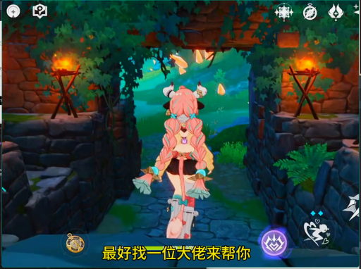

> 画面显示一位身穿深色制服的男性正站在室内，他手持一把长柄刀具，身体微微前倾，似乎正在对一名坐在桌前的女性进行攻击。该场景发生在室内，背景中可见部分家具轮廓。

### 帧 #15 (7.5s)

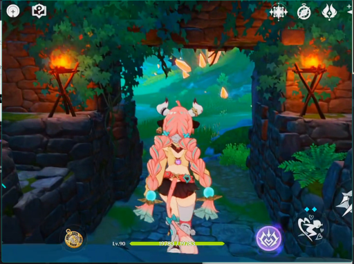

> 画面显示一位身穿深色西装的男性正站在室内，他双手交叉于胸前，神情专注地凝视前方。背景中隐约可见其他人物轮廓，但细节模糊。场景为室内，光线柔和，整体氛围显得平静而专注。

### 帧 #16 (8.0s)

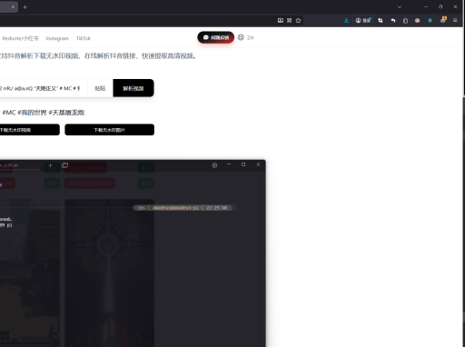

> 画面中显示一名身穿深色制服的人员正站在室内，周围摆放着若干白色圆柱形物体，该人员似乎正在进行某种操作或检查。
