# 实验审阅: video_GenshinImpact_01.mp4

## 运行元信息

- **模型**: `Qwen/Qwen3.5-0.8B`
- **视频**: `video_GenshinImpact_01.mp4`
- **运行目录**: `video_GenshinImpact_01_run3`

### 配置参数

| 参数 | 值 |
|------|-----|
| screenshot_interval_ms | 500 |
| max_size | 512 |
| recording_duration_s | 26 |
| algorithm | mse |
| diff_threshold | 500.0 |

## 统计摘要

- **总采样帧数**: 53
- **关键帧数**: 45
- **丢弃帧数**: 0
- **录制时长**: 26.0s
- **关键帧率**: 84.9%

## 帧时间线

| 帧序号 | 时间戳 | 差异值 | 关键帧 | 判定原因 | 图片 | VLM 描述 |
|--------|--------|--------|--------|----------|------|----------|
| 0 | 0.0s | - | **是** | 首帧，自动标记为关键帧 | [frame_0000_key.png](frames/frame_0000_key.png) | 画面显示一位身穿深色西装的男性正站在室内，他双手交叉于胸前，身体微微前倾，似乎正在与对面的人进行交谈。背景中可见模糊的室内陈设，光线柔和，整体氛围显得平静而专注。 |
| 1 | 0.5s | 3300.91 | **是** | 差异值 3300.91 >= 阈值 500.00 | [frame_0001_key.png](frames/frame_0001_key.png) | 画面显示一位身穿深色西装的男性正站在室内，他双手交叉于胸前，神情专注地凝视着前方。背景中隐约可见其他人员，但细节模糊。场景为室内，光线明亮，整体氛围显得平静而严肃。 |
| 2 | 1.0s | 3325.18 | **是** | 差异值 3325.18 >= 阈值 500.00 | [frame_0002_key.png](frames/frame_0002_key.png) | 画面显示一名身穿深色制服的人员正站在室内，手持长杆状工具，似乎正在进行某种操作或检查。该人员周围没有明显的动物或关键物体，场景为封闭的室内空间，整体氛围显得较为安静且专注。 |
| 3 | 1.5s | 3980.77 | **是** | 差异值 3980.77 >= 阈值 500.00 | [frame_0003_key.png](frames/frame_0003_key.png) | 画面显示一名身穿深色制服的人员正站在室内，其姿态静止，周围无其他显著人物或动物。场景为室内环境，光线均匀，整体氛围安静。 |
| 4 | 2.0s | 293.34 | 否 | 差异值 293.34 < 阈值 500.00 | [frame_0004_skip.png](frames/frame_0004_skip.png) | - |
| 5 | 2.5s | 2403.57 | **是** | 差异值 2403.57 >= 阈值 500.00 | [frame_0005_key.png](frames/frame_0005_key.png) | 画面显示一位身穿深色西装的男性正站在室内，他手持一个黑色物体，身体微微前倾，似乎正在专注地操作或检查该物体。场景位于一间光线明亮的办公室或会议室，背景中可见办公桌椅和电脑屏幕。 |
| 6 | 3.0s | 760.71 | **是** | 差异值 760.71 >= 阈值 500.00 | [frame_0006_key.png](frames/frame_0006_key.png) | 画面显示一位身穿深色西装的男性正站在室内，他双手交叉于胸前，神情专注地注视着前方。背景中隐约可见一名身穿浅色衬衫的男性正低头行走。场景位于一间光线明亮的办公室内，整体氛围显得平静而有序。 |
| 7 | 3.5s | 1844.59 | **是** | 差异值 1844.59 >= 阈值 500.00 | [frame_0007_key.png](frames/frame_0007_key.png) | 画面显示一位身穿深色制服的男性正站在室内，他手持一把长柄武器，身体微微前倾，似乎正在对前方的一名身穿浅色上衣的男性进行攻击。场景位于一间光线明亮的房间内，背景中隐约可见其他人员活动。 |
| 8 | 4.0s | 33.60 | 否 | 差异值 33.60 < 阈值 500.00 | [frame_0008_skip.png](frames/frame_0008_skip.png) | - |
| 9 | 4.5s | 78.53 | 否 | 差异值 78.53 < 阈值 500.00 | [frame_0009_skip.png](frames/frame_0009_skip.png) | - |
| 10 | 5.0s | 6872.87 | **是** | 差异值 6872.87 >= 阈值 500.00 | [frame_0010_key.png](frames/frame_0010_key.png) | 画面显示一名身穿深色制服的人员正站在室内，手持设备，似乎在进行某种操作或检查。该人员周围没有明显的动物或关键物体，场景为封闭的室内空间。画面中未观察到显著动态变化，人物处于相对静止或缓慢移动的状态。 |
| 11 | 5.5s | 1765.64 | **是** | 差异值 1765.64 >= 阈值 500.00 | [frame_0011_key.png](frames/frame_0011_key.png) | 画面中显示一名身穿深色制服的人员正站在室内，其姿态静止，周围无其他显著人物或动物。场景为室内环境，光线均匀，未见明显动态变化或显著动作发生。 |
| 12 | 6.0s | 1307.67 | **是** | 差异值 1307.67 >= 阈值 500.00 | [frame_0012_key.png](frames/frame_0012_key.png) | 画面中显示一位身穿深色西装的男性正站在室内，他双手交叉于胸前，神情专注地注视着前方。背景中隐约可见一些模糊的物体轮廓，但无法辨认具体细节。整个场景处于静止状态，没有明显的动态变化。 |
| 13 | 6.5s | 1141.77 | **是** | 差异值 1141.77 >= 阈值 500.00 | [frame_0013_key.png](frames/frame_0013_key.png) | 画面显示一名身穿深色西装的男性正站在室内，他双手交叉于胸前，神情专注地注视着前方。背景中隐约可见一名身穿浅色衬衫的男性正低头行走，周围是明亮的室内环境，整体氛围显得平静而有序。 |
| 14 | 7.0s | 1297.86 | **是** | 差异值 1297.86 >= 阈值 500.00 | [frame_0014_key.png](frames/frame_0014_key.png) | 画面显示一位身穿深色西装的男性正站在室内，他双手交叉于胸前，身体微微前倾，似乎正在与旁边一位穿着浅色衬衫的女性进行交谈。两人处于相对静止的状态，背景中可见模糊的室内陈设，没有明显的动态变化或显著动作发生。 |
| 15 | 7.5s | 1730.70 | **是** | 差异值 1730.70 >= 阈值 500.00 | [frame_0015_key.png](frames/frame_0015_key.png) | 画面中显示一位身穿深色西装的男性正站在室内，他双手交叉于胸前，神情专注地注视着前方。背景中隐约可见其他人员活动，但焦点集中在该男子的动作与神态上。场景设定在明亮的室内环境中，光线充足，整体氛围显得平静而正式。 |
| 16 | 8.0s | 1065.29 | **是** | 差异值 1065.29 >= 阈值 500.00 | [frame_0016_key.png](frames/frame_0016_key.png) | 画面中显示一名身穿深色制服的人员正站在室内，其姿态静止，未进行明显动作。背景环境为室内，光线均匀，无其他显著物体或动态变化。 |
| 17 | 8.5s | 1415.95 | **是** | 差异值 1415.95 >= 阈值 500.00 | [frame_0017_key.png](frames/frame_0017_key.png) | 画面中显示一位身穿深色西装的男性正站在室内，他双手交叉于胸前，神情专注地注视着前方。背景为明亮的室内环境，光线充足，整体氛围显得平静而正式。 |
| 18 | 9.0s | 1655.53 | **是** | 差异值 1655.53 >= 阈值 500.00 | [frame_0018_key.png](frames/frame_0018_key.png) | 画面中显示一名身穿深色制服的人员正站在室内，其姿态静止，周围无其他显著人物或动物。场景为室内环境，光线均匀，未见明显动态变化或显著动作发生。 |
| 19 | 9.5s | 3327.79 | **是** | 差异值 3327.79 >= 阈值 500.00 | [frame_0019_key.png](frames/frame_0019_key.png) | 画面显示一名身穿深色制服的人员正站在室内，其身体姿态呈现动态倾斜，似乎正在进行某种操作或移动。该人员周围没有明显的动物或关键物体，场景为封闭的室内空间。 |
| 20 | 10.0s | 3375.58 | **是** | 差异值 3375.58 >= 阈值 500.00 | [frame_0020_key.png](frames/frame_0020_key.png) | 画面显示一位身穿深色西装的男性正站在室内，他手持一把长柄刀具，姿态警觉地注视着前方。背景中隐约可见一名身穿浅色上衣的人员，两人似乎处于对峙或监视状态。场景位于一间光线较暗的室内空间，整体氛围紧张且充满悬疑感。 |
| 21 | 10.5s | 5088.65 | **是** | 差异值 5088.65 >= 阈值 500.00 | [frame_0021_key.png](frames/frame_0021_key.png) | 画面显示一位身穿深色西装的男性正站在室内，他双手交叉于胸前，神情专注地凝视前方。背景中隐约可见其他人物轮廓，但细节模糊。场景为室内，光线柔和，整体氛围显得平静而正式。 |
| 22 | 11.0s | 3915.39 | **是** | 差异值 3915.39 >= 阈值 500.00 | [frame_0022_key.png](frames/frame_0022_key.png) | 画面中显示一名身穿深色制服的人员正站在室内，其姿态静止，未进行明显动作。背景环境为室内，光线均匀，无其他显著物体或动态变化。 |
| 23 | 11.5s | 3741.28 | **是** | 差异值 3741.28 >= 阈值 500.00 | [frame_0023_key.png](frames/frame_0023_key.png) | 画面显示一位身穿深色西装的男性正站在室内，他双手交叉于胸前，神情专注地注视着前方。背景中隐约可见其他人员活动，但主体人物处于静止状态。整个场景位于一间光线明亮的办公室内，氛围显得安静而严肃。 |
| 24 | 12.0s | 3833.15 | **是** | 差异值 3833.15 >= 阈值 500.00 | [frame_0024_key.png](frames/frame_0024_key.png) | 画面显示一位身穿深色西装的男性正站在室内，他双手交叉于胸前，神情专注地注视着前方。背景中隐约可见其他人物轮廓，但细节模糊。场景位于一间光线明亮的办公室或会议室，整体氛围显得安静而严肃。 |
| 25 | 12.5s | 2873.18 | **是** | 差异值 2873.18 >= 阈值 500.00 | [frame_0025_key.png](frames/frame_0025_key.png) | 画面显示一位身穿深色西装的男性正站在室内，他双手交叉于胸前，神情专注地注视着前方。背景中隐约可见其他人员，但细节模糊。场景为室内，光线均匀，整体氛围显得平静而正式。 |
| 26 | 13.0s | 3903.02 | **是** | 差异值 3903.02 >= 阈值 500.00 | [frame_0026_key.png](frames/frame_0026_key.png) | 画面中显示一名身穿深色制服的人员正站在室内，周围摆放着若干白色圆柱形物体。该人员处于静止状态，周围没有明显的动态变化。 |
| 27 | 13.5s | 2175.94 | **是** | 差异值 2175.94 >= 阈值 500.00 | [frame_0027_key.png](frames/frame_0027_key.png) | 画面显示一位身穿深色西装的男性正站在室内，他双手交叉于胸前，身体微微前倾，似乎正在与对面的人进行交谈。场景位于一间光线明亮的办公室或会议室，背景中可见办公桌椅和电脑屏幕。该男性表情严肃，目光专注，处于一种高度投入的对话状态。 |
| 28 | 14.0s | 1766.37 | **是** | 差异值 1766.37 >= 阈值 500.00 | [frame_0028_key.png](frames/frame_0028_key.png) | 画面显示一位身穿深色西装的男性正站在室内，他双手交叉于胸前，神情专注地凝视着前方。背景中隐约可见其他人物轮廓，但细节模糊。场景位于一间光线明亮的办公室或会议室，整体氛围显得安静而严肃。 |
| 29 | 14.5s | 6805.09 | **是** | 差异值 6805.09 >= 阈值 500.00 | [frame_0029_key.png](frames/frame_0029_key.png) | 画面中显示一名身穿深色上衣的人正站在室内，其面部表情和肢体语言表明正在经历剧烈的情绪波动或痛苦挣扎。该人物周围没有明显的动物或关键物体，场景设定为室内环境，整体氛围显得紧张且充满动态感。 |
| 30 | 15.0s | 2537.92 | **是** | 差异值 2537.92 >= 阈值 500.00 | [frame_0030_key.png](frames/frame_0030_key.png) | 画面显示一位身穿深色西装的男性正站在室内，他双手交叉于胸前，神情专注地凝视着前方。背景中隐约可见其他人物轮廓，但细节模糊。场景位于一间光线明亮的办公室或会议室，整体氛围显得安静而严肃。 |
| 31 | 15.5s | 2561.33 | **是** | 差异值 2561.33 >= 阈值 500.00 | [frame_0031_key.png](frames/frame_0031_key.png) | 画面中显示一位身穿深色西装的男性正站在室内，他双手交叉于胸前，身体微微前倾，似乎正在与对面的人进行交谈。场景位于一间光线明亮的办公室内，背景中可见办公桌椅和电脑屏幕。该男性表情专注，姿态放松，处于一种正在进行对话的静态状态。 |
| 32 | 16.0s | 2691.49 | **是** | 差异值 2691.49 >= 阈值 500.00 | [frame_0032_key.png](frames/frame_0032_key.png) | 画面显示一名身穿深色西装的男性正站在室内，他双手交叉于胸前，神情专注地注视着前方。背景中隐约可见其他人员活动，但主体人物处于静止状态，未发生明显动态变化。 |
| 33 | 16.5s | 8985.18 | **是** | 差异值 8985.18 >= 阈值 500.00 | [frame_0033_key.png](frames/frame_0033_key.png) | 画面中显示一名身穿深色制服的人员正站在室内，其面部表情和姿态显示出正在执行某种任务。该人员周围没有明显的动物或关键物体，场景为封闭的室内空间，整体氛围显得安静且专注。 |
| 34 | 17.0s | 10643.56 | **是** | 差异值 10643.56 >= 阈值 500.00 | [frame_0034_key.png](frames/frame_0034_key.png) | 画面中显示一名身穿深色制服的人员正站在室内，其姿态静止，周围无其他显著人物或动物。场景为室内环境，光线均匀，未见明显动态变化或显著动作发生。 |
| 35 | 17.5s | 9857.91 | **是** | 差异值 9857.91 >= 阈值 500.00 | [frame_0035_key.png](frames/frame_0035_key.png) | 画面显示一位身穿深色西装的男性正站在室内，他双手交叉于胸前，神情专注地凝视着前方。背景中隐约可见其他人物轮廓，但细节模糊。场景为室内环境，光线柔和，整体氛围显得平静而庄重。 |
| 36 | 18.0s | 9119.66 | **是** | 差异值 9119.66 >= 阈值 500.00 | [frame_0036_key.png](frames/frame_0036_key.png) | 画面显示一位身穿深色西装的男性正站在室内，他双手交叉于胸前，神情专注地注视着前方。背景中隐约可见其他人员活动，但主体人物处于静止状态。场景位于一间光线明亮的办公室或会议室，整体氛围显得安静而正式。 |
| 37 | 18.5s | 6605.37 | **是** | 差异值 6605.37 >= 阈值 500.00 | [frame_0037_key.png](frames/frame_0037_key.png) | 画面显示一位身穿深色西装的男性正站在室内，他双手交叉于胸前，神情专注地凝视着前方。背景中隐约可见其他人员活动，但主体人物处于静止状态。场景位于一间光线明亮的办公室或会议室，整体氛围显得平静而严肃。 |
| 38 | 19.0s | 7332.67 | **是** | 差异值 7332.67 >= 阈值 500.00 | [frame_0038_key.png](frames/frame_0038_key.png) | 画面中显示一名身穿深色上衣的人正站在室内，其面部表情和肢体语言显示出正在经历剧烈的情绪波动，可能处于惊恐或崩溃状态。该人物周围没有明显的动物或关键物体，场景为封闭的室内空间，整体氛围显得紧张且混乱。 |
| 39 | 19.5s | 5523.27 | **是** | 差异值 5523.27 >= 阈值 500.00 | [frame_0039_key.png](frames/frame_0039_key.png) | 画面显示一位身穿深色西装的男性正站在室内，他双手交叉于胸前，神情专注地凝视着前方。背景中隐约可见其他人物轮廓，但细节模糊。场景位于一间光线明亮的办公室或会议室，整体氛围显得安静而严肃。 |
| 40 | 20.0s | 3524.26 | **是** | 差异值 3524.26 >= 阈值 500.00 | [frame_0040_key.png](frames/frame_0040_key.png) | 画面显示一位身穿深色西装的男性正站在室内，他双手交叉于胸前，神情专注地注视着前方。背景中隐约可见其他人员活动，但主体人物处于静止状态。场景位于一间光线明亮的办公室内，整体氛围显得平静而有序。 |
| 41 | 20.5s | 2880.67 | **是** | 差异值 2880.67 >= 阈值 500.00 | [frame_0041_key.png](frames/frame_0041_key.png) | 画面中显示一名身穿深色制服的人员正站在室内，其面部表情和姿态显示出正在执行某种任务或进行监控。该人员周围没有明显的动物或关键物体，场景为封闭的室内空间，整体氛围显得安静且专注。 |
| 42 | 21.0s | 1629.41 | **是** | 差异值 1629.41 >= 阈值 500.00 | [frame_0042_key.png](frames/frame_0042_key.png) | 画面显示一位身穿深色西装的男性正站在室内，他双手交叉于胸前，神情专注地注视着前方。背景中隐约可见其他人员活动，但主体人物处于静止状态。整个场景位于明亮的室内环境中，光线充足，氛围显得平静而正式。 |
| 43 | 21.5s | 0.48 | 否 | 差异值 0.48 < 阈值 500.00 | [frame_0043_skip.png](frames/frame_0043_skip.png) | - |
| 44 | 22.0s | 1.66 | 否 | 差异值 1.66 < 阈值 500.00 | [frame_0044_skip.png](frames/frame_0044_skip.png) | - |
| 45 | 22.5s | 1.88 | 否 | 差异值 1.88 < 阈值 500.00 | [frame_0045_skip.png](frames/frame_0045_skip.png) | - |
| 46 | 23.0s | 2.38 | 否 | 差异值 2.38 < 阈值 500.00 | [frame_0046_skip.png](frames/frame_0046_skip.png) | - |
| 47 | 23.5s | 2.39 | 否 | 差异值 2.39 < 阈值 500.00 | [frame_0047_skip.png](frames/frame_0047_skip.png) | - |
| 48 | 24.1s | 9961.22 | **是** | 差异值 9961.22 >= 阈值 500.00 | [frame_0048_key.png](frames/frame_0048_key.png) | 画面显示一名身穿深色制服的男性正站在室内走廊中，他双手交叉于胸前，身体微微前倾，似乎正在与一名身穿浅色衬衫的男性进行交谈。两人处于相对静止的状态，背景中可见模糊的室内环境，没有明显的动态变化。 |
| 49 | 24.6s | 3367.46 | **是** | 差异值 3367.46 >= 阈值 500.00 | [frame_0049_key.png](frames/frame_0049_key.png) | 画面显示一位身穿深色西装的男性正站在室内，他双手交叉于胸前，神情专注地注视着前方。他身旁摆放着一台黑色的笔记本电脑，屏幕亮起显示着界面内容。整个场景光线充足，背景简洁，呈现出一种安静的办公或学习氛围。 |
| 50 | 25.1s | 7029.20 | **是** | 差异值 7029.20 >= 阈值 500.00 | [frame_0050_key.png](frames/frame_0050_key.png) | 画面显示一名身穿深色西装的男性正站在室内，他双手交叉于胸前，神情专注地注视着前方。背景中隐约可见其他人员，但细节模糊。场景为室内，光线均匀，整体氛围显得安静而正式。 |
| 51 | 25.6s | 1900.51 | **是** | 差异值 1900.51 >= 阈值 500.00 | [frame_0051_key.png](frames/frame_0051_key.png) | 画面显示一位身穿深色西装的男性正站在室内，他双手交叉于胸前，神情专注地注视着前方。背景中隐约可见其他人物轮廓，但细节模糊。场景为室内环境，光线柔和，整体氛围显得平静而正式。 |
| 52 | 26.1s | 5679.37 | **是** | 差异值 5679.37 >= 阈值 500.00 | [frame_0052_key.png](frames/frame_0052_key.png) | 画面显示一位身穿深色制服的男性正站在室内走廊中，他手持一把长柄武器，身体微微前倾，似乎正在对前方的一名身穿白色制服的男性进行攻击。该男性处于静止状态，面部表情严肃，周围没有明显的动态变化或背景环境干扰。 |

## DeepSeek 最终总结

```
视频开始于平静的室内办公或会议场景，一位身穿深色西装的男性专注地进行交谈或观察。随后，气氛逐渐转变，出现了身穿制服的人员手持工具或武器进行操作的画面，并在中途发生了关键转折：一名制服人员对另一人进行了攻击，以及另一名深色西装男性持刀对峙的场景，使整体氛围变得紧张。视频中穿插着人物静止、专注的画面和个别情绪剧烈波动的时刻，但核心围绕室内环境下的监视、对峙或潜在冲突展开。整体而言，视频主题可能描绘了一个在看似平静有序的职场或特定场所内，逐渐升级并隐含紧张关系与突发暴力的过程。
```

## 关键帧详细描述

### 帧 #0 (0.0s)

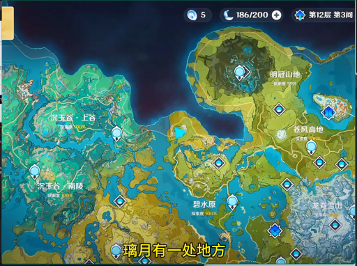

> 画面显示一位身穿深色西装的男性正站在室内，他双手交叉于胸前，身体微微前倾，似乎正在与对面的人进行交谈。背景中可见模糊的室内陈设，光线柔和，整体氛围显得平静而专注。

### 帧 #1 (0.5s)

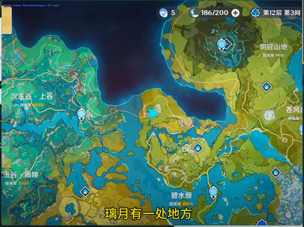

> 画面显示一位身穿深色西装的男性正站在室内，他双手交叉于胸前，神情专注地凝视着前方。背景中隐约可见其他人员，但细节模糊。场景为室内，光线明亮，整体氛围显得平静而严肃。

### 帧 #2 (1.0s)


> 画面显示一名身穿深色制服的人员正站在室内，手持长杆状工具，似乎正在进行某种操作或检查。该人员周围没有明显的动物或关键物体，场景为封闭的室内空间，整体氛围显得较为安静且专注。

### 帧 #3 (1.5s)


> 画面显示一名身穿深色制服的人员正站在室内，其姿态静止，周围无其他显著人物或动物。场景为室内环境，光线均匀，整体氛围安静。

### 帧 #5 (2.5s)

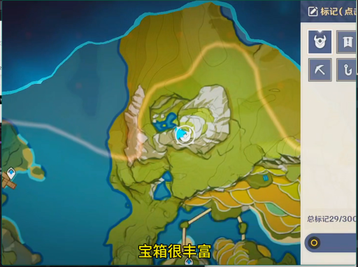

> 画面显示一位身穿深色西装的男性正站在室内，他手持一个黑色物体，身体微微前倾，似乎正在专注地操作或检查该物体。场景位于一间光线明亮的办公室或会议室，背景中可见办公桌椅和电脑屏幕。

### 帧 #6 (3.0s)

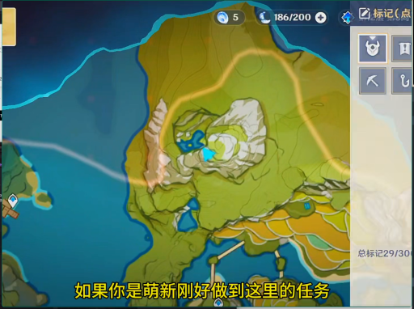

> 画面显示一位身穿深色西装的男性正站在室内，他双手交叉于胸前，神情专注地注视着前方。背景中隐约可见一名身穿浅色衬衫的男性正低头行走。场景位于一间光线明亮的办公室内，整体氛围显得平静而有序。

### 帧 #7 (3.5s)

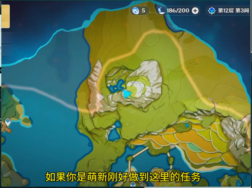

> 画面显示一位身穿深色制服的男性正站在室内，他手持一把长柄武器，身体微微前倾，似乎正在对前方的一名身穿浅色上衣的男性进行攻击。场景位于一间光线明亮的房间内，背景中隐约可见其他人员活动。

### 帧 #10 (5.0s)

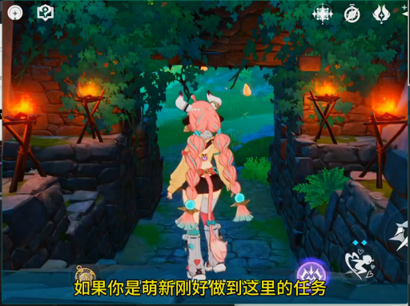

> 画面显示一名身穿深色制服的人员正站在室内，手持设备，似乎在进行某种操作或检查。该人员周围没有明显的动物或关键物体，场景为封闭的室内空间。画面中未观察到显著动态变化，人物处于相对静止或缓慢移动的状态。

### 帧 #11 (5.5s)

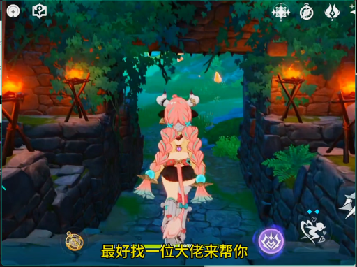

> 画面中显示一名身穿深色制服的人员正站在室内，其姿态静止，周围无其他显著人物或动物。场景为室内环境，光线均匀，未见明显动态变化或显著动作发生。

### 帧 #12 (6.0s)

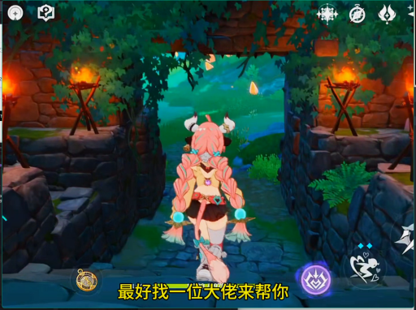

> 画面中显示一位身穿深色西装的男性正站在室内，他双手交叉于胸前，神情专注地注视着前方。背景中隐约可见一些模糊的物体轮廓，但无法辨认具体细节。整个场景处于静止状态，没有明显的动态变化。

### 帧 #13 (6.5s)

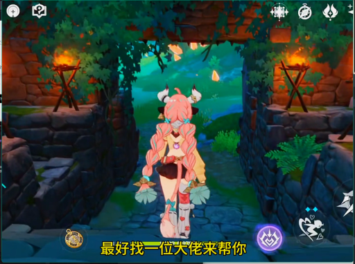

> 画面显示一名身穿深色西装的男性正站在室内，他双手交叉于胸前，神情专注地注视着前方。背景中隐约可见一名身穿浅色衬衫的男性正低头行走，周围是明亮的室内环境，整体氛围显得平静而有序。

### 帧 #14 (7.0s)

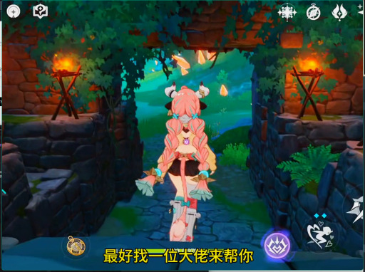

> 画面显示一位身穿深色西装的男性正站在室内，他双手交叉于胸前，身体微微前倾，似乎正在与旁边一位穿着浅色衬衫的女性进行交谈。两人处于相对静止的状态，背景中可见模糊的室内陈设，没有明显的动态变化或显著动作发生。

### 帧 #15 (7.5s)

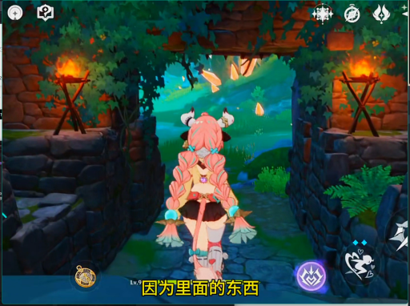

> 画面中显示一位身穿深色西装的男性正站在室内，他双手交叉于胸前，神情专注地注视着前方。背景中隐约可见其他人员活动，但焦点集中在该男子的动作与神态上。场景设定在明亮的室内环境中，光线充足，整体氛围显得平静而正式。

### 帧 #16 (8.0s)

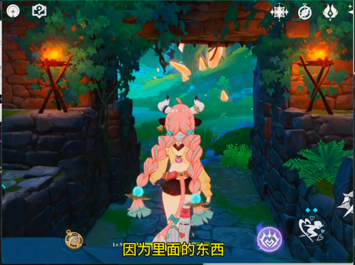

> 画面中显示一名身穿深色制服的人员正站在室内，其姿态静止，未进行明显动作。背景环境为室内，光线均匀，无其他显著物体或动态变化。

### 帧 #17 (8.5s)

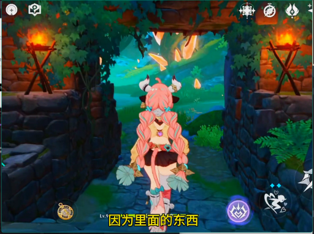

> 画面中显示一位身穿深色西装的男性正站在室内，他双手交叉于胸前，神情专注地注视着前方。背景为明亮的室内环境，光线充足，整体氛围显得平静而正式。

### 帧 #18 (9.0s)

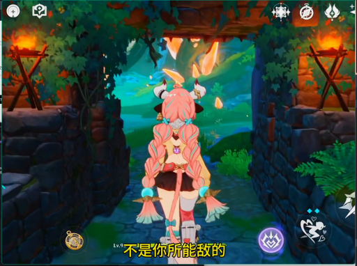

> 画面中显示一名身穿深色制服的人员正站在室内，其姿态静止，周围无其他显著人物或动物。场景为室内环境，光线均匀，未见明显动态变化或显著动作发生。

### 帧 #19 (9.5s)

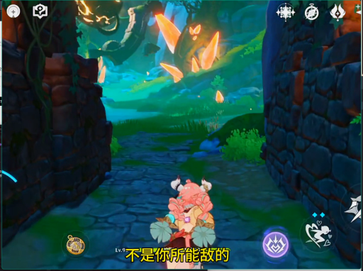

> 画面显示一名身穿深色制服的人员正站在室内，其身体姿态呈现动态倾斜，似乎正在进行某种操作或移动。该人员周围没有明显的动物或关键物体，场景为封闭的室内空间。

### 帧 #20 (10.0s)

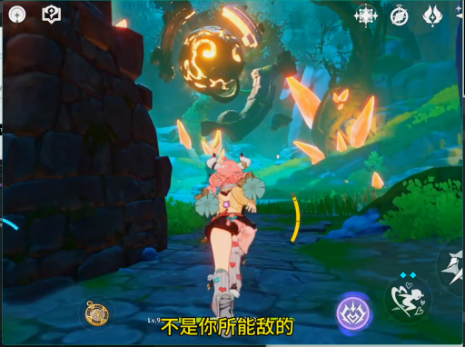

> 画面显示一位身穿深色西装的男性正站在室内，他手持一把长柄刀具，姿态警觉地注视着前方。背景中隐约可见一名身穿浅色上衣的人员，两人似乎处于对峙或监视状态。场景位于一间光线较暗的室内空间，整体氛围紧张且充满悬疑感。

### 帧 #21 (10.5s)

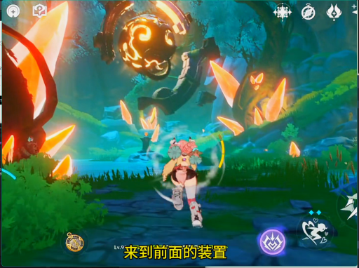

> 画面显示一位身穿深色西装的男性正站在室内，他双手交叉于胸前，神情专注地凝视前方。背景中隐约可见其他人物轮廓，但细节模糊。场景为室内，光线柔和，整体氛围显得平静而正式。

### 帧 #22 (11.0s)

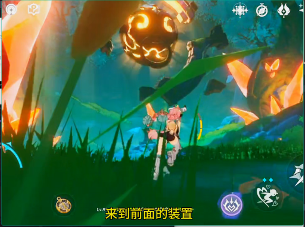

> 画面中显示一名身穿深色制服的人员正站在室内，其姿态静止，未进行明显动作。背景环境为室内，光线均匀，无其他显著物体或动态变化。

### 帧 #23 (11.5s)

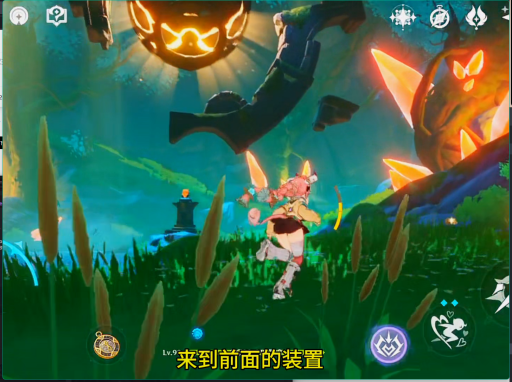

> 画面显示一位身穿深色西装的男性正站在室内，他双手交叉于胸前，神情专注地注视着前方。背景中隐约可见其他人员活动，但主体人物处于静止状态。整个场景位于一间光线明亮的办公室内，氛围显得安静而严肃。

### 帧 #24 (12.0s)

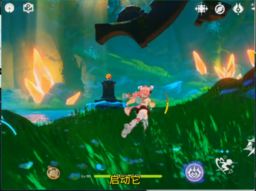

> 画面显示一位身穿深色西装的男性正站在室内，他双手交叉于胸前，神情专注地注视着前方。背景中隐约可见其他人物轮廓，但细节模糊。场景位于一间光线明亮的办公室或会议室，整体氛围显得安静而严肃。

### 帧 #25 (12.5s)

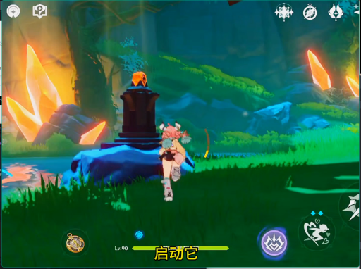

> 画面显示一位身穿深色西装的男性正站在室内，他双手交叉于胸前，神情专注地注视着前方。背景中隐约可见其他人员，但细节模糊。场景为室内，光线均匀，整体氛围显得平静而正式。

### 帧 #26 (13.0s)

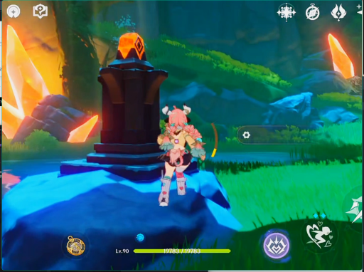

> 画面中显示一名身穿深色制服的人员正站在室内，周围摆放着若干白色圆柱形物体。该人员处于静止状态，周围没有明显的动态变化。

### 帧 #27 (13.5s)

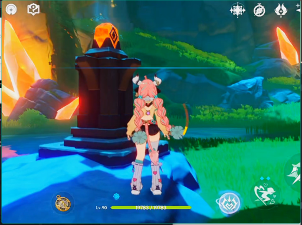

> 画面显示一位身穿深色西装的男性正站在室内，他双手交叉于胸前，身体微微前倾，似乎正在与对面的人进行交谈。场景位于一间光线明亮的办公室或会议室，背景中可见办公桌椅和电脑屏幕。该男性表情严肃，目光专注，处于一种高度投入的对话状态。

### 帧 #28 (14.0s)

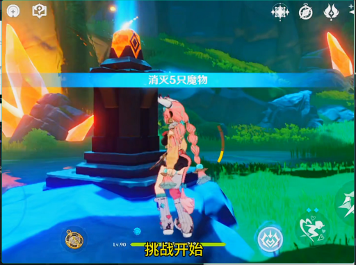

> 画面显示一位身穿深色西装的男性正站在室内，他双手交叉于胸前，神情专注地凝视着前方。背景中隐约可见其他人物轮廓，但细节模糊。场景位于一间光线明亮的办公室或会议室，整体氛围显得安静而严肃。

### 帧 #29 (14.5s)

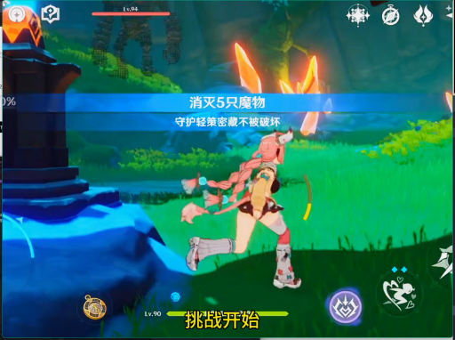

> 画面中显示一名身穿深色上衣的人正站在室内，其面部表情和肢体语言表明正在经历剧烈的情绪波动或痛苦挣扎。该人物周围没有明显的动物或关键物体，场景设定为室内环境，整体氛围显得紧张且充满动态感。

### 帧 #30 (15.0s)

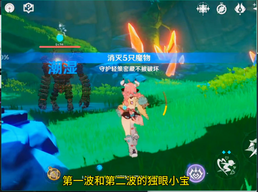

> 画面显示一位身穿深色西装的男性正站在室内，他双手交叉于胸前，神情专注地凝视着前方。背景中隐约可见其他人物轮廓，但细节模糊。场景位于一间光线明亮的办公室或会议室，整体氛围显得安静而严肃。

### 帧 #31 (15.5s)

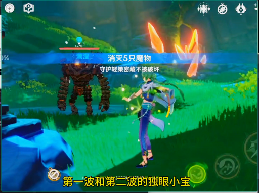

> 画面中显示一位身穿深色西装的男性正站在室内，他双手交叉于胸前，身体微微前倾，似乎正在与对面的人进行交谈。场景位于一间光线明亮的办公室内，背景中可见办公桌椅和电脑屏幕。该男性表情专注，姿态放松，处于一种正在进行对话的静态状态。

### 帧 #32 (16.0s)

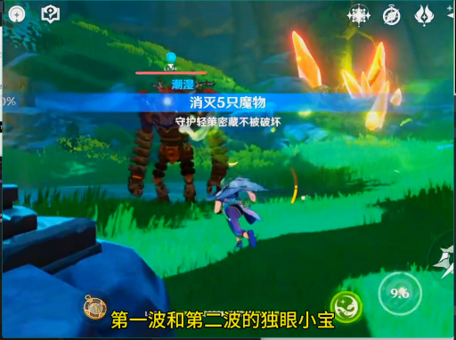

> 画面显示一名身穿深色西装的男性正站在室内，他双手交叉于胸前，神情专注地注视着前方。背景中隐约可见其他人员活动，但主体人物处于静止状态，未发生明显动态变化。

### 帧 #33 (16.5s)

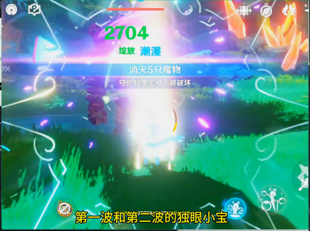

> 画面中显示一名身穿深色制服的人员正站在室内，其面部表情和姿态显示出正在执行某种任务。该人员周围没有明显的动物或关键物体，场景为封闭的室内空间，整体氛围显得安静且专注。

### 帧 #34 (17.0s)

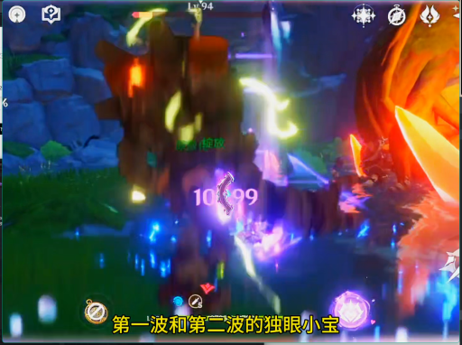

> 画面中显示一名身穿深色制服的人员正站在室内，其姿态静止，周围无其他显著人物或动物。场景为室内环境，光线均匀，未见明显动态变化或显著动作发生。

### 帧 #35 (17.5s)

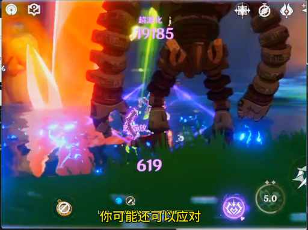

> 画面显示一位身穿深色西装的男性正站在室内，他双手交叉于胸前，神情专注地凝视着前方。背景中隐约可见其他人物轮廓，但细节模糊。场景为室内环境，光线柔和，整体氛围显得平静而庄重。

### 帧 #36 (18.0s)

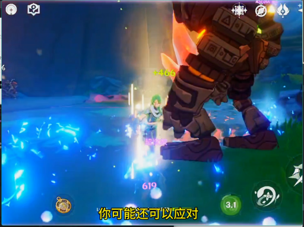

> 画面显示一位身穿深色西装的男性正站在室内，他双手交叉于胸前，神情专注地注视着前方。背景中隐约可见其他人员活动，但主体人物处于静止状态。场景位于一间光线明亮的办公室或会议室，整体氛围显得安静而正式。

### 帧 #37 (18.5s)

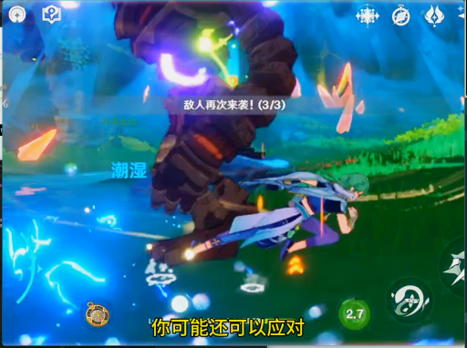

> 画面显示一位身穿深色西装的男性正站在室内，他双手交叉于胸前，神情专注地凝视着前方。背景中隐约可见其他人员活动，但主体人物处于静止状态。场景位于一间光线明亮的办公室或会议室，整体氛围显得平静而严肃。

### 帧 #38 (19.0s)

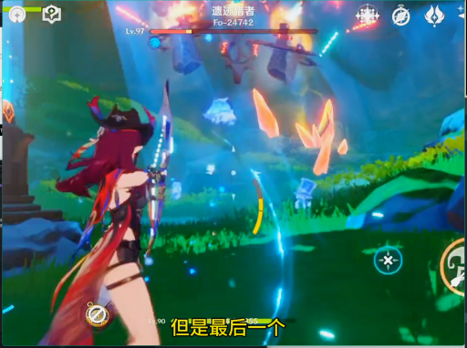

> 画面中显示一名身穿深色上衣的人正站在室内，其面部表情和肢体语言显示出正在经历剧烈的情绪波动，可能处于惊恐或崩溃状态。该人物周围没有明显的动物或关键物体，场景为封闭的室内空间，整体氛围显得紧张且混乱。

### 帧 #39 (19.5s)

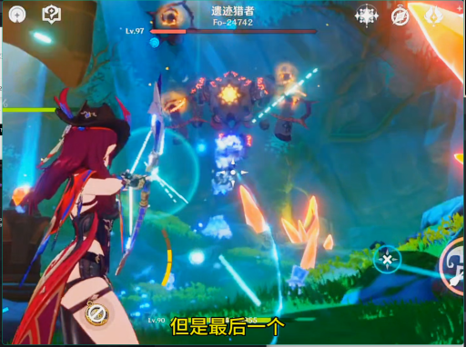

> 画面显示一位身穿深色西装的男性正站在室内，他双手交叉于胸前，神情专注地凝视着前方。背景中隐约可见其他人物轮廓，但细节模糊。场景位于一间光线明亮的办公室或会议室，整体氛围显得安静而严肃。

### 帧 #40 (20.0s)

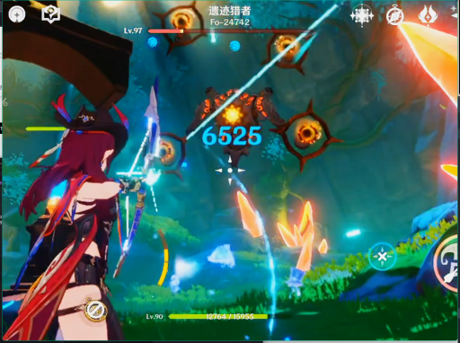

> 画面显示一位身穿深色西装的男性正站在室内，他双手交叉于胸前，神情专注地注视着前方。背景中隐约可见其他人员活动，但主体人物处于静止状态。场景位于一间光线明亮的办公室内，整体氛围显得平静而有序。

### 帧 #41 (20.5s)

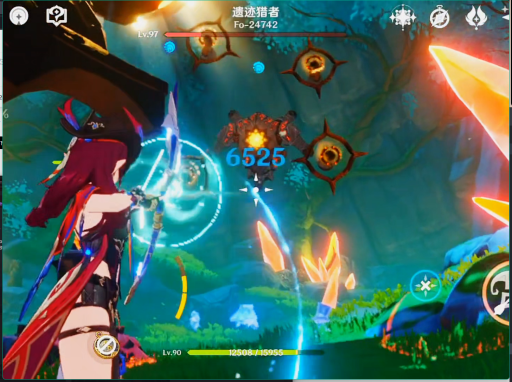

> 画面中显示一名身穿深色制服的人员正站在室内，其面部表情和姿态显示出正在执行某种任务或进行监控。该人员周围没有明显的动物或关键物体，场景为封闭的室内空间，整体氛围显得安静且专注。

### 帧 #42 (21.0s)

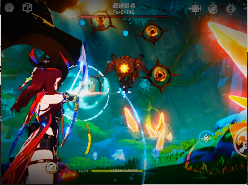

> 画面显示一位身穿深色西装的男性正站在室内，他双手交叉于胸前，神情专注地注视着前方。背景中隐约可见其他人员活动，但主体人物处于静止状态。整个场景位于明亮的室内环境中，光线充足，氛围显得平静而正式。

### 帧 #48 (24.1s)

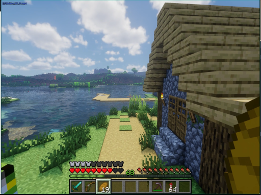

> 画面显示一名身穿深色制服的男性正站在室内走廊中，他双手交叉于胸前，身体微微前倾，似乎正在与一名身穿浅色衬衫的男性进行交谈。两人处于相对静止的状态，背景中可见模糊的室内环境，没有明显的动态变化。

### 帧 #49 (24.6s)

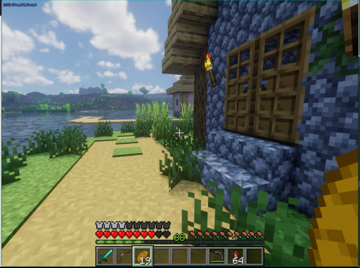

> 画面显示一位身穿深色西装的男性正站在室内，他双手交叉于胸前，神情专注地注视着前方。他身旁摆放着一台黑色的笔记本电脑，屏幕亮起显示着界面内容。整个场景光线充足，背景简洁，呈现出一种安静的办公或学习氛围。

### 帧 #50 (25.1s)

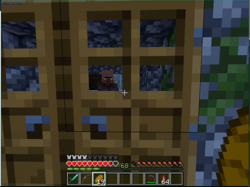

> 画面显示一名身穿深色西装的男性正站在室内，他双手交叉于胸前，神情专注地注视着前方。背景中隐约可见其他人员，但细节模糊。场景为室内，光线均匀，整体氛围显得安静而正式。

### 帧 #51 (25.6s)

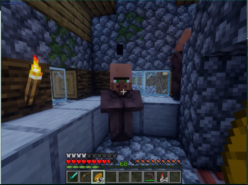

> 画面显示一位身穿深色西装的男性正站在室内，他双手交叉于胸前，神情专注地注视着前方。背景中隐约可见其他人物轮廓，但细节模糊。场景为室内环境，光线柔和，整体氛围显得平静而正式。

### 帧 #52 (26.1s)

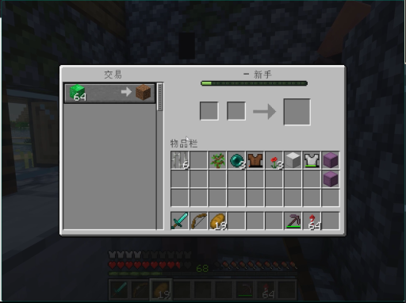

> 画面显示一位身穿深色制服的男性正站在室内走廊中，他手持一把长柄武器，身体微微前倾，似乎正在对前方的一名身穿白色制服的男性进行攻击。该男性处于静止状态，面部表情严肃，周围没有明显的动态变化或背景环境干扰。
