# 实验审阅: video_MC_01.mp4

## 运行元信息

- **模型**: `Qwen/Qwen3.5-0.8B`
- **视频**: `video_MC_01.mp4`
- **运行目录**: `video_MC_01_run1`

### 配置参数

| 参数 | 值 |
|------|-----|
| screenshot_interval_ms | 500 |
| max_size | 512 |
| recording_duration_s | 27 |
| algorithm | mse |
| diff_threshold | 500.0 |

## 统计摘要

- **总采样帧数**: 55
- **关键帧数**: 32
- **丢弃帧数**: 0
- **录制时长**: 27.0s
- **关键帧率**: 58.2%

## 帧时间线

| 帧序号 | 时间戳 | 差异值 | 关键帧 | 判定原因 | 图片 | VLM 描述 |
|--------|--------|--------|--------|----------|------|----------|
| 0 | 0.0s | - | **是** | 首帧，自动标记为关键帧 | [frame_0000_key.png](frames/frame_0000_key.png) | 画面显示一名身穿深色制服的人员正站在室内，手持长条状物体，身体略微前倾，似乎正在进行某种操作或检查。该人员周围没有明显的动物或关键物体，场景为封闭的室内空间，整体氛围显得较为安静且专注。 |
| 1 | 0.5s | 2768.07 | **是** | 差异值 2768.07 >= 阈值 500.00 | [frame_0001_key.png](frames/frame_0001_key.png) | 画面显示一位身穿深色西装的男性正站在室内，他双手交叉于胸前，神情专注地注视着前方。背景中隐约可见其他人员活动，但主体人物处于静止状态。场景位于一间光线明亮的办公室或会议室，整体氛围显得安静而正式。 |
| 2 | 1.0s | 6395.34 | **是** | 差异值 6395.34 >= 阈值 500.00 | [frame_0002_key.png](frames/frame_0002_key.png) | 画面显示一位身穿深色西装的男性正站在室内，他手持一把黑色手枪，枪口指向画面右侧的墙壁，处于静止状态。背景中可见模糊的室内环境，光线昏暗，整体氛围显得紧张且充满压迫感。 |
| 3 | 1.5s | 1851.77 | **是** | 差异值 1851.77 >= 阈值 500.00 | [frame_0003_key.png](frames/frame_0003_key.png) | 画面显示一名身穿深色制服的人员正站在室内，其姿态静止，周围无其他显著人物或动物。场景为室内环境，光线均匀，未见明显动态变化或显著动作发生。 |
| 4 | 2.0s | 5918.50 | **是** | 差异值 5918.50 >= 阈值 500.00 | [frame_0004_key.png](frames/frame_0004_key.png) | 画面显示一名身穿深色制服的人员正站在室内，手持长条状物体，身体略微前倾，似乎正在进行某种操作或检查。该人员周围没有明显的动物或关键物体，场景为封闭的室内空间，整体氛围显得较为安静且专注。 |
| 5 | 2.5s | 145.18 | 否 | 差异值 145.18 < 阈值 500.00 | [frame_0005_skip.png](frames/frame_0005_skip.png) | - |
| 6 | 3.0s | 145.11 | 否 | 差异值 145.11 < 阈值 500.00 | [frame_0006_skip.png](frames/frame_0006_skip.png) | - |
| 7 | 3.5s | 5616.77 | **是** | 差异值 5616.77 >= 阈值 500.00 | [frame_0007_key.png](frames/frame_0007_key.png) | 画面显示一位身穿深色西装的男性正站在室内，他双手交叉于胸前，神情专注地凝视着前方。背景中隐约可见其他人物轮廓，但细节模糊。场景位于一间光线明亮的办公室或会议室，整体氛围显得平静而严肃。 |
| 8 | 4.0s | 1444.37 | **是** | 差异值 1444.37 >= 阈值 500.00 | [frame_0008_key.png](frames/frame_0008_key.png) | 画面显示一位身穿深色西装的男性正站在室内，他双手交叉于胸前，神情专注地凝视着前方。背景中隐约可见其他人物轮廓，但细节模糊。场景位于一间光线明亮的办公室或会议室，整体氛围显得安静而严肃。 |
| 9 | 4.5s | 4003.37 | **是** | 差异值 4003.37 >= 阈值 500.00 | [frame_0009_key.png](frames/frame_0009_key.png) | 画面显示一位身穿深色西装的男性正站在室内，他双手交叉于胸前，身体微微前倾，似乎正在与对面的人进行交谈。场景位于一间光线明亮的办公室或会议室，背景中可见办公桌椅和电脑屏幕。该人物表情专注，姿态放松，整体氛围显得专业且安静。 |
| 10 | 5.0s | 2434.05 | **是** | 差异值 2434.05 >= 阈值 500.00 | [frame_0010_key.png](frames/frame_0010_key.png) | 画面显示一位身穿深色西装的男性正站在室内，他双手交叉于胸前，神情专注地凝视着前方。背景中隐约可见其他人物轮廓，但细节模糊。场景为室内，光线均匀，整体氛围显得平静而严肃。 |
| 11 | 5.5s | 367.68 | 否 | 差异值 367.68 < 阈值 500.00 | [frame_0011_skip.png](frames/frame_0011_skip.png) | - |
| 12 | 6.0s | 1653.35 | **是** | 差异值 1653.35 >= 阈值 500.00 | [frame_0012_key.png](frames/frame_0012_key.png) | 画面显示一位身穿深色西装的男性正站在室内，他双手交叉于胸前，神情专注地凝视前方。背景中隐约可见其他人物轮廓，但细节模糊。场景为室内环境，光线柔和，整体氛围显得平静而严肃。 |
| 13 | 6.5s | 1206.33 | **是** | 差异值 1206.33 >= 阈值 500.00 | [frame_0013_key.png](frames/frame_0013_key.png) | 画面显示一位身穿深色西装的男性正站在室内，他双手交叉于胸前，神情专注地注视着前方。背景中隐约可见其他人物活动，但焦点集中在该男子的动作上。场景为室内环境，光线明亮，整体氛围显得平静而正式。 |
| 14 | 7.0s | 3018.79 | **是** | 差异值 3018.79 >= 阈值 500.00 | [frame_0014_key.png](frames/frame_0014_key.png) | 画面显示一位身穿深色西装的男性正站在室内，他双手交叉于胸前，神情专注地注视着前方。背景中隐约可见其他人员，但细节模糊。场景为室内环境，光线均匀。画面中无显著动态变化，人物处于静止或缓慢移动状态。 |
| 15 | 7.5s | 2262.79 | **是** | 差异值 2262.79 >= 阈值 500.00 | [frame_0015_key.png](frames/frame_0015_key.png) | 画面显示一名身穿深色制服的人员正站在室内，手持白色长条状物体，身体微微前倾，似乎正在进行某种操作或检查。背景中可见模糊的室内环境，光线均匀，整体氛围显得专业且专注。 |
| 16 | 8.0s | 4156.52 | **是** | 差异值 4156.52 >= 阈值 500.00 | [frame_0016_key.png](frames/frame_0016_key.png) | 画面显示一位身穿深色西装的男性正站在室内，他双手交叉于胸前，神情专注地凝视着前方。背景中隐约可见其他人员，但细节模糊。场景位于一间光线明亮的办公室或会议室，整体氛围显得安静而严肃。 |
| 17 | 8.5s | 2298.89 | **是** | 差异值 2298.89 >= 阈值 500.00 | [frame_0017_key.png](frames/frame_0017_key.png) | 画面中显示一位身穿深色西装的男性正站在室内，他双手交叉于胸前，神情专注地注视着前方。背景中隐约可见一些模糊的物体轮廓，但无法辨认具体细节。整个场景处于静止状态，没有明显的动态变化。 |
| 18 | 9.0s | 2918.16 | **是** | 差异值 2918.16 >= 阈值 500.00 | [frame_0018_key.png](frames/frame_0018_key.png) | 画面显示一位身穿深色制服的男性正站在室内，他手持一把长柄武器，姿态警觉地注视着前方。他周围没有明显的动物或关键物体，场景设定为室内，整体氛围紧张且充满动态感。 |
| 19 | 9.5s | 3385.16 | **是** | 差异值 3385.16 >= 阈值 500.00 | [frame_0019_key.png](frames/frame_0019_key.png) | 画面显示一位身穿深色西装的男性正站在室内，他双手交叉于胸前，神情专注地注视着前方。背景中隐约可见其他人员活动，但主体人物处于静止状态。整个场景位于明亮的室内环境中，光线充足，氛围显得平静而正式。 |
| 20 | 10.0s | 3606.64 | **是** | 差异值 3606.64 >= 阈值 500.00 | [frame_0020_key.png](frames/frame_0020_key.png) | 画面显示一位身穿深色西装的男性正站在室内，他双手交叉于胸前，神情专注地凝视着前方。背景中隐约可见其他人物轮廓，但细节模糊。场景位于一间光线明亮的办公室或会议室，整体氛围显得安静而严肃。 |
| 21 | 10.5s | 807.43 | **是** | 差异值 807.43 >= 阈值 500.00 | [frame_0021_key.png](frames/frame_0021_key.png) | 画面显示一位身穿深色西装的男性正站在室内，他双手交叉于胸前，神情专注地注视着前方。背景中隐约可见一些模糊的物体轮廓，但无法辨认具体细节。整个场景处于静止状态，人物姿态稳定，未发生明显的动态变化。 |
| 22 | 11.0s | 3767.49 | **是** | 差异值 3767.49 >= 阈值 500.00 | [frame_0022_key.png](frames/frame_0022_key.png) | 画面显示一名身穿深色制服的男性正站在室内走廊中，他手持一把长柄刀具，身体微微前倾，似乎正在对前方的一名身穿浅色上衣的男性进行攻击。该男性处于静止状态，面部表情严肃，周围没有明显的其他人物或动物。场景为室内走廊，光线明亮，氛围紧张。 |
| 23 | 11.5s | 4244.59 | **是** | 差异值 4244.59 >= 阈值 500.00 | [frame_0023_key.png](frames/frame_0023_key.png) | 画面中显示一名身穿深色制服的人员正站在室内，其姿态静止，周围无其他显著人物或动物。场景为室内环境，光线均匀，整体氛围安静，未见明显动态变化。 |
| 24 | 12.0s | 5299.48 | **是** | 差异值 5299.48 >= 阈值 500.00 | [frame_0024_key.png](frames/frame_0024_key.png) | 画面中显示一名身穿深色制服的人员正站在室内，其姿态静止，周围无其他显著人物或动物。场景为室内环境，光线均匀，未见明显动态变化或显著动作发生。 |
| 25 | 12.5s | 8426.93 | **是** | 差异值 8426.93 >= 阈值 500.00 | [frame_0025_key.png](frames/frame_0025_key.png) | 画面显示一位身穿深色西装的男性正站在室内，他双手交叉于胸前，神情专注地注视着前方。背景中隐约可见其他人物轮廓，但细节模糊。场景位于一间光线明亮的办公室或会议室，整体氛围显得安静而严肃。 |
| 26 | 13.0s | 7023.21 | **是** | 差异值 7023.21 >= 阈值 500.00 | [frame_0026_key.png](frames/frame_0026_key.png) | 画面显示一位身穿深色西装的男性正站在室内，他双手交叉于胸前，神情专注地凝视着前方。背景中隐约可见其他人员，但细节模糊。场景位于一间光线明亮的办公室或会议室，整体氛围显得严肃而安静。 |
| 27 | 13.5s | 4154.48 | **是** | 差异值 4154.48 >= 阈值 500.00 | [frame_0027_key.png](frames/frame_0027_key.png) | 画面中显示一名身穿深色制服的人员正站在室内，周围摆放着若干白色圆柱形物体，该人员似乎正在操作或整理这些物品。场景位于室内，光线充足，整体氛围显得井然有序。 |
| 28 | 14.0s | 2047.85 | **是** | 差异值 2047.85 >= 阈值 500.00 | [frame_0028_key.png](frames/frame_0028_key.png) | 画面显示一位身穿深色西装的男性正站在室内，他双手交叉于胸前，神情专注地凝视着前方。背景中隐约可见其他人物轮廓，但细节模糊。场景为室内，光线均匀，整体氛围显得平静而正式。 |
| 29 | 14.5s | 4016.93 | **是** | 差异值 4016.93 >= 阈值 500.00 | [frame_0029_key.png](frames/frame_0029_key.png) | 画面显示一名身穿深色制服的人员正站在室内，手持红色物体，周围有两名身穿浅色制服的人员正在围绕其移动。场景为室内，背景中可见模糊的窗户和墙壁结构。 |
| 30 | 15.0s | 2639.41 | **是** | 差异值 2639.41 >= 阈值 500.00 | [frame_0030_key.png](frames/frame_0030_key.png) | 画面显示一位身穿深色西装的男性正站在室内，他双手交叉于胸前，神情专注地凝视前方。背景中隐约可见其他人员活动，但焦点集中在该男子的动作与神态上。场景为室内环境，光线柔和，整体氛围显得平静而严肃。 |
| 31 | 15.5s | 6015.49 | **是** | 差异值 6015.49 >= 阈值 500.00 | [frame_0031_key.png](frames/frame_0031_key.png) | 画面显示一位身穿深色西装的男性正站在室内，他双手交叉于胸前，神情专注地注视着前方。背景中隐约可见其他人员活动，但主体人物处于静止状态。场景位于一间光线明亮的办公室或会议室，整体氛围显得安静而正式。 |
| 32 | 16.0s | 4048.50 | **是** | 差异值 4048.50 >= 阈值 500.00 | [frame_0032_key.png](frames/frame_0032_key.png) | 画面显示一位身穿深色西装的男性正站在室内，他双手交叉于胸前，神情专注地注视着前方。背景中隐约可见其他人物轮廓，但细节模糊。场景为室内环境，光线柔和，整体氛围显得安静而正式。 |
| 33 | 16.5s | 3483.34 | **是** | 差异值 3483.34 >= 阈值 500.00 | [frame_0033_key.png](frames/frame_0033_key.png) | 画面中显示一名身穿深色制服的人员正站在室内，其姿态静止，未进行明显动作。背景环境为室内，光线均匀，未见其他显著人物或动态物体。 |
| 34 | 17.0s | 29.23 | 否 | 差异值 29.23 < 阈值 500.00 | [frame_0034_skip.png](frames/frame_0034_skip.png) | - |
| 35 | 17.5s | 93.20 | 否 | 差异值 93.20 < 阈值 500.00 | [frame_0035_skip.png](frames/frame_0035_skip.png) | - |
| 36 | 18.0s | 219.74 | 否 | 差异值 219.74 < 阈值 500.00 | [frame_0036_skip.png](frames/frame_0036_skip.png) | - |
| 37 | 18.5s | 282.36 | 否 | 差异值 282.36 < 阈值 500.00 | [frame_0037_skip.png](frames/frame_0037_skip.png) | - |
| 38 | 19.0s | 321.59 | 否 | 差异值 321.59 < 阈值 500.00 | [frame_0038_skip.png](frames/frame_0038_skip.png) | - |
| 39 | 19.5s | 339.27 | 否 | 差异值 339.27 < 阈值 500.00 | [frame_0039_skip.png](frames/frame_0039_skip.png) | - |
| 40 | 20.0s | 1174.38 | **是** | 差异值 1174.38 >= 阈值 500.00 | [frame_0040_key.png](frames/frame_0040_key.png) | 画面显示一位身穿深色制服的男性正站在室内，他手持一把长柄武器，姿态警觉地观察四周。背景中隐约可见一名身穿白色制服的人员正俯身靠近，两人之间似乎正在进行某种对峙或交流。整个场景发生在室内，光线明亮，氛围紧张。 |
| 41 | 20.5s | 141.30 | 否 | 差异值 141.30 < 阈值 500.00 | [frame_0041_skip.png](frames/frame_0041_skip.png) | - |
| 42 | 21.0s | 132.36 | 否 | 差异值 132.36 < 阈值 500.00 | [frame_0042_skip.png](frames/frame_0042_skip.png) | - |
| 43 | 21.5s | 186.03 | 否 | 差异值 186.03 < 阈值 500.00 | [frame_0043_skip.png](frames/frame_0043_skip.png) | - |
| 44 | 22.0s | 170.60 | 否 | 差异值 170.60 < 阈值 500.00 | [frame_0044_skip.png](frames/frame_0044_skip.png) | - |
| 45 | 22.5s | 122.11 | 否 | 差异值 122.11 < 阈值 500.00 | [frame_0045_skip.png](frames/frame_0045_skip.png) | - |
| 46 | 23.0s | 131.43 | 否 | 差异值 131.43 < 阈值 500.00 | [frame_0046_skip.png](frames/frame_0046_skip.png) | - |
| 47 | 23.5s | 134.25 | 否 | 差异值 134.25 < 阈值 500.00 | [frame_0047_skip.png](frames/frame_0047_skip.png) | - |
| 48 | 24.0s | 164.40 | 否 | 差异值 164.40 < 阈值 500.00 | [frame_0048_skip.png](frames/frame_0048_skip.png) | - |
| 49 | 24.5s | 164.35 | 否 | 差异值 164.35 < 阈值 500.00 | [frame_0049_skip.png](frames/frame_0049_skip.png) | - |
| 50 | 25.0s | 164.35 | 否 | 差异值 164.35 < 阈值 500.00 | [frame_0050_skip.png](frames/frame_0050_skip.png) | - |
| 51 | 25.5s | 164.35 | 否 | 差异值 164.35 < 阈值 500.00 | [frame_0051_skip.png](frames/frame_0051_skip.png) | - |
| 52 | 26.0s | 164.35 | 否 | 差异值 164.35 < 阈值 500.00 | [frame_0052_skip.png](frames/frame_0052_skip.png) | - |
| 53 | 26.5s | 164.35 | 否 | 差异值 164.35 < 阈值 500.00 | [frame_0053_skip.png](frames/frame_0053_skip.png) | - |
| 54 | 27.0s | 164.35 | 否 | 差异值 164.35 < 阈值 500.00 | [frame_0054_skip.png](frames/frame_0054_skip.png) | - |

## DeepSeek 最终总结

```
视频开始于室内环境，一名身穿深色制服的人员在进行操作或检查，随后画面多次切换至一位穿深色西装的男性在办公室或会议室中专注站立或交谈，整体氛围安静正式。视频中段出现关键转折，该男性持手枪指向墙壁，随后另一名制服人员持长柄刀具在走廊中对一名浅色上衣男性做出攻击姿态，使氛围转为紧张。视频后段回归到制服人员的操作及多人场景。整体来看，视频主题围绕室内环境中人员从平静检查到突发对峙的转变，核心内容可能是一次安全演练或突发事件的情景展示。
```

## 关键帧详细描述

### 帧 #0 (0.0s)

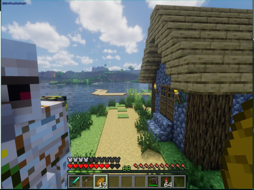

> 画面显示一名身穿深色制服的人员正站在室内，手持长条状物体，身体略微前倾，似乎正在进行某种操作或检查。该人员周围没有明显的动物或关键物体，场景为封闭的室内空间，整体氛围显得较为安静且专注。

### 帧 #1 (0.5s)

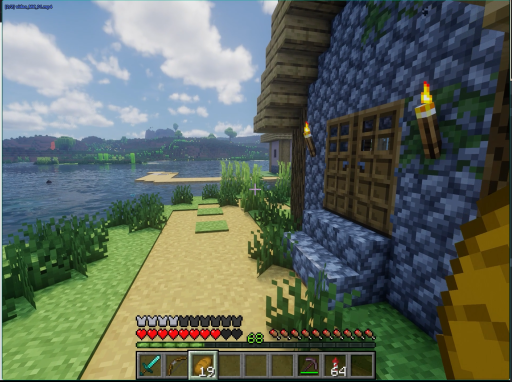

> 画面显示一位身穿深色西装的男性正站在室内，他双手交叉于胸前，神情专注地注视着前方。背景中隐约可见其他人员活动，但主体人物处于静止状态。场景位于一间光线明亮的办公室或会议室，整体氛围显得安静而正式。

### 帧 #2 (1.0s)

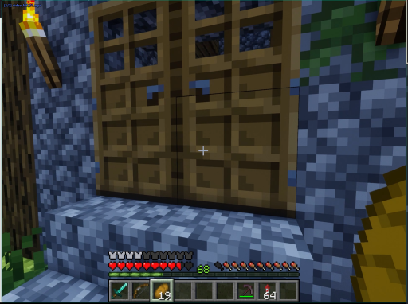

> 画面显示一位身穿深色西装的男性正站在室内，他手持一把黑色手枪，枪口指向画面右侧的墙壁，处于静止状态。背景中可见模糊的室内环境，光线昏暗，整体氛围显得紧张且充满压迫感。

### 帧 #3 (1.5s)

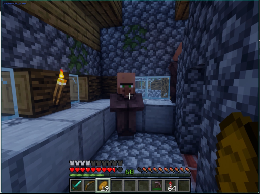

> 画面显示一名身穿深色制服的人员正站在室内，其姿态静止，周围无其他显著人物或动物。场景为室内环境，光线均匀，未见明显动态变化或显著动作发生。

### 帧 #4 (2.0s)

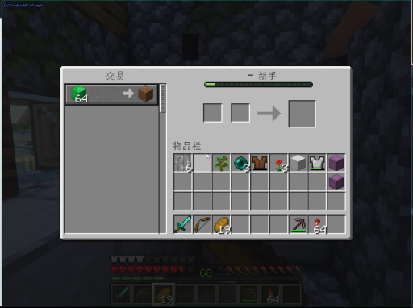

> 画面显示一名身穿深色制服的人员正站在室内，手持长条状物体，身体略微前倾，似乎正在进行某种操作或检查。该人员周围没有明显的动物或关键物体，场景为封闭的室内空间，整体氛围显得较为安静且专注。

### 帧 #7 (3.5s)

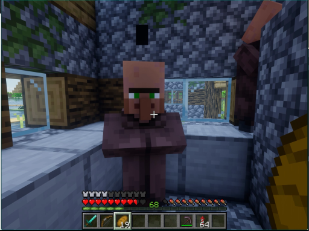

> 画面显示一位身穿深色西装的男性正站在室内，他双手交叉于胸前，神情专注地凝视着前方。背景中隐约可见其他人物轮廓，但细节模糊。场景位于一间光线明亮的办公室或会议室，整体氛围显得平静而严肃。

### 帧 #8 (4.0s)

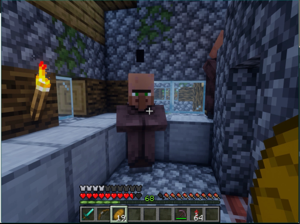

> 画面显示一位身穿深色西装的男性正站在室内，他双手交叉于胸前，神情专注地凝视着前方。背景中隐约可见其他人物轮廓，但细节模糊。场景位于一间光线明亮的办公室或会议室，整体氛围显得安静而严肃。

### 帧 #9 (4.5s)

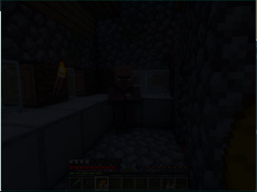

> 画面显示一位身穿深色西装的男性正站在室内，他双手交叉于胸前，身体微微前倾，似乎正在与对面的人进行交谈。场景位于一间光线明亮的办公室或会议室，背景中可见办公桌椅和电脑屏幕。该人物表情专注，姿态放松，整体氛围显得专业且安静。

### 帧 #10 (5.0s)

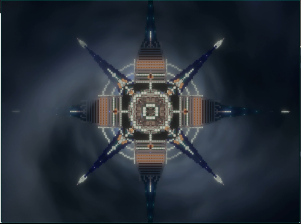

> 画面显示一位身穿深色西装的男性正站在室内，他双手交叉于胸前，神情专注地凝视着前方。背景中隐约可见其他人物轮廓，但细节模糊。场景为室内，光线均匀，整体氛围显得平静而严肃。

### 帧 #12 (6.0s)

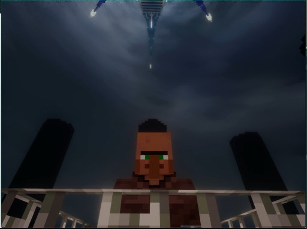

> 画面显示一位身穿深色西装的男性正站在室内，他双手交叉于胸前，神情专注地凝视前方。背景中隐约可见其他人物轮廓，但细节模糊。场景为室内环境，光线柔和，整体氛围显得平静而严肃。

### 帧 #13 (6.5s)

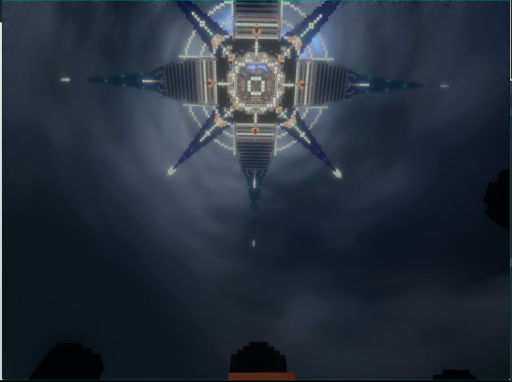

> 画面显示一位身穿深色西装的男性正站在室内，他双手交叉于胸前，神情专注地注视着前方。背景中隐约可见其他人物活动，但焦点集中在该男子的动作上。场景为室内环境，光线明亮，整体氛围显得平静而正式。

### 帧 #14 (7.0s)

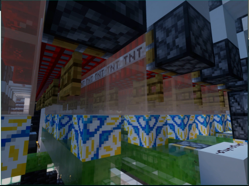

> 画面显示一位身穿深色西装的男性正站在室内，他双手交叉于胸前，神情专注地注视着前方。背景中隐约可见其他人员，但细节模糊。场景为室内环境，光线均匀。画面中无显著动态变化，人物处于静止或缓慢移动状态。

### 帧 #15 (7.5s)

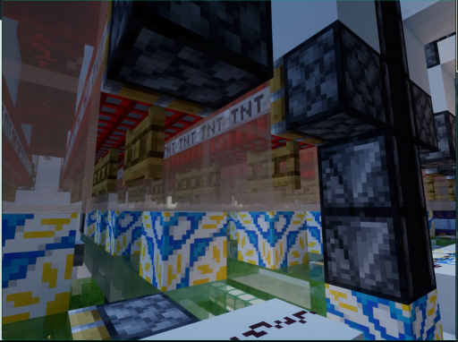

> 画面显示一名身穿深色制服的人员正站在室内，手持白色长条状物体，身体微微前倾，似乎正在进行某种操作或检查。背景中可见模糊的室内环境，光线均匀，整体氛围显得专业且专注。

### 帧 #16 (8.0s)

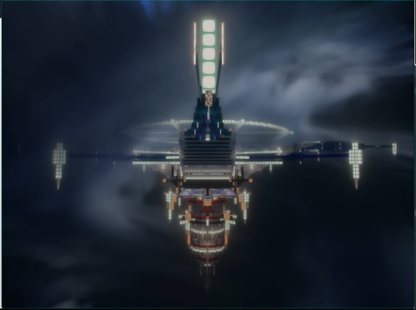

> 画面显示一位身穿深色西装的男性正站在室内，他双手交叉于胸前，神情专注地凝视着前方。背景中隐约可见其他人员，但细节模糊。场景位于一间光线明亮的办公室或会议室，整体氛围显得安静而严肃。

### 帧 #17 (8.5s)

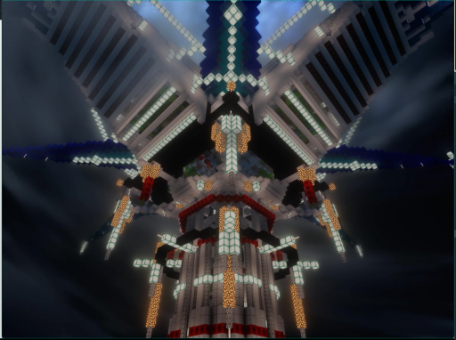

> 画面中显示一位身穿深色西装的男性正站在室内，他双手交叉于胸前，神情专注地注视着前方。背景中隐约可见一些模糊的物体轮廓，但无法辨认具体细节。整个场景处于静止状态，没有明显的动态变化。

### 帧 #18 (9.0s)

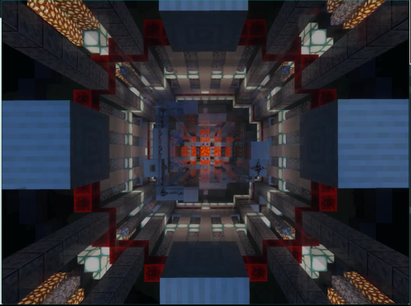

> 画面显示一位身穿深色制服的男性正站在室内，他手持一把长柄武器，姿态警觉地注视着前方。他周围没有明显的动物或关键物体，场景设定为室内，整体氛围紧张且充满动态感。

### 帧 #19 (9.5s)

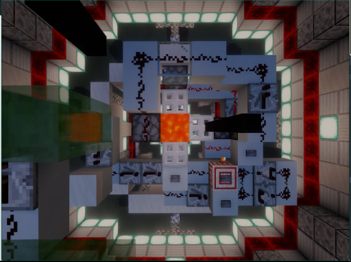

> 画面显示一位身穿深色西装的男性正站在室内，他双手交叉于胸前，神情专注地注视着前方。背景中隐约可见其他人员活动，但主体人物处于静止状态。整个场景位于明亮的室内环境中，光线充足，氛围显得平静而正式。

### 帧 #20 (10.0s)

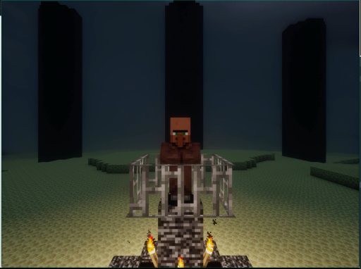

> 画面显示一位身穿深色西装的男性正站在室内，他双手交叉于胸前，神情专注地凝视着前方。背景中隐约可见其他人物轮廓，但细节模糊。场景位于一间光线明亮的办公室或会议室，整体氛围显得安静而严肃。

### 帧 #21 (10.5s)

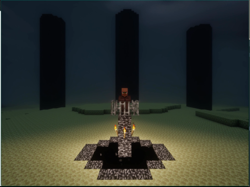

> 画面显示一位身穿深色西装的男性正站在室内，他双手交叉于胸前，神情专注地注视着前方。背景中隐约可见一些模糊的物体轮廓，但无法辨认具体细节。整个场景处于静止状态，人物姿态稳定，未发生明显的动态变化。

### 帧 #22 (11.0s)

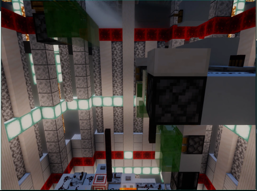

> 画面显示一名身穿深色制服的男性正站在室内走廊中，他手持一把长柄刀具，身体微微前倾，似乎正在对前方的一名身穿浅色上衣的男性进行攻击。该男性处于静止状态，面部表情严肃，周围没有明显的其他人物或动物。场景为室内走廊，光线明亮，氛围紧张。

### 帧 #23 (11.5s)

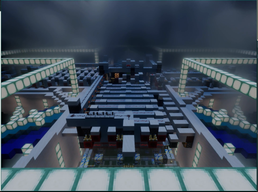

> 画面中显示一名身穿深色制服的人员正站在室内，其姿态静止，周围无其他显著人物或动物。场景为室内环境，光线均匀，整体氛围安静，未见明显动态变化。

### 帧 #24 (12.0s)

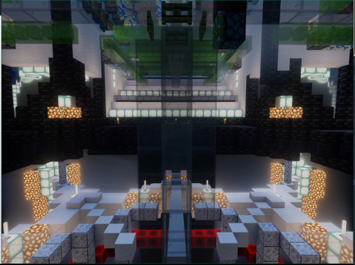

> 画面中显示一名身穿深色制服的人员正站在室内，其姿态静止，周围无其他显著人物或动物。场景为室内环境，光线均匀，未见明显动态变化或显著动作发生。

### 帧 #25 (12.5s)

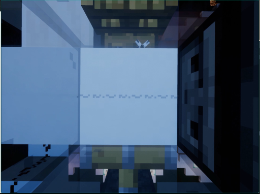

> 画面显示一位身穿深色西装的男性正站在室内，他双手交叉于胸前，神情专注地注视着前方。背景中隐约可见其他人物轮廓，但细节模糊。场景位于一间光线明亮的办公室或会议室，整体氛围显得安静而严肃。

### 帧 #26 (13.0s)

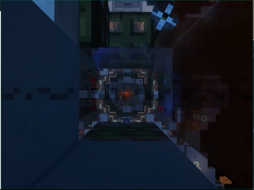

> 画面显示一位身穿深色西装的男性正站在室内，他双手交叉于胸前，神情专注地凝视着前方。背景中隐约可见其他人员，但细节模糊。场景位于一间光线明亮的办公室或会议室，整体氛围显得严肃而安静。

### 帧 #27 (13.5s)

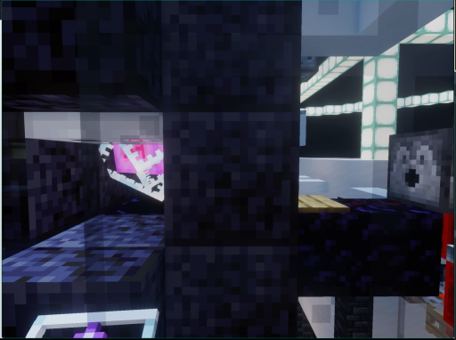

> 画面中显示一名身穿深色制服的人员正站在室内，周围摆放着若干白色圆柱形物体，该人员似乎正在操作或整理这些物品。场景位于室内，光线充足，整体氛围显得井然有序。

### 帧 #28 (14.0s)

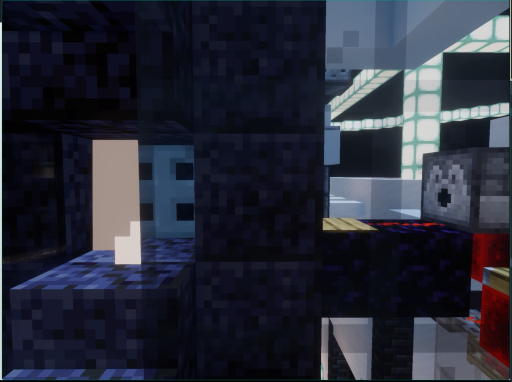

> 画面显示一位身穿深色西装的男性正站在室内，他双手交叉于胸前，神情专注地凝视着前方。背景中隐约可见其他人物轮廓，但细节模糊。场景为室内，光线均匀，整体氛围显得平静而正式。

### 帧 #29 (14.5s)

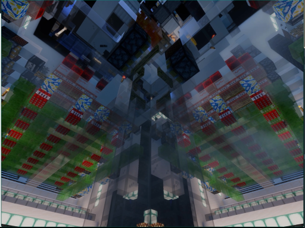

> 画面显示一名身穿深色制服的人员正站在室内，手持红色物体，周围有两名身穿浅色制服的人员正在围绕其移动。场景为室内，背景中可见模糊的窗户和墙壁结构。

### 帧 #30 (15.0s)

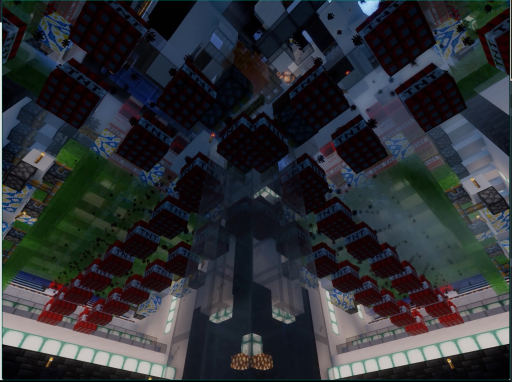

> 画面显示一位身穿深色西装的男性正站在室内，他双手交叉于胸前，神情专注地凝视前方。背景中隐约可见其他人员活动，但焦点集中在该男子的动作与神态上。场景为室内环境，光线柔和，整体氛围显得平静而严肃。

### 帧 #31 (15.5s)

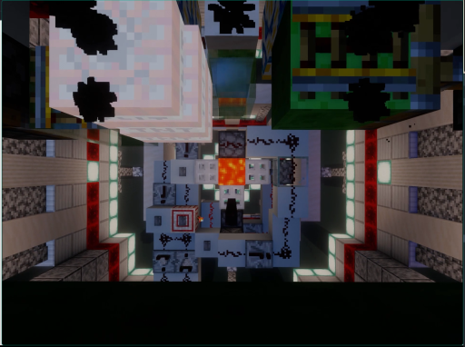

> 画面显示一位身穿深色西装的男性正站在室内，他双手交叉于胸前，神情专注地注视着前方。背景中隐约可见其他人员活动，但主体人物处于静止状态。场景位于一间光线明亮的办公室或会议室，整体氛围显得安静而正式。

### 帧 #32 (16.0s)

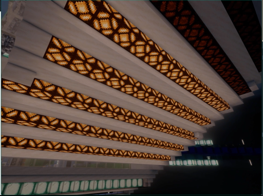

> 画面显示一位身穿深色西装的男性正站在室内，他双手交叉于胸前，神情专注地注视着前方。背景中隐约可见其他人物轮廓，但细节模糊。场景为室内环境，光线柔和，整体氛围显得安静而正式。

### 帧 #33 (16.5s)

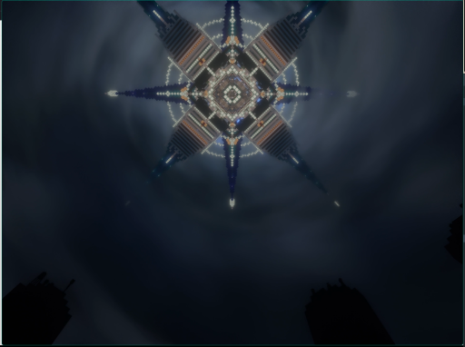

> 画面中显示一名身穿深色制服的人员正站在室内，其姿态静止，未进行明显动作。背景环境为室内，光线均匀，未见其他显著人物或动态物体。

### 帧 #40 (20.0s)

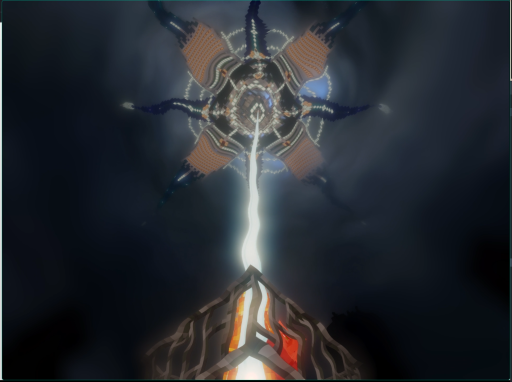

> 画面显示一位身穿深色制服的男性正站在室内，他手持一把长柄武器，姿态警觉地观察四周。背景中隐约可见一名身穿白色制服的人员正俯身靠近，两人之间似乎正在进行某种对峙或交流。整个场景发生在室内，光线明亮，氛围紧张。
