# 实验审阅: video_MC_01.mp4

## 运行元信息

- **模型**: `Qwen/Qwen3.5-0.8B`
- **视频**: `video_MC_01.mp4`
- **运行目录**: `video_MC_01_run2`

### 配置参数

| 参数 | 值 |
|------|-----|
| screenshot_interval_ms | 500 |
| max_size | 512 |
| recording_duration_s | 27 |
| algorithm | mse |
| diff_threshold | 500.0 |

## 统计摘要

- **总采样帧数**: 55
- **关键帧数**: 32
- **丢弃帧数**: 0
- **录制时长**: 27.0s
- **关键帧率**: 58.2%

## 帧时间线

| 帧序号 | 时间戳 | 差异值 | 关键帧 | 判定原因 | 图片 | VLM 描述 |
|--------|--------|--------|--------|----------|------|----------|
| 0 | 0.0s | - | **是** | 首帧，自动标记为关键帧 | [frame_0000_key.png](frames/frame_0000_key.png) | 画面显示一名身穿深色制服的人员正站在室内，其姿态静止，未进行明显动作。背景中可见模糊的室内环境，光线均匀，无其他显著动态变化。 |
| 1 | 0.5s | 2582.77 | **是** | 差异值 2582.77 >= 阈值 500.00 | [frame_0001_key.png](frames/frame_0001_key.png) | 画面显示一位身穿深色西装的男性正站在室内，他双手交叉于胸前，神情专注地注视着前方。背景中隐约可见其他人员活动，但主体人物处于静止状态，未发生明显动态变化。 |
| 2 | 1.0s | 6174.42 | **是** | 差异值 6174.42 >= 阈值 500.00 | [frame_0002_key.png](frames/frame_0002_key.png) | 画面显示一位身穿深色西装的男性正站在室内，他双手交叉于胸前，神情专注地凝视着前方。背景中隐约可见其他人员活动，但主体人物处于静止状态。场景位于一间光线明亮的办公室或会议室，整体氛围显得安静而正式。 |
| 3 | 1.5s | 1934.83 | **是** | 差异值 1934.83 >= 阈值 500.00 | [frame_0003_key.png](frames/frame_0003_key.png) | 画面显示一位身穿深色西装的男性正站在室内，他手持一把黑色手枪，枪口对准前方，处于静止或缓慢移动状态。背景中可见模糊的室内环境，光线昏暗，整体氛围紧张。 |
| 4 | 2.0s | 6025.17 | **是** | 差异值 6025.17 >= 阈值 500.00 | [frame_0004_key.png](frames/frame_0004_key.png) | 画面显示一位身穿深色西装的男性正站在室内，他双手交叉于胸前，神情专注地凝视前方。背景中隐约可见其他人物轮廓，但细节模糊。场景位于一间光线明亮的办公室或会议室，整体氛围显得安静而严肃。 |
| 5 | 2.5s | 147.19 | 否 | 差异值 147.19 < 阈值 500.00 | [frame_0005_skip.png](frames/frame_0005_skip.png) | - |
| 6 | 3.0s | 147.40 | 否 | 差异值 147.40 < 阈值 500.00 | [frame_0006_skip.png](frames/frame_0006_skip.png) | - |
| 7 | 3.5s | 5633.68 | **是** | 差异值 5633.68 >= 阈值 500.00 | [frame_0007_key.png](frames/frame_0007_key.png) | 画面显示一位身穿深色制服的男性正站在室内走廊中，他手持一把长柄武器，身体微微前倾，似乎正在对前方的一名身穿浅色上衣的行人进行攻击。该行人处于静止状态，未表现出明显的反抗或逃跑动作。场景位于光线明亮的室内走廊，背景中可见模糊的墙壁纹理和... |
| 8 | 4.0s | 1387.98 | **是** | 差异值 1387.98 >= 阈值 500.00 | [frame_0008_key.png](frames/frame_0008_key.png) | 画面显示一位身穿深色西装的男性正站在室内，他双手交叉于胸前，神情专注地凝视前方。背景中隐约可见其他人员活动，但主体人物处于静止状态。场景为室内环境，光线柔和，整体氛围显得平静而专注。 |
| 9 | 4.5s | 3201.90 | **是** | 差异值 3201.90 >= 阈值 500.00 | [frame_0009_key.png](frames/frame_0009_key.png) | 画面显示一名身穿深色制服的人员正站在室内，手持长条状物体，身体略微前倾，似乎正在进行某种操作或检查。该人员周围没有明显的动物或关键物体，场景为封闭的室内空间。 |
| 10 | 5.0s | 1932.01 | **是** | 差异值 1932.01 >= 阈值 500.00 | [frame_0010_key.png](frames/frame_0010_key.png) | 画面显示一名身穿深色制服的人员正站在室内，其姿态静止，周围无其他显著人物或动物。场景为室内环境，光线均匀，未见明显动态变化或显著动作发生。 |
| 11 | 5.5s | 362.15 | 否 | 差异值 362.15 < 阈值 500.00 | [frame_0011_skip.png](frames/frame_0011_skip.png) | - |
| 12 | 6.0s | 1648.75 | **是** | 差异值 1648.75 >= 阈值 500.00 | [frame_0012_key.png](frames/frame_0012_key.png) | 画面中显示一位身穿深色西装的男性正站在室内，他双手交叉于胸前，神情专注地注视着前方。背景为明亮的室内环境，光线充足，整体氛围显得平静而正式。 |
| 13 | 6.5s | 1292.99 | **是** | 差异值 1292.99 >= 阈值 500.00 | [frame_0013_key.png](frames/frame_0013_key.png) | 画面中显示一名身穿深色制服的人员正站在室内，其面部表情严肃且目光直视前方，似乎处于警觉状态。该人员周围没有明显的动物或关键物体，场景为封闭的室内空间，整体氛围显得紧张且专注。 |
| 14 | 7.0s | 3059.61 | **是** | 差异值 3059.61 >= 阈值 500.00 | [frame_0014_key.png](frames/frame_0014_key.png) | 画面显示一位身穿深色西装的男性正站在室内，他双手交叉于胸前，神情专注地注视着前方。背景中隐约可见其他人物轮廓，但细节模糊。场景为室内，光线柔和，整体氛围显得平静而庄重。 |
| 15 | 7.5s | 2323.34 | **是** | 差异值 2323.34 >= 阈值 500.00 | [frame_0015_key.png](frames/frame_0015_key.png) | 画面显示一位身穿深色西装的男性正站在室内，他双手交叉于胸前，神情专注地注视着前方。背景中隐约可见其他人物轮廓，但细节模糊。场景位于一间光线明亮的办公室或会议室，整体氛围显得安静而正式。 |
| 16 | 8.0s | 4228.65 | **是** | 差异值 4228.65 >= 阈值 500.00 | [frame_0016_key.png](frames/frame_0016_key.png) | 画面显示一位身穿深色西装的男性正站在室内，他双手交叉于胸前，神情专注地凝视着前方。背景中隐约可见一些模糊的物体轮廓，但无法辨认具体细节。场景位于室内，光线柔和，整体氛围显得平静而专注。 |
| 17 | 8.5s | 2320.85 | **是** | 差异值 2320.85 >= 阈值 500.00 | [frame_0017_key.png](frames/frame_0017_key.png) | 画面显示一名身穿深色制服的人员正站在室内，手持长条状物体，身体略微前倾，似乎正在进行某种操作或检查。该人员周围没有明显的动物或关键物体，场景为封闭的室内空间，整体氛围较为安静且专注。 |
| 18 | 9.0s | 2854.18 | **是** | 差异值 2854.18 >= 阈值 500.00 | [frame_0018_key.png](frames/frame_0018_key.png) | 画面显示一位身穿深色西装的男性正站在室内，他双手交叉于胸前，神情专注地凝视着前方。背景中隐约可见其他人物轮廓，但细节模糊。场景位于一间光线明亮的办公室或会议室，整体氛围显得安静而严肃。 |
| 19 | 9.5s | 2927.12 | **是** | 差异值 2927.12 >= 阈值 500.00 | [frame_0019_key.png](frames/frame_0019_key.png) | 画面显示一位身穿深色西装的男性正站在室内，他双手交叉于胸前，神情专注地注视着前方。背景中隐约可见其他人物轮廓，但细节模糊。场景位于一间光线明亮的办公室或会议室，整体氛围显得安静而严肃。 |
| 20 | 10.0s | 3574.14 | **是** | 差异值 3574.14 >= 阈值 500.00 | [frame_0020_key.png](frames/frame_0020_key.png) | 画面显示一位身穿深色西装的男性正站在室内，他双手交叉于胸前，神情专注地凝视着前方。背景中隐约可见一些模糊的物体轮廓，但无法辨认具体细节。整个场景处于静止状态，人物并未进行明显的动态动作。 |
| 21 | 10.5s | 779.60 | **是** | 差异值 779.60 >= 阈值 500.00 | [frame_0021_key.png](frames/frame_0021_key.png) | 画面显示一名身穿深色制服的人员正站在室内，手持长杆状工具，动作幅度较大且持续进行。该人员周围没有明显的动物或关键物体，场景为封闭的室内空间，整体氛围显得较为静态。 |
| 22 | 11.0s | 3721.71 | **是** | 差异值 3721.71 >= 阈值 500.00 | [frame_0022_key.png](frames/frame_0022_key.png) | 画面显示一位身穿深色西装的男性正站在室内，他双手交叉于胸前，神情专注地凝视前方。背景中隐约可见其他人员活动，但主体人物处于静止状态。场景为室内环境，光线柔和，整体氛围显得平静而专注。 |
| 23 | 11.5s | 4276.01 | **是** | 差异值 4276.01 >= 阈值 500.00 | [frame_0023_key.png](frames/frame_0023_key.png) | 画面中显示一位身穿深色西装的男性正站在室内，他双手交叉于胸前，神情专注地注视着前方。背景为明亮的室内环境，光线充足，氛围显得平静而正式。 |
| 24 | 12.0s | 5060.19 | **是** | 差异值 5060.19 >= 阈值 500.00 | [frame_0024_key.png](frames/frame_0024_key.png) | 画面显示一名身穿深色制服的人员正站在室内，周围摆放着若干白色圆柱形物体，该人员似乎正在操作或整理这些物体。 |
| 25 | 12.5s | 7949.46 | **是** | 差异值 7949.46 >= 阈值 500.00 | [frame_0025_key.png](frames/frame_0025_key.png) | 画面显示一位身穿深色西装的男性正站在室内，他双手交叉于胸前，神情专注地注视着前方。背景中隐约可见其他人物轮廓，但细节模糊。场景位于一间光线明亮的办公室或会议室，整体氛围显得安静而严肃。 |
| 26 | 13.0s | 3428.71 | **是** | 差异值 3428.71 >= 阈值 500.00 | [frame_0026_key.png](frames/frame_0026_key.png) | 画面显示一位身穿深色西装的男性正站在室内，他双手交叉于胸前，神情专注地注视着前方。背景中隐约可见其他人员，但细节模糊。场景为室内，光线均匀。画面中未观察到明显的动态变化或显著动作。 |
| 27 | 13.5s | 5150.37 | **是** | 差异值 5150.37 >= 阈值 500.00 | [frame_0027_key.png](frames/frame_0027_key.png) | 画面中显示一名身穿深色制服的人员正站在室内，其姿态静止，未进行明显动作。背景环境为室内，光线均匀。画面中无其他显著人物或动物，整体场景处于静态。 |
| 28 | 14.0s | 1537.71 | **是** | 差异值 1537.71 >= 阈值 500.00 | [frame_0028_key.png](frames/frame_0028_key.png) | 画面显示一位身穿深色西装的男性正站在室内，他双手交叉于胸前，神情专注地凝视着前方。背景中隐约可见其他人物轮廓，但细节模糊。场景位于一间光线明亮的办公室或会议室，整体氛围显得安静而严肃。 |
| 29 | 14.5s | 3947.29 | **是** | 差异值 3947.29 >= 阈值 500.00 | [frame_0029_key.png](frames/frame_0029_key.png) | 画面显示一名身穿深色制服的人员正站在室内，手持长杆状工具，似乎正在进行某种操作或检查。该人员周围没有明显的动物或关键物体，场景为封闭的室内空间，整体氛围较为安静且专注。 |
| 30 | 15.0s | 2599.81 | **是** | 差异值 2599.81 >= 阈值 500.00 | [frame_0030_key.png](frames/frame_0030_key.png) | 画面显示一位身穿深色西装的男性正站在室内，他双手交叉于胸前，神情专注地凝视前方。背景中隐约可见其他人员活动，但主体人物处于静止状态。场景为室内环境，光线柔和，整体氛围显得平静而专注。 |
| 31 | 15.5s | 6326.98 | **是** | 差异值 6326.98 >= 阈值 500.00 | [frame_0031_key.png](frames/frame_0031_key.png) | 画面中显示一名身穿深色上衣的人正站在室内，其面部表情和肢体语言显示出正在经历剧烈的情绪波动或痛苦。该人物处于静止状态，周围没有明显的动态物体或动物。场景设定在室内，光线较为柔和，整体氛围显得压抑且充满张力。 |
| 32 | 16.0s | 4344.43 | **是** | 差异值 4344.43 >= 阈值 500.00 | [frame_0032_key.png](frames/frame_0032_key.png) | 画面中显示一名身穿深色制服的人员正站在室内，其姿态显示其处于站立状态。该人员周围没有明显的动物或关键物体，场景为室内环境。画面中未观察到明显的动态变化或显著的动作。 |
| 33 | 16.5s | 3736.14 | **是** | 差异值 3736.14 >= 阈值 500.00 | [frame_0033_key.png](frames/frame_0033_key.png) | 画面中显示一名身穿深色制服的人员正站在室内，周围摆放着若干白色圆柱形物体。该人员处于静止状态，周围没有明显的动态变化。 |
| 34 | 17.0s | 28.71 | 否 | 差异值 28.71 < 阈值 500.00 | [frame_0034_skip.png](frames/frame_0034_skip.png) | - |
| 35 | 17.5s | 91.78 | 否 | 差异值 91.78 < 阈值 500.00 | [frame_0035_skip.png](frames/frame_0035_skip.png) | - |
| 36 | 18.0s | 195.89 | 否 | 差异值 195.89 < 阈值 500.00 | [frame_0036_skip.png](frames/frame_0036_skip.png) | - |
| 37 | 18.5s | 286.55 | 否 | 差异值 286.55 < 阈值 500.00 | [frame_0037_skip.png](frames/frame_0037_skip.png) | - |
| 38 | 19.0s | 322.25 | 否 | 差异值 322.25 < 阈值 500.00 | [frame_0038_skip.png](frames/frame_0038_skip.png) | - |
| 39 | 19.5s | 339.48 | 否 | 差异值 339.48 < 阈值 500.00 | [frame_0039_skip.png](frames/frame_0039_skip.png) | - |
| 40 | 20.0s | 1140.47 | **是** | 差异值 1140.47 >= 阈值 500.00 | [frame_0040_key.png](frames/frame_0040_key.png) | 画面显示一位身穿深色西装的男性正站在室内，他双手交叉于胸前，神情专注地凝视着前方。背景中隐约可见其他人物轮廓，但细节模糊。场景位于一间光线明亮的办公室或会议室，整体氛围显得安静而严肃。 |
| 41 | 20.5s | 134.89 | 否 | 差异值 134.89 < 阈值 500.00 | [frame_0041_skip.png](frames/frame_0041_skip.png) | - |
| 42 | 21.0s | 125.34 | 否 | 差异值 125.34 < 阈值 500.00 | [frame_0042_skip.png](frames/frame_0042_skip.png) | - |
| 43 | 21.5s | 176.87 | 否 | 差异值 176.87 < 阈值 500.00 | [frame_0043_skip.png](frames/frame_0043_skip.png) | - |
| 44 | 22.0s | 174.66 | 否 | 差异值 174.66 < 阈值 500.00 | [frame_0044_skip.png](frames/frame_0044_skip.png) | - |
| 45 | 22.5s | 116.15 | 否 | 差异值 116.15 < 阈值 500.00 | [frame_0045_skip.png](frames/frame_0045_skip.png) | - |
| 46 | 23.0s | 119.01 | 否 | 差异值 119.01 < 阈值 500.00 | [frame_0046_skip.png](frames/frame_0046_skip.png) | - |
| 47 | 23.5s | 130.98 | 否 | 差异值 130.98 < 阈值 500.00 | [frame_0047_skip.png](frames/frame_0047_skip.png) | - |
| 48 | 24.0s | 161.69 | 否 | 差异值 161.69 < 阈值 500.00 | [frame_0048_skip.png](frames/frame_0048_skip.png) | - |
| 49 | 24.5s | 162.05 | 否 | 差异值 162.05 < 阈值 500.00 | [frame_0049_skip.png](frames/frame_0049_skip.png) | - |
| 50 | 25.0s | 162.05 | 否 | 差异值 162.05 < 阈值 500.00 | [frame_0050_skip.png](frames/frame_0050_skip.png) | - |
| 51 | 25.5s | 162.05 | 否 | 差异值 162.05 < 阈值 500.00 | [frame_0051_skip.png](frames/frame_0051_skip.png) | - |
| 52 | 26.0s | 162.05 | 否 | 差异值 162.05 < 阈值 500.00 | [frame_0052_skip.png](frames/frame_0052_skip.png) | - |
| 53 | 26.5s | 162.05 | 否 | 差异值 162.05 < 阈值 500.00 | [frame_0053_skip.png](frames/frame_0053_skip.png) | - |
| 54 | 27.0s | 162.05 | 否 | 差异值 162.05 < 阈值 500.00 | [frame_0054_skip.png](frames/frame_0054_skip.png) | - |

## DeepSeek 最终总结

```
视频以一名身穿深色西装的男性在室内安静站立、神情专注的场景开始，整体氛围平静正式。随后出现关键转折：他手持手枪，并在约3.5秒时用长柄武器攻击一名浅色上衣的行人，使氛围转为紧张。此后视频交替呈现他静止观察与其他人员操作工具的静态画面，最后以一名人员显露痛苦情绪结束。整体主题围绕室内环境中潜伏的暴力与紧张对峙，通过平静表象与突发攻击的对比，展现了冲突与压抑的核心内容。
```

## 关键帧详细描述

### 帧 #0 (0.0s)

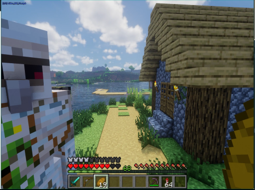

> 画面显示一名身穿深色制服的人员正站在室内，其姿态静止，未进行明显动作。背景中可见模糊的室内环境，光线均匀，无其他显著动态变化。

### 帧 #1 (0.5s)


> 画面显示一位身穿深色西装的男性正站在室内，他双手交叉于胸前，神情专注地注视着前方。背景中隐约可见其他人员活动，但主体人物处于静止状态，未发生明显动态变化。

### 帧 #2 (1.0s)

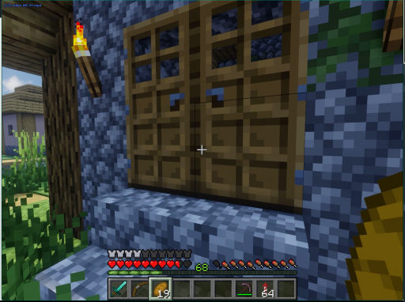

> 画面显示一位身穿深色西装的男性正站在室内，他双手交叉于胸前，神情专注地凝视着前方。背景中隐约可见其他人员活动，但主体人物处于静止状态。场景位于一间光线明亮的办公室或会议室，整体氛围显得安静而正式。

### 帧 #3 (1.5s)


> 画面显示一位身穿深色西装的男性正站在室内，他手持一把黑色手枪，枪口对准前方，处于静止或缓慢移动状态。背景中可见模糊的室内环境，光线昏暗，整体氛围紧张。

### 帧 #4 (2.0s)


> 画面显示一位身穿深色西装的男性正站在室内，他双手交叉于胸前，神情专注地凝视前方。背景中隐约可见其他人物轮廓，但细节模糊。场景位于一间光线明亮的办公室或会议室，整体氛围显得安静而严肃。

### 帧 #7 (3.5s)


> 画面显示一位身穿深色制服的男性正站在室内走廊中，他手持一把长柄武器，身体微微前倾，似乎正在对前方的一名身穿浅色上衣的行人进行攻击。该行人处于静止状态，未表现出明显的反抗或逃跑动作。场景位于光线明亮的室内走廊，背景中可见模糊的墙壁纹理和地面反光，整体氛围紧张且充满动态感。

### 帧 #8 (4.0s)


> 画面显示一位身穿深色西装的男性正站在室内，他双手交叉于胸前，神情专注地凝视前方。背景中隐约可见其他人员活动，但主体人物处于静止状态。场景为室内环境，光线柔和，整体氛围显得平静而专注。

### 帧 #9 (4.5s)

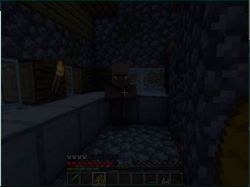

> 画面显示一名身穿深色制服的人员正站在室内，手持长条状物体，身体略微前倾，似乎正在进行某种操作或检查。该人员周围没有明显的动物或关键物体，场景为封闭的室内空间。

### 帧 #10 (5.0s)

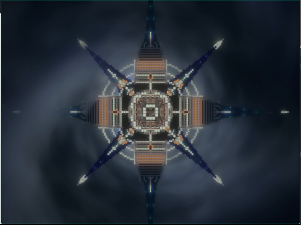

> 画面显示一名身穿深色制服的人员正站在室内，其姿态静止，周围无其他显著人物或动物。场景为室内环境，光线均匀，未见明显动态变化或显著动作发生。

### 帧 #12 (6.0s)

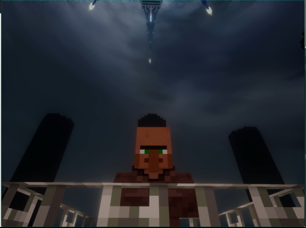

> 画面中显示一位身穿深色西装的男性正站在室内，他双手交叉于胸前，神情专注地注视着前方。背景为明亮的室内环境，光线充足，整体氛围显得平静而正式。

### 帧 #13 (6.5s)

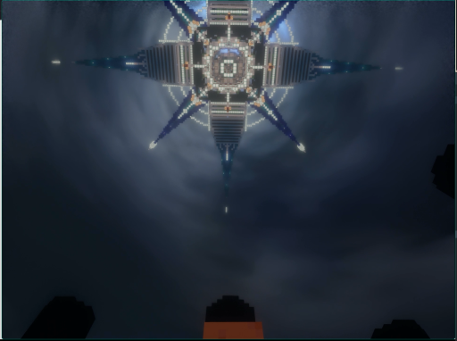

> 画面中显示一名身穿深色制服的人员正站在室内，其面部表情严肃且目光直视前方，似乎处于警觉状态。该人员周围没有明显的动物或关键物体，场景为封闭的室内空间，整体氛围显得紧张且专注。

### 帧 #14 (7.0s)


> 画面显示一位身穿深色西装的男性正站在室内，他双手交叉于胸前，神情专注地注视着前方。背景中隐约可见其他人物轮廓，但细节模糊。场景为室内，光线柔和，整体氛围显得平静而庄重。

### 帧 #15 (7.5s)

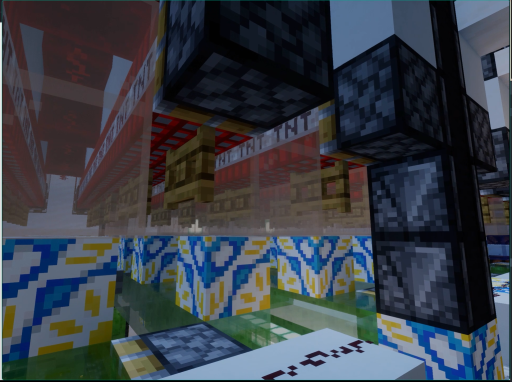

> 画面显示一位身穿深色西装的男性正站在室内，他双手交叉于胸前，神情专注地注视着前方。背景中隐约可见其他人物轮廓，但细节模糊。场景位于一间光线明亮的办公室或会议室，整体氛围显得安静而正式。

### 帧 #16 (8.0s)

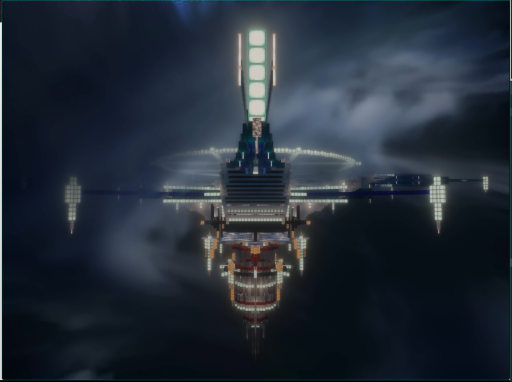

> 画面显示一位身穿深色西装的男性正站在室内，他双手交叉于胸前，神情专注地凝视着前方。背景中隐约可见一些模糊的物体轮廓，但无法辨认具体细节。场景位于室内，光线柔和，整体氛围显得平静而专注。

### 帧 #17 (8.5s)


> 画面显示一名身穿深色制服的人员正站在室内，手持长条状物体，身体略微前倾，似乎正在进行某种操作或检查。该人员周围没有明显的动物或关键物体，场景为封闭的室内空间，整体氛围较为安静且专注。

### 帧 #18 (9.0s)

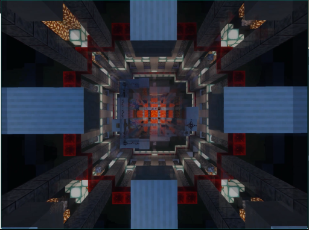

> 画面显示一位身穿深色西装的男性正站在室内，他双手交叉于胸前，神情专注地凝视着前方。背景中隐约可见其他人物轮廓，但细节模糊。场景位于一间光线明亮的办公室或会议室，整体氛围显得安静而严肃。

### 帧 #19 (9.5s)


> 画面显示一位身穿深色西装的男性正站在室内，他双手交叉于胸前，神情专注地注视着前方。背景中隐约可见其他人物轮廓，但细节模糊。场景位于一间光线明亮的办公室或会议室，整体氛围显得安静而严肃。

### 帧 #20 (10.0s)


> 画面显示一位身穿深色西装的男性正站在室内，他双手交叉于胸前，神情专注地凝视着前方。背景中隐约可见一些模糊的物体轮廓，但无法辨认具体细节。整个场景处于静止状态，人物并未进行明显的动态动作。

### 帧 #21 (10.5s)


> 画面显示一名身穿深色制服的人员正站在室内，手持长杆状工具，动作幅度较大且持续进行。该人员周围没有明显的动物或关键物体，场景为封闭的室内空间，整体氛围显得较为静态。

### 帧 #22 (11.0s)

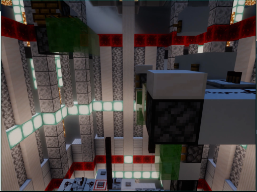

> 画面显示一位身穿深色西装的男性正站在室内，他双手交叉于胸前，神情专注地凝视前方。背景中隐约可见其他人员活动，但主体人物处于静止状态。场景为室内环境，光线柔和，整体氛围显得平静而专注。

### 帧 #23 (11.5s)

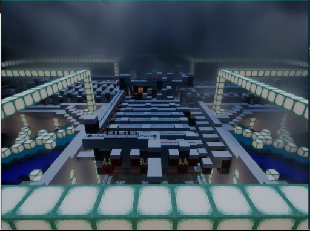

> 画面中显示一位身穿深色西装的男性正站在室内，他双手交叉于胸前，神情专注地注视着前方。背景为明亮的室内环境，光线充足，氛围显得平静而正式。

### 帧 #24 (12.0s)


> 画面显示一名身穿深色制服的人员正站在室内，周围摆放着若干白色圆柱形物体，该人员似乎正在操作或整理这些物体。

### 帧 #25 (12.5s)


> 画面显示一位身穿深色西装的男性正站在室内，他双手交叉于胸前，神情专注地注视着前方。背景中隐约可见其他人物轮廓，但细节模糊。场景位于一间光线明亮的办公室或会议室，整体氛围显得安静而严肃。

### 帧 #26 (13.0s)


> 画面显示一位身穿深色西装的男性正站在室内，他双手交叉于胸前，神情专注地注视着前方。背景中隐约可见其他人员，但细节模糊。场景为室内，光线均匀。画面中未观察到明显的动态变化或显著动作。

### 帧 #27 (13.5s)

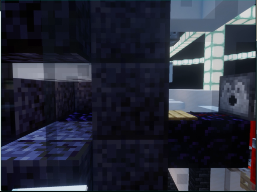

> 画面中显示一名身穿深色制服的人员正站在室内，其姿态静止，未进行明显动作。背景环境为室内，光线均匀。画面中无其他显著人物或动物，整体场景处于静态。

### 帧 #28 (14.0s)

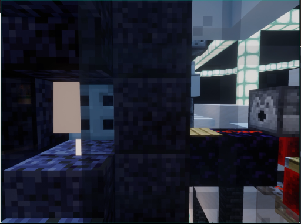

> 画面显示一位身穿深色西装的男性正站在室内，他双手交叉于胸前，神情专注地凝视着前方。背景中隐约可见其他人物轮廓，但细节模糊。场景位于一间光线明亮的办公室或会议室，整体氛围显得安静而严肃。

### 帧 #29 (14.5s)

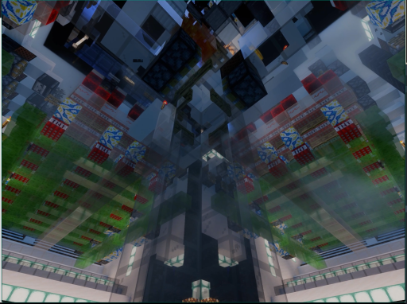

> 画面显示一名身穿深色制服的人员正站在室内，手持长杆状工具，似乎正在进行某种操作或检查。该人员周围没有明显的动物或关键物体，场景为封闭的室内空间，整体氛围较为安静且专注。

### 帧 #30 (15.0s)

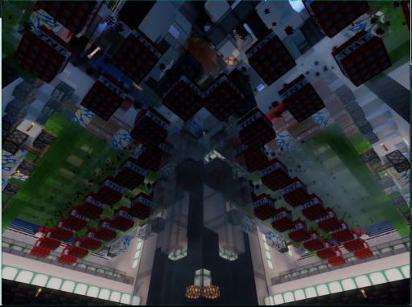

> 画面显示一位身穿深色西装的男性正站在室内，他双手交叉于胸前，神情专注地凝视前方。背景中隐约可见其他人员活动，但主体人物处于静止状态。场景为室内环境，光线柔和，整体氛围显得平静而专注。

### 帧 #31 (15.5s)

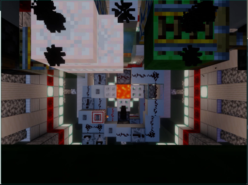

> 画面中显示一名身穿深色上衣的人正站在室内，其面部表情和肢体语言显示出正在经历剧烈的情绪波动或痛苦。该人物处于静止状态，周围没有明显的动态物体或动物。场景设定在室内，光线较为柔和，整体氛围显得压抑且充满张力。

### 帧 #32 (16.0s)

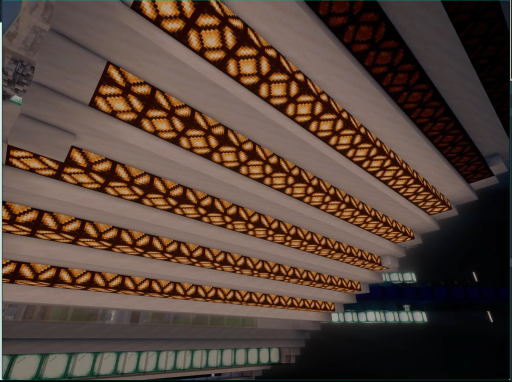

> 画面中显示一名身穿深色制服的人员正站在室内，其姿态显示其处于站立状态。该人员周围没有明显的动物或关键物体，场景为室内环境。画面中未观察到明显的动态变化或显著的动作。

### 帧 #33 (16.5s)

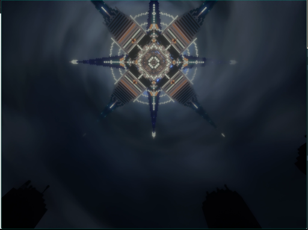

> 画面中显示一名身穿深色制服的人员正站在室内，周围摆放着若干白色圆柱形物体。该人员处于静止状态，周围没有明显的动态变化。

### 帧 #40 (20.0s)

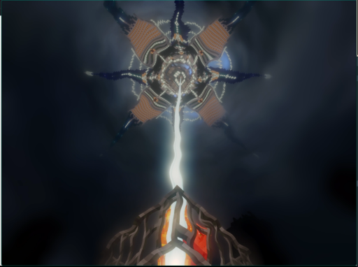

> 画面显示一位身穿深色西装的男性正站在室内，他双手交叉于胸前，神情专注地凝视着前方。背景中隐约可见其他人物轮廓，但细节模糊。场景位于一间光线明亮的办公室或会议室，整体氛围显得安静而严肃。
