# 实验审阅: video_MC_01.mp4

## 运行元信息

- **模型**: `Qwen/Qwen3.5-0.8B`
- **视频**: `video_MC_01.mp4`
- **运行目录**: `video_MC_01_run3`

### 配置参数

| 参数 | 值 |
|------|-----|
| screenshot_interval_ms | 500 |
| max_size | 512 |
| recording_duration_s | 27 |
| algorithm | mse |
| diff_threshold | 500.0 |

## 统计摘要

- **总采样帧数**: 55
- **关键帧数**: 32
- **丢弃帧数**: 0
- **录制时长**: 27.0s
- **关键帧率**: 58.2%

## 帧时间线

| 帧序号 | 时间戳 | 差异值 | 关键帧 | 判定原因 | 图片 | VLM 描述 |
|--------|--------|--------|--------|----------|------|----------|
| 0 | 0.0s | - | **是** | 首帧，自动标记为关键帧 | [frame_0000_key.png](frames/frame_0000_key.png) | 画面中显示一名身穿深色上衣的人物正站在室内，其面部表情和肢体语言表明其正处于紧张或惊恐的状态。该人物周围没有明显的动物或关键物体，场景为封闭的室内空间，整体氛围显得压抑且充满动态张力。 |
| 1 | 0.5s | 2582.77 | **是** | 差异值 2582.77 >= 阈值 500.00 | [frame_0001_key.png](frames/frame_0001_key.png) | 画面中显示一位身穿深色西装的男性正站在室内，他双手交叉于胸前，神情专注地注视着前方。背景中隐约可见一些模糊的物体轮廓，但无法辨认具体细节。整个场景处于静止状态，没有明显的动态变化或人物移动。 |
| 2 | 1.0s | 6174.42 | **是** | 差异值 6174.42 >= 阈值 500.00 | [frame_0002_key.png](frames/frame_0002_key.png) | 画面中显示一位身穿深色西装的男性正站在室内，他双手交叉于胸前，神情专注地注视着前方。背景为明亮的室内环境，光线充足，氛围显得平静而严肃。 |
| 3 | 1.5s | 1934.83 | **是** | 差异值 1934.83 >= 阈值 500.00 | [frame_0003_key.png](frames/frame_0003_key.png) | 画面显示一名身穿深色制服的人员正站在室内，手持长杆状工具，似乎正在进行某种操作或检查。该人员周围没有明显的动物或关键物体，场景为封闭的室内空间，整体氛围较为安静且专注。 |
| 4 | 2.0s | 6025.17 | **是** | 差异值 6025.17 >= 阈值 500.00 | [frame_0004_key.png](frames/frame_0004_key.png) | 画面显示一位身穿深色西装的男性正站在室内，他双手交叉于胸前，神情专注地凝视着前方。背景中隐约可见其他人员，但细节模糊。场景位于一间光线明亮的办公室或会议室，整体氛围显得安静而严肃。 |
| 5 | 2.5s | 147.19 | 否 | 差异值 147.19 < 阈值 500.00 | [frame_0005_skip.png](frames/frame_0005_skip.png) | - |
| 6 | 3.0s | 147.40 | 否 | 差异值 147.40 < 阈值 500.00 | [frame_0006_skip.png](frames/frame_0006_skip.png) | - |
| 7 | 3.5s | 5633.68 | **是** | 差异值 5633.68 >= 阈值 500.00 | [frame_0007_key.png](frames/frame_0007_key.png) | 画面显示一位身穿深色西装的男性正站在室内，他双手交叉于胸前，神情专注地注视着前方。背景中隐约可见其他人物轮廓，但细节模糊。场景为室内环境，光线柔和，整体氛围显得平静而庄重。 |
| 8 | 4.0s | 1387.98 | **是** | 差异值 1387.98 >= 阈值 500.00 | [frame_0008_key.png](frames/frame_0008_key.png) | 画面显示一位身穿深色西装的男性正站在室内，他双手交叉于胸前，神情专注地注视着前方。背景中隐约可见其他人物轮廓，但细节模糊。场景为室内环境，光线柔和，整体氛围显得平静而严肃。 |
| 9 | 4.5s | 3201.90 | **是** | 差异值 3201.90 >= 阈值 500.00 | [frame_0009_key.png](frames/frame_0009_key.png) | 画面显示一位身穿深色西装的男性正站在室内，他双手交叉于胸前，神情专注地注视着前方。背景中隐约可见其他人物轮廓，但细节模糊。场景位于一间光线明亮的办公室或会议室，整体氛围显得安静而严肃。 |
| 10 | 5.0s | 1932.01 | **是** | 差异值 1932.01 >= 阈值 500.00 | [frame_0010_key.png](frames/frame_0010_key.png) | 画面显示一位身穿深色西装的男性正站在室内，他双手交叉于胸前，神情专注地凝视前方。背景中隐约可见其他人员活动，但焦点集中在该男子的动作与神态上。场景位于一间光线明亮的办公室或会议室，整体氛围显得严肃而安静。 |
| 11 | 5.5s | 362.15 | 否 | 差异值 362.15 < 阈值 500.00 | [frame_0011_skip.png](frames/frame_0011_skip.png) | - |
| 12 | 6.0s | 1648.75 | **是** | 差异值 1648.75 >= 阈值 500.00 | [frame_0012_key.png](frames/frame_0012_key.png) | 画面显示一位身穿深色西装的男性正站在室内，他双手交叉于胸前，神情专注地凝视着前方。背景中隐约可见其他人物轮廓，但细节模糊。场景为室内，光线柔和，整体氛围显得平静而庄重。 |
| 13 | 6.5s | 1292.99 | **是** | 差异值 1292.99 >= 阈值 500.00 | [frame_0013_key.png](frames/frame_0013_key.png) | 画面显示一位身穿深色西装的男性正站在室内，他双手交叉于胸前，神情专注地注视着前方。背景中隐约可见其他人员活动，但主体人物处于静止状态。场景位于一间光线明亮的办公室或会议室，整体氛围显得安静而正式。 |
| 14 | 7.0s | 3059.61 | **是** | 差异值 3059.61 >= 阈值 500.00 | [frame_0014_key.png](frames/frame_0014_key.png) | 画面显示一位身穿深色制服的男性正站在室内走廊中，他手持一把长柄刀具，身体微微前倾，似乎正在对前方的一名身穿浅色上衣的女性进行攻击。该女性处于静止状态，面部表情平静。场景位于一间光线明亮的室内走廊，背景可见其他人员活动。 |
| 15 | 7.5s | 2323.34 | **是** | 差异值 2323.34 >= 阈值 500.00 | [frame_0015_key.png](frames/frame_0015_key.png) | 画面显示一名身穿深色制服的人员正站在室内，周围摆放着若干白色圆柱形物体，该人员似乎正在操作或整理这些物品。 |
| 16 | 8.0s | 4228.65 | **是** | 差异值 4228.65 >= 阈值 500.00 | [frame_0016_key.png](frames/frame_0016_key.png) | 画面显示一位身穿深色西装的男性正站在室内，他手持一把黑色手枪，枪口指向画面右侧的墙壁，处于静止状态。背景中可见模糊的室内环境，光线昏暗，整体氛围紧张。 |
| 17 | 8.5s | 2320.85 | **是** | 差异值 2320.85 >= 阈值 500.00 | [frame_0017_key.png](frames/frame_0017_key.png) | 画面中显示一名身穿深色制服的人员正站在室内，周围摆放着若干白色圆柱形物体。该人员处于静止状态，周围没有明显的动态变化。 |
| 18 | 9.0s | 2854.18 | **是** | 差异值 2854.18 >= 阈值 500.00 | [frame_0018_key.png](frames/frame_0018_key.png) | 画面中显示一名身穿深色制服的人员正站在室内，其姿态静止，周围无其他人物或动物。场景为室内，光线均匀，未见明显动态变化。 |
| 19 | 9.5s | 2927.12 | **是** | 差异值 2927.12 >= 阈值 500.00 | [frame_0019_key.png](frames/frame_0019_key.png) | 画面中显示一名身穿深色上衣的人物正站在室内，其面部表情和姿态显示出正在经历剧烈的情绪波动或痛苦挣扎。该人物周围没有明显的动物或关键物体，场景为封闭的室内空间，整体氛围显得紧张且充满动态感。 |
| 20 | 10.0s | 3574.14 | **是** | 差异值 3574.14 >= 阈值 500.00 | [frame_0020_key.png](frames/frame_0020_key.png) | 画面显示一位身穿深色西装的男性正站在室内，他双手交叉于胸前，神情专注地凝视着前方。背景中隐约可见一些模糊的物体轮廓，但无法辨认具体细节。场景位于室内，光线均匀，整体氛围显得平静而静止。 |
| 21 | 10.5s | 779.60 | **是** | 差异值 779.60 >= 阈值 500.00 | [frame_0021_key.png](frames/frame_0021_key.png) | 画面中显示一位身穿深色西装的男性正站在室内，他双手交叉于胸前，神情专注地注视着前方。背景中隐约可见一些模糊的物体轮廓，但无法辨认具体细节。整个场景处于静止状态，人物并未进行明显的动态动作。 |
| 22 | 11.0s | 3721.71 | **是** | 差异值 3721.71 >= 阈值 500.00 | [frame_0022_key.png](frames/frame_0022_key.png) | 画面显示一位身穿深色西装的男性正站在室内，他双手交叉置于胸前，神情专注地凝视前方。背景中隐约可见其他人员活动，但焦点集中在该男子的动作与神态上。场景位于一间光线明亮的办公室或会议室，整体氛围显得平静而严肃。 |
| 23 | 11.5s | 4276.01 | **是** | 差异值 4276.01 >= 阈值 500.00 | [frame_0023_key.png](frames/frame_0023_key.png) | 画面显示一位身穿深色制服的男性正站在室内走廊中，他手持一把长柄武器，身体微微前倾，似乎正在对前方的一名身穿浅色上衣的男性进行攻击。该男性处于静止状态，面部表情严肃，周围没有明显的动态变化或背景环境干扰。 |
| 24 | 12.0s | 5060.19 | **是** | 差异值 5060.19 >= 阈值 500.00 | [frame_0024_key.png](frames/frame_0024_key.png) | 画面显示一位身穿深色西装的男性正站在室内，他双手交叉于胸前，神情专注地凝视前方。背景中隐约可见一些模糊的物体轮廓，但无法辨认具体细节。场景位于室内，光线均匀，整体氛围显得平静而正式。 |
| 25 | 12.5s | 7949.46 | **是** | 差异值 7949.46 >= 阈值 500.00 | [frame_0025_key.png](frames/frame_0025_key.png) | 画面显示一位身穿深色西装的男性正站在室内，他双手交叉于胸前，神情专注地注视着前方。背景中隐约可见其他人物轮廓，但细节模糊。场景为室内，光线柔和，整体氛围显得平静而专注。 |
| 26 | 13.0s | 3428.71 | **是** | 差异值 3428.71 >= 阈值 500.00 | [frame_0026_key.png](frames/frame_0026_key.png) | 画面显示一位身穿深色西装的男性正站在室内，他双手交叉于胸前，神情专注地注视着前方。背景中隐约可见其他人员活动，但主体人物处于静止状态。场景位于一间光线明亮的办公室或会议室，整体氛围显得安静而正式。 |
| 27 | 13.5s | 5150.37 | **是** | 差异值 5150.37 >= 阈值 500.00 | [frame_0027_key.png](frames/frame_0027_key.png) | 画面显示一位身穿深色西装的男性正站在室内，他双手交叉于胸前，神情专注地凝视着前方。背景中隐约可见其他人物轮廓，但细节模糊。场景位于一间光线明亮的办公室或会议室，整体氛围显得安静而严肃。 |
| 28 | 14.0s | 1537.71 | **是** | 差异值 1537.71 >= 阈值 500.00 | [frame_0028_key.png](frames/frame_0028_key.png) | 画面中显示一名身穿深色上衣的男性正站在室内，他身体前倾，双手抬起似乎正在对前方进行某种操作或检查。该场景位于明亮的室内环境中，光线充足。 |
| 29 | 14.5s | 3961.09 | **是** | 差异值 3961.09 >= 阈值 500.00 | [frame_0029_key.png](frames/frame_0029_key.png) | 画面中显示一名身穿深色制服的人员正站在室内，背景可见模糊的监控设备。该人员姿态静止，未进行明显动作。场景为室内，光线均匀。画面中无显著动态变化。 |
| 30 | 15.0s | 2610.66 | **是** | 差异值 2610.66 >= 阈值 500.00 | [frame_0030_key.png](frames/frame_0030_key.png) | 画面中显示一位身穿深色西装的男性正站在室内，他手持一把黑色手枪，枪口指向画面右侧。该男子表情严肃，身体略微前倾，处于戒备状态。背景为室内环境，光线明亮，整体氛围紧张。 |
| 31 | 15.5s | 6264.30 | **是** | 差异值 6264.30 >= 阈值 500.00 | [frame_0031_key.png](frames/frame_0031_key.png) | 画面显示一位身穿深色西装的男性正站在室内，他双手交叉于胸前，神情专注地注视着前方。背景中隐约可见其他人物轮廓，但细节模糊。场景位于一间光线明亮的办公室或会议室，整体氛围显得安静而正式。 |
| 32 | 16.0s | 4230.17 | **是** | 差异值 4230.17 >= 阈值 500.00 | [frame_0032_key.png](frames/frame_0032_key.png) | 画面显示一名身穿深色西装的男子正站在室内，他双手交叉于胸前，神情专注地注视着前方。背景中隐约可见一些模糊的物体轮廓，但无法辨认具体细节。整个场景处于静止状态，没有明显的动态变化或人物移动。 |
| 33 | 16.5s | 3640.43 | **是** | 差异值 3640.43 >= 阈值 500.00 | [frame_0033_key.png](frames/frame_0033_key.png) | 画面显示一位身穿深色西装的男性正站在室内，他双手交叉于胸前，神情专注地凝视着前方。背景中隐约可见其他人物轮廓，但细节模糊。场景为室内，光线柔和，整体氛围显得平静而严肃。 |
| 34 | 17.0s | 29.08 | 否 | 差异值 29.08 < 阈值 500.00 | [frame_0034_skip.png](frames/frame_0034_skip.png) | - |
| 35 | 17.5s | 92.65 | 否 | 差异值 92.65 < 阈值 500.00 | [frame_0035_skip.png](frames/frame_0035_skip.png) | - |
| 36 | 18.0s | 208.60 | 否 | 差异值 208.60 < 阈值 500.00 | [frame_0036_skip.png](frames/frame_0036_skip.png) | - |
| 37 | 18.5s | 284.04 | 否 | 差异值 284.04 < 阈值 500.00 | [frame_0037_skip.png](frames/frame_0037_skip.png) | - |
| 38 | 19.0s | 322.29 | 否 | 差异值 322.29 < 阈值 500.00 | [frame_0038_skip.png](frames/frame_0038_skip.png) | - |
| 39 | 19.5s | 339.72 | 否 | 差异值 339.72 < 阈值 500.00 | [frame_0039_skip.png](frames/frame_0039_skip.png) | - |
| 40 | 20.0s | 1184.11 | **是** | 差异值 1184.11 >= 阈值 500.00 | [frame_0040_key.png](frames/frame_0040_key.png) | 画面显示一位身穿深色西装的男性正站在室内，他双手交叉于胸前，神情专注地注视着前方。背景中隐约可见其他人物轮廓，但细节模糊。场景为室内，光线均匀，整体氛围显得平静而严肃。 |
| 41 | 20.5s | 143.16 | 否 | 差异值 143.16 < 阈值 500.00 | [frame_0041_skip.png](frames/frame_0041_skip.png) | - |
| 42 | 21.1s | 126.21 | 否 | 差异值 126.21 < 阈值 500.00 | [frame_0042_skip.png](frames/frame_0042_skip.png) | - |
| 43 | 21.5s | 184.58 | 否 | 差异值 184.58 < 阈值 500.00 | [frame_0043_skip.png](frames/frame_0043_skip.png) | - |
| 44 | 22.0s | 175.54 | 否 | 差异值 175.54 < 阈值 500.00 | [frame_0044_skip.png](frames/frame_0044_skip.png) | - |
| 45 | 22.5s | 116.99 | 否 | 差异值 116.99 < 阈值 500.00 | [frame_0045_skip.png](frames/frame_0045_skip.png) | - |
| 46 | 23.0s | 124.92 | 否 | 差异值 124.92 < 阈值 500.00 | [frame_0046_skip.png](frames/frame_0046_skip.png) | - |
| 47 | 23.5s | 131.93 | 否 | 差异值 131.93 < 阈值 500.00 | [frame_0047_skip.png](frames/frame_0047_skip.png) | - |
| 48 | 24.0s | 163.32 | 否 | 差异值 163.32 < 阈值 500.00 | [frame_0048_skip.png](frames/frame_0048_skip.png) | - |
| 49 | 24.5s | 163.41 | 否 | 差异值 163.41 < 阈值 500.00 | [frame_0049_skip.png](frames/frame_0049_skip.png) | - |
| 50 | 25.0s | 163.41 | 否 | 差异值 163.41 < 阈值 500.00 | [frame_0050_skip.png](frames/frame_0050_skip.png) | - |
| 51 | 25.5s | 163.41 | 否 | 差异值 163.41 < 阈值 500.00 | [frame_0051_skip.png](frames/frame_0051_skip.png) | - |
| 52 | 26.0s | 163.41 | 否 | 差异值 163.41 < 阈值 500.00 | [frame_0052_skip.png](frames/frame_0052_skip.png) | - |
| 53 | 26.5s | 163.41 | 否 | 差异值 163.41 < 阈值 500.00 | [frame_0053_skip.png](frames/frame_0053_skip.png) | - |
| 54 | 27.1s | 163.41 | 否 | 差异值 163.41 < 阈值 500.00 | [frame_0054_skip.png](frames/frame_0054_skip.png) | - |

## DeepSeek 最终总结

```
视频开始于一个紧张压抑的室内场景，一名人物表现出惊恐状态。随后，画面多次聚焦于一位身穿深色西装的男性在办公室或会议室环境中保持专注、静止的姿态，整体氛围严肃。视频中段出现了关键转折：一名身穿制服的人员在走廊中用长柄武器攻击他人，以及另一名西装男性持枪指向墙壁，使氛围转为紧张并暗示了冲突或暴力事件。视频的核心主题似乎围绕室内环境下的紧张对峙、潜在暴力以及人物在压力下的静止与专注状态展开。
```

## 关键帧详细描述

### 帧 #0 (0.0s)


> 画面中显示一名身穿深色上衣的人物正站在室内，其面部表情和肢体语言表明其正处于紧张或惊恐的状态。该人物周围没有明显的动物或关键物体，场景为封闭的室内空间，整体氛围显得压抑且充满动态张力。

### 帧 #1 (0.5s)

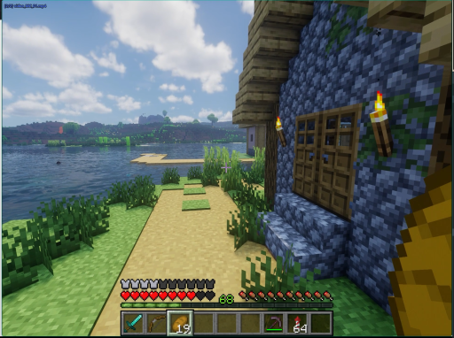

> 画面中显示一位身穿深色西装的男性正站在室内，他双手交叉于胸前，神情专注地注视着前方。背景中隐约可见一些模糊的物体轮廓，但无法辨认具体细节。整个场景处于静止状态，没有明显的动态变化或人物移动。

### 帧 #2 (1.0s)


> 画面中显示一位身穿深色西装的男性正站在室内，他双手交叉于胸前，神情专注地注视着前方。背景为明亮的室内环境，光线充足，氛围显得平静而严肃。

### 帧 #3 (1.5s)

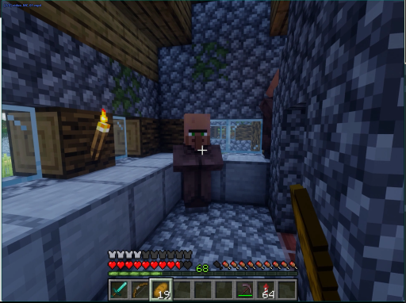

> 画面显示一名身穿深色制服的人员正站在室内，手持长杆状工具，似乎正在进行某种操作或检查。该人员周围没有明显的动物或关键物体，场景为封闭的室内空间，整体氛围较为安静且专注。

### 帧 #4 (2.0s)

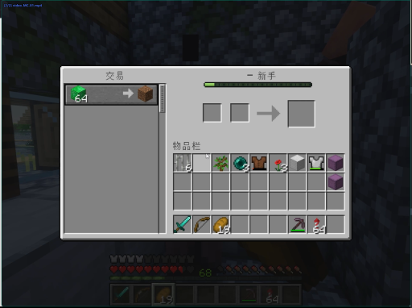

> 画面显示一位身穿深色西装的男性正站在室内，他双手交叉于胸前，神情专注地凝视着前方。背景中隐约可见其他人员，但细节模糊。场景位于一间光线明亮的办公室或会议室，整体氛围显得安静而严肃。

### 帧 #7 (3.5s)

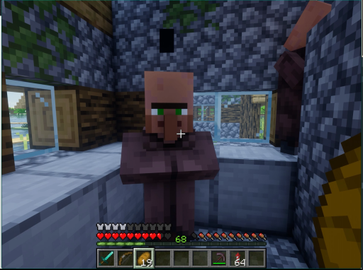

> 画面显示一位身穿深色西装的男性正站在室内，他双手交叉于胸前，神情专注地注视着前方。背景中隐约可见其他人物轮廓，但细节模糊。场景为室内环境，光线柔和，整体氛围显得平静而庄重。

### 帧 #8 (4.0s)

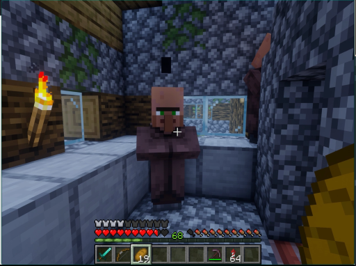

> 画面显示一位身穿深色西装的男性正站在室内，他双手交叉于胸前，神情专注地注视着前方。背景中隐约可见其他人物轮廓，但细节模糊。场景为室内环境，光线柔和，整体氛围显得平静而严肃。

### 帧 #9 (4.5s)


> 画面显示一位身穿深色西装的男性正站在室内，他双手交叉于胸前，神情专注地注视着前方。背景中隐约可见其他人物轮廓，但细节模糊。场景位于一间光线明亮的办公室或会议室，整体氛围显得安静而严肃。

### 帧 #10 (5.0s)


> 画面显示一位身穿深色西装的男性正站在室内，他双手交叉于胸前，神情专注地凝视前方。背景中隐约可见其他人员活动，但焦点集中在该男子的动作与神态上。场景位于一间光线明亮的办公室或会议室，整体氛围显得严肃而安静。

### 帧 #12 (6.0s)


> 画面显示一位身穿深色西装的男性正站在室内，他双手交叉于胸前，神情专注地凝视着前方。背景中隐约可见其他人物轮廓，但细节模糊。场景为室内，光线柔和，整体氛围显得平静而庄重。

### 帧 #13 (6.5s)


> 画面显示一位身穿深色西装的男性正站在室内，他双手交叉于胸前，神情专注地注视着前方。背景中隐约可见其他人员活动，但主体人物处于静止状态。场景位于一间光线明亮的办公室或会议室，整体氛围显得安静而正式。

### 帧 #14 (7.0s)

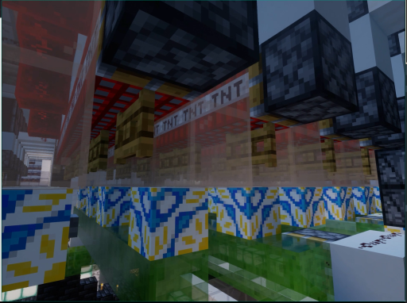

> 画面显示一位身穿深色制服的男性正站在室内走廊中，他手持一把长柄刀具，身体微微前倾，似乎正在对前方的一名身穿浅色上衣的女性进行攻击。该女性处于静止状态，面部表情平静。场景位于一间光线明亮的室内走廊，背景可见其他人员活动。

### 帧 #15 (7.5s)


> 画面显示一名身穿深色制服的人员正站在室内，周围摆放着若干白色圆柱形物体，该人员似乎正在操作或整理这些物品。

### 帧 #16 (8.0s)


> 画面显示一位身穿深色西装的男性正站在室内，他手持一把黑色手枪，枪口指向画面右侧的墙壁，处于静止状态。背景中可见模糊的室内环境，光线昏暗，整体氛围紧张。

### 帧 #17 (8.5s)

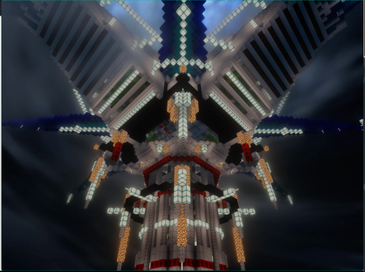

> 画面中显示一名身穿深色制服的人员正站在室内，周围摆放着若干白色圆柱形物体。该人员处于静止状态，周围没有明显的动态变化。

### 帧 #18 (9.0s)


> 画面中显示一名身穿深色制服的人员正站在室内，其姿态静止，周围无其他人物或动物。场景为室内，光线均匀，未见明显动态变化。

### 帧 #19 (9.5s)

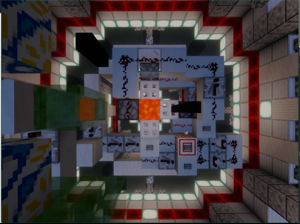

> 画面中显示一名身穿深色上衣的人物正站在室内，其面部表情和姿态显示出正在经历剧烈的情绪波动或痛苦挣扎。该人物周围没有明显的动物或关键物体，场景为封闭的室内空间，整体氛围显得紧张且充满动态感。

### 帧 #20 (10.0s)

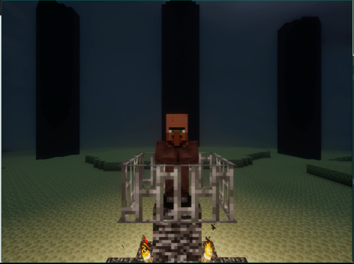

> 画面显示一位身穿深色西装的男性正站在室内，他双手交叉于胸前，神情专注地凝视着前方。背景中隐约可见一些模糊的物体轮廓，但无法辨认具体细节。场景位于室内，光线均匀，整体氛围显得平静而静止。

### 帧 #21 (10.5s)

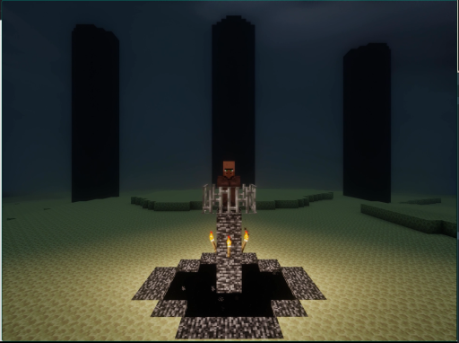

> 画面中显示一位身穿深色西装的男性正站在室内，他双手交叉于胸前，神情专注地注视着前方。背景中隐约可见一些模糊的物体轮廓，但无法辨认具体细节。整个场景处于静止状态，人物并未进行明显的动态动作。

### 帧 #22 (11.0s)


> 画面显示一位身穿深色西装的男性正站在室内，他双手交叉置于胸前，神情专注地凝视前方。背景中隐约可见其他人员活动，但焦点集中在该男子的动作与神态上。场景位于一间光线明亮的办公室或会议室，整体氛围显得平静而严肃。

### 帧 #23 (11.5s)


> 画面显示一位身穿深色制服的男性正站在室内走廊中，他手持一把长柄武器，身体微微前倾，似乎正在对前方的一名身穿浅色上衣的男性进行攻击。该男性处于静止状态，面部表情严肃，周围没有明显的动态变化或背景环境干扰。

### 帧 #24 (12.0s)

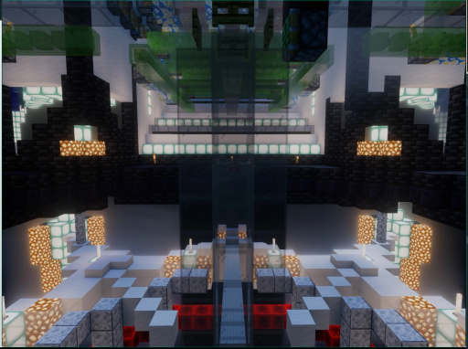

> 画面显示一位身穿深色西装的男性正站在室内，他双手交叉于胸前，神情专注地凝视前方。背景中隐约可见一些模糊的物体轮廓，但无法辨认具体细节。场景位于室内，光线均匀，整体氛围显得平静而正式。

### 帧 #25 (12.5s)

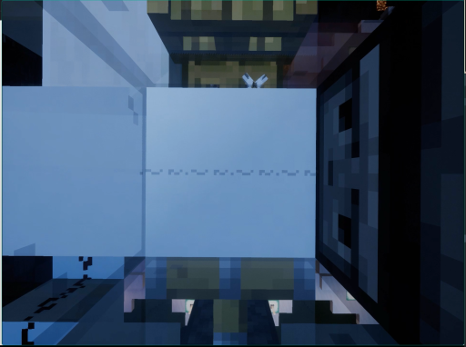

> 画面显示一位身穿深色西装的男性正站在室内，他双手交叉于胸前，神情专注地注视着前方。背景中隐约可见其他人物轮廓，但细节模糊。场景为室内，光线柔和，整体氛围显得平静而专注。

### 帧 #26 (13.0s)

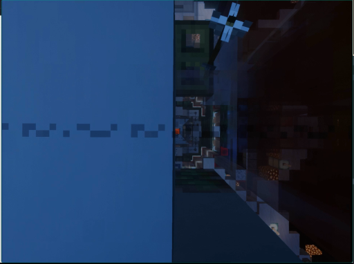

> 画面显示一位身穿深色西装的男性正站在室内，他双手交叉于胸前，神情专注地注视着前方。背景中隐约可见其他人员活动，但主体人物处于静止状态。场景位于一间光线明亮的办公室或会议室，整体氛围显得安静而正式。

### 帧 #27 (13.5s)


> 画面显示一位身穿深色西装的男性正站在室内，他双手交叉于胸前，神情专注地凝视着前方。背景中隐约可见其他人物轮廓，但细节模糊。场景位于一间光线明亮的办公室或会议室，整体氛围显得安静而严肃。

### 帧 #28 (14.0s)


> 画面中显示一名身穿深色上衣的男性正站在室内，他身体前倾，双手抬起似乎正在对前方进行某种操作或检查。该场景位于明亮的室内环境中，光线充足。

### 帧 #29 (14.5s)

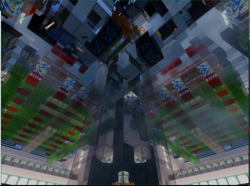

> 画面中显示一名身穿深色制服的人员正站在室内，背景可见模糊的监控设备。该人员姿态静止，未进行明显动作。场景为室内，光线均匀。画面中无显著动态变化。

### 帧 #30 (15.0s)

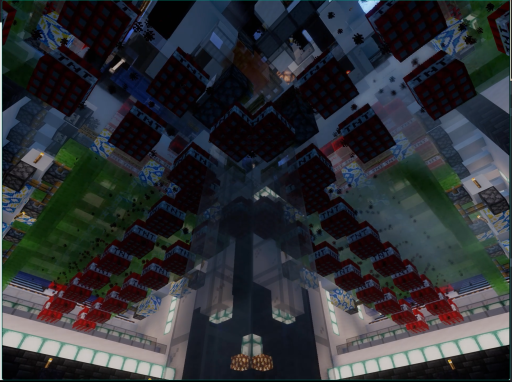

> 画面中显示一位身穿深色西装的男性正站在室内，他手持一把黑色手枪，枪口指向画面右侧。该男子表情严肃，身体略微前倾，处于戒备状态。背景为室内环境，光线明亮，整体氛围紧张。

### 帧 #31 (15.5s)

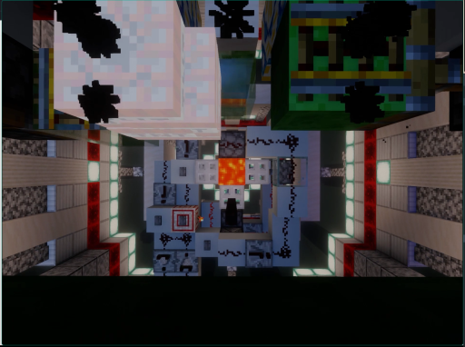

> 画面显示一位身穿深色西装的男性正站在室内，他双手交叉于胸前，神情专注地注视着前方。背景中隐约可见其他人物轮廓，但细节模糊。场景位于一间光线明亮的办公室或会议室，整体氛围显得安静而正式。

### 帧 #32 (16.0s)


> 画面显示一名身穿深色西装的男子正站在室内，他双手交叉于胸前，神情专注地注视着前方。背景中隐约可见一些模糊的物体轮廓，但无法辨认具体细节。整个场景处于静止状态，没有明显的动态变化或人物移动。

### 帧 #33 (16.5s)


> 画面显示一位身穿深色西装的男性正站在室内，他双手交叉于胸前，神情专注地凝视着前方。背景中隐约可见其他人物轮廓，但细节模糊。场景为室内，光线柔和，整体氛围显得平静而严肃。

### 帧 #40 (20.0s)

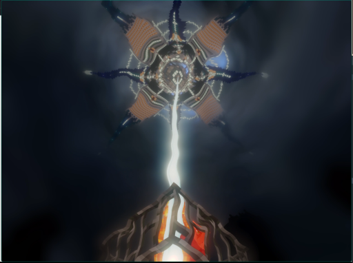

> 画面显示一位身穿深色西装的男性正站在室内，他双手交叉于胸前，神情专注地注视着前方。背景中隐约可见其他人物轮廓，但细节模糊。场景为室内，光线均匀，整体氛围显得平静而严肃。
